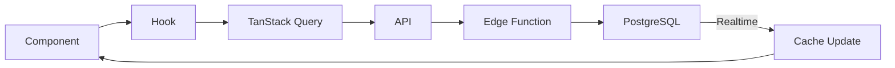

# CLAUDE.md - Conventions de developpement GMBS-CRM

## Contexte du projet

CRM pour la gestion des interventions, artisans et clients.

- **Stack** : Next.js 15, React 18, TypeScript 5, Supabase, TanStack Query v5, Zustand, Tailwind CSS, shadcn/ui
- **Tests** : Vitest + React Testing Library + Playwright (E2E)
- **Score audit** : ~82/100

> En cas de doute, consulte `/docs`. La documentation est la source de verite.

---

## Architecture Overview

### Data Flow

```
Component --> Hook --> TanStack Query --> API --> Edge Function --> PostgreSQL
                                                                        |
Component <-- Cache Update <-- Realtime <-------------------------------+
```



- **~22 modules API** dans `src/lib/api/`
- **99 hooks custom** dans `src/hooks/`
- **13 Edge Functions** dans `supabase/functions/`
- **290+ composants** dans `src/components/`

Pour le detail complet : [docs/architecture/data-flow.md](docs/architecture/data-flow.md)

---

## Organisation des fichiers

```
gmbs-crm/
  app/                    # Next.js App Router (pages, API routes, layouts)
    (auth)/               # Routes auth (login, set-password)
    admin/                # Admin dashboard
    api/                  # API routes Next.js
    artisans/             # Pages artisans + _components/ + _lib/
    interventions/        # Pages interventions + _components/ + _lib/
    settings/             # Pages parametres
    dashboard/            # Dashboard utilisateur
  src/
    components/           # Composants React (200+)
    config/               # Configuration metier (workflow-rules, status-colors)
    contexts/             # 9 React Contexts
    hooks/                # 67 hooks custom
    lib/                  # Logique metier, API, realtime, workflow
    providers/            # Providers globaux
    stores/               # Zustand stores
    types/                # 11 fichiers de types
    utils/                # Utilitaires
  supabase/
    functions/            # 13 Edge Functions (Deno)
    migrations/           # 82 migrations SQL
    seeds/                # Donnees initiales
  tests/                  # Tests (unit, integration, e2e)
  docs/                   # Documentation du projet
```

### Pattern de co-location (App Router)

Chaque feature dans `app/` utilise des dossiers prefixes `_` pour co-localiser composants et logique :

```
app/interventions/
  page.tsx                # Page principale
  [id]/page.tsx           # Page detail
  _components/            # Composants co-localises (non routes)
  _lib/                   # Logique co-localisee (hooks de page)
```

### Ou placer chaque type de fichier

| Type | Emplacement |
|------|-------------|
| Page / Route | `app/<feature>/page.tsx` |
| Composant co-localise | `app/<feature>/_components/` |
| Hook de page | `app/<feature>/_lib/` |
| Composant reutilisable | `src/components/<category>/` |
| Composant UI (shadcn) | `src/components/ui/` |
| Hook custom | `src/hooks/` |
| Module API | `src/lib/api/` |
| Types / Interfaces | `src/types/` |
| Store Zustand | `src/stores/` |
| Context React | `src/contexts/` |
| Config metier | `src/config/` |
| Edge Function | `supabase/functions/<nom>/` |
| Test unitaire | `tests/unit/` (miroir de src/) |
| Test integration | `tests/integration/` |
| Test E2E | `tests/e2e/` |

---

## Conventions de code

### TypeScript

- Strict mode active
- Pas de `any` sauf cas exceptionnels documentes
- Interfaces pour les props, types pour les unions
- Path alias : `@/*` pointe vers `./src/*`

### Composants React

- Functional components uniquement
- Hooks custom pour la logique reutilisable
- Props destructurees avec types explicites
- Pattern : composant + hook separe pour la logique complexe

### Imports

- Toujours utiliser `@/` pour les imports cross-feature
- Imports relatifs uniquement au sein du meme dossier `_components/` ou `_lib/`

---

## Politique de Tests

### Regle fondamentale

**Toute nouvelle feature ou modification de code existant DOIT inclure des tests.**

### Structure des tests

```
tests/
  unit/                    # Tests unitaires
    hooks/                 # Tests des hooks custom
    lib/                   # Tests des utilitaires/API
    components/            # Tests des composants avec logique
  integration/             # Tests d'integration
  e2e/                     # Tests end-to-end (Playwright)
```

### Quoi tester obligatoirement

| Priorite | Type | Couverture attendue |
|----------|------|---------------------|
| Critique | Workflow/transitions de statuts | 100% |
| Critique | Calculs metier (marge, couts) | 100% |
| Haute | Hooks custom (useInterventionsQuery, etc.) | 80%+ |
| Haute | Fonctions API (interventionsApi.ts) | 80%+ |
| Moyenne | Composants avec logique conditionnelle | 60%+ |
| Basse | Composants UI simples | Optionnel |

### Conventions de nommage

- Fichier test : `<fichier-source>.test.ts` ou `.spec.ts`
- Structure : `describe('NomDuModule')` puis `it('should <comportement attendu>')`
- Un fichier test par fichier source

### Workflow de developpement (TDD encourage)

1. **D'abord les tests** - Ecrire les tests qui decrivent le comportement attendu
2. **Ensuite le code** - Implementer jusqu'a ce que les tests passent
3. **Verification** - `npm run test` doit passer sans regression

### Template de test

```typescript
import { describe, it, expect, vi, beforeEach } from 'vitest'

describe('NomDuModule', () => {
  beforeEach(() => {
    vi.clearAllMocks()
  })

  describe('nomDeLaFonction', () => {
    it('should <comportement nominal>', () => {
      // Arrange
      const input = createMockData()

      // Act
      const result = fonctionATest(input)

      // Assert
      expect(result).toEqual(expectedOutput)
    })

    it('should throw when <cas erreur>', () => {
      // Arrange
      const invalidInput = {}

      // Act & Assert
      expect(() => fonctionATest(invalidInput)).toThrow()
    })
  })
})
```

### Mocks

- Mocks Supabase : `tests/__mocks__/supabase.ts` (Builder pattern fluent)
- Mocks donnees : `tests/__fixtures__/`
- Utiliser `vi.mock()` pour les dependances externes

### Avant de valider une feature

- [ ] Tests unitaires ecrits pour la nouvelle logique
- [ ] Tests passent localement (`npm run test`)
- [ ] Pas de regression sur les tests existants
- [ ] Coverage n'a pas diminue

---

## Error Handling

### Pattern ErrorHandler

```typescript
// src/lib/api/common/error-handler.ts
import { safeErrorMessage } from '@/lib/api/common/error-handler'

// En dev : message detaille complet
// En prod : message generique securise "Erreur lors de <context>"
const message = safeErrorMessage(error, 'la mise a jour de l\'intervention')
```

### Error Boundaries React

- Utiliser des Error Boundaries autour des sections critiques (modals, formulaires)
- Chaque page principale a son propre error boundary

### Gestion erreurs dans les hooks

```typescript
// Pattern TanStack Query
const { data, error, isError } = useQuery({
  queryKey: interventionKeys.detail(id),
  queryFn: () => interventionsApi.getById(id),
})

// Pattern mutation avec rollback
const mutation = useMutation({
  onMutate: async (variables) => {
    const previous = queryClient.getQueryData(key)
    queryClient.setQueryData(key, optimisticUpdate)
    return { previous }
  },
  onError: (error, _, context) => {
    queryClient.setQueryData(key, context.previous) // Rollback
  },
})
```

---

## State Management Decision Tree

| Besoin | Solution | Emplacement |
|--------|----------|-------------|
| Donnees serveur (interventions, artisans, users) | TanStack Query | `src/hooks/use*Query.ts` |
| Etat UI global (sidebar, theme, preferences) | Zustand | `src/stores/` |
| Donnees de scope (auth, theme, filtres de page) | React Context | `src/contexts/` |
| Filtres, pagination, vue active | URL params | `useSearchParams()` |
| Etat local composant (toggle, input) | useState | Composant local |

### Regles

- **Jamais** de state local pour des donnees serveur : utiliser TanStack Query
- **Jamais** de Zustand pour des donnees qui viennent du serveur
- Les query keys sont centralisees dans `src/lib/react-query/queryKeys.ts`
- Invalidation ciblee : utiliser les factories de keys (`interventionKeys.lists()`)

---

## API Usage

### Regles fondamentales

1. **Toujours passer par la couche API** : `src/lib/api/`
2. **Jamais Supabase direct dans les composants** : utiliser les modules API
3. **Query keys centralisees** dans `src/lib/react-query/queryKeys.ts`
4. **Facade principale** : `import { interventionsApi, artisansApi } from '@/lib/api'`

### Pattern d'utilisation

```typescript
// BON : via le hook + API
import { useInterventionsQuery } from '@/hooks/useInterventionsQuery'
const { data, isLoading } = useInterventionsQuery(params)

// BON : mutation via API
import { interventionsApi } from '@/lib/api'
await interventionsApi.create(data)

// MAUVAIS : Supabase direct dans un composant
import { supabase } from '@/lib/supabase'
const { data } = await supabase.from('interventions').select('*') // NE PAS FAIRE
```

### Modules API disponibles

`agencies`, `users`, `interventions`, `artisans`, `clients`, `documents`, `comments`, `roles`, `permissions`, `tenants`, `owners`, `reminders`, `enums`, `utils`

---

## Git Workflow

- Commits conventionnels : `feat:`, `fix:`, `chore:`, `refactor:`, `test:`, `docs:`
- Messages en francais ou anglais (coherent par PR)
- Pas de fichiers sensibles (credentials, .env, donnees clients)
- Branches : `feature/<nom>`, `fix/<nom>`, `chore/<nom>`

---

## Documentation obligatoire

**Toute nouvelle feature ou modification DOIT mettre a jour la documentation dans `/docs`.**

Un PR sans mise a jour de la documentation correspondante sera refuse. Cela inclut :
- Mise a jour de la page API reference si un endpoint change
- Mise a jour du guide si un workflow metier evolue
- Mise a jour de l'architecture si un nouveau pattern est introduit

---

## Fichiers critiques

Ces fichiers sont au coeur du systeme. Toute modification necessite des tests et une mise a jour de la documentation :

| Fichier | Tests requis | Documentation |
|---------|-------------|---------------|
| `src/lib/api/interventions/*.ts` | 80%+ | `docs/api-reference/interventions.md` |
| `src/lib/workflow/` | 100% | `docs/architecture/workflow-engine.md` |
| `src/lib/realtime/cache-sync*.ts` | 80%+ | `docs/architecture/data-flow.md` |
| `src/hooks/useInterventionsQuery.ts` | 80%+ | `docs/api-reference/query-keys.md` |
| `src/hooks/usePermissions.ts` | 80%+ | `docs/architecture/auth-and-security.md` |
| `src/hooks/useInterventionForm.ts` | 80%+ | `docs/guides/adding-a-feature.md` |
| `src/hooks/useInterventionViews.ts` | 80%+ | `docs/components/intervention-components.md` |
| `src/lib/api/common/cache.ts` | 80%+ | `docs/architecture/api-layer.md` |
| `supabase/functions/` | 60%+ | `docs/api-reference/edge-functions.md` |

---

## Commandes utiles

```bash
npm run dev          # Serveur de developpement
npm run build        # Build production
npm run test         # Lancer les tests
npm run test:watch   # Tests en mode watch
npm run lint         # Linter
npm run typecheck    # Verification TypeScript
```

---

## Liens /docs

| Section | Chemin |
|---------|--------|
| Getting Started | [docs/getting-started/](docs/getting-started/) |
| Architecture | [docs/architecture/](docs/architecture/) |
| Guides | [docs/guides/](docs/guides/) |
| API Reference | [docs/api-reference/](docs/api-reference/) |
| Components | [docs/components/](docs/components/) |
| Database | [docs/database/](docs/database/) |
| Conventions | [docs/conventions/](docs/conventions/) |
| Maintenance | [docs/maintenance/](docs/maintenance/) |
| AI Integration | [docs/ai-integration/](docs/ai-integration/) |
| Index | [docs/README.md](docs/README.md) |
| LLM Context | [llms.txt](llms.txt) |
