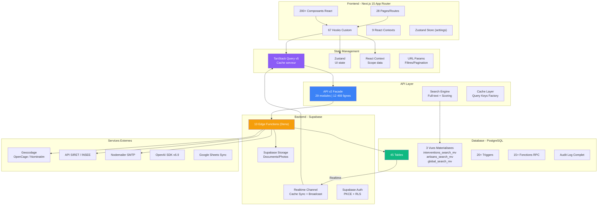
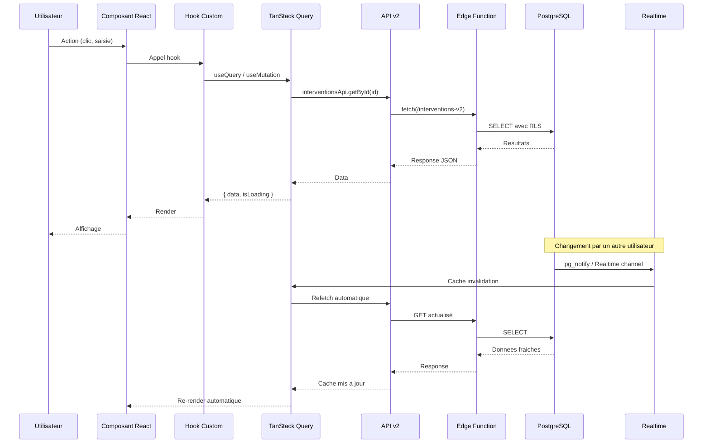
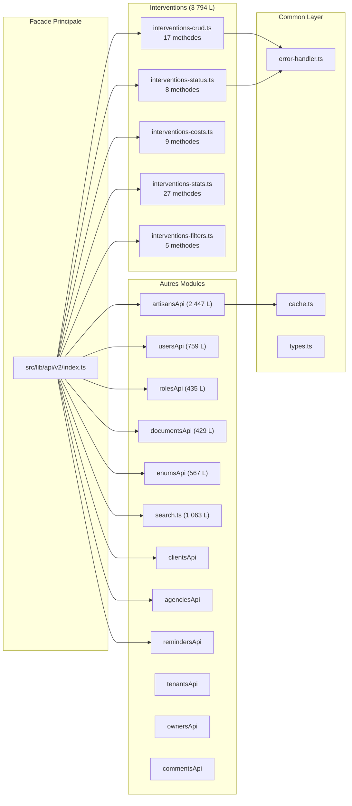
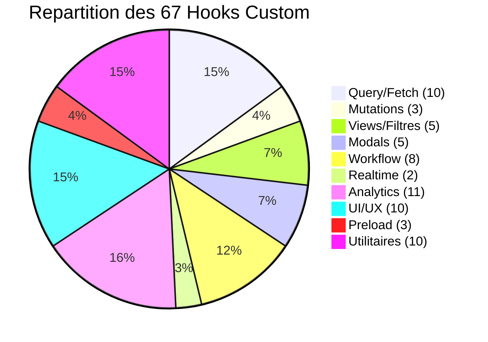
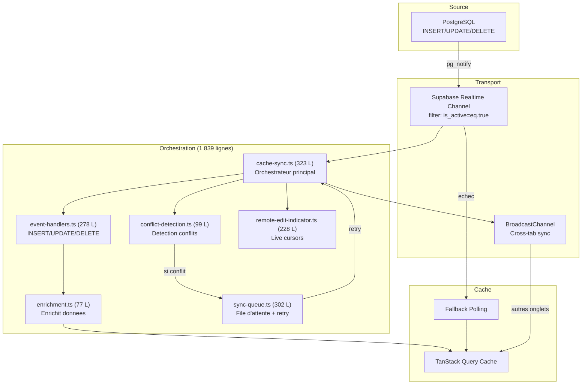
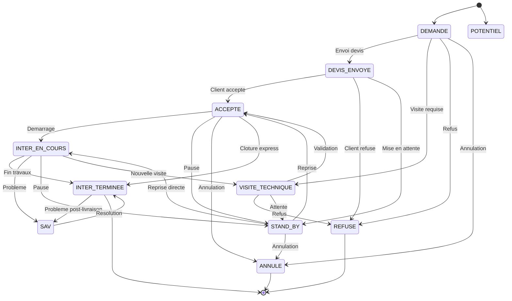
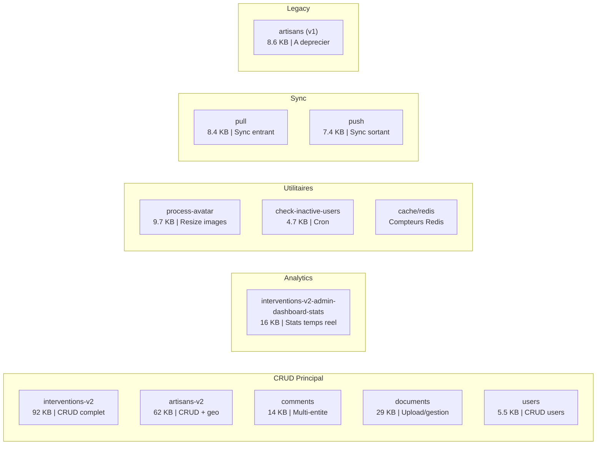
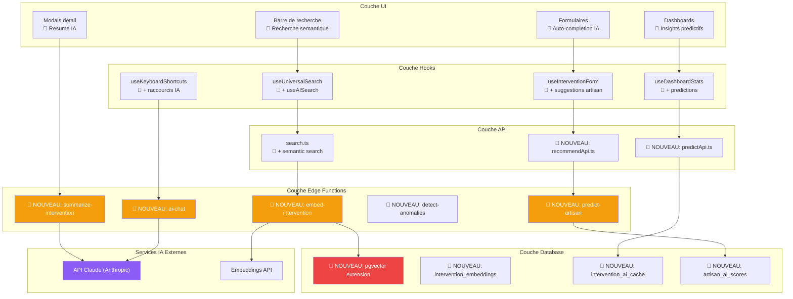

# 01 - Cartographie Technique GMBS-CRM

> **Audit IA** | Date : 12 fevrier 2026 | Version : 1.0

---

## 1. Architecture Globale

### 1.1 Diagramme d'architecture

### 1.2 Flux de donnees detaille

---

## 2. Inventaire des Routes

### 2.1 Pages principales

| Route | Fichier | Description | Composants cles |
|-------|---------|-------------|-----------------|
| `/dashboard` | `app/dashboard/page.tsx` | Dashboard gestionnaire avec KPIs | StatsBarChart, MarginStatsCard, Speedometer, GestionnaireRankingPodium |
| `/interventions` | `app/interventions/page.tsx` | Liste interventions avec 8 vues | FiltersBar, InterventionViews, ContextMenu |
| `/interventions/[id]` | `app/interventions/[id]/page.tsx` | Detail/edition intervention | InterventionEditForm (2778 L), CommentSection (30k) |
| `/interventions/new` | `app/interventions/new/page.tsx` | Creation intervention | NewInterventionForm (1822 L) |
| `/artisans` | `app/artisans/page.tsx` | Liste artisans | ArtisanViewTabs, filtres |
| `/comptabilite` | `app/comptabilite/page.tsx` | Module comptabilite | Checks, factures |
| `/admin/dashboard` | `app/admin/dashboard/page.tsx` | Dashboard administrateur | Stats globales, breakdown par agence/metier |
| `/admin/analytics` | `app/admin/analytics/page.tsx` | Analytics avancees | Graphiques Recharts, Sankey, ReactFlow |
| `/settings/*` | `app/settings/` | 6 sous-pages | Profil, Equipe, Interface, Workflow, Enums, Targets |
| `/login` | `app/(auth)/login/page.tsx` | Authentification | Supabase Auth PKCE |
| `/set-password` | `app/(auth)/set-password/page.tsx` | Definition mot de passe | Auth flow |

### 2.2 Layouts

| Layout | Fichier | Role |
|--------|---------|------|
| Root | `app/layout.tsx` (14k) | 10 providers imbriques, Topbar, Sidebar, GlobalShortcuts |
| Auth | `app/(auth)/layout.tsx` | Layout simplifie sans sidebar |
| Interventions | `app/interventions/layout.tsx` | Preload + filtres interventions |
| Settings | `app/settings/layout.tsx` | Navigation settings |

---

## 3. Modules API v2

### 3.1 Architecture facade

### 3.2 Methodes API principales

| Module | Methodes cles | Total |
|--------|--------------|-------|
| **interventions-crud** | getById, create, update, delete, getList, getLight | 17 |
| **interventions-status** | updateStatus, validateTransition, getTransitions | 8 |
| **interventions-costs** | getCosts, updateCosts, getMarginHistory | 9 |
| **interventions-stats** | getRevenueHistory, getCycleTimeHistory, getTransformationRate, getAdminDashboardStats | 27 |
| **interventions-filters** | getFilterCounts, getStatusCounts | 5 |
| **artisansApi** | CRUD, getMetiers, getZones, getAbsences, getNearby | 30+ |
| **usersApi** | CRUD, getRoles, getPermissions | 20+ |
| **search** | universalSearch, searchInterventions, searchArtisans | 10+ |

---

## 4. Categorisation des 67 Hooks

### 4.1 Par categorie fonctionnelle

| Categorie | Hooks | Fichiers cles |
|-----------|-------|---------------|
| **Query** | useInterventionsQuery, useArtisansQuery, useDashboardStatsQuery | Fetch TanStack Query |
| **Mutations** | useInterventionsMutations, useInterventionForm, useInterventionFormState | CRUD avec rollback optimiste |
| **Views** | useInterventionViews, useArtisanViews, useFilterCounts, useSmartFilters | 8 layouts (table, kanban, calendar...) |
| **Modals** | useModal, useInterventionModal, useArtisanModal | Systeme fullpage/halfpage/centerpage |
| **Workflow** | useWorkflowConfig, useInterventionStatuses, usePermissions, useStatusTransitions | State machine 12 statuts |
| **Realtime** | useInterventionsRealtime, useInterventionReminders | Cache sync + broadcast |
| **Analytics** | useDashboardStats, useRevenueHistory, useMarginHistory, useCycleTimeHistory, useTransformationRateHistory, useAdminDashboardStats | KPIs temps reel |
| **UI/UX** | useIsNarrow, useKeyboardShortcuts, useLowPowerMode, useSubmitShortcut, usePlatformKey | Responsive + accessibilite |
| **Preload** | usePreloadInterventions, usePreloadDefaultViews | Warm-up cache |
| **Utilitaires** | useNearbyArtisans, useSiretVerification, useGeocodeSearch, useDebounce, useDocumentUpload | Integrations externes |

---

## 5. Systeme Realtime

### 5.1 Architecture de synchronisation

### 5.2 Modules realtime

| Module | Lignes | Role |
|--------|--------|------|
| `realtime-client.ts` | 100 | Channel Supabase (filter: is_active=eq.true) |
| `cache-sync.ts` | 323 | Orchestrateur principal |
| `event-handlers.ts` | 278 | Traiteurs INSERT/UPDATE/DELETE |
| `enrichment.ts` | 77 | Enrichissement donnees relationnelles |
| `broadcasting.ts` | 43 | Sync cross-tab |
| `conflict-detection.ts` | 99 | Detection conflits edition |
| `sync-queue.ts` | 302 | Queue + retry + offline |
| `remote-edit-indicator.ts` | 228 | Indicateurs edition en temps reel |
| `filter-utils.ts` | 201 | Utilitaires filtrage realtime |

---

## 6. Workflow Engine

### 6.1 Machine a etats des interventions

### 6.2 Regles de validation par statut

| Statut cible | Champs requis | Validation |
|-------------|---------------|------------|
| DEVIS_ENVOYE | devisId, nomPrenomFacturation, assignedUserId | + idIntervention sans "AUTO" |
| VISITE_TECHNIQUE | artisanId | + idIntervention sans "AUTO" |
| ACCEPTE | devisId | + idIntervention sans "AUTO" |
| INTER_EN_COURS | artisanId, coutIntervention, coutSST, consigneArtisan, nomClient, telClient, datePrevue | **7 prerequis** (goulot) |
| INTER_TERMINEE | artisanId, factureId, proprietaireId, factureGmbsFile | + au moins 1 attachment facturesGMBS |
| REFUSE / ANNULE / SAV / STAND_BY | commentaire | Motif obligatoire |

---

## 7. Edge Functions

### 7.1 Inventaire des 13 fonctions

---

## 8. Points d'injection IA dans l'architecture

### 8.1 Diagramme des points d'injection

### 8.2 Points d'injection par priorite

| # | Point d'injection | Fichier existant | Nouveau fichier | Impact | Effort |
|---|-------------------|------------------|-----------------|--------|--------|
| 1 | Recherche semantique | `src/lib/api/v2/search.ts` | `supabase/functions/embed-intervention/` | Recherche +40% CTR | 2 sem |
| 2 | Recommandation artisan | `src/hooks/useNearbyArtisans.ts` | `supabase/functions/predict-artisan/` | Allocation -60% temps | 2-3 sem |
| 3 | Resume contextuel | `src/hooks/useKeyboardShortcuts.ts` | `src/components/ai/AIAssistantDialog.tsx` | UX power-users | 1-2 sem |
| 4 | Pre-remplissage formulaire | `src/hooks/useInterventionForm.ts` | `src/lib/ai/form-assistant.ts` | Saisie -50% temps | 2 sem |
| 5 | Predictions analytics | `src/hooks/useDashboardStats.ts` | `src/lib/api/v2/interventions/interventions-forecast.ts` | Previsions fiables | 3 sem |
| 6 | Classification documents | `src/lib/api/v2/documentsApi.ts` | `supabase/functions/classify-document/` | Retrouvabilite +40% | 2-3 sem |
| 7 | Detection anomalies | `intervention_audit_log` | `supabase/functions/detect-anomalies/` | Compliance automatique | 3 sem |
| 8 | Chat assistant | `app/layout.tsx` | `src/components/ai/ChatPanel.tsx` | Transformation UX | 4-6 sem |

---

## 9. Evaluation de la modularite

### 9.1 Scores

| Critere | Score | Justification |
|---------|-------|---------------|
| **Separation des responsabilites** | 9/10 | API v2 facade, hooks isoles, contexts dedies |
| **Extensibilite** | 8.5/10 | Pattern co-location, factory keys, modules API composables |
| **Testabilite** | 8/10 | Mock builder Supabase, hooks isolables, fixtures |
| **Integration IA** | 7/10 | Points d'entree clairs, mais pas de couche IA existante |
| **Performance** | 8.5/10 | Virtualisation, preload, cache TanStack, vues materialisees |
| **Scalabilite** | 8/10 | Edge Functions, Redis cache, batch processing |

### 9.2 Forces architecturales pour l'IA

- **API Facade** : Permet d'ajouter des modules IA sans toucher a l'existant
- **Query Key Factory** : Invalidation ciblee pour les predictions IA
- **Hook pattern** : Creer `useAISuggestions(id)` suit le meme pattern que les hooks existants
- **Edge Functions** : Ajouter de nouvelles fonctions IA sans modifier le frontend
- **Realtime** : Enrichir le cache-sync avec des scores IA en temps reel
- **Audit Log** : Donnees historiques riches pour entrainer des modeles

### 9.3 Lacunes a combler

- **Pas de pgvector** : Extension a installer pour les embeddings
- **Pas de couche IA** : Creer `src/lib/ai/` avec prompts, context-detector, etc.
- **Pas de feature flags** : Utile pour deployer l'IA progressivement
- **Pas de rate limiting** : Necessaire pour controler les couts API IA
- **OpenAI SDK present** : v6.9.1 dans package.json mais usage minimal

---

## 10. Stack technique complete

### 10.1 Dependances principales

| Categorie | Technologie | Version |
|-----------|-------------|---------|
| **Framework** | Next.js | 15.5.7 |
| **UI** | React | 18.3.1 |
| **Langage** | TypeScript | 5.x (strict) |
| **Backend** | Supabase | 2.58.0 |
| **State** | TanStack Query | 5.90.2 |
| **State UI** | Zustand | 5.0.8 |
| **CSS** | Tailwind CSS | 3.4.17 |
| **Composants** | shadcn/ui + Radix | 20+ packages |
| **Formulaires** | React Hook Form + Zod | 7.54.1 + 3.24.1 |
| **Cartes** | MapLibre GL + MapTiler | 5.9.0 + 3.8.0 |
| **Graphiques** | Recharts + Nivo + ReactFlow | latest |
| **Animations** | Framer Motion | 12.23.12 |
| **IA** | OpenAI SDK | 6.9.1 |
| **Email** | Nodemailer | 7.0.10 |
| **Tests** | Vitest + Playwright | 3.2.4 + 1.55.0 |
| **Import/Export** | ExcelJS + PapaParse + Google Sheets | Divers |

### 10.2 Extensions PostgreSQL

| Extension | Usage |
|-----------|-------|
| `pg_stat_statements` | Statistiques de requetes |
| `pgcrypto` | Chiffrement / UUID |
| `pg_trgm` | Recherche trigram (fuzzy) |
| `unaccent` | Recherche sans accents |
| **pgvector** (a ajouter) | **Embeddings vectoriels pour IA** |
