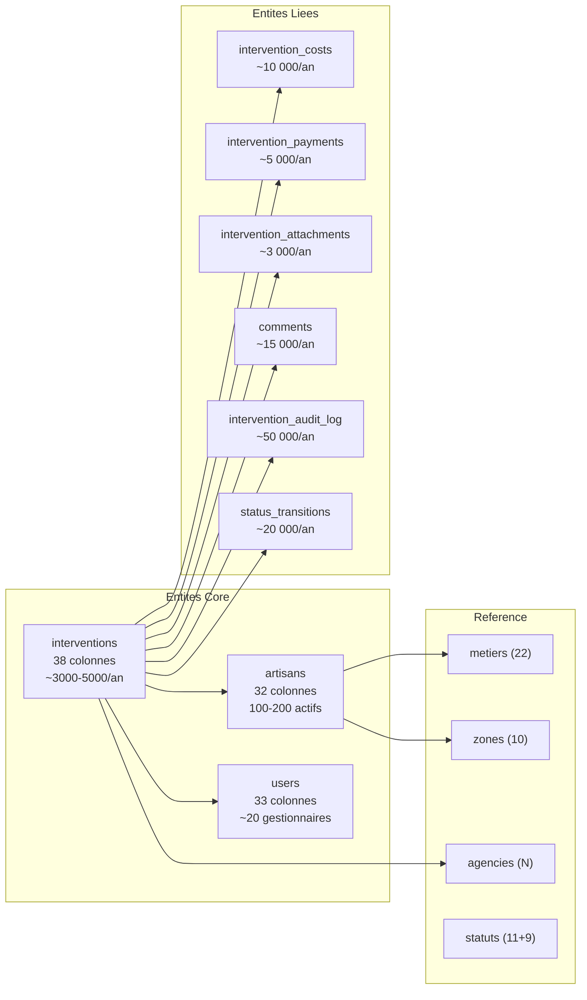
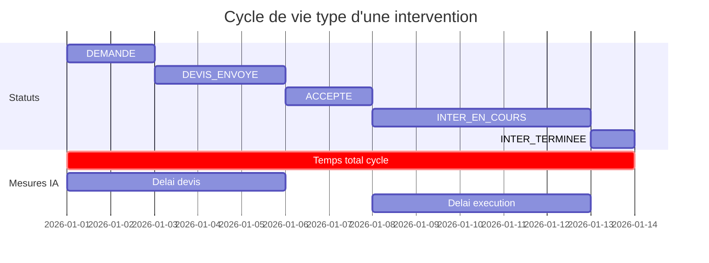
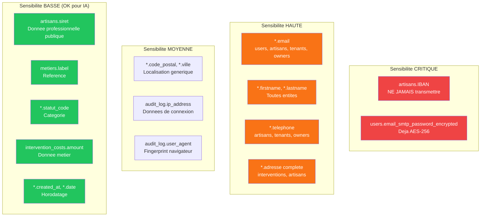
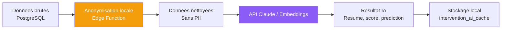
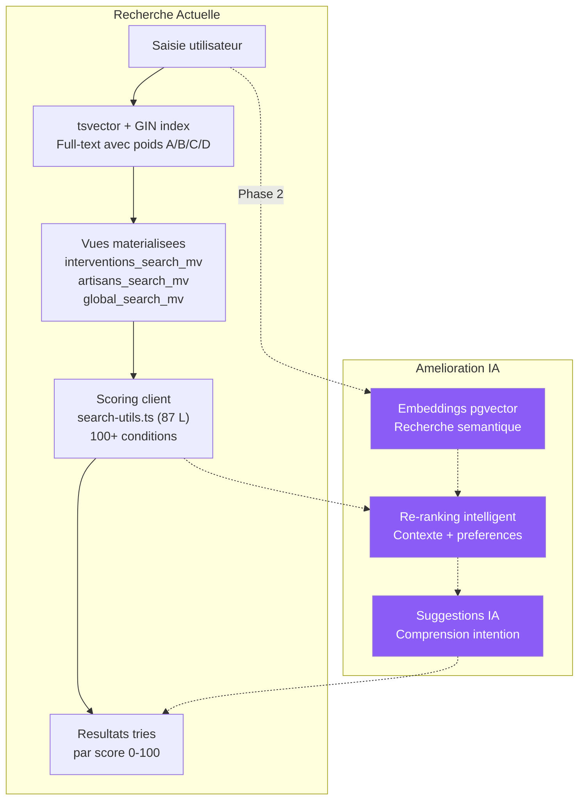

# 02 - Analyse du Potentiel des Donnees pour l'IA

> **Audit IA** | Date : 12 fevrier 2026 | Version : 1.0

---

## 1. Vue d'ensemble du modele de donnees

### 1.1 Chiffres cles

| Metrique | Valeur |
|----------|--------|
| Tables | 45 |
| Colonnes totales | 450+ |
| Vues materialisees | 3 |
| Triggers | 20+ |
| Fonctions RPC | 15+ |
| Migrations SQL | 82 |
| Index | 100+ |
| RLS Policies | 30+ |

### 1.2 Entites principales et volumes



---

## 2. Inventaire des donnees exploitables par l'IA

### 2.1 Donnees textuelles (NLP / Embeddings)

Les champs texte libre sont la **mine d'or** pour l'IA. Ils contiennent des descriptions en langage naturel exploitables par NLP, embeddings et generation.

| Champ | Table | Longueur typique | Volume estime/an | Potentiel IA |
|-------|-------|-----------------|-----------------|-------------|
| `contexte_intervention` | interventions | 100-500 chars | 1.5-2.5 MB | Classification, extraction entites, similarite |
| `consigne_intervention` | interventions | 100-500 chars | 1-2 MB | Instructions artisan, generation auto |
| `consigne_second_artisan` | interventions | 100-300 chars | 0.5-1 MB | Contexte multi-artisan |
| `commentaire_agent` | interventions | 100-500 chars | 1-2 MB | Notes internes, sentiment |
| `content` (comments) | comments | Variable | 5-10 MB | Sentiment, topic modeling, FAQ |
| `suivi_relances_docs` | artisans | Variable | 0.1-0.5 MB | Historique interactions |
| `reason` | artisan_absences | Variable | 0.05 MB | Patterns absences |
| `reference_agence` | interventions | 50-200 chars | 0.3-0.5 MB | Normalisation |
| `vacant_housing_instructions` | interventions | Variable | 0.1 MB | Instructions specifiques |

**Total texte estime** : 10-20 MB/an en production
**Tokens Claude** : 2.5M-5M tokens/an
**Cout embeddings** : ~0.10 EUR/an (negligeable)

#### Entites extractibles par NLP

```
Contexte : "Fuite d'eau sous l'evier cuisine, urgence car degat des eaux au voisin"
                ^^^^^^^^^                ^^^^^^^ ^^^^^^^^^^^^^^^^^^^^^^^^^^
                Probleme                 Urgence  Impact/Consequence

Consigne : "Remplacer le joint du robinet mitigeur, apporter flexible 3/8"
            ^^^^^^^^^           ^^^^^^^^^^^^^^^^^^ ^^^^^^^^^^^^^^^^^^^^^^^
            Action              Equipement         Materiel necessaire
```

### 2.2 Donnees temporelles (Prediction / Forecasting)

Les donnees temporelles permettent des modeles predictifs (duree, retard, saisonnalite).

| Champ | Table | Pattern temporel | Use case IA |
|-------|-------|-----------------|-------------|
| `date` + `date_termine` | interventions | Duree d'intervention | Prediction de duree |
| `date_prevue` vs `date_termine` | interventions | Ecart planifie/reel | Detection retards |
| `transition_date` | intervention_status_transitions | Temps entre statuts | Markov chains, bottleneck |
| `created_at` | interventions | Saisonnalite | Forecast volume demande |
| `assigned_at` | intervention_artisans | Delai assignation | Optimisation allocation |
| `payment_date` | intervention_payments | Flux financier | Prediction tresorerie |
| `start_date` / `end_date` | artisan_absences | Patterns absence | Planification previsionnelle |
| `last_activity_date` | users | Activite gestionnaires | Detection desengagement |
| `lateness_count` | users | Retards cumules | Scoring fiabilite |

#### Series temporelles disponibles



### 2.3 Donnees geospatiales (Optimisation / Routing)

Les coordonnees GPS collectees ouvrent des opportunites d'optimisation geographique.

| Champ | Table | Type | Couverture |
|-------|-------|------|-----------|
| `latitude`, `longitude` | interventions | numeric(9,6) | Lieu d'intervention |
| `intervention_latitude`, `intervention_longitude` | artisans | numeric(9,6) | Zone artisan |
| `adresse`, `code_postal`, `ville` | interventions | TEXT | 3 niveaux |
| `adresse_siege_social` | artisans | TEXT | Siege artisan |
| `adresse_intervention` | artisans | TEXT | Zone intervention |

#### Use cases geospatiaux

| Use case | Donnees | Methode |
|----------|---------|---------|
| **Matching artisan-intervention** | GPS intervention + GPS artisan | Distance euclidienne / Haversine |
| **Optimisation tournees** | N interventions + M artisans | TSP (Travelling Salesman) |
| **Heatmap demande** | GPS interventions + dates | Clustering spatial + temporel |
| **Prediction zone** | Historique GPS par metier | Regression spatiale |
| **Detection anomalies** | GPS aberrants | Outlier detection |

### 2.4 Donnees relationnelles et comportementales

| Pattern | Tables | Valeur IA |
|---------|--------|-----------|
| **Qui travaille avec qui** | intervention_artisans + users | Graph de collaboration |
| **Progression artisan** | artisan_status_history | Prediction progression |
| **Decisions passees** | intervention_audit_log | Patterns decisionnels |
| **Couts reels vs estimes** | intervention_costs + payments | Calibration modele cout |
| **Taux conversion** | status_transitions | Funnel analysis |
| **Mentions** | intervention_reminders.mentioned_user_ids | Reseau social interne |

---

## 3. Donnees sous-exploitees

### 3.1 Audit Log : tresor inexploite

La table `intervention_audit_log` (migration 00037) capture **chaque modification** sur les interventions avec un diff complet (old_values / new_values / changed_fields).

**Collecte** : ~15-20 changements par intervention = 50 000+ entrees/an

**Actuellement utilise pour** : Affichage historique dans le detail intervention

**Potentiel inexploite** :
- **Patterns de modification** : Qui change quoi, quand, pourquoi
- **Detection anomalies** : Changement de cout x10 en 1 seconde = erreur ou fraude
- **Analyse de workflow** : Temps moyen par etape, goulots d'etranglement
- **Scoring gestionnaire** : Vitesse, precision, qualite des decisions

### 3.2 Status Transitions : Markov chains non modelisees

La table `intervention_status_transitions` trace chaque transition avec source (api/trigger) et metadata.

**Potentiel** :
- **Probabilite de transition** : DEMANDE a 65% chance d'aller en DEVIS_ENVOYE, 20% en VISITE_TECHNIQUE, 15% en REFUSE
- **Detection de boucles** : INTER_TERMINEE -> SAV -> INTER_TERMINEE = probleme qualite recurrent
- **Prediction cycle time** : Basee sur la trajectoire historique

### 3.3 Metadata JSONB

Plusieurs tables contiennent des champs `metadata` (JSONB) riches mais non indexes :
- `intervention_costs.metadata`
- `tasks.metadata`
- `intervention_status_transitions.metadata`
- `ai_views.metadata`

### 3.4 Documents non analyses

Les fichiers uploades (devis, factures, photos) sont stockes mais jamais analyses :
- **Devis PDF** : Montants, conditions, dates extractibles par OCR
- **Photos chantier** : Classification avant/apres, detection defauts
- **Factures** : Reconciliation automatique avec intervention_costs

---

## 4. Contraintes RGPD

### 4.1 Cartographie des donnees personnelles



### 4.2 Regles de traitement pour l'IA

| Donnee | Action avant envoi a API IA | Methode |
|--------|---------------------------|---------|
| Email | Anonymiser | `hash(email)` ou supprimer |
| Nom/Prenom | Pseudonymiser | `ARTISAN_001`, `CLIENT_042` |
| Telephone | Supprimer | Ne pas transmettre |
| Adresse complete | Generaliser | Garder uniquement code_postal + ville |
| IBAN | **Interdire** | Ne JAMAIS envoyer |
| SIRET | Conserver | Donnee professionnelle publique |
| Contexte intervention | Nettoyer | Supprimer noms propres eventuels |
| Commentaires | Nettoyer | Supprimer references personnelles |
| Montants | Conserver | Donnee metier anonyme |
| Dates | Conserver | Pas de PII |

### 4.3 Pipeline d'anonymisation recommande



### 4.4 Obligations RGPD

| Obligation | Statut actuel | Action requise |
|-----------|---------------|----------------|
| **Soft delete** | ✅ Implemente (archived_at) | - |
| **Chiffrement mots de passe** | ✅ AES-256 | - |
| **RLS** | ✅ 30+ policies | - |
| **Audit trail** | ✅ intervention_audit_log | - |
| **DPA avec fournisseur IA** | ❌ Non signe | Signer DPA avec Anthropic/OpenAI |
| **Anonymisation avant export** | ❌ Non implemente | Pipeline a creer |
| **Droit a l'oubli** | ⚠️ Partiel (CASCADE) | Verifier tous les champs |
| **Consentement traitement IA** | ❌ Non implemente | Ajouter consentement utilisateur |
| **Registre de traitement** | ❌ Non documente | Documenter les traitements IA |

---

## 5. Recommandations schema pour l'IA

### 5.1 Extension pgvector (Prerequis #1)

```sql
-- Migration: 00083_install_pgvector.sql
CREATE EXTENSION IF NOT EXISTS vector;
```

### 5.2 Tables a creer

```sql
-- Table 1: Embeddings des interventions
CREATE TABLE intervention_embeddings (
    id uuid PRIMARY KEY REFERENCES interventions(id) ON DELETE CASCADE,
    embedding vector(1536),
    model_name text DEFAULT 'text-embedding-3-small',
    source_text_hash text,  -- Pour detecter changements
    created_at timestamptz DEFAULT now(),
    updated_at timestamptz DEFAULT now()
);

CREATE INDEX idx_intervention_embeddings_vector
    ON intervention_embeddings USING hnsw (embedding vector_cosine_ops)
    WITH (m = 16, ef_construction = 200);

-- Table 2: Cache des resultats IA
CREATE TABLE intervention_ai_cache (
    id uuid PRIMARY KEY DEFAULT gen_random_uuid(),
    intervention_id uuid REFERENCES interventions(id) ON DELETE CASCADE,
    cache_type text CHECK (cache_type IN ('summary', 'sentiment', 'risk_score', 'recommendation', 'classification')),
    cached_value jsonb NOT NULL,
    confidence numeric(5,2),
    computed_at timestamptz DEFAULT now(),
    expires_at timestamptz,
    UNIQUE(intervention_id, cache_type)
);

-- Table 3: Scores artisans
CREATE TABLE artisan_ai_scores (
    id uuid PRIMARY KEY DEFAULT gen_random_uuid(),
    artisan_id uuid REFERENCES artisans(id) ON DELETE CASCADE,
    score_type text CHECK (score_type IN ('reliability', 'lateness_risk', 'quality', 'match_score')),
    score numeric(5,2) CHECK (score BETWEEN 0 AND 100),
    confidence numeric(5,2),
    factors jsonb,  -- {"distance": 0.9, "experience": 0.8, "availability": 1.0}
    computed_at timestamptz DEFAULT now(),
    UNIQUE(artisan_id, score_type)
);

-- Table 4: Predictions
CREATE TABLE intervention_predictions (
    id uuid PRIMARY KEY DEFAULT gen_random_uuid(),
    intervention_id uuid REFERENCES interventions(id) ON DELETE CASCADE,
    prediction_type text CHECK (prediction_type IN ('duration', 'cost', 'delay_risk', 'conversion')),
    predicted_value numeric(12,2),
    confidence_interval jsonb,  -- {"low": 5, "high": 15, "confidence": 0.85}
    factors jsonb,
    computed_at timestamptz DEFAULT now(),
    UNIQUE(intervention_id, prediction_type)
);
```

### 5.3 Estimation des volumes IA

| Table | Entrees/an | Taille/entree | Total/an |
|-------|-----------|---------------|---------|
| intervention_embeddings | 3 000-5 000 | ~6 KB | 18-30 MB |
| intervention_ai_cache | 15 000-25 000 | ~1 KB | 15-25 MB |
| artisan_ai_scores | 400-800 | ~0.5 KB | 0.2-0.4 MB |
| intervention_predictions | 3 000-5 000 | ~0.5 KB | 1.5-2.5 MB |
| **Total** | | | **~35-58 MB/an** |

---

## 6. Recherche actuelle et ameliorations

### 6.1 Architecture de recherche existante



### 6.2 Limitations actuelles

| Limitation | Impact | Solution IA |
|-----------|--------|-------------|
| Pas de comprehension semantique | "fuite d'eau" != "rupture tuyau" | Embeddings + cosine similarity |
| Pas de typos/fuzzy avance | "plomerie" non trouve | pg_trgm + embeddings |
| Pas de contexte utilisateur | Resultats identiques pour tous | Re-ranking par profil |
| Pas d'apprentissage | Pas de click-through tracking | Feedback loop + preferences |
| Recherche statique | Score precalcule | Scoring dynamique contextualisé |

### 6.3 Recherche hybride proposee

```
score_final =
    0.35 * bm25_score           -- Full-text existant
  + 0.25 * semantic_similarity  -- Embeddings pgvector
  + 0.20 * geographic_proximity -- Distance GPS
  + 0.10 * recency              -- Date recente
  + 0.10 * user_preference      -- Historique clics
```

---

## 7. Estimation des couts IA

### 7.1 Couts d'infrastructure

| Composant | Cout initial | Cout recurrent/an |
|-----------|-------------|-------------------|
| pgvector (Supabase) | Gratuit | Inclus |
| Stockage embeddings | - | ~30 MB = negligeable |
| Tables AI cache | - | ~50 MB = negligeable |

### 7.2 Couts API IA

| Service | Volume/an | Cout unitaire | Total/an |
|---------|----------|---------------|---------|
| Embeddings (OpenAI text-embedding-3-small) | 5M tokens | $0.02/1M | ~1 EUR |
| Claude Sonnet (resumes, suggestions) | 500k tokens | $3/1M input | ~2 EUR |
| Claude Sonnet (chat assistant) | 2M tokens | $3/1M input + $15/1M output | ~35 EUR |
| **Total API** | | | **~38 EUR/an** (usage modere) |

### 7.3 Cout de developpement

| Phase | Effort | Cout estime |
|-------|--------|-------------|
| Infrastructure pgvector + tables | 2 jours | 800 EUR |
| Pipeline embeddings | 3 jours | 1 200 EUR |
| Recherche semantique | 5 jours | 2 000 EUR |
| Recommandation artisan | 8 jours | 3 200 EUR |
| Resume contextuel | 3 jours | 1 200 EUR |
| Pre-remplissage formulaire | 5 jours | 2 000 EUR |
| **Total dev Phase 1** | **26 jours** | **~10 400 EUR** |
