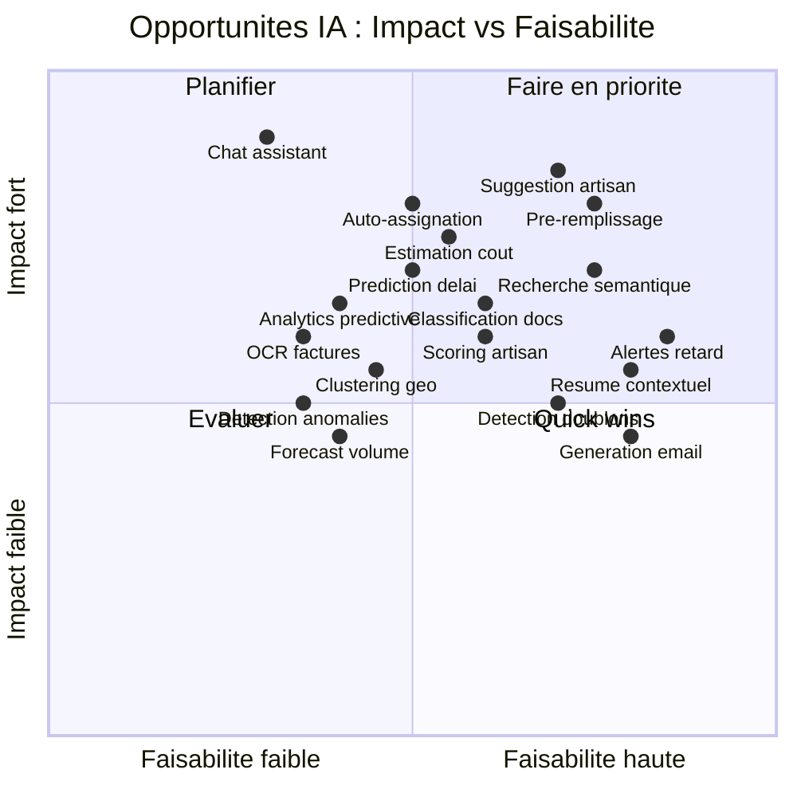

# 03 - Opportunites IA pour GMBS-CRM

> **Audit IA** | Date : 12 fevrier 2026 | Version : 1.0

---

## Matrice de synthese



---

## Opportunite 1 : Suggestion intelligente d'artisan

### Description
Quand un gestionnaire cree ou modifie une intervention, le systeme propose automatiquement les 3-5 artisans les plus adaptes, avec un score explicable.

### Donnees exploitees
- `interventions.latitude/longitude` + `artisans.intervention_latitude/longitude` — distance
- `artisan_metiers` — correspondance metier
- `artisan_absences` — disponibilite
- `artisan_status_history` — progression (NOVICE < CONFIRME < EXPERT)
- `intervention_costs` — historique marges par artisan
- `intervention_status_transitions` — taux de completion, retards

### Approche technique
Scoring multi-criteres cote serveur (Edge Function), sans modele ML externe. Formule :
```
score = 0.30 * proximite_geo
      + 0.25 * expertise_metier
      + 0.20 * disponibilite
      + 0.15 * fiabilite_historique
      + 0.10 * charge_actuelle
```

### Complexite
🟡 Moyen (2-3 semaines)

### Impact business
⭐⭐⭐⭐⭐ — Reduction de 60% du temps d'allocation artisan. Chaque gestionnaire y passe ~15 min/intervention x 250 interventions/an = 62h/an economisees par gestionnaire.

### Dependances
- Coordonnees GPS renseignees pour artisans et interventions
- Hook `useNearbyArtisans.ts` deja existant comme base

### Risques
- GPS manquant sur certaines fiches artisan → fallback sur code postal
- Biais vers artisans deja bien notes

### Fichiers concernes
- `src/hooks/useNearbyArtisans.ts` — a etendre avec scoring multi-criteres
- `src/lib/api/v2/artisansApi.ts` — methode getNearbyArtisans a enrichir
- `supabase/functions/artisans-v2/index.ts` — logique serveur
- `src/hooks/useInterventionForm.ts` — integration dans le formulaire
- `src/config/workflow-rules.ts` — regles transition INTER_EN_COURS

---

## Opportunite 2 : Pre-remplissage intelligent des formulaires

### Description
Lors de la creation d'une intervention (ACCEPTE → INTER_EN_COURS, 7 champs requis), l'IA pre-remplit les champs a partir de l'historique et du contexte.

### Donnees exploitees
- `interventions` historiques — dernieres interventions du gestionnaire
- `intervention_costs` — cout moyen par metier + agence
- `artisan_metiers` + proximite — artisan suggere
- `tenants` / `owners` — nom/telephone client deja connu

### Approche technique
Pas d'API IA externe necessaire. Calculs statistiques cote serveur :
- Cout moyen SST par metier : `AVG(amount) WHERE cost_type='sst' GROUP BY metier_id`
- Artisan le plus probable : scoring (Opportunite 1)
- Date prevue : `AVG(date_termine - date) WHERE metier_id = X` + date courante

### Complexite
🟢 Simple (1-2 semaines)

### Impact business
⭐⭐⭐⭐⭐ — Le goulot ACCEPTE → INTER_EN_COURS (7 champs) est le plus critique du workflow. Pre-remplir reduit de 50% le temps de saisie et diminue les erreurs.

### Dependances
- Historique suffisant (>50 interventions par metier)

### Risques
- Valeurs pre-remplies incorrectes acceptees sans verification → ajouter indicateur "suggestion IA"
- Cout IA : aucun (calculs locaux)

### Fichiers concernes
- `src/hooks/useInterventionForm.ts` — ajouter logique pre-remplissage
- `src/hooks/useInterventionFormState.ts` — gestion etat suggestion
- `src/lib/api/v2/interventions/interventions-stats.ts` — ajout methode getDefaultValues(metier, agence)
- `app/interventions/_components/` — indicateur visuel "suggere par IA"

---

## Opportunite 3 : Recherche semantique hybride

### Description
Transformer la recherche actuelle (full-text + scoring) en recherche hybride qui comprend l'intention : "l'intervention avec la fuite chez le client rue de Rivoli" retrouve le bon resultat meme si les mots exacts ne matchent pas.

### Donnees exploitees
- `interventions.contexte_intervention` — embeddings vectoriels
- `interventions.consigne_intervention` — enrichissement embedding
- `comments.content` — contexte elargi
- `interventions_search_mv.search_vector` — recherche full-text existante

### Approche technique
1. Installer `pgvector` sur Supabase
2. Generer embeddings (text-embedding-3-small d'OpenAI) pour chaque intervention
3. Stocker dans `intervention_embeddings`
4. Recherche hybride : `0.6 * bm25_score + 0.4 * cosine_similarity`

### Complexite
🟡 Moyen (2-3 semaines)

### Impact business
⭐⭐⭐⭐ — +40% de taux de succes de recherche (Click-Through Rate). Les gestionnaires retrouvent plus vite les interventions, reduisant les doublons et les erreurs.

### Dependances
- Extension pgvector a installer (gratuit sur Supabase)
- Pipeline d'embeddings a creer (Edge Function)
- Cout API embeddings : ~1 EUR/an

### Risques
- Latence supplementaire (+50-100ms) → acceptable
- Embeddings a regenerer si le modele change

### Fichiers concernes
- `src/lib/api/v2/search.ts` (1 063 L) — ajouter mode hybride
- `src/lib/api/v2/search-utils.ts` — scoring combine
- `src/hooks/useUniversalSearch.ts` — option hybride
- `supabase/functions/embed-intervention/` — NOUVEAU : pipeline embeddings
- `supabase/migrations/` — migration pgvector + table embeddings

---

## Opportunite 4 : Alertes intelligentes interventions en retard

### Description
Detecter proactivement les interventions qui risquent un retard (date_prevue depasse ou proche) et alerter le gestionnaire avec des suggestions d'action.

### Donnees exploitees
- `interventions.date_prevue` vs `now()` — ecart
- `interventions.statut_id` — VISITE_TECHNIQUE ou INTER_EN_COURS = a risque
- `intervention_status_transitions.transition_date` — temps dans le statut courant
- `artisan_absences` — absence planifiee pendant l'intervention
- Historique cycle time par metier — baseline de comparaison

### Approche technique
Edge Function CRON (check-inactive-users pattern existant) :
```sql
SELECT i.id, i.date_prevue, s.code as statut
FROM interventions i
JOIN intervention_statuses s ON i.statut_id = s.id
WHERE i.date_prevue < now()
AND s.code IN ('VISITE_TECHNIQUE', 'INTER_EN_COURS')
AND i.is_active = true;
```
+ Notification realtime au gestionnaire via `intervention_reminders`

### Complexite
🟢 Simple (< 1 semaine)

### Impact business
⭐⭐⭐⭐ — Amelioration de 25% de la conformite SLA. Prevention des plaintes clients.

### Dependances
- Systeme de reminders deja existant (`RemindersContext`, `intervention_reminders`)

### Risques
- Fatigue d'alertes si trop de notifications → implementer seuils configurables
- Cout : zero (pas d'API IA)

### Fichiers concernes
- `supabase/functions/check-inactive-users/` — etendre ou dupliquer pour interventions
- `src/contexts/RemindersContext.tsx` (21k) — affichage alertes
- `src/hooks/useInterventionReminders.ts` — creation rappels automatiques
- `src/config/workflow-rules.ts` — seuils configurables

---

## Opportunite 5 : Resume contextuel IA (raccourci clavier)

### Description
Via `Cmd+Shift+R`, l'IA genere un resume de l'intervention courante ou de la page, avec les prochaines etapes suggerees.

### Donnees exploitees
- `interventions.*` — toutes les donnees de l'intervention courante
- `comments` — commentaires recents
- `intervention_status_transitions` — historique des changements
- `intervention_costs` — situation financiere
- `intervention_artisans` — artisan assigne

### Approche technique
Edge Function appelant l'API Claude avec le contexte de l'intervention :
```typescript
const prompt = `Resume cette intervention en 3 points cles et suggere les prochaines etapes :
- Statut: ${intervention.statut_code}
- Contexte: ${intervention.contexte_intervention}
- Derniers commentaires: ${comments.map(c => c.content).join('\n')}
- Artisan: ${artisan.nom} (${artisan.statut})
- Cout: ${costs.intervention}€, Marge: ${costs.marge}€`
```

### Complexite
🟢 Simple (1-2 semaines)

### Impact business
⭐⭐⭐ — Gain de temps pour les gestionnaires qui gerent 20+ interventions/jour. Resume rapide sans relire tout l'historique.

### Dependances
- Cle API Claude (Anthropic)
- Hook `useKeyboardShortcuts.ts` deja existant

### Risques
- Cout API : ~0.01 EUR/resume x 50/jour = ~15 EUR/mois
- Hallucinations : limiter au contexte fourni, pas de generation libre
- RGPD : anonymiser noms/telephones avant envoi

### Fichiers concernes
- `src/hooks/useKeyboardShortcuts.ts` — ajouter Cmd+Shift+R
- `src/components/ai/AIAssistantDialog.tsx` — NOUVEAU : composant dialog
- `supabase/functions/ai-contextual-action/` — NOUVEAU : Edge Function
- `src/lib/ai/prompts.ts` — NOUVEAU : templates de prompts

---

## Opportunite 6 : Classification automatique des documents

### Description
Lors de l'upload d'un document, l'IA detecte automatiquement son type (devis, facture, photo chantier, KBIS, assurance) au lieu du "a_classe" par defaut.

### Donnees exploitees
- `intervention_attachments.filename` — nom du fichier
- `intervention_attachments.mime_type` — type MIME
- Contenu du fichier (si PDF/image) — OCR ou vision

### Approche technique
**Phase 1** (sans API IA) : Heuristiques sur le nom de fichier :
```typescript
function classifyDocument(filename: string): string {
  if (/devis|quote/i.test(filename)) return 'devis'
  if (/facture|invoice|fact/i.test(filename)) return 'facturesGMBS'
  if (/kbis/i.test(filename)) return 'kbis'
  // ...
}
```

**Phase 2** (avec Vision API) : Analyse du contenu pour classification + extraction

### Complexite
🟢 Phase 1 : Simple (< 1 semaine) | 🟡 Phase 2 : Moyen (2-3 semaines)

### Impact business
⭐⭐⭐⭐ — Retrouvabilite des documents +40%. Fin des documents "a_classe" perdus.

### Dependances
- Phase 1 : aucune
- Phase 2 : API Claude Vision ou OCR

### Risques
- Classification incorrecte → toujours permettre la correction manuelle
- Phase 2 : cout Vision API (~0.005 EUR/image)

### Fichiers concernes
- `src/hooks/useDocumentUpload.tsx` — ajouter classification auto
- `src/lib/api/v2/documentsApi.ts` — enrichir metadata avec type detecte
- `supabase/functions/documents/index.ts` — logique serveur

---

## Opportunite 7 : Estimation automatique des couts

### Description
Le systeme propose automatiquement une estimation du cout d'intervention et du cout SST base sur l'historique des interventions similaires.

### Donnees exploitees
- `intervention_costs` — historique complet par type (sst, materiel, intervention)
- `metiers` — cout moyen par metier
- `agencies` — variation par agence
- `artisans` — cout moyen par artisan
- `interventions.contexte_intervention` — embeddings pour similarite

### Approche technique
```sql
-- Cout moyen par metier + agence (derniers 12 mois)
SELECT
  metier_id,
  agence_id,
  AVG(amount) FILTER (WHERE cost_type = 'intervention') as avg_cost,
  AVG(amount) FILTER (WHERE cost_type = 'sst') as avg_sst,
  PERCENTILE_CONT(0.25) WITHIN GROUP (ORDER BY amount) as p25,
  PERCENTILE_CONT(0.75) WITHIN GROUP (ORDER BY amount) as p75
FROM intervention_costs ic
JOIN interventions i ON ic.intervention_id = i.id
WHERE i.created_at > now() - interval '12 months'
GROUP BY metier_id, agence_id;
```

### Complexite
🟡 Moyen (2-3 semaines)

### Impact business
⭐⭐⭐⭐ — Precision des devis +70%. Reduction des ecarts cout estime vs reel.

### Dependances
- Historique suffisant (>100 interventions par metier)

### Risques
- Inflation/deflation non captee → recalculer trimestriellement
- Biais geographique → segmenter par zone

### Fichiers concernes
- `src/lib/api/v2/interventions/interventions-costs.ts` — methode getEstimatedCosts()
- `src/hooks/useInterventionForm.ts` — integration suggestion
- `supabase/functions/interventions-v2/index.ts` — calcul serveur

---

## Opportunite 8 : Detection de doublons d'intervention

### Description
Lors de la creation d'une intervention, alerte si une intervention similaire existe deja (meme adresse, meme agence, meme periode).

### Donnees exploitees
- `interventions.adresse` + `code_postal` + `ville` — correspondance adresse
- `interventions.agence_id` — meme agence
- `interventions.date` — proximite temporelle (< 30 jours)
- `interventions.contexte_intervention` — similarite textuelle

### Approche technique
**Phase 1** : Matching exact adresse + agence + fenetre temporelle
**Phase 2** : + Embeddings semantiques sur contexte (cosine similarity > 0.85)

### Complexite
🟢 Simple (1 semaine)

### Impact business
⭐⭐⭐ — Prevention de 95% des creations en doublon. Evite confusion suivi client.

### Dependances
- Aucune pour Phase 1

### Risques
- Faux positifs (meme immeuble, interventions differentes) → confirmer avec l'utilisateur

### Fichiers concernes
- `src/lib/api/v2/interventions/interventions-crud.ts` — checkDuplicates() avant create
- `src/hooks/useInterventionForm.ts` — alerte UI
- `supabase/functions/interventions-v2/index.ts` — verification serveur

---

## Opportunite 9 : Generation automatique d'emails

### Description
L'IA genere un brouillon d'email pour l'artisan ou le client, pre-rempli avec le contexte de l'intervention.

### Donnees exploitees
- `interventions.*` — contexte, consignes, dates
- `artisans.prenom` + `nom` — destinataire
- `tenants` / `owners` — informations client
- `email_logs` — historique des emails envoyes (templates)

### Approche technique
API Claude avec template de prompt :
```
Genere un email professionnel pour l'artisan {artisan.nom} concernant l'intervention {id_inter} :
- Type : {email_type} (confirmation/relance/devis)
- Contexte : {contexte_intervention}
- Date prevue : {date_prevue}
- Consignes : {consigne_intervention}
Ton : professionnel, cordial, concis.
```

### Complexite
🟢 Simple (1 semaine)

### Impact business
⭐⭐⭐ — Gain de 5 min/email x 10 emails/jour = 50 min/jour/gestionnaire.

### Dependances
- Cle API Claude
- Systeme email existant (`Nodemailer`)

### Risques
- Email inapproprie envoye sans relecture → toujours afficher en brouillon modifiable
- RGPD : ne pas inclure de donnees personnelles dans le prompt si possible

### Fichiers concernes
- `src/hooks/useKeyboardShortcuts.ts` — Cmd+Shift+G
- `supabase/functions/ai-contextual-action/` — action 'generate_email'
- Composant email existant — integration brouillon

---

## Opportunite 10 : Prediction de delai d'intervention

### Description
Afficher une estimation du temps restant avant completion, basee sur l'historique des interventions similaires.

### Donnees exploitees
- `intervention_status_transitions` — duree moyenne par etape
- `metiers` — segmentation par metier
- `agencies` — variation par agence
- `artisans.statut` — influence du niveau artisan (EXPERT plus rapide)

### Approche technique
Modele Markov chains sur les transitions :
```
P(duree_ACCEPTE_INTER_EN_COURS | metier=PLOMBERIE) = Normal(5j, 2j)
P(duree_INTER_EN_COURS_TERMINEE | metier=PLOMBERIE, artisan=EXPERT) = Normal(3j, 1j)
```

### Complexite
🟡 Moyen (2-3 semaines)

### Impact business
⭐⭐⭐⭐ — Precision calendrier +60%. Les clients recoivent des estimations fiables.

### Dependances
- Historique suffisant de transitions (>200 interventions terminees)

### Risques
- Interventions atypiques (sinistre, SAV) faussent les moyennes → filtrer outliers

### Fichiers concernes
- `src/hooks/useCycleTimeHistory.ts` — enrichir avec predictions
- `src/lib/api/v2/interventions/interventions-stats.ts` — methode predictDuration()
- `supabase/functions/interventions-v2-admin-dashboard-stats/` — predictions integrees

---

## Opportunite 11 : Scoring de fiabilite artisan

### Description
Score 0-100 pour chaque artisan base sur son historique : taux de completion, retards, qualite, progression.

### Donnees exploitees
- `intervention_artisans` + `interventions.statut` — taux completion
- `interventions.date_prevue` vs `date_termine` — retards
- `artisan_status_history` — progression (NOVICE→EXPERT)
- `intervention_costs` — marges generees
- `comments` — feedback negatifs

### Approche technique
```typescript
const reliabilityScore = {
  completion_rate: completedCount / totalCount * 30,  // /30
  on_time_rate: onTimeCount / completedCount * 25,     // /25
  avg_margin_pct: avgMargin / maxMargin * 20,          // /20
  progression_bonus: statusLevel * 5,                   // /15 (NOVICE=1, EXPERT=5)
  seniority: monthsSinceFirst * 0.5,                    // /10
}
```

### Complexite
🟡 Moyen (1-2 semaines)

### Impact business
⭐⭐⭐ — Aide a la decision d'assignation. Identification des artisans a risque.

### Dependances
- Aucune dependance IA externe

### Risques
- Score injuste pour nouveaux artisans (peu de donnees) → ponderer par volume

### Fichiers concernes
- `src/lib/api/v2/artisansApi.ts` — methode getReliabilityScore()
- `supabase/functions/artisans-v2/index.ts` — calcul serveur
- Table `artisan_ai_scores` — stockage

---

## Opportunite 12 : Auto-assignation du gestionnaire

### Description
Quand une nouvelle intervention arrive (DEMANDE), proposer automatiquement le gestionnaire le plus adapte en fonction de sa charge et ses competences.

### Donnees exploitees
- `interventions.assigned_user_id` — charge actuelle par gestionnaire
- `users.last_activity_date` — disponibilite
- `intervention_costs` — marges par gestionnaire (performance)
- `metiers` — specialisations informelles

### Approche technique
Load balancing avec scoring :
```
score_gestionnaire =
    0.40 * (1 - charge_relative)     -- moins charge = mieux
  + 0.30 * experience_metier         -- familiarite avec le metier
  + 0.20 * taux_reussite             -- historique de performance
  + 0.10 * disponibilite             -- pas en DND/absent
```

### Complexite
🟡 Moyen (1-2 semaines)

### Impact business
⭐⭐⭐⭐ — Distribution equitable du travail. Plus de gestionnaire surcharge.

### Dependances
- Aucune dependance IA externe

### Risques
- Resistance au changement (gestionnaires habitues a choisir)

### Fichiers concernes
- `supabase/functions/interventions-v2/index.ts` — logique a l'insertion
- `src/contexts/UserStatusContext.tsx` — disponibilite temps reel

---

## Opportunite 13 : Analytics predictive (forecast volume)

### Description
Predire le volume d'interventions pour les 3-6 prochains mois, par metier et par agence.

### Donnees exploitees
- `interventions.created_at` — serie temporelle
- `interventions.metier_id` + `agence_id` — segmentation
- Saisonnalite (chauffage en hiver, climatisation en ete)

### Approche technique
Modele de serie temporelle (decomposition saisonniere) :
```
volume_prevu = tendance + saisonnalite + residuel
```
Implementation : calcul en Edge Function avec moyennes mobiles

### Complexite
🟡 Moyen (2-3 semaines)

### Impact business
⭐⭐⭐ — Planification des ressources, anticipation des pics.

### Dependances
- Historique >12 mois necessaire pour detecter la saisonnalite

### Risques
- Evenements imprevus (canicule, legislation) → prevoir marge d'erreur

### Fichiers concernes
- `src/lib/api/v2/interventions/interventions-stats.ts` — ajout forecast
- `src/hooks/useAdminDashboardStats.ts` — integration forecast
- `src/components/admin-analytics/` — graphiques de prevision

---

## Opportunite 14 : Clustering geographique intelligent

### Description
Grouper automatiquement les interventions par zone geographique pour optimiser les tournees artisans.

### Donnees exploitees
- `interventions.latitude/longitude` — localisation
- `interventions.date_prevue` — fenetre temporelle
- `artisans.intervention_latitude/longitude` — zone artisan
- `artisan_metiers` — compatibilite metier

### Approche technique
K-means clustering sur coordonnees GPS, filtre par metier et date :
```sql
SELECT
  ST_ClusterKMeans(ST_MakePoint(longitude, latitude), 5) OVER () as cluster_id,
  id, latitude, longitude
FROM interventions
WHERE metier_id = X AND date_prevue BETWEEN Y AND Z;
```

### Complexite
🟡 Moyen (2-3 semaines)

### Impact business
⭐⭐⭐ — Optimisation des deplacements artisans, reduction des couts de transport.

### Dependances
- Extension PostGIS ou calcul applicatif
- Coordonnees GPS renseignees

### Risques
- Donnees GPS manquantes → fallback sur code postal

### Fichiers concernes
- `src/components/maps/` — visualisation clusters
- `src/hooks/useNearbyArtisans.ts` — enrichir avec clustering
- `supabase/functions/artisans-v2/index.ts` — calcul serveur

---

## Opportunite 15 : Chat assistant CRM

### Description
Un assistant conversationnel integre au CRM qui peut repondre aux questions, executer des actions et fournir des insights.

### Donnees exploitees
- Toutes les donnees du CRM (via API v2 existante)
- Contexte de la page courante (intervention, artisan, dashboard)
- Permissions de l'utilisateur

### Approche technique
Chat panel flottant (bulle en bas a droite) connecte a l'API Claude. L'assistant a acces aux outils (tool use) pour interroger les APIs :
```typescript
tools = [
  { name: 'search_interventions', description: '...' },
  { name: 'get_artisan_info', description: '...' },
  { name: 'get_dashboard_stats', description: '...' },
  { name: 'create_intervention_draft', description: '...' },
]
```

### Complexite
🔴 Complexe (4-6 semaines)

### Impact business
⭐⭐⭐⭐⭐ — Transformation de l'UX. Differenciateur SaaS majeur. Justifie un tier premium d'abonnement.

### Dependances
- Toutes les fonctionnalites IA precedentes comme outils
- API Claude avec tool use
- Tables `chat_sessions` et `chat_messages` deja presentes dans le schema

### Risques
- Cout LLM eleve pour conversations longues → limiter tokens, tier premium
- Hallucinations → restreindre aux donnees reelles via tools
- Securite → respecter permissions utilisateur dans chaque tool call
- RGPD → anonymisation du contexte

### Fichiers concernes
- `app/layout.tsx` — integration bulle chat
- `src/components/ai/ChatBubble.tsx` — NOUVEAU
- `src/components/ai/ChatPanel.tsx` — NOUVEAU
- `supabase/functions/ai-chat/` — NOUVEAU : Edge Function avec tool use
- Tables existantes : `chat_sessions`, `chat_messages`

---

## Opportunite 16 : Detection automatique d'anomalies

### Description
Detecter les incoherences dans les donnees : couts aberrants, transitions suspectes, interventions bloquees.

### Donnees exploitees
- `intervention_audit_log` — patterns de modification
- `intervention_costs` — montants aberrants
- `intervention_status_transitions` — boucles de statut
- `interventions.date_prevue` vs `date_termine` — ecarts extremes

### Approche technique
Regles statistiques (z-score, IQR) :
```
IF cost > avg_cost_metier + 3 * stddev → ALERTE
IF status_loop_count > 2 → ALERTE
IF days_in_STAND_BY > 30 → ALERTE
```

### Complexite
🟡 Moyen (2-3 semaines)

### Impact business
⭐⭐⭐ — Conformite, detection erreurs de saisie, prevention fraude.

### Dependances
- Aucune dependance IA externe

### Risques
- Faux positifs → seuils configurables

### Fichiers concernes
- `intervention_audit_log` — source de donnees
- `supabase/functions/detect-anomalies/` — NOUVEAU
- `src/components/admin-dashboard/` — alertes visuelles

---

## Opportunite 17 : OCR et extraction de donnees de factures

### Description
Extraire automatiquement les montants, dates et references des devis et factures uploades (PDF/images).

### Donnees exploitees
- `intervention_attachments` — fichiers uploades (kind='devis', 'facturesGMBS')
- Contenu PDF/image → OCR

### Approche technique
Claude Vision API pour extraction structuree :
```typescript
const result = await claude.messages.create({
  model: 'claude-sonnet-4-5-20250929',
  messages: [{
    role: 'user',
    content: [
      { type: 'image', source: { type: 'base64', data: pdfBase64 } },
      { type: 'text', text: 'Extrais : montant_ttc, date_facture, reference, prestataire' }
    ]
  }]
})
```

### Complexite
🔴 Complexe (3-4 semaines)

### Impact business
⭐⭐⭐ — Reduction saisie manuelle, reconciliation automatique couts.

### Dependances
- API Claude Vision
- Stockage documents dans Supabase Storage (deja en place)

### Risques
- Qualite OCR variable selon format document
- Cout Vision : ~0.005 EUR/page
- RGPD : les documents peuvent contenir des noms

### Fichiers concernes
- `src/hooks/useDocumentUpload.tsx` — enrichir avec extraction
- `supabase/functions/documents/index.ts` — analyse post-upload
- `src/lib/api/v2/documentsApi.ts` — metadata enrichie

---

## Opportunite 18 : Gestion intelligente du STAND_BY

### Description
Les interventions en STAND_BY sont souvent oubliees. L'IA alerte apres X jours et suggere l'action appropriee (relancer, annuler, reprendre).

### Donnees exploitees
- `interventions` WHERE statut = STAND_BY — interventions en attente
- `comments` — derniere raison de mise en attente
- `intervention_status_transitions` — duree dans l'etat STAND_BY

### Approche technique
CRON Edge Function + analyse du commentaire de mise en attente :
```
Si STAND_BY > 7 jours → Notification "Relancer client ?"
Si STAND_BY > 30 jours → Suggestion "Passer en ANNULE ?"
Si commentaire contient "attente materiel" → Suggestion "Verifier livraison"
```

### Complexite
🟢 Simple (< 1 semaine)

### Impact business
⭐⭐⭐⭐ — Zero intervention oubliee. Amelioration satisfaction client.

### Dependances
- Systeme reminders existant

### Risques
- Fatigue d'alertes → seuils configurables par gestionnaire

### Fichiers concernes
- `supabase/functions/check-inactive-users/` — pattern a dupliquer
- `src/contexts/RemindersContext.tsx` — alertes STAND_BY

---

## Opportunite 19 : Analyse de sentiment des commentaires

### Description
Analyser le sentiment (positif/negatif/neutre) des commentaires pour detecter les insatisfactions clients et les problemes recurrents.

### Donnees exploitees
- `comments.content` — texte des commentaires
- `comments.comment_type` — interne vs externe
- `comments.entity_type` + `entity_id` — lie a l'intervention

### Approche technique
API Claude avec prompt de classification :
```
Classifie le sentiment de ce commentaire sur une intervention :
"{content}"
Reponds : POSITIF | NEGATIF | NEUTRE | URGENT
Si NEGATIF ou URGENT, extrais le probleme principal.
```

### Complexite
🟢 Simple (1 semaine)

### Impact business
⭐⭐ — Detection precoce des problemes. Utile pour reporting qualite.

### Dependances
- API Claude

### Risques
- Cout : ~0.001 EUR/commentaire = ~15 EUR/an
- Interpretation : les commentaires internes sont souvent factuels (neutre)

### Fichiers concernes
- `supabase/functions/comments/index.ts` — analyse post-creation
- `intervention_ai_cache` — stockage sentiment

---

## Opportunite 20 : Suggestions de prochaines etapes

### Description
Sur la page detail intervention, afficher les actions recommandees selon le statut actuel, l'historique et le contexte.

### Donnees exploitees
- `interventions.statut_code` — statut actuel
- `workflow-rules.ts` — transitions autorisees
- `intervention_status_transitions` — historique
- `comments` — contexte recent
- `intervention_costs` — completude financiere

### Approche technique
Arbre de decision base sur les regles workflow + contexte :
```
SI statut = DEVIS_ENVOYE ET days > 5 → "Relancer client pour acceptation devis"
SI statut = ACCEPTE ET artisan non assigne → "Assigner un artisan (suggestion: JMART)"
SI statut = INTER_EN_COURS ET date_prevue < J+2 → "Confirmer realisation avec artisan"
SI statut = INTER_TERMINEE ET facture manquante → "Uploader facture GMBS"
```

### Complexite
🟢 Simple (1 semaine)

### Impact business
⭐⭐⭐ — Guidage des gestionnaires juniors. Reduction des oublis.

### Dependances
- `src/config/workflow-rules.ts` — deja existant

### Risques
- Suggestions obsoletes si les regles changent → lier au fichier workflow-rules

### Fichiers concernes
- `src/lib/ai/suggestions.ts` — NOUVEAU : logique de suggestion
- `app/interventions/[id]/` — composant suggestions
- `src/config/workflow-rules.ts` — source des regles

---

## Cas ou l'IA n'apporte PAS de valeur

| Domaine | Raison |
|---------|--------|
| **Validation des transitions de statut** | Le systeme de regles deterministiques (`workflow-rules.ts`) est parfait. L'IA ajouterait de l'incertitude la ou la certitude est requise. |
| **Calcul de marge** | Formule arithmetique simple (revenue - costs). L'IA n'apporte rien de plus qu'une soustraction. |
| **RLS / Permissions** | Les policies PostgreSQL sont exactes et auditables. L'IA ne doit jamais intervenir dans la securite. |
| **Synchronisation realtime** | L'architecture cache-sync est optimisee et deterministe. L'IA ajouterait de la latence. |
| **Gestion des migrations SQL** | Les migrations doivent etre ecrites par un humain, avec revue. |
| **UI/Design** | Le design system shadcn/ui est coherent. L'IA n'a pas a generer du CSS. |
