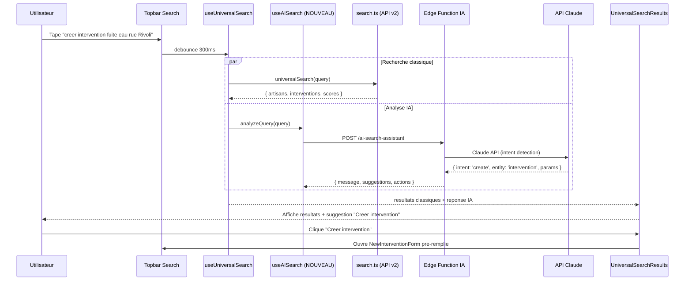
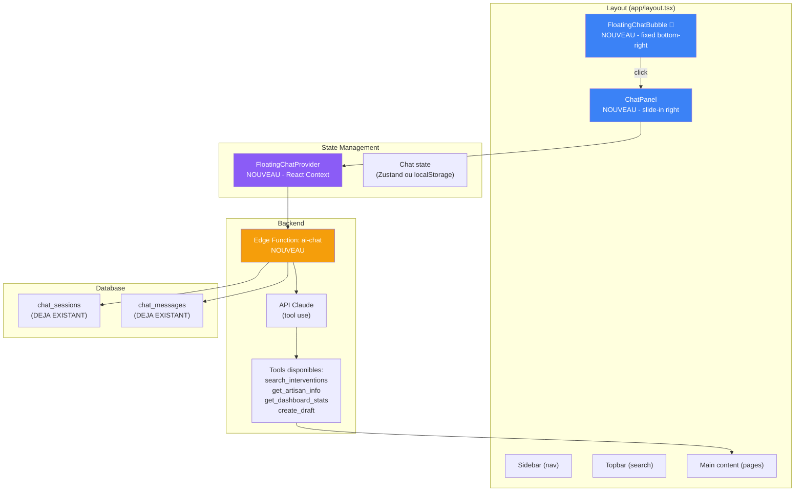
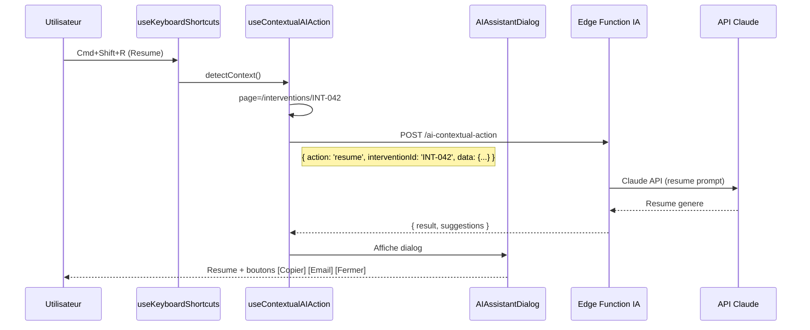
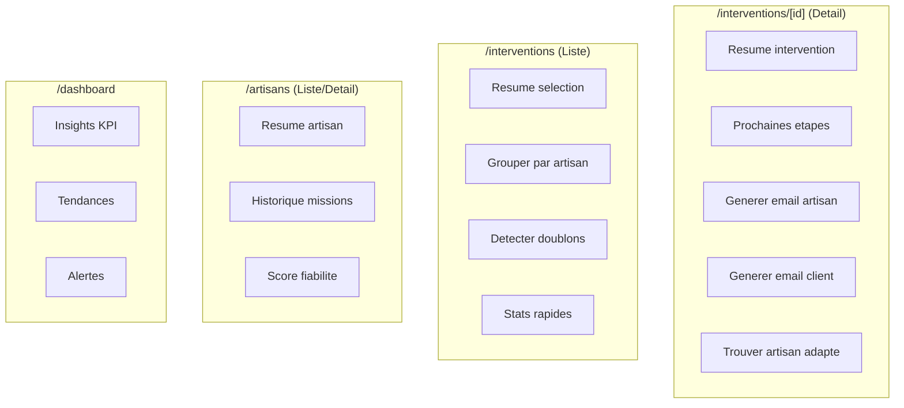
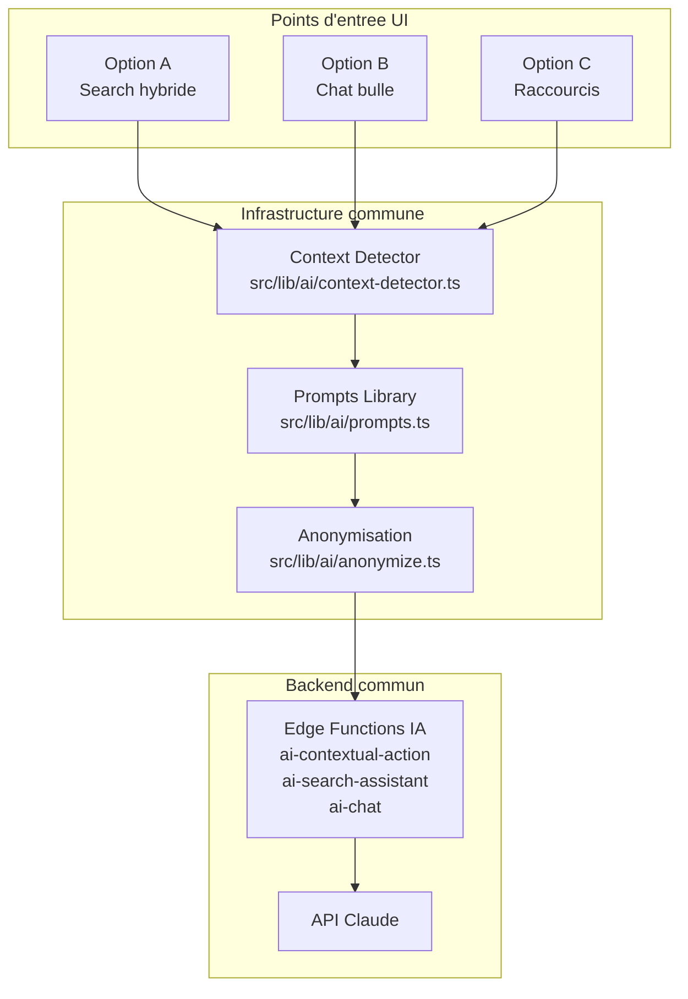
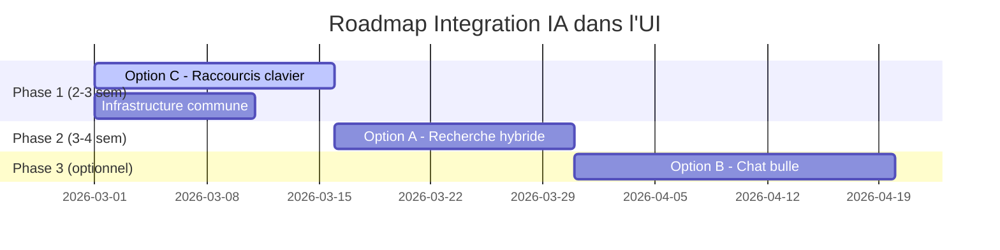

# 04 - Integration UI de l'IA dans GMBS-CRM

> **Audit IA** | Date : 12 fevrier 2026 | Version : 1.0

---

## Analyse comparative des 3 modes d'integration

Ce document analyse en detail les 3 approches pour integrer l'IA dans l'interface utilisateur du CRM, avec des recommandations concretes ancrees dans le codebase existant.

---

## Option A — Chat integre a la recherche (Cmd+K)

### Concept

Transformer la barre de recherche existante (`topbar.tsx`) en une **recherche hybride** : les resultats classiques (SQL full-text) sont enrichis par une reponse IA qui comprend l'intention de l'utilisateur et propose des actions.

### Diagramme du flux utilisateur



### Composants a modifier

| Fichier | Modification | Effort |
|---------|-------------|--------|
| `src/components/search/UniversalSearchResults.tsx` (267 L) | Ajouter section IA en haut des resultats | 1 jour |
| `src/hooks/useUniversalSearch.ts` (192 L) | Brancher useAISearch en parallele | 0.5 jour |
| `src/lib/api/v2/search.ts` (1 063 L) | Aucune modification (recherche classique inchangee) | - |
| `src/components/layout/topbar.tsx` (29k) | Passer le mode IA au composant search | 0.5 jour |

### Composants a creer

| Fichier | Lignes estimees | Role |
|---------|----------------|------|
| `src/components/search/SearchResponseWithAI.tsx` | ~200 | Panel reponse IA dans les resultats |
| `src/hooks/useAISearch.ts` | ~150 | Hook pour l'analyse IA de la requete |
| `supabase/functions/ai-search-assistant/index.ts` | ~200 | Edge Function (intent detection + suggestions) |
| `src/lib/ai/search-prompts.ts` | ~100 | Templates de prompts pour la recherche |

### Experience utilisateur

```
┌─────────────────────────────────────────────────┐
│ 🔍  creer intervention fuite eau rue Rivoli     │
├─────────────────────────────────────────────────┤
│ 🤖 IA : Je detecte une demande de creation      │
│    d'intervention pour un probleme de fuite      │
│    d'eau, rue de Rivoli.                         │
│    [Creer intervention] [Rechercher similaires]  │
├─────────────────────────────────────────────────┤
│ 📋 Interventions (3 resultats)                   │
│    INT-2026-042 | Fuite robinet - Rue Rivoli     │
│    INT-2026-038 | Degat eaux - 3e etage Rivoli   │
│    INT-2025-891 | Plomberie urgente - Rivoli      │
├─────────────────────────────────────────────────┤
│ 👷 Artisans (2 resultats)                        │
│    AA042 | Jean Martin | Plomberie | 2.3 km      │
│    AA019 | Paul Dupont | Plomberie | 4.1 km      │
└─────────────────────────────────────────────────┘
```

### Avantages

- Integration naturelle dans l'UX existante (meme barre de recherche)
- Zero nouvelle surface UI a decouvrir
- Resultats classiques toujours presents (pas de regression)
- Suggestions d'actions contextuelles
- Faible friction utilisateur

### Inconvenients

- Limite aux requetes courtes (pas de conversation)
- Pas d'historique conversationnel
- Pas de possibilite d'affiner la demande en plusieurs tours
- Depend de la qualite du parsing de la requete

### Estimation d'effort

| Tache | Jours |
|-------|-------|
| Edge Function IA + prompts | 3-4 |
| Composants frontend | 2-3 |
| Integration hook search | 1 |
| Tests | 1-2 |
| **Total** | **8-10 jours** |

---

## Option B — Chatbot bulle flottante (type Messenger)

### Concept

Une **bulle de chat** toujours visible en bas a droite de l'ecran, qui ouvre un **panneau coulissant** permettant des conversations longues avec l'IA. L'IA a acces au contexte de la page courante.

### Diagramme d'architecture



### Composants a creer

| Fichier | Lignes estimees | Role |
|---------|----------------|------|
| `src/components/ai/FloatingChatBubble.tsx` | ~120 | Bulle fixe avec badge unread |
| `src/components/ai/ChatPanel.tsx` | ~200 | Panneau coulissant (messages + input) |
| `src/components/ai/ChatMessage.tsx` | ~150 | Rendu message (markdown, actions inline) |
| `src/components/ai/ChatInput.tsx` | ~100 | Zone de saisie (Ctrl+Enter, mentions) |
| `src/contexts/FloatingChatContext.tsx` | ~150 | Provider global (state, historique) |
| `src/hooks/useFloatingChat.ts` | ~200 | Hook API chat (send, clear, stream) |
| `supabase/functions/ai-chat/index.ts` | ~300 | Edge Function avec tool use Claude |
| `src/lib/ai/chat-tools.ts` | ~200 | Definition des tools disponibles |

### Composants a modifier

| Fichier | Modification |
|---------|-------------|
| `app/layout.tsx` (14k) | Ajouter `<FloatingChatProvider>` + `<FloatingChatBubble />` + `<ChatPanel />` |

### Integration avec le contexte de page

```typescript
// useFloatingChat.ts - Detection automatique du contexte
function getPageContext(): ChatContext {
  const pathname = usePathname()
  const modalState = useInterventionModalState()

  return {
    currentPage: pathname,  // "/interventions" | "/artisans" | "/dashboard"
    // Si une modal intervention est ouverte, inclure les donnees
    interventionId: modalState.isOpen ? modalState.interventionId : null,
    interventionData: modalState.isOpen ? getInterventionData() : null,
    // Permissions de l'utilisateur pour limiter les actions
    userPermissions: usePermissions(),
  }
}
```

### Experience utilisateur

```
┌──────────────────────────────────────────────────────────┐
│ Page Interventions                                        │
│ ┌──────────────────────┐                                  │
│ │ Liste interventions  │                  ┌──────────────┐│
│ │ ...                  │                  │ 💬 Assistant  ││
│ │ ...                  │                  │──────────────││
│ │ ...                  │                  │ Bonjour ! En ││
│ │ ...                  │                  │ quoi puis-je ││
│ │ ...                  │                  │ vous aider ? ││
│ │ ...                  │                  │              ││
│ │ ...                  │                  │ 👤 Quels     ││
│ │ ...                  │                  │ artisans ont ││
│ │ ...                  │                  │ le plus      ││
│ │ ...                  │                  │ d'inter ?    ││
│ │ ...                  │                  │              ││
│ │ ...                  │                  │ 🤖 Top 5 :   ││
│ │ ...                  │                  │ 1. JMART (12)││
│ │ ...                  │                  │ 2. PDUP (9)  ││
│ │ ...                  │                  │ [Voir detail]││
│ │ ...                  │                  │──────────────││
│ │ ...                  │                  │ Message...   ││
│ └──────────────────────┘                  └──────────────┘│
│                                                    [💬]   │
└──────────────────────────────────────────────────────────┘
```

### Avantages

- Toujours disponible, non intrusif quand ferme
- Conversations naturelles multi-tours
- Historique persistant (tables deja presentes : `chat_sessions`, `chat_messages`)
- Contexte de page automatique
- Execution d'actions via tool use Claude
- Differenciateur SaaS fort

### Inconvenients

- Encombrement UI (panel prend de la place)
- Complexite d'implementation elevee (~800 lignes de composants)
- Cout LLM eleve pour conversations longues
- Gestion streaming complexe
- Risque de dependance (utilisateurs qui "parlent au chatbot" au lieu d'utiliser l'UI)
- RGPD : historique a gerer (retention, droit a l'oubli)

### Estimation d'effort

| Tache | Jours |
|-------|-------|
| Composants UI (bulle, panel, messages) | 5-6 |
| Backend Edge Function + tool use | 3-4 |
| Context + state management | 2-3 |
| Streaming + realtime | 2 |
| Tests + polish | 2-3 |
| **Total** | **15-18 jours** |

---

## Option C — Raccourcis clavier + assistant contextuel

### Concept

Des **actions IA rapides** accessibles via raccourcis clavier, qui s'executent dans le contexte de la page/modal courante. Un dialog leger apparait avec le resultat.

### Diagramme du flux



### Raccourcis proposes

| Raccourci | Action | Contexte | Resultat |
|-----------|--------|----------|---------|
| `Cmd+Shift+A` | Ouvrir assistant IA | Toutes pages | Menu d'actions disponibles |
| `Cmd+Shift+R` | Resume | Detail intervention/artisan | Resume 3 points + prochaines etapes |
| `Cmd+Shift+S` | Suggestions | Liste/detail | Actions recommandees |
| `Cmd+Shift+G` | Generer email | Detail intervention | Brouillon email artisan/client |
| `Cmd+Shift+F` | Trouver artisan | Detail intervention | Top 3 artisans recommandes |

### Composants a modifier

| Fichier | Modification | Effort |
|---------|-------------|--------|
| `src/hooks/useKeyboardShortcuts.ts` (32 L) | Ajouter 5 nouveaux callbacks | 0.5 jour |
| `src/components/layout/topbar.tsx` | Passer callbacks IA | 0.5 jour |
| `app/layout.tsx` | Wrapper AIAssistantProvider | 0.5 jour |

### Composants a creer

| Fichier | Lignes estimees | Role |
|---------|----------------|------|
| `src/components/ai/AIAssistantDialog.tsx` | ~200 | Dialog leger pour afficher resultat |
| `src/components/ai/AIActionsPanel.tsx` | ~100 | Menu des actions IA disponibles |
| `src/hooks/useContextualAIAction.ts` | ~200 | Detection contexte + execution action |
| `src/lib/ai/context-detector.ts` | ~100 | Detecte page/entity/permissions |
| `src/lib/ai/prompts.ts` | ~300 | Templates prompts par action |
| `supabase/functions/ai-contextual-action/index.ts` | ~200 | Edge Function par action |

### Actions par contexte de page



### Experience utilisateur

```
┌──────────────────────────────────────────────────┐
│ Intervention INT-2026-042                         │
│ ┌──────────────────────────────────────────────┐  │
│ │ Statut: INTER_EN_COURS | Plomberie           │  │
│ │ Artisan: Jean Martin (JMART)                  │  │
│ │ ...                                           │  │
│ └──────────────────────────────────────────────┘  │
│                                                    │
│  ┌─ AI Assistant (Cmd+Shift+R) ──────────────────┐│
│  │                                                ││
│  │ 📋 Resume :                                    ││
│  │ • Fuite d'eau cuisine - en cours depuis 3j     ││
│  │ • Artisan JMART assigne, date prevue : 15/02   ││
│  │ • Cout estime 450€, marge prevue 35%           ││
│  │                                                ││
│  │ 💡 Prochaines etapes :                         ││
│  │ 1. Confirmer realisation avec artisan (J-3)    ││
│  │ 2. Preparer facture GMBS                       ││
│  │ 3. Verifier paiement acompte client            ││
│  │                                                ││
│  │ [Copier] [Envoyer par email] [Fermer]          ││
│  └────────────────────────────────────────────────┘│
└──────────────────────────────────────────────────┘
```

### Avantages

- Totalement discret (invisible tant que non utilise)
- Contexte automatique (page + entite + permissions)
- Tres rapide (action one-shot, pas de conversation)
- Apprentissable (raccourcis clavier standards)
- Power-user friendly
- Leger en composants (~500 lignes total)
- Cout LLM maitrise (requetes courtes)

### Inconvenients

- Decouverte difficile (raccourcis caches)
- Pas de mode conversationnel
- Actions pre-definies (moins flexible qu'un chat)
- Necessite onboarding/documentation
- Pas d'historique des actions

### Estimation d'effort

| Tache | Jours |
|-------|-------|
| Hooks + detection contexte | 3 |
| Edge Function par action | 2-3 |
| Dialog UI + actions panel | 1-2 |
| Prompts + tuning | 1-2 |
| Tests + documentation | 1 |
| **Total** | **8-10 jours** |

---

## Comparatif et Recommandation

### Tableau comparatif

| Critere | Option A (Search) | Option B (Bubble) | Option C (Shortcuts) |
|---------|:-----------------:|:-----------------:|:--------------------:|
| **Effort** | 8-10 jours | 15-18 jours | 8-10 jours |
| **Impact UX** | ⭐⭐⭐ | ⭐⭐⭐⭐⭐ | ⭐⭐⭐ |
| **Decouverte** | Immediate | Evidente | Difficile |
| **Conversation** | Non | Oui (multi-tours) | Non |
| **Contexte auto** | Non | Oui | Oui |
| **Cout LLM** | Faible | Eleve | Moyen |
| **Power-users** | ⭐⭐⭐ | ⭐⭐ | ⭐⭐⭐⭐⭐ |
| **Casual users** | ⭐⭐⭐⭐ | ⭐⭐⭐⭐⭐ | ⭐⭐ |
| **Mobile** | ✅ | ⚠️ (espace) | ⚠️ (pas de clavier) |
| **Scalabilite cout** | Bonne | Risquee | Bonne |
| **Differenciateur SaaS** | ⭐⭐ | ⭐⭐⭐⭐⭐ | ⭐⭐⭐ |
| **Risque technique** | Faible | Moyen | Faible |

### Possibilite de combinaison

Les 3 options ne sont **pas mutuellement exclusives**. Elles partagent la meme infrastructure backend (Edge Functions IA, prompts, detection contexte). L'architecture recommandee :



### Recommandation strategique



**Phase 1 — Option C (Raccourcis clavier)** : Commencer par la. ROI rapide, validation d'usage avec les power-users, faible risque. L'infrastructure backend (Edge Functions, prompts, context detector) est creee et reutilisee par les phases suivantes.

**Phase 2 — Option A (Recherche hybride)** : Etendre la recherche existante avec les capacites IA. Reutilise 80% de l'infrastructure Phase 1. Ouvre l'IA a tous les utilisateurs (pas seulement les power-users).

**Phase 3 — Option B (Chat bulle)** : A evaluer apres feedback Phases 1+2. Si les utilisateurs demandent des interactions longues et conversationnelles, le chat devient pertinent. Sinon, les Phases 1+2 suffisent.

### Budget total des 3 phases

| Phase | Effort | Composants | Backend |
|-------|--------|-----------|---------|
| Phase 1 (C) | 8-10 jours | ~500 L | 1 Edge Function |
| Phase 2 (A) | 6-8 jours | ~350 L | 1 Edge Function (reutilise infra) |
| Phase 3 (B) | 12-15 jours | ~800 L | 1 Edge Function (reutilise infra) |
| **Total** | **26-33 jours** | **~1 650 L** | **3 Edge Functions** |
