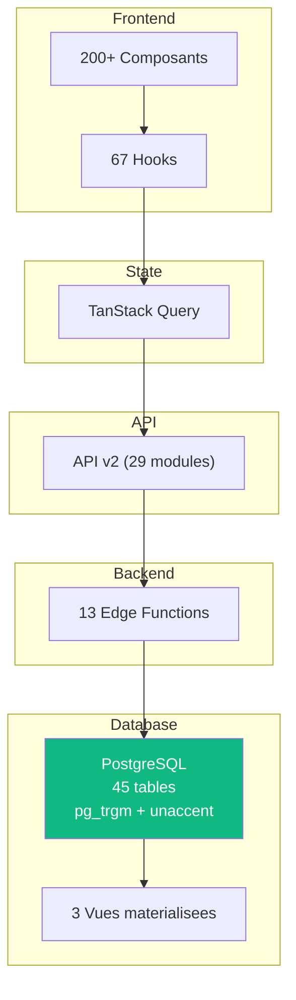
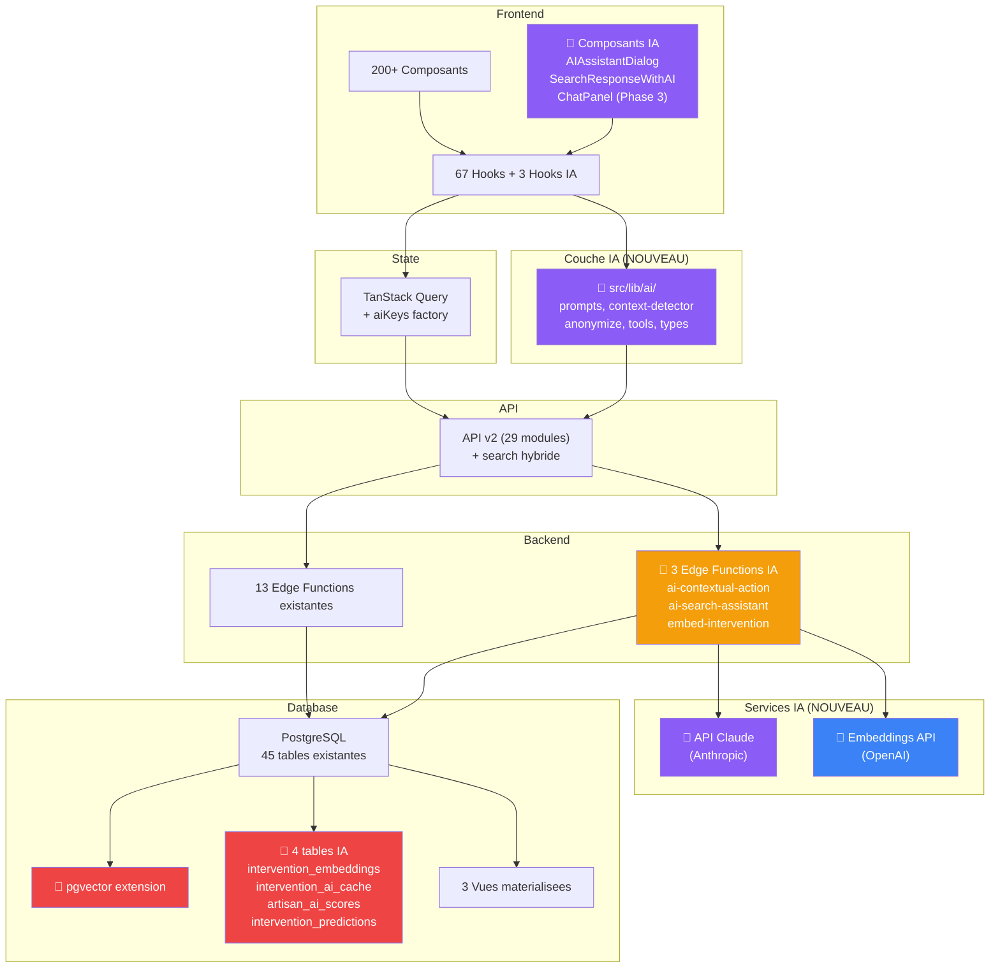

# 05 - Etat des Lieux : Ce qui est Pret et Ce qui Manque

> **Audit IA** | Date : 12 fevrier 2026 | Version : 1.0

---

## 1. Ce qui va : atouts existants pour l'IA

### 1.1 Architecture modulaire et extensible

Le CRM est construit selon des patterns d'architecture qui facilitent l'injection d'une couche IA sans modification majeure de l'existant.

| Atout | Detail | Fichier(s) | Impact IA |
|-------|--------|-----------|-----------|
| **API v2 Facade** | Facade centralisee avec 29 modules. Ajouter un module `aiApi.ts` suit le meme pattern. | `src/lib/api/v2/index.ts` | Permet d'ajouter des appels IA sans toucher aux modules existants |
| **Hook pattern** | 67 hooks custom. Creer `useAISuggestions()` ou `useAISearch()` suit exactement le meme schema. | `src/hooks/` | Pattern eprouve pour encapsuler la logique IA |
| **Edge Functions** | 13 fonctions Deno existantes. Le pattern est maitrise, le deploiement rodé. | `supabase/functions/` | Creer `ai-contextual-action/`, `ai-chat/` = meme pattern |
| **TanStack Query** | Cache serveur avec invalidation ciblee. Les predictions IA peuvent etre cachees avec `staleTime: 5min`. | `src/lib/react-query/queryKeys.ts` | Ajouter `aiKeys.suggestion(id)` suit la factory existante |
| **Query Key Factory** | Factories centralisees pour chaque entite. | `queryKeys.ts` | Extension naturelle avec `aiKeys` |
| **Realtime system** | Cache-sync sophistique. Les scores IA peuvent etre pousses en temps reel. | `src/lib/realtime/` | Enrichissement des events avec metadata IA |
| **Error handling** | Pattern `safeErrorMessage()` avec messages differents dev/prod. | `src/lib/api/v2/common/error-handler.ts` | Gestion erreurs API IA avec le meme pattern |

### 1.2 Infrastructure database prete

| Atout | Detail | Impact IA |
|-------|--------|-----------|
| **Vues materialisees** | 3 MV avec `tsvector` GIN pour la recherche. Base pour recherche hybride. | La recherche semantique s'ajoute en parallele du full-text |
| **Audit log complet** | `intervention_audit_log` avec diff (old/new values). 20+ triggers. | Donnees riches pour detection anomalies et analyse patterns |
| **Status transitions** | Table `intervention_status_transitions` trace chaque changement. | Base pour Markov chains et prediction de cycle time |
| **Extension pg_trgm** | Deja installee pour la recherche trigram. | Base pour fuzzy search amelioree |
| **Extension unaccent** | Deja installee. | Recherche insensible aux accents |
| **Soft delete** | `archived_at` + `is_active` sur toutes les entites principales. | Donnees historiques preservees pour l'entrainement |
| **RLS policies** | 30+ policies. | Les requetes IA respectent les memes droits que l'UI |

### 1.3 Tables deja presentes pour le chat IA

Le schema contient deja des tables preparees pour l'IA :

```
chat_sessions         -- Sessions de chat IA (user_id, title, model_tier)
chat_messages         -- Messages (role: user/assistant, content, tokens, cost_cents)
ai_assistants         -- Contexte IA persistant (session_id, conversation jsonb)
ai_views              -- Vues generees par IA (filters, sorts, layout)
conversations         -- Conversations multi-participants
messages              -- Messages dans les conversations
billing_state         -- Etat facturation (requests_remaining)
usage_events          -- Suivi consommation (delta, reason, chat_tier)
```

### 1.4 Integrations externes fonctionnelles

| Integration | Hook/Fichier | Valeur pour l'IA |
|------------|-------------|-----------------|
| **Geocodage** | `useGeocodeSearch.ts` | Coordonnees GPS pour matching artisan-intervention |
| **Verification SIRET** | `useSiretVerification.ts` | Enrichissement automatique fiche artisan |
| **OpenAI SDK** | `package.json` (v6.9.1) | SDK deja installe, pret a l'emploi |
| **Google Sheets sync** | `scripts/imports/` + `scripts/exports/` | Pipeline import/export pour donnees d'entrainement |
| **Nodemailer** | SMTP configure | Generation + envoi d'emails IA |

### 1.5 UI prete pour l'extension IA

| Element UI | Detail | Extension IA |
|-----------|--------|-------------|
| **Barre de recherche** | `UniversalSearchResults` avec scoring, clavier (↑↓↵) | Ajouter panel reponse IA |
| **Raccourcis clavier** | `useKeyboardShortcuts.ts` avec `/`, Esc, Cmd+A | Ajouter Cmd+Shift+R/S/G |
| **Systeme de modals** | fullpage/halfpage/centerpage responsive | Dialog IA = meme pattern |
| **Systeme de toasters** | Sonner en bas a droite | Notifications IA |
| **Reminders** | `RemindersContext` avec bell icon | Alertes IA = meme systeme |
| **Command palette** | `cmdk` installe (package.json) | Base pour Cmd+K hybride |
| **Markdown rendering** | `react-markdown` + `rehype-highlight` | Affichage reponses IA formatees |

---

## 2. Ce qui manque : prerequis pour l'IA

### 2.1 Infrastructure database

| Manque | Description | Effort | Priorite |
|--------|-------------|--------|----------|
| **Extension pgvector** | Non installee. Necessaire pour les embeddings vectoriels. | 10 min | 🔴 Critique |
| **Table `intervention_embeddings`** | Stockage des vecteurs d'embedding par intervention. | 1h (migration SQL) | 🔴 Critique |
| **Table `intervention_ai_cache`** | Cache des resultats IA (resumes, sentiment, scores). | 1h (migration SQL) | 🟡 Haute |
| **Table `artisan_ai_scores`** | Scores de fiabilite/qualite par artisan. | 1h (migration SQL) | 🟡 Haute |
| **Table `intervention_predictions`** | Predictions de duree/cout par intervention. | 1h (migration SQL) | 🟢 Moyenne |
| **Index HNSW/IVFFlat** | Index vectoriel pour recherche rapide des embeddings. | 30 min | 🔴 Critique (si pgvector) |

### 2.2 Backend IA

| Manque | Description | Effort | Priorite |
|--------|-------------|--------|----------|
| **Edge Function `ai-contextual-action`** | Point d'entree unique pour actions IA contextuelles. | 2-3 jours | 🔴 Critique |
| **Edge Function `embed-intervention`** | Pipeline de generation d'embeddings a l'insertion/update. | 1-2 jours | 🟡 Haute |
| **Edge Function `ai-search-assistant`** | Recherche hybride full-text + semantique. | 2 jours | 🟡 Haute |
| **Edge Function `ai-chat`** | Chat assistant avec tool use Claude. | 3-4 jours | 🟢 Phase 3 |
| **Pipeline d'anonymisation** | Nettoyage des PII avant envoi a l'API IA. | 1 jour | 🔴 Critique (RGPD) |
| **Cle API Claude** | Configuration de la cle API Anthropic dans les secrets Supabase. | 30 min | 🔴 Critique |
| **Rate limiting** | Controle du nombre d'appels IA par utilisateur/minute. | 1 jour | 🟡 Haute |

### 2.3 Frontend IA

| Manque | Description | Effort | Priorite |
|--------|-------------|--------|----------|
| **`src/lib/ai/` (dossier)** | Couche IA : prompts, context-detector, anonymize, tools. | 2 jours | 🔴 Critique |
| **`src/components/ai/` (dossier)** | Composants IA : AIAssistantDialog, ChatBubble, ChatPanel. | 3-5 jours | 🟡 Haute |
| **Hook `useContextualAIAction`** | Detection contexte + execution actions IA. | 1 jour | 🔴 Critique |
| **Hook `useAISearch`** | Recherche hybride IA dans la barre de recherche. | 1 jour | 🟡 Phase 2 |
| **Hook `useFloatingChat`** | Gestion chat IA (state, streaming, historique). | 2 jours | 🟢 Phase 3 |
| **Extension `useKeyboardShortcuts`** | Ajout des 5 raccourcis IA (Cmd+Shift+R/S/G/A/F). | 0.5 jour | 🔴 Critique |

### 2.4 Configuration et operations

| Manque | Description | Effort | Priorite |
|--------|-------------|--------|----------|
| **DPA Anthropic** | Accord de traitement de donnees (RGPD Article 28). | Administratif | 🔴 Critique |
| **Secrets Supabase** | `ANTHROPIC_API_KEY`, `OPENAI_API_KEY`. | 10 min | 🔴 Critique |
| **Monitoring couts IA** | Dashboard de suivi des tokens consommes + couts. | 1 jour | 🟡 Haute |
| **Feature flags** | Activer/desactiver l'IA par utilisateur ou par fonctionnalite. | 1 jour | 🟡 Haute |
| **Documentation IA** | Guide dev pour l'ajout de fonctionnalites IA. | 1 jour | 🟢 Moyenne |

---

## 3. Prerequis techniques detailles

### 3.1 Installation pgvector (10 minutes)

```sql
-- Migration: supabase/migrations/00083_install_pgvector.sql
CREATE EXTENSION IF NOT EXISTS vector;

-- Verification
SELECT * FROM pg_extension WHERE extname = 'vector';
```

**Sur Supabase** : L'extension est nativement supportee, activable en 1 clic dans le dashboard ou via migration.

### 3.2 Creation de la couche `src/lib/ai/`

```
src/lib/ai/
  ├── index.ts              -- Facade AI (export all)
  ├── prompts.ts            -- Templates de prompts par action
  ├── context-detector.ts   -- Detection page/entity/permissions
  ├── anonymize.ts          -- Nettoyage PII avant envoi API
  ├── tools.ts              -- Definition tools pour Claude tool use
  └── types.ts              -- Types TypeScript pour l'IA
```

### 3.3 Pipeline d'anonymisation (RGPD)

```typescript
// src/lib/ai/anonymize.ts
export function anonymizeForAI(intervention: Intervention): AnonymizedIntervention {
  return {
    id: intervention.id,
    id_inter: intervention.id_inter,
    contexte: intervention.contexte_intervention,         // Texte metier OK
    consigne: intervention.consigne_intervention,         // Texte metier OK
    statut: intervention.statut_code,                     // Enum OK
    metier: intervention.metier_label,                    // Reference OK
    zone: intervention.code_postal,                       // Generalise OK
    ville: intervention.ville,                            // Generalise OK
    date: intervention.date,                              // Horodatage OK
    artisan: `ARTISAN_${hash(intervention.artisan_id)}`,  // Pseudonymise
    gestionnaire: `USER_${hash(intervention.assigned_user_id)}`, // Pseudonymise
    // OMIS : email, telephone, adresse complete, IBAN, nom complet
  }
}
```

### 3.4 Configuration secrets

```bash
# Supabase secrets (via CLI ou dashboard)
supabase secrets set ANTHROPIC_API_KEY=sk-ant-...
supabase secrets set OPENAI_API_KEY=sk-...
```

---

## 4. Architecture Before/After

### 4.1 Architecture AVANT (actuelle)



### 4.2 Architecture APRES (avec couche IA)



### 4.3 Changements quantifies

| Categorie | Avant | Apres | Delta |
|-----------|-------|-------|-------|
| **Composants React** | 200+ | 200+ | +3-5 composants IA |
| **Hooks custom** | 67 | 67 | +3 hooks IA |
| **Modules API v2** | 29 | 29 | +1 module search hybride |
| **Edge Functions** | 13 | 13 | +3 fonctions IA |
| **Tables** | 45 | 45 | +4 tables IA |
| **Extensions PG** | 4 | 4 | +1 (pgvector) |
| **Dossier `src/lib/ai/`** | 0 | 1 | +6 fichiers (~1 000 L) |
| **Dossier `src/components/ai/`** | 0 | 1 | +3-5 fichiers (~700 L) |

---

## 5. Checklist de preparation

### Phase 0 : Infrastructure (3-5 jours)

- [ ] Signer DPA avec Anthropic
- [ ] Installer extension pgvector
- [ ] Creer migration SQL (4 tables IA)
- [ ] Configurer secrets Supabase (ANTHROPIC_API_KEY)
- [ ] Creer dossier `src/lib/ai/` avec structure de base
- [ ] Creer dossier `src/components/ai/` vide
- [ ] Ajouter `aiKeys` dans `queryKeys.ts`
- [ ] Creer Edge Function `ai-contextual-action/` (structure vide)
- [ ] Implementer `anonymize.ts`
- [ ] Documenter le pattern IA dans `docs/ai-integration/`

### Phase 1 : Quick Wins (8-10 jours)

- [ ] Implementer `context-detector.ts`
- [ ] Implementer `prompts.ts` (resume, suggestions, email)
- [ ] Completer Edge Function `ai-contextual-action/`
- [ ] Creer `AIAssistantDialog.tsx`
- [ ] Etendre `useKeyboardShortcuts.ts` (+5 raccourcis)
- [ ] Creer `useContextualAIAction.ts`
- [ ] Tests unitaires hooks IA
- [ ] Tests integration Edge Function

### Phase 2 : Recherche hybride (6-8 jours)

- [ ] Creer Edge Function `embed-intervention/`
- [ ] Pipeline d'embedding automatique (trigger on INSERT/UPDATE)
- [ ] Modifier `search.ts` pour mode hybride
- [ ] Creer `SearchResponseWithAI.tsx`
- [ ] Creer `useAISearch.ts`
- [ ] Tests de recherche semantique
- [ ] Monitoring latence recherche

### Phase 3 : Chat assistant (12-15 jours, optionnel)

- [ ] Creer Edge Function `ai-chat/` avec tool use
- [ ] Definir tools (`search_interventions`, `get_artisan`, etc.)
- [ ] Creer `FloatingChatBubble.tsx` + `ChatPanel.tsx`
- [ ] Creer `useFloatingChat.ts`
- [ ] Integrer dans `app/layout.tsx`
- [ ] Gestion streaming reponses
- [ ] Historique dans `chat_sessions` + `chat_messages`
- [ ] Rate limiting par utilisateur
- [ ] Tests E2E du chat
