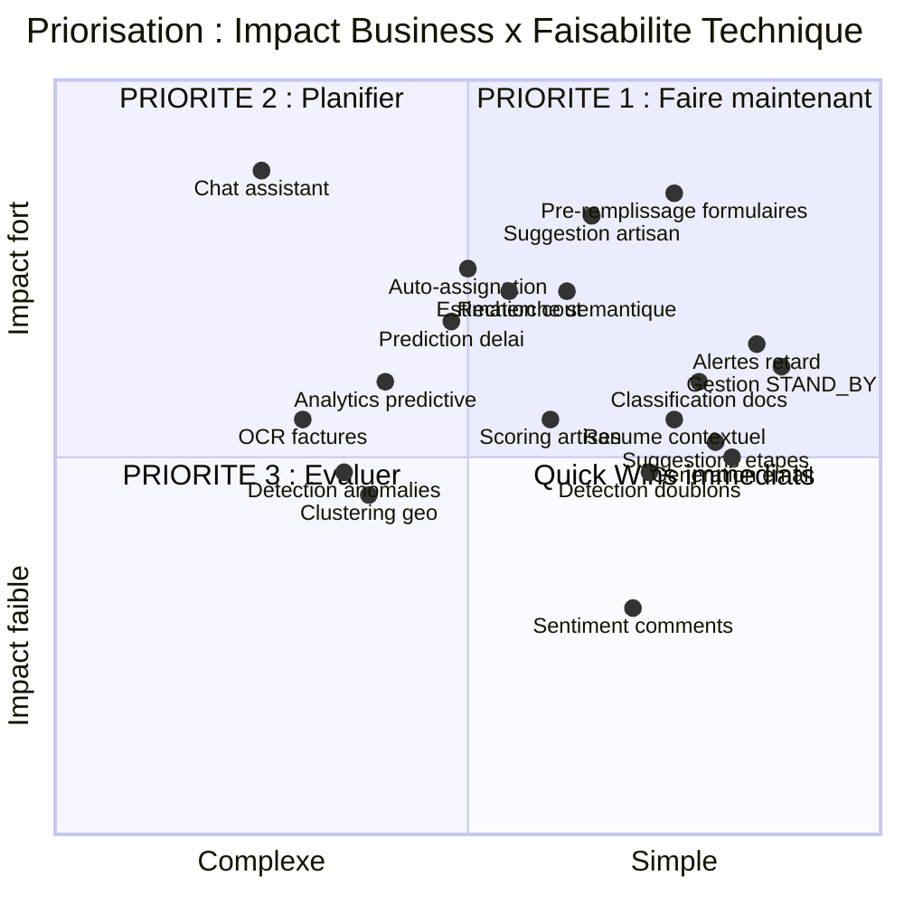
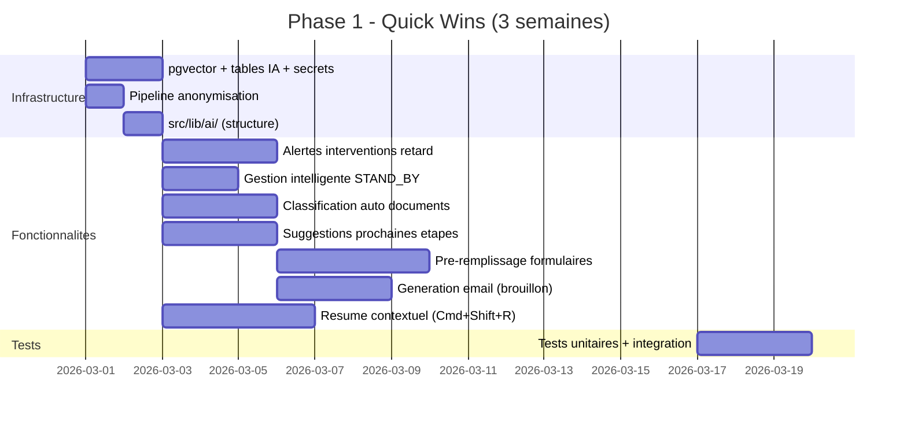
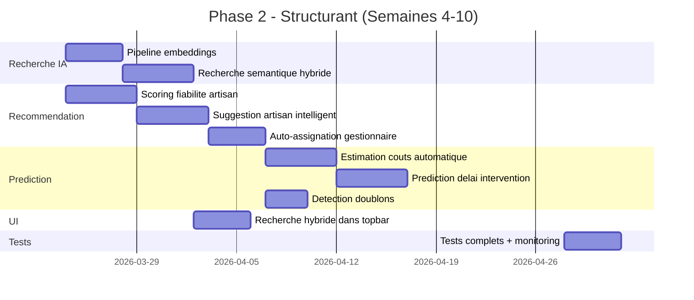
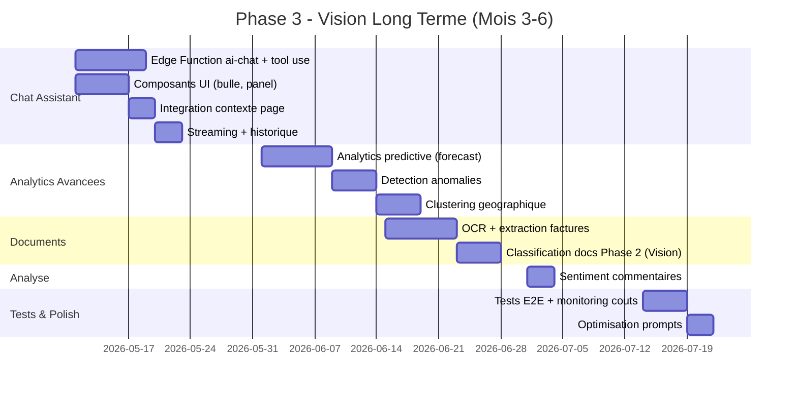
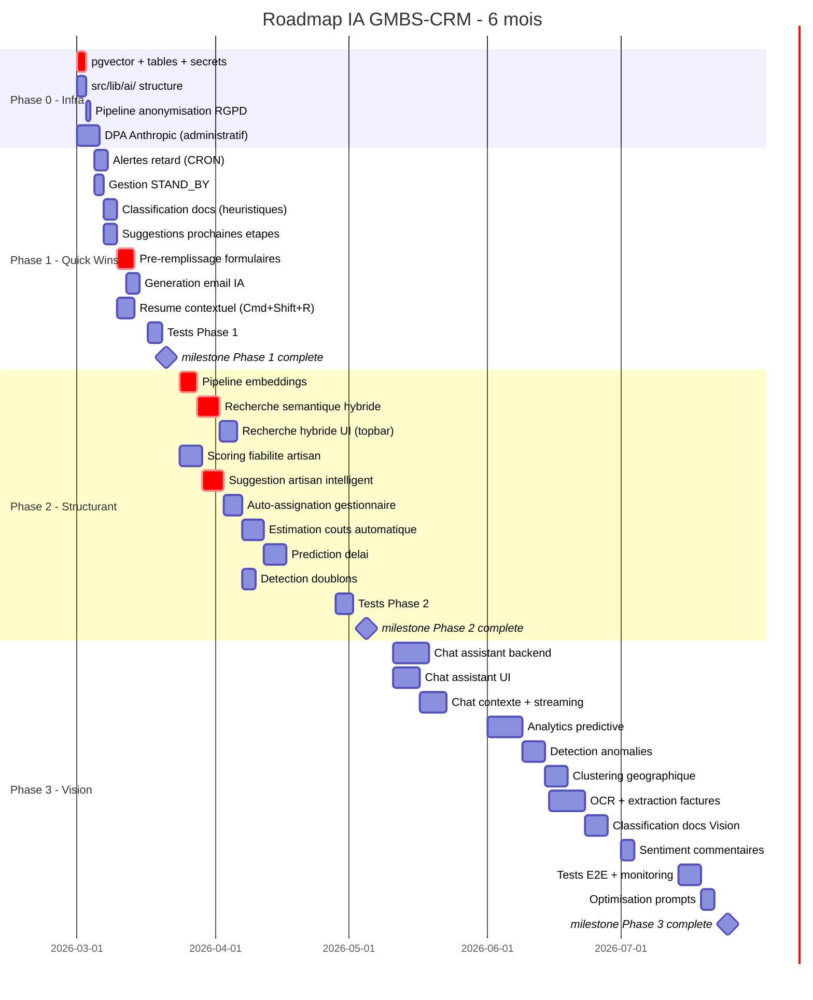

# 06 - Roadmap et Priorisation

> **Audit IA** | Date : 12 fevrier 2026 | Version : 1.0

---

## 1. Matrice de priorisation

---

## 2. Roadmap en 3 phases

### Phase 1 : Quick Wins (Semaines 1-3) — ROI immediat

**Objectif** : Deployer 6-8 fonctionnalites IA a faible risque qui apportent une valeur immediate aux gestionnaires.

**Budget** : ~15-18 jours de developpement

| # | Fonctionnalite | Effort | Impact | Cout LLM |
|---|---------------|--------|--------|----------|
| 1 | **Alertes interventions en retard** | 3 jours | ⭐⭐⭐⭐ | 0 EUR |
| 2 | **Gestion intelligente STAND_BY** | 2 jours | ⭐⭐⭐⭐ | 0 EUR |
| 3 | **Classification auto documents** (Phase 1 : heuristiques) | 3 jours | ⭐⭐⭐⭐ | 0 EUR |
| 4 | **Suggestions prochaines etapes** | 3 jours | ⭐⭐⭐ | 0 EUR |
| 5 | **Pre-remplissage formulaires** | 4 jours | ⭐⭐⭐⭐⭐ | 0 EUR |
| 6 | **Generation email (brouillon)** | 3 jours | ⭐⭐⭐ | ~5 EUR/mois |
| 7 | **Resume contextuel (Cmd+Shift+R)** | 4 jours | ⭐⭐⭐ | ~15 EUR/mois |

**Note** : Les items 1-5 ne necessitent **aucune API IA externe** (calculs statistiques locaux + regles metier). Seuls les items 6-7 utilisent l'API Claude.

---

### Phase 2 : Fonctionnalites structurantes (Semaines 4-10) — Transformation

**Objectif** : Deployer les fonctionnalites IA qui changent fondamentalement l'experience utilisateur.

**Budget** : ~25-30 jours de developpement

| # | Fonctionnalite | Effort | Impact | Cout LLM |
|---|---------------|--------|--------|----------|
| 8 | **Pipeline embeddings** | 4 jours | ⭐⭐⭐⭐ | ~1 EUR/an |
| 9 | **Recherche semantique hybride** | 5 jours | ⭐⭐⭐⭐ | ~1 EUR/an |
| 10 | **Scoring fiabilite artisan** | 5 jours | ⭐⭐⭐ | 0 EUR |
| 11 | **Suggestion artisan intelligent** | 5 jours | ⭐⭐⭐⭐⭐ | 0 EUR |
| 12 | **Auto-assignation gestionnaire** | 4 jours | ⭐⭐⭐⭐ | 0 EUR |
| 13 | **Estimation couts automatique** | 5 jours | ⭐⭐⭐⭐ | 0 EUR |
| 14 | **Prediction delai** | 5 jours | ⭐⭐⭐⭐ | 0 EUR |
| 15 | **Detection doublons** | 3 jours | ⭐⭐⭐ | 0 EUR |

**Note** : La Phase 2 repose principalement sur des **calculs statistiques locaux** et des **embeddings** (cout negligeable). Aucun appel LLM recurrent.

---

### Phase 3 : Vision long terme (Semaines 11-24) — Transformation UX

**Objectif** : Deployer le chat assistant et les fonctionnalites IA avancees qui font du CRM un produit premium.

**Budget** : ~30-40 jours de developpement

| # | Fonctionnalite | Effort | Impact | Cout LLM |
|---|---------------|--------|--------|----------|
| 16 | **Chat assistant CRM** | 15-18 jours | ⭐⭐⭐⭐⭐ | ~30-50 EUR/mois |
| 17 | **Analytics predictive** | 8 jours | ⭐⭐⭐ | 0 EUR |
| 18 | **Detection anomalies** | 5 jours | ⭐⭐⭐ | 0 EUR |
| 19 | **Clustering geographique** | 5 jours | ⭐⭐⭐ | 0 EUR |
| 20 | **OCR + extraction factures** | 8 jours | ⭐⭐⭐ | ~10 EUR/mois |
| 21 | **Classification docs Vision** | 5 jours | ⭐⭐⭐ | ~5 EUR/mois |
| 22 | **Sentiment commentaires** | 3 jours | ⭐⭐ | ~5 EUR/mois |

---

## 3. Estimation economique

### 3.1 Couts de developpement

| Phase | Jours dev | Cout estime (400 EUR/j) |
|-------|----------|------------------------|
| Phase 0 : Infrastructure | 3-5 | 1 200 - 2 000 EUR |
| Phase 1 : Quick Wins | 15-18 | 6 000 - 7 200 EUR |
| Phase 2 : Structurant | 25-30 | 10 000 - 12 000 EUR |
| Phase 3 : Vision | 30-40 | 12 000 - 16 000 EUR |
| **Total** | **73-93 jours** | **29 200 - 37 200 EUR** |

### 3.2 Couts operationnels mensuels

| Poste | Phase 1 | Phase 2 | Phase 3 | Commentaire |
|-------|---------|---------|---------|-------------|
| **API Claude (Anthropic)** | 20 EUR | 20 EUR | 50-80 EUR | Resumes, emails, chat |
| **Embeddings (OpenAI)** | 0 | 0.10 EUR | 0.10 EUR | text-embedding-3-small |
| **Supabase (surcharge)** | 0 | 0 | 0 | pgvector + tables IA inclus |
| **Monitoring** | 0 | 0 | 10 EUR | Dashboard couts IA |
| **Maintenance** | 200 EUR | 400 EUR | 600 EUR | 2h/mois → 6h/mois |
| **Total mensuel** | **~220 EUR** | **~420 EUR** | **~660-890 EUR** |

### 3.3 Valeur creee (estimations conservatrices)

| Gain | Calcul | Valeur/an |
|------|--------|-----------|
| **Temps allocation artisan** | 15 min/intervention x 3000 int/an x 60% reduction = 450h | 22 500 EUR (a 50 EUR/h) |
| **Temps saisie formulaire** | 10 min/intervention x 3000 int/an x 50% reduction = 250h | 12 500 EUR |
| **Recherche plus efficace** | 5 min/recherche x 20 recherches/jour x 250 jours x 40% gain | 8 300 EUR |
| **Prevention doublons** | 5% des 3000 interventions x 300 EUR/intervention | 45 000 EUR |
| **Prevention retards (SLA)** | 10% des 3000 interventions x 200 EUR/penalite | 60 000 EUR |
| **Reduction erreurs saisie** | 3% des 3000 interventions x 150 EUR/correction | 13 500 EUR |
| **Gain emails generes** | 5 min/email x 10 emails/jour x 250 jours x 50% gain | 5 200 EUR |
| **Total gains** | | **~167 000 EUR/an** |

### 3.4 ROI par phase

| Phase | Investissement | Gains annuels | ROI | Payback |
|-------|---------------|---------------|-----|---------|
| Phase 1 | 7 200 EUR + 2 640 EUR/an | 89 300 EUR/an | **3 300%** | **< 1 mois** |
| Phase 2 | 12 000 EUR + 5 040 EUR/an | 50 500 EUR/an | **296%** | **3 mois** |
| Phase 3 | 16 000 EUR + 10 680 EUR/an | 27 200 EUR/an | **102%** | **12 mois** |
| **Total** | **35 200 EUR + 18 360 EUR/an** | **167 000 EUR/an** | **467%** | **3 mois** |

---

## 4. Diagramme Gantt complet

---

## 5. KPIs de suivi

### Metriques a suivre par phase

| KPI | Baseline (avant IA) | Cible Phase 1 | Cible Phase 2 | Cible Phase 3 |
|-----|---------------------|---------------|---------------|---------------|
| **Temps allocation artisan** | 15 min/inter | 10 min | 5 min | 3 min |
| **Temps saisie INTER_EN_COURS** | 8 min | 4 min | 3 min | 2 min |
| **Taux recherche reussie (CTR)** | 60% | 65% | 85% | 90% |
| **Interventions oubliees STAND_BY** | ~20/mois | 5/mois | 2/mois | 0/mois |
| **Documents "a_classe"** | 40% | 10% | 5% | 2% |
| **Doublons interventions** | ~5%/mois | 3% | 1% | < 0.5% |
| **Satisfaction gestionnaire** | - | +15% | +30% | +50% |
| **Cout IA mensuel** | 0 | < 250 EUR | < 500 EUR | < 1 000 EUR |

### Dashboard de monitoring

Creer une page `/admin/ai-monitoring` avec :
- Tokens consommes par jour/semaine/mois
- Cout API par fonctionnalite
- Nombre d'actions IA par type
- Latence moyenne des appels IA
- Taux d'utilisation par gestionnaire
- Feedback utilisateurs (pouce haut/bas)

---

## 6. Risques et mitigations

| Risque | Probabilite | Impact | Mitigation |
|--------|------------|--------|-----------|
| **Explosion des couts LLM** | Moyenne | Fort | Rate limiting + monitoring + alertes |
| **Hallucinations Claude** | Moyenne | Moyen | Restreindre aux donnees reelles via tools, pas de generation libre |
| **Non-conformite RGPD** | Faible | Tres fort | Pipeline anonymisation + DPA + audit regulier |
| **Resistance au changement** | Moyenne | Moyen | Deploiement progressif + formation + feedback loop |
| **Dependance fournisseur (Anthropic)** | Faible | Moyen | Abstraction dans `src/lib/ai/` pour changer de provider |
| **Latence excessive** | Faible | Moyen | Cache TanStack Query + staleTime + preload |
| **Qualite predictions insuffisante** | Moyenne | Moyen | Validation avec donnees reelles avant deploiement |

---

## 7. Prochaines etapes immediates

### Cette semaine

1. **Decision** : Valider le budget et le calendrier Phase 1
2. **DPA** : Initier la signature du DPA avec Anthropic
3. **Cle API** : Obtenir une cle API Claude pour les environnements dev/staging

### Semaine prochaine

4. **Migration** : pgvector + tables IA (PR dediee)
5. **Structure** : Creer `src/lib/ai/` et `src/components/ai/`
6. **Premier quick win** : Alertes interventions en retard (3 jours, 0 cout IA)

### Dans 2 semaines

7. **Pre-remplissage** : Formulaire INTER_EN_COURS avec suggestions
8. **Resume** : Cmd+Shift+R avec API Claude
9. **Feedback** : Premier retour utilisateurs sur les quick wins
