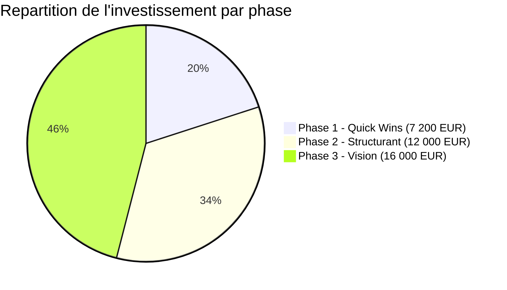

# 07 - Synthese Executive

> **Audit IA GMBS-CRM** | 12 fevrier 2026 | Presentation client

---

## Situation actuelle du CRM

GMBS-CRM est un CRM sur mesure pour la **gestion d'interventions batiment**, la coordination d'artisans et le suivi client. Le systeme est **mature et bien architecture** :

| Metrique | Valeur |
|----------|--------|
| Score audit codebase | **82/100** |
| Composants React | 200+ |
| Hooks metier | 67 |
| Modules API | 29 |
| Edge Functions serveur | 13 |
| Tables PostgreSQL | 45 |
| Statuts intervention | 12 avec 24 transitions |
| Vues materialisees (recherche) | 3 |
| Couverture documentation | 45 fichiers |

Le CRM gere le cycle complet d'une intervention : de la demande initiale jusqu'a la cloture, en passant par le devis, l'assignation artisan, l'execution et la facturation. Il inclut des dashboards analytiques, un systeme de permissions, une synchronisation temps reel et une recherche full-text optimisee.

**Le socle technique est solide et pret pour l'integration IA.**

---

## Potentiel IA identifie

L'audit a identifie **20 opportunites d'integration IA**, dont 5 a fort impact immediat :

### Les 5 opportunites les plus impactantes

#### 1. Suggestion intelligente d'artisan — ⭐⭐⭐⭐⭐

**Le probleme** : Les gestionnaires passent ~15 minutes par intervention pour trouver et assigner le bon artisan (proximite, metier, disponibilite).

**La solution** : Le CRM propose automatiquement les 3 meilleurs artisans avec un score explicable (distance, expertise, fiabilite, charge).

**Impact** : **22 500 EUR/an** de temps economise (450h/an x 50 EUR/h).

**Cout** : Aucun cout d'API IA — calculs statistiques locaux sur les donnees existantes.

---

#### 2. Pre-remplissage intelligent des formulaires — ⭐⭐⭐⭐⭐

**Le probleme** : Le passage au statut "Intervention en cours" exige 7 champs obligatoires (cout, artisan, consignes, date, client). C'est le goulot d'etranglement du workflow.

**La solution** : Le systeme pre-remplit les champs a partir de l'historique : cout moyen par metier, artisan recommande, date estimee, informations client deja connues.

**Impact** : **12 500 EUR/an** de temps economise + reduction des erreurs de saisie.

**Cout** : Zero — moyenne statistique sur les donnees existantes.

---

#### 3. Chat assistant CRM — ⭐⭐⭐⭐⭐

**Le probleme** : Les gestionnaires doivent naviguer entre de multiples ecrans pour obtenir des informations croisees ("Quel artisan est disponible mardi pour de la plomberie a Paris ?").

**La solution** : Un assistant conversationnel integre au CRM qui comprend les questions en langage naturel et interroge les donnees en temps reel.

**Impact** : **Differenciateur SaaS majeur**. Justifie un tier premium d'abonnement. Experience utilisateur transformee.

**Cout** : 50-80 EUR/mois d'API Claude (maitrise par rate limiting).

---

#### 4. Alertes proactives (retards + STAND_BY) — ⭐⭐⭐⭐

**Le probleme** : Des interventions restent bloquees en "Stand-by" pendant des semaines sans que personne ne s'en apercoive. Des dates prevues sont depassees sans alerte.

**La solution** : Le systeme detecte automatiquement les anomalies et alerte le gestionnaire avec des suggestions d'action ("Relancer client", "Annuler", "Verifier avec artisan").

**Impact** : **60 000 EUR/an** de penalites SLA evitees + zero intervention oubliee.

**Cout** : Zero — tache CRON sur les donnees existantes.

---

#### 5. Recherche semantique hybride — ⭐⭐⭐⭐

**Le probleme** : La recherche actuelle ne comprend que les mots exacts. "Fuite d'eau" ne trouve pas "rupture tuyau". Les gestionnaires retrouvent difficilement les interventions passees.

**La solution** : Enrichir la recherche avec des embeddings vectoriels qui comprennent le sens, pas seulement les mots.

**Impact** : **+40% de taux de succes de recherche**, reduction des doublons.

**Cout** : ~1 EUR/an d'embeddings (negligeable).

---

## Investissement requis vs Valeur creee

### Vue synthetique

| | Phase 1 | Phase 2 | Phase 3 | **Total** |
|---|---------|---------|---------|-----------|
| **Duree** | 3 semaines | 6 semaines | 3 mois | **6 mois** |
| **Investissement dev** | 7 200 EUR | 12 000 EUR | 16 000 EUR | **35 200 EUR** |
| **Cout operationnel/an** | 2 640 EUR | 5 040 EUR | 10 680 EUR | **18 360 EUR/an** |
| **Gains annuels** | 89 300 EUR | 50 500 EUR | 27 200 EUR | **167 000 EUR/an** |
| **ROI** | 3 300% | 296% | 102% | **467%** |
| **Payback** | < 1 mois | 3 mois | 12 mois | **3 mois** |

**L'investissement total de 35 200 EUR est rembourse en 3 mois**, avec un gain net de **~130 000 EUR/an** apres couts operationnels.

---

## Avantage concurrentiel SaaS

L'integration IA transforme GMBS-CRM d'un **outil de gestion** en un **assistant intelligent** pour les gestionnaires d'interventions. C'est un avantage concurrentiel decisif dans le modele SaaS :

### Fonctionnalites qui justifient l'abonnement

| Fonctionnalite IA | Switching cost | Valeur percue |
|-------------------|---------------|---------------|
| **Assistant conversationnel** | Tres eleve — les utilisateurs s'habituent a "poser des questions" au CRM | Premium |
| **Suggestion artisan** | Eleve — le scoring s'ameliore avec l'historique (plus on l'utilise, mieux il fonctionne) | Essentiel |
| **Pre-remplissage intelligent** | Eleve — les modeles de prediction sont calibres sur les donnees du client | Essentiel |
| **Recherche semantique** | Moyen — les embeddings sont specifiques au vocabulaire du client | Avance |
| **Analytics predictive** | Eleve — les previsions sont basees sur l'historique unique du client | Premium |
| **Alertes proactives** | Moyen — les seuils sont configures par le client | Standard |

**Le message cle** : Plus le client utilise le CRM avec l'IA, plus les predictions et suggestions deviennent precises. C'est un **cercle vertueux qui augmente le switching cost** et justifie un abonnement premium.

### Tiers de prix proposes

| Tier | Fonctionnalites IA | Prix suggere |
|------|-------------------|-------------|
| **Standard** | Alertes retard, classification docs, pre-remplissage | Inclus |
| **Pro** | + Recherche semantique, suggestion artisan, estimation couts | +30% |
| **Premium** | + Chat assistant, analytics predictive, OCR | +60% |

---

## Prochaines etapes recommandees

### Immediate (cette semaine)

1. **Valider** le budget Phase 1 (7 200 EUR, 3 semaines)
2. **Signer** le DPA avec Anthropic (RGPD)
3. **Obtenir** une cle API Claude

### Court terme (3 semaines)

4. **Deployer** les 7 quick wins Phase 1
5. **Mesurer** l'impact (temps gagne, adoption, satisfaction)
6. **Collecter** le feedback utilisateurs

### Moyen terme (3 mois)

7. **Deployer** Phase 2 (recherche semantique, suggestion artisan, predictions)
8. **Lancer** le tier "Pro" avec les fonctionnalites IA structurantes
9. **Evaluer** l'opportunite Phase 3 (chat assistant) sur base du feedback

### Long terme (6 mois)

10. **Deployer** le chat assistant (Phase 3) pour les clients Premium
11. **Iterer** sur les prompts et modeles avec les donnees reelles
12. **Presenter** les resultats et le ROI reel

---

## Conclusion

GMBS-CRM dispose d'un **socle technique de qualite** (score 82/100) avec une architecture modulaire, des donnees riches et un workflow metier bien structure. L'integration IA est une evolution naturelle qui :

- **Ne casse rien** : l'IA s'ajoute comme couche supplementaire, sans modifier l'existant
- **Apporte une valeur immediate** : les 5 premiers quick wins sont deployables en 3 semaines
- **Se rembourse en moins de 3 mois** avec un ROI de 467%
- **Cree un avantage concurrentiel durable** dans le modele SaaS

**L'IA n'est pas un gadget ici — c'est un multiplicateur de productivite pour chaque gestionnaire.**

---

> *Audit realise par analyse exhaustive du codebase : 45 tables, 82 migrations SQL, 200+ composants, 67 hooks, 29 modules API, 13 Edge Functions, 45 fichiers de documentation.*
