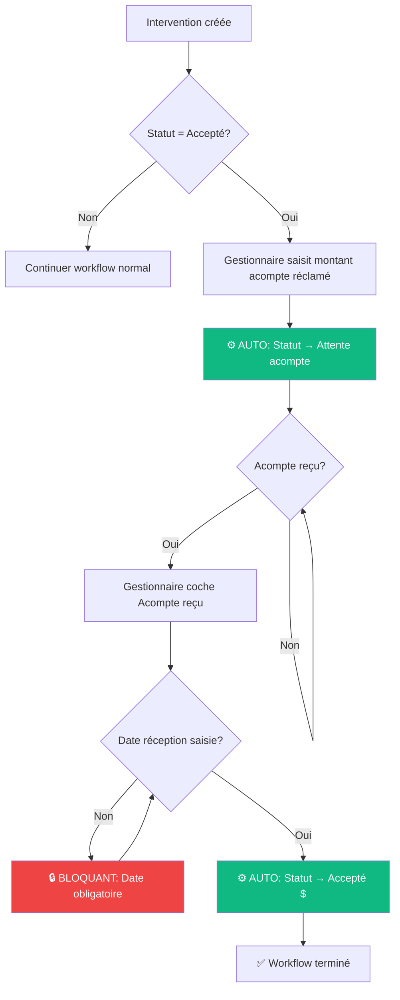
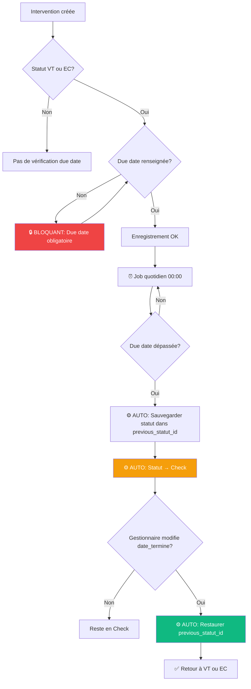
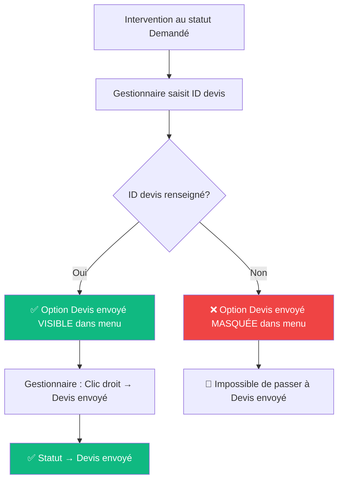
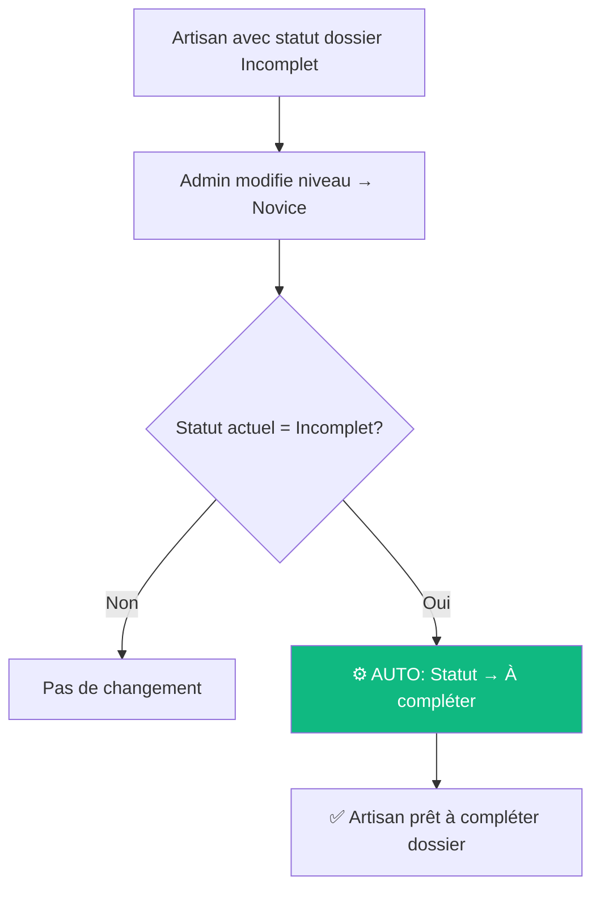
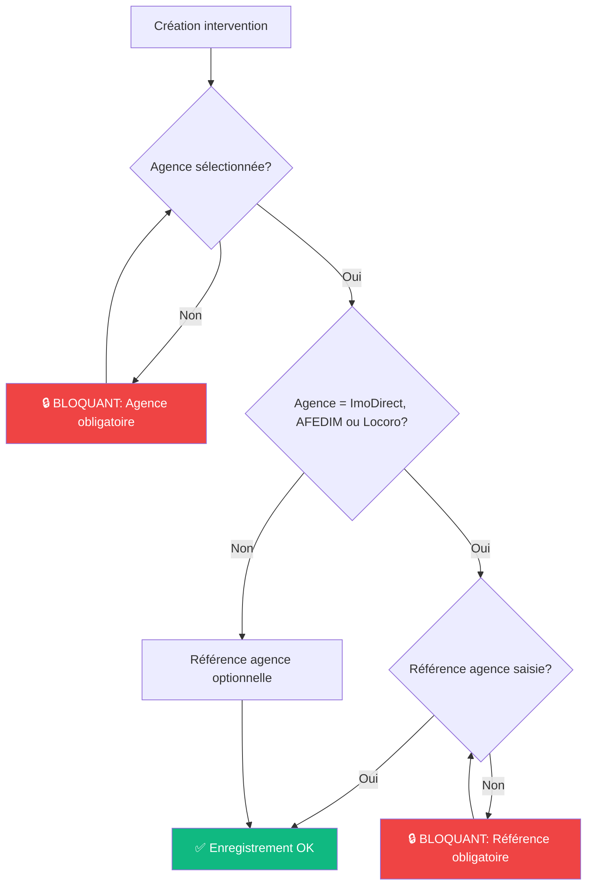
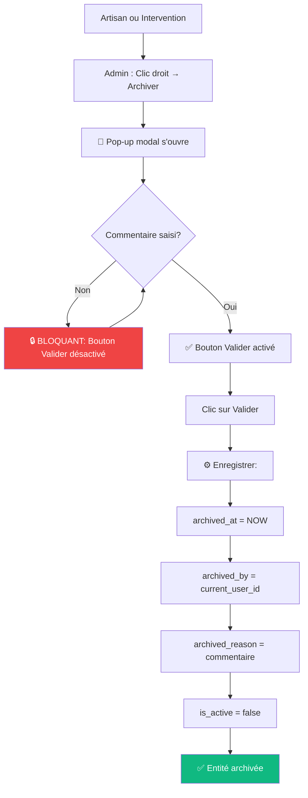
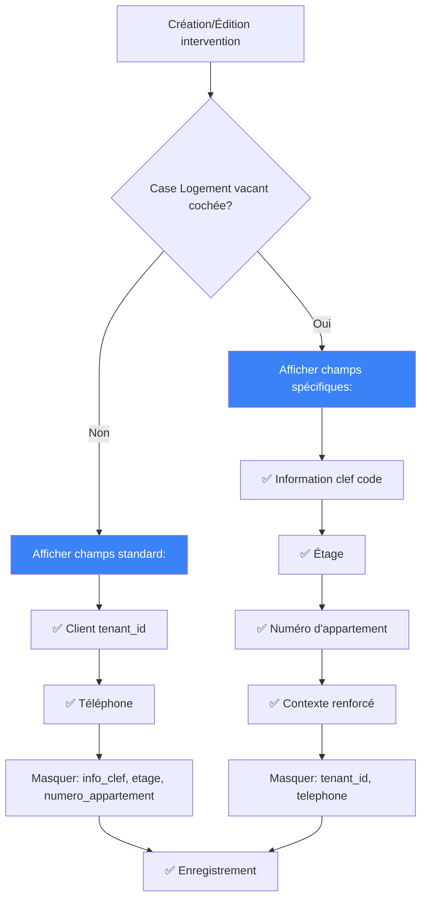
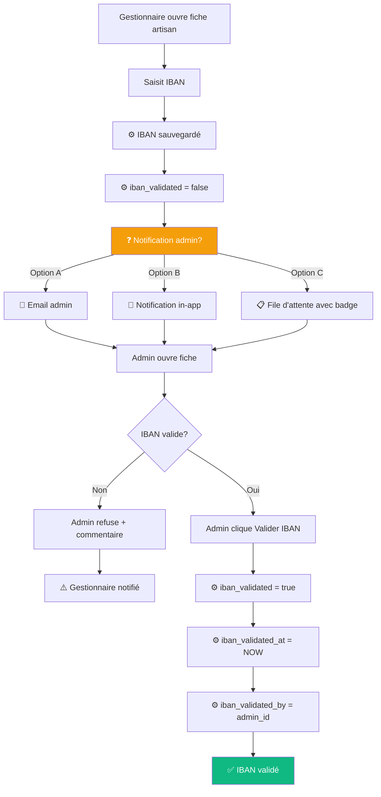
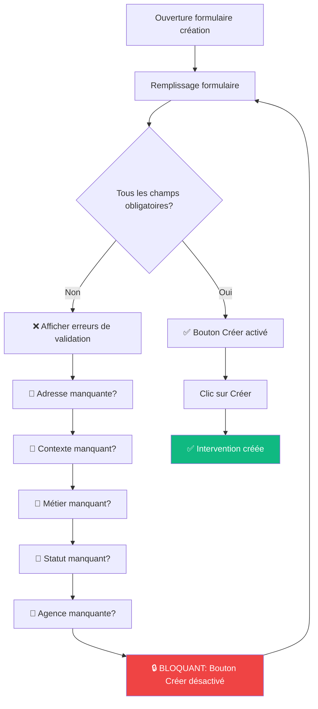

# 🔄 Workflows & Règles Métier - Diagrammes

**Version** : 1.0  
**Date** : 5 novembre 2025  
**Objectif** : Visualiser les règles métier sous forme de diagrammes

---

## 📊 Workflow 1 : Gestion des Acomptes



**Règles impliquées** :
- `BR-ACPT-001` : Saisie montant → "Attente acompte"
- `BR-ACPT-002` : Date réception obligatoire
- `BR-ACPT-003` : Date saisie → "Accepté $"

---

## 🕐 Workflow 2 : Gestion Due Date → Check



**Règles impliquées** :
- `BR-STAT-003` : Due date obligatoire pour VT/EC
- `BR-STAT-001` : Due date dépassée → "Check"
- `BR-STAT-002` : Modification date_termine → Retour au statut précédent

---

## 📝 Workflow 3 : Passage à "Devis envoyé"



**Règles impliquées** :
- `BR-DEVI-001` : ID devis obligatoire avant "Devis envoyé"
- `BR-DEVI-002` : Pas d'automatisation

---

## 🔄 Workflow 4 : Duplication "Devis supp"

```mermaid
graph TD
    A[Intervention existante] --> B[Gestionnaire : Clic droit → Devis supp]
    
    B --> C[⚙️ Créer nouvelle intervention]
    
    C --> D[📋 Copier tous les champs]
    D --> E[❌ SAUF: id, id_inter, contexte, consigne]
    
    E --> F[🆕 Générer nouveau UUID]
    F --> G[🆕 Générer nouveau id_inter]
    G --> H[⚙️ Statut → Demandé par défaut]
    
    H --> I[💬 Ajouter commentaire:]
    I --> J[Devis supp avec l'ancien ID [id_inter]]
    
    J --> K[✅ Nouvelle intervention créée]
    
    style C fill:#10b981,color:#fff
    style E fill:#f59e0b,color:#fff
    style K fill:#10b981,color:#fff
```

**Règles impliquées** :
- `BR-DUP-001` : Exclusions et commentaire automatique

---

## 👷 Workflow 5 : Artisan Incomplet → Novice



**Règles impliquées** :
- `BR-ART-001` : Statut automatique si Incomplet + Novice

---

## 🏢 Workflow 6 : Référence agence obligatoire



**Règles impliquées** :
- `BR-AGN-001` : Référence obligatoire pour 3 agences

---

## 🗄️ Workflow 7 : Archivage avec commentaire



**Règles impliquées** :
- `BR-ARC-001` : Commentaire obligatoire à l'archivage

---

## 🏠 Workflow 8 : Logement vacant - Champs conditionnels



**Règles impliquées** :
- `BR-INT-003` : Champs conditionnels logement vacant

---

## 🔐 Workflow 9 : Validation IBAN (à cadrer)



**Règles impliquées** :
- `BR-ART-002` : IBAN - Saisie gestionnaire, validation admin

**⚠️ À CLARIFIER** : Choix du mode de notification (A, B ou C)

---

## 🎯 Workflow 10 : Champs obligatoires création intervention



**Règles impliquées** :
- `BR-INT-001` : 5 champs obligatoires à la création

---

## 📊 Matrice de décision : Menus contextuels

### Interventions - Actions disponibles selon statut et données

| Action | Condition | Règle |
|--------|-----------|-------|
| **Ouvrir** | Toujours | - |
| **Ouvrir nouvel onglet** | Toujours | - |
| **Demandé → Devis envoyé** | `id_devis` renseigné ET `statut = Demandé` | BR-DEVI-001 |
| **Devis envoyé → Accepté** | `statut = Devis envoyé` | - |
| **Devis supp** | Toujours | BR-DUP-001 |

### Artisans - Actions disponibles

| Action | Condition | Règle |
|--------|-----------|-------|
| **Ouvrir fiche** | Toujours | - |
| **Modifier fiche** | Permissions suffisantes | - |
| **Archiver** | Pop-up avec motif obligatoire | BR-ARC-001 |

### Market / Carte - Actions disponibles

| Action | Condition | Règle |
|--------|-----------|-------|
| **Je gère** | Intervention non assignée | BR-PERM-001 |

---

## 🧪 Scénarios de test critiques

### Scénario 1 : Workflow acomptes complet
```
ÉTAPE 1 : Créer intervention statut "Accepté"
ÉTAPE 2 : Saisir montant_acompte_reclame = 500€
ATTENDU : Statut → "Attente acompte" ✅

ÉTAPE 3 : Cocher "Acompte reçu" SANS saisir date
ATTENDU : Erreur "Date obligatoire" 🔒

ÉTAPE 4 : Saisir date_reception_acompte = 05/11/2025
ATTENDU : Statut → "Accepté $" ✅
```

### Scénario 2 : Due date dépassée
```
ÉTAPE 1 : Créer intervention statut "VT", due_date = 01/01/2025
ÉTAPE 2 : Exécuter job de vérification
ATTENDU : Statut → "Check" + previous_statut_id = VT ✅

ÉTAPE 3 : Modifier date_termine = 31/12/2025
ATTENDU : Statut → "VT" (restauré) ✅
```

### Scénario 3 : Référence agence obligatoire
```
ÉTAPE 1 : Créer intervention, sélectionner agence "ImoDirect"
ÉTAPE 2 : Laisser référence_agence vide
ATTENDU : Erreur "Référence obligatoire" 🔒

ÉTAPE 3 : Saisir référence_agence = "REF-123"
ATTENDU : Enregistrement OK ✅
```

### Scénario 4 : Devis envoyé sans ID
```
ÉTAPE 1 : Créer intervention statut "Demandé", id_devis vide
ÉTAPE 2 : Clic droit sur intervention
ATTENDU : Option "Devis envoyé" MASQUÉE ❌

ÉTAPE 3 : Saisir id_devis = "DEV-456"
ÉTAPE 4 : Clic droit sur intervention
ATTENDU : Option "Devis envoyé" VISIBLE ✅
```

### Scénario 5 : Duplication devis supp
```
ÉTAPE 1 : Intervention existante avec contexte = "Urgence"
ÉTAPE 2 : Clic droit → "Devis supp"
ATTENDU : 
  - Nouveau id ✅
  - Nouveau id_inter ✅
  - contexte_intervention = NULL ✅
  - Commentaire "Devis supp avec l'ancien ID [xxx]" ✅
```

---

## 📈 Statistiques du livrable

### Règles métier par type
```
🔒 Bloquantes : 8 règles (44%)
⚙️ Automatiques : 9 règles (50%)
ℹ️ Informatives : 1 règle (6%)
━━━━━━━━━━━━━━━━━━━━━━
Total : 18 règles
```

### Tâches par complexité
```
🔴 Haute : 3 tâches (14%)
🟡 Moyenne : 10 tâches (48%)
🟢 Faible/Très faible : 8 tâches (38%)
━━━━━━━━━━━━━━━━━━━━━━
Total : 21 tâches
```

### Modifications BDD
```
Table interventions : +11 champs
Table intervention_payments : +3 champs
Table artisans : +7 champs
Nouveaux statuts : +2
━━━━━━━━━━━━━━━━━━━━━━
Total : 23 modifications
```

---

## 🔗 Navigation rapide

- 📋 [Résumé exécutif](RESUME_EXECUTIF_LIVRABLE_2025-11-04.md)
- 📜 [Règles métier détaillées](BUSINESS_RULES_2025-11-04.md)
- 📊 [Classification des tâches](ANALYSE_CLASSIFICATION_TACHES_2025-11-04.md)
- 📄 [Spécifications HTML source](../livrable-specs-interventions-artisans_2025-11-04.html)

---

**Dernière mise à jour** : 5 novembre 2025  
**Maintenu par** : Équipe Dev GMBS CRM  
**Version** : 1.0

