# 📐 Diagrammes d'Architecture - Synchronisation Google Sheets

## 1. Architecture globale

```mermaid
graph TB
    subgraph "Frontend - Next.js"
        UI[Interface CRM]
        Settings[Page Settings Google Sheets]
        Dashboard[Dashboard Monitoring]
    end
    
    subgraph "API Routes - Next.js"
        AuthAPI[/api/google-sheets/auth]
        ConfigAPI[/api/google-sheets/config]
        SyncAPI[/api/google-sheets/sync]
        SheetsAPI[/api/google-sheets/spreadsheets]
    end
    
    subgraph "Supabase Backend"
        subgraph "PostgreSQL Database"
            Users[(users)]
            Artisans[(artisans)]
            Interventions[(interventions)]
            GSConfigs[(google_sheets_configs)]
            SyncQueue[(sync_queue)]
            SyncLogs[(sync_logs)]
        end
        
        subgraph "Database Triggers"
            ArtisanTrigger[Artisan Change Trigger]
            InterventionTrigger[Intervention Change Trigger]
        end
        
        subgraph "Edge Functions"
            ExportFunc[sync-to-sheets]
            ImportFunc[sync-from-sheets]
            WebhookFunc[sheets-webhook]
        end
        
        subgraph "Cron Jobs"
            ImportCron[Import Cron Every 5min]
            QueueCron[Queue Worker Every 1min]
        end
    end
    
    subgraph "Google Services"
        OAuth[Google OAuth 2.0]
        SheetsAPI_Google[Google Sheets API v4]
        DriveAPI[Google Drive API]
    end
    
    UI --> Settings
    UI --> Dashboard
    Settings --> AuthAPI
    Settings --> ConfigAPI
    Settings --> SheetsAPI
    Dashboard --> SyncAPI
    
    AuthAPI --> OAuth
    ConfigAPI --> GSConfigs
    SheetsAPI --> DriveAPI
    SheetsAPI --> SheetsAPI_Google
    SyncAPI --> SyncLogs
    
    Artisans --> ArtisanTrigger
    Interventions --> InterventionTrigger
    
    ArtisanTrigger --> SyncQueue
    InterventionTrigger --> SyncQueue
    
    SyncQueue --> ExportFunc
    ImportCron --> ImportFunc
    QueueCron --> ExportFunc
    
    ExportFunc --> SheetsAPI_Google
    ImportFunc --> SheetsAPI_Google
    WebhookFunc --> SheetsAPI_Google
    
    ExportFunc --> SyncLogs
    ImportFunc --> SyncLogs
    
    ImportFunc --> Artisans
    ImportFunc --> Interventions
    
    OAuth --> GSConfigs
    
    style UI fill:#e1f5ff
    style Settings fill:#e1f5ff
    style Dashboard fill:#e1f5ff
    style ExportFunc fill:#fff4e6
    style ImportFunc fill:#fff4e6
    style GSConfigs fill:#f3e5f5
    style SyncQueue fill:#f3e5f5
    style SyncLogs fill:#f3e5f5
```

---

## 2. Flux de connexion OAuth

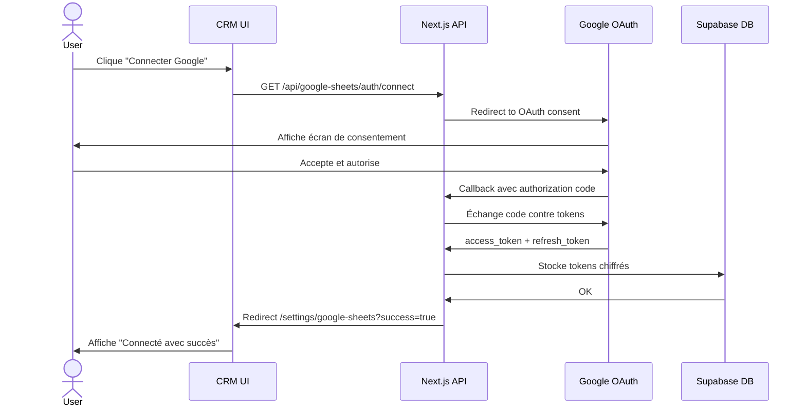

---

## 3. Flux de configuration initiale

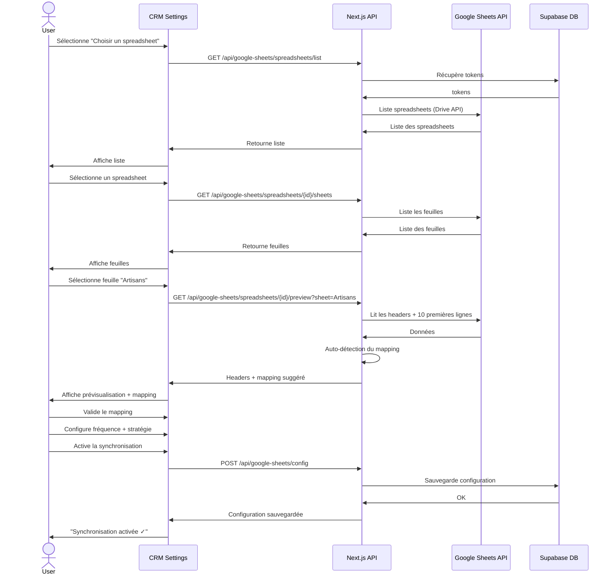

---

## 4. Flux de synchronisation Export (CRM → Sheets)

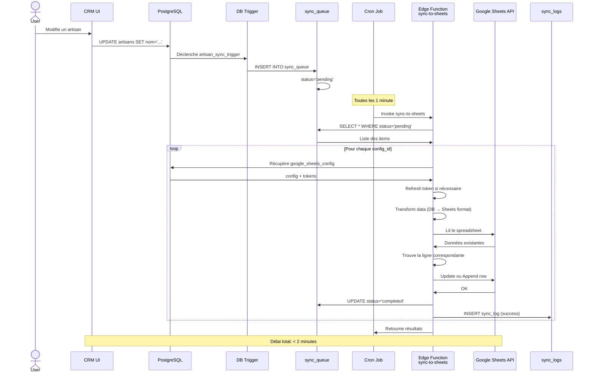

---

## 5. Flux de synchronisation Import (Sheets → CRM)

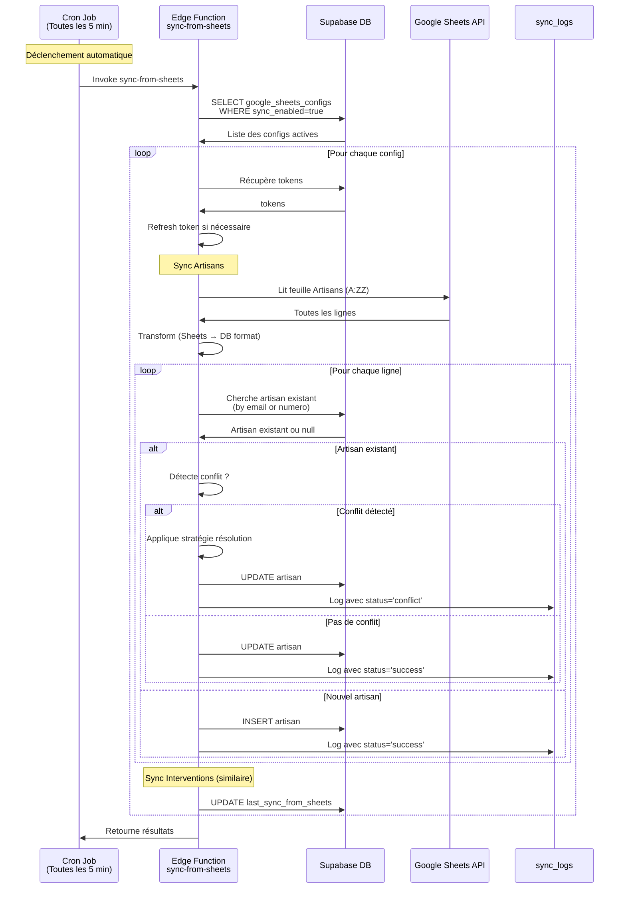

---

## 6. Gestion des conflits

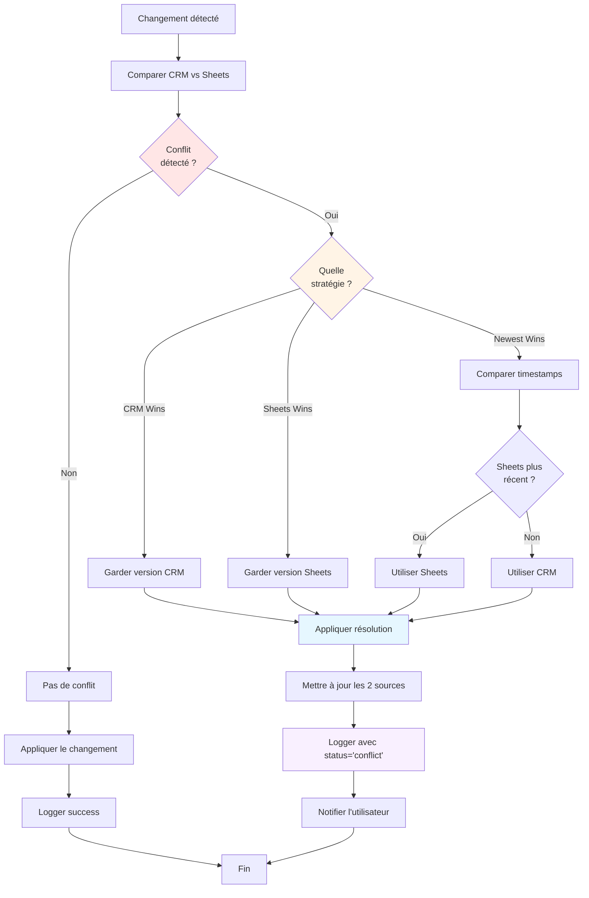

---

## 7. Structure des données

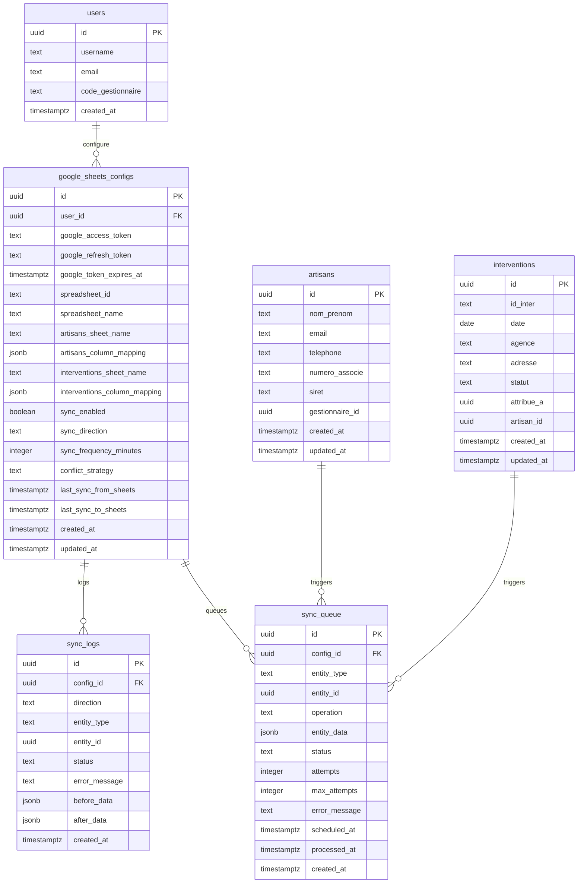

---

## 8. Mapping des colonnes

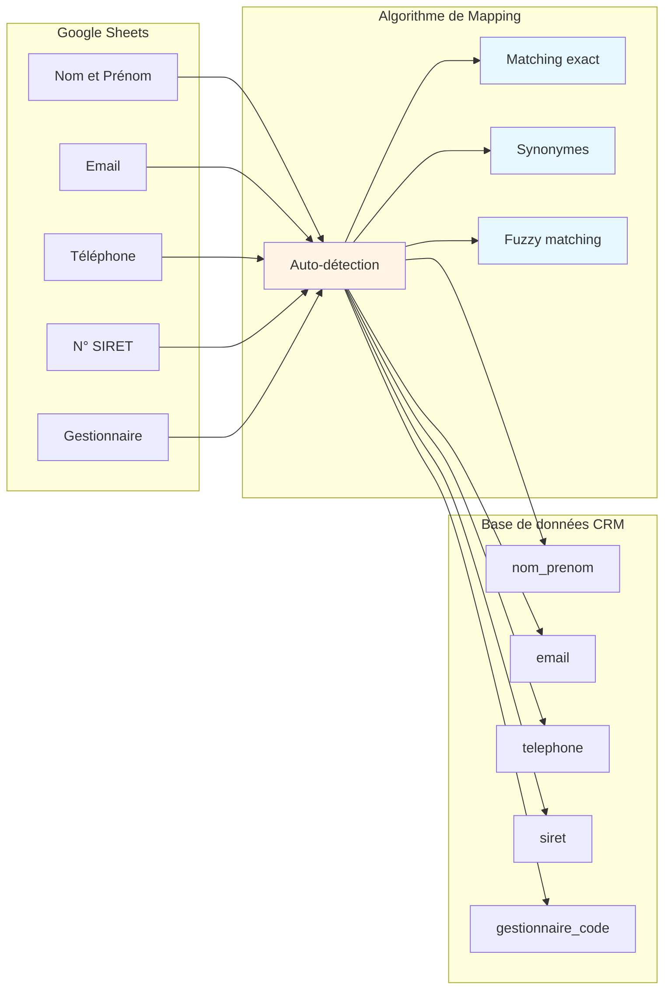

### Exemples de mapping

| Google Sheets | Algorithme | Base de données | Confiance |
|---------------|------------|-----------------|-----------|
| Nom et Prénom | Fuzzy | nom_prenom | 85% |
| Email | Exact | email | 100% |
| Tél. | Synonyme | telephone | 90% |
| N° SIRET | Fuzzy | siret | 85% |
| Gestionnaire | Synonyme | gestionnaire_code | 90% |

---

## 9. Timeline de synchronisation

```mermaid
gantt
    title Timeline typique d'une synchronisation
    dateFormat ss
    axisFormat %S sec
    
    section Changement CRM
    Utilisateur modifie un artisan :done, crm1, 00, 1s
    Sauvegarde en DB :done, crm2, 01, 1s
    Trigger capte changement :done, crm3, 02, 1s
    Ajout à la queue :done, crm4, 03, 1s
    
    section Attente
    En attente dans la queue :active, wait1, 04, 56s
    
    section Export vers Sheets
    Cron démarre worker :crit, export1, 60, 2s
    Lecture de la queue :export2, 62, 3s
    Transformation données :export3, 65, 5s
    Authentification Google :export4, 70, 3s
    Lecture Sheets existant :export5, 73, 5s
    Écriture dans Sheets :export6, 78, 10s
    Marquage completed :export7, 88, 2s
    
    section Total
    Délai total (CRM → Sheets) :milestone, 00, 90s
```

**Délai moyen** : 60-90 secondes (selon fréquence du cron)

---

## 10. Composants de l'interface utilisateur

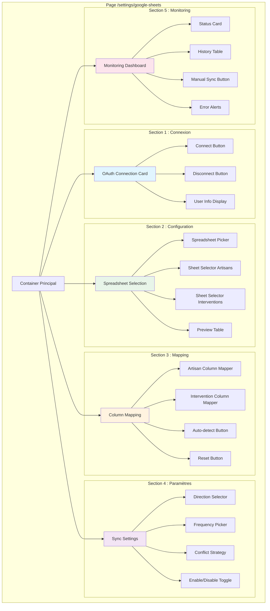

---

## 11. Schéma de sécurité

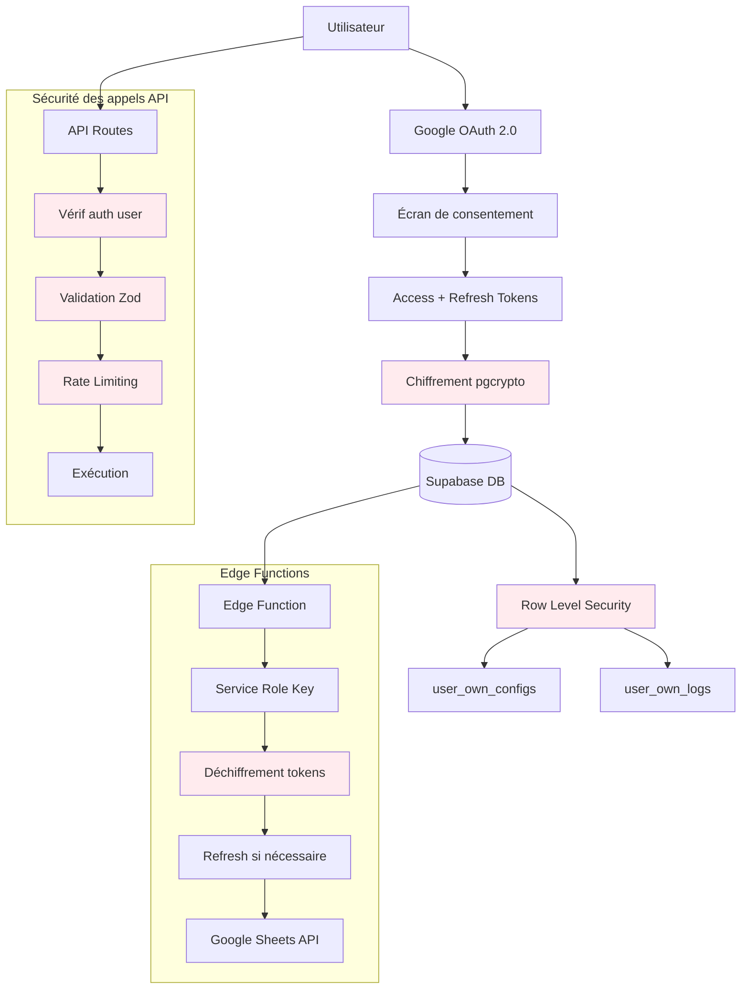

---

## 12. Monitoring et alertes

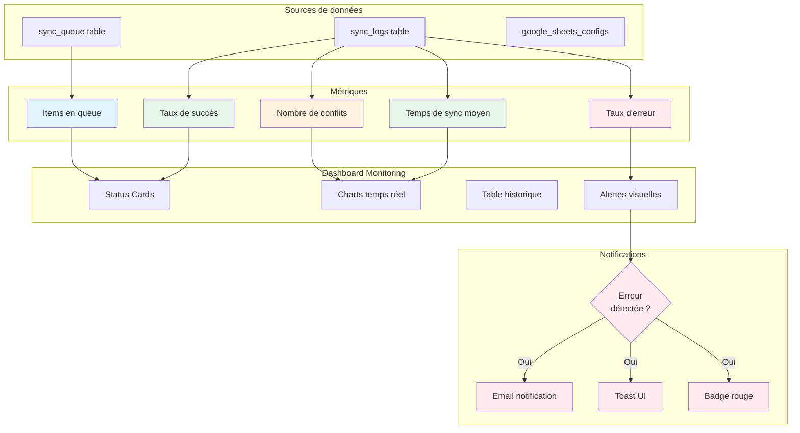

---

Ces diagrammes fournissent une vue complète et visuelle de l'architecture de synchronisation. Ils peuvent être utilisés pour :

1. **Présenter** la solution aux stakeholders
2. **Guider** l'implémentation technique
3. **Former** les nouveaux développeurs
4. **Documenter** le système pour la maintenance

Pour afficher ces diagrammes :
- Utilisez un éditeur Markdown compatible Mermaid (VS Code + extension, GitHub, GitLab)
- Ou copiez le code dans [Mermaid Live Editor](https://mermaid.live/)


