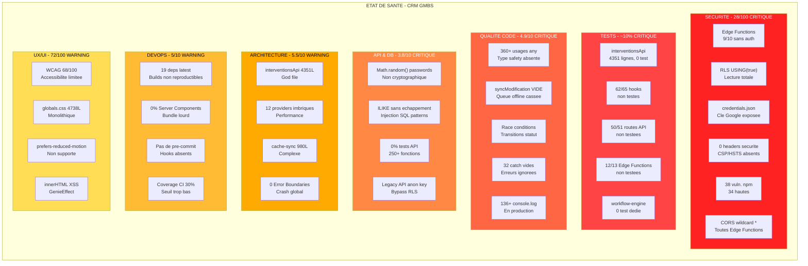
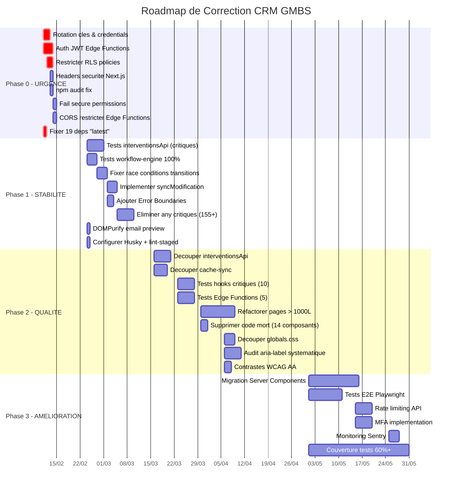

# RAPPORT EXECUTIF - Audit CRM GMBS

**Date** : 10 fevrier 2026
**Version** : 1.0
**Branche auditee** : `design_ux_ui`
**Equipe d'audit** : 7 agents specialises (IA Claude Opus 4.6)
**Commanditaire** : Direction GMBS

---

## A. Dashboard de l'etat du CRM

### Tableau de scores par domaine

| # | Domaine | Score | Seuil | Statut | Problemes | Rapport |
|---|---------|-------|-------|--------|-----------|---------|
| 1 | **Securite (OWASP)** | **28/100** | 70 | CRITIQUE | 41 (14 critiques) | `02_security_audit.md` |
| 2 | **Couverture de tests** | **~10%** | 60% | CRITIQUE | 24+ modules non testes | `01_test_coverage.md` |
| 3 | **Qualite du code** | **4.9/10** | 7.0 | CRITIQUE | 120 (20 critiques) | `04_code_quality.md` |
| 4 | **API & Base de donnees** | **3.8/10** | 7.0 | CRITIQUE | 38 problemes | `05_api_database.md` |
| 5 | **Architecture** | **5.5/10** | 7.0 | WARNING | 24 problemes | `03_architecture.md` |
| 6 | **DevOps & Config** | **5/10** | 7.0 | WARNING | 23 problemes | `07_devops_config.md` |
| 7 | **UX/UI & Accessibilite** | **72/100** | 80 | WARNING | 22 problemes | `06_ux_ui_audit.md` |

### Score global pondere

```
Securite (poids 30%)      :  28 x 0.30 =   8.4
Tests (poids 20%)         :  10 x 0.20 =   2.0
Qualite code (poids 15%)  :  49 x 0.15 =   7.4
API & DB (poids 15%)      :  38 x 0.15 =   5.7
Architecture (poids 10%)  :  55 x 0.10 =   5.5
DevOps (poids 5%)         :  50 x 0.05 =   2.5
UX/UI (poids 5%)          :  72 x 0.05 =   3.6
                                         ------
SCORE GLOBAL :                            35/100
```

```
+================================================================+
|                                                                |
|        SCORE GLOBAL DU CRM :  35 / 100  -  CRITIQUE           |
|                                                                |
|  [###########.....................................] 35%        |
|                                                                |
|  Le CRM n'est PAS pret pour un usage production securise.     |
|                                                                |
+================================================================+
```

### Nombre total de problemes par severite

| Severite | Securite | Tests | Qualite | API/DB | Archi | DevOps | UX/UI | **TOTAL** |
|----------|----------|-------|---------|--------|-------|--------|-------|-----------|
| CRITIQUE | 14 | 5 | 20 | 6 | 6 | 4 | 4 | **59** |
| HAUTE | 12 | 10 | 41 | 11 | 6 | 10 | 8 | **98** |
| MOYENNE | 11 | 8 | 59 | 14 | 8 | 7 | 10 | **117** |
| BASSE | 4 | 3 | - | 7 | 4 | 2 | - | **20** |
| **TOTAL** | **41** | **26** | **120** | **38** | **24** | **23** | **22** | **294** |

---

## B. Diagrammes d'ensemble

### B.1 Etat de sante de chaque module du CRM



### B.2 Roadmap de correction (Timeline)



---

## C. Top 10 des problemes les plus critiques

Les problemes ci-dessous sont classes par **impact business** et proviennent de l'ensemble des 7 rapports d'audit.

### 1. credentials.json expose - Cle privee Google Service Account

| Attribut | Detail |
|----------|--------|
| **Source** | Rapport Securite (CRIT-05), Rapport API/DB (C1) |
| **Fichier** | `supabase/functions/credentials.json` |
| **Impact** | Acces complet a Google Drive et Google Sheets de l'entreprise. Cle RSA 4096 bits du service account `gmbs-service@crm-gmbs-1-472714.iam.gserviceaccount.com` |
| **Risque business** | Vol de donnees clients, modification/suppression de documents Google, usurpation d'identite du service |
| **Urgence** | **IMMEDIATE** - Regenerer la cle dans les prochaines heures |

### 2. Edge Functions sans authentification (9/10)

| Attribut | Detail |
|----------|--------|
| **Source** | Rapport Securite (CRIT-01) |
| **Fichiers** | 9 fichiers `supabase/functions/*/index.ts` |
| **Impact** | Toute personne connaissant l'URL Supabase peut lire, creer, modifier et supprimer TOUTES les donnees (artisans, documents, commentaires, utilisateurs, interventions) |
| **Risque business** | Fuite de donnees massive, corruption de la base, violation RGPD. N'importe quel script automatise peut vider la base |
| **Urgence** | **IMMEDIATE** - Ajouter verification JWT sur chaque Edge Function |

### 3. RLS USING(true) - Tout le monde lit tout

| Attribut | Detail |
|----------|--------|
| **Source** | Rapport Securite (CRIT-02) |
| **Fichier** | `supabase/migrations/00041_rls_core_tables.sql:125-127, 254-256` |
| **Impact** | Tout utilisateur authentifie peut lire TOUTES les interventions et TOUS les profils utilisateurs, sans restriction par agence, role ou gestionnaire |
| **Risque business** | Violation du principe du moindre privilege, non-conformite RGPD (acces aux donnees sans legitimite), espionnage interne possible |
| **Urgence** | **IMMEDIATE** - Restreindre par role et perimetre |

### 4. syncModification() est VIDE

| Attribut | Detail |
|----------|--------|
| **Source** | Rapport Qualite (G.3), Rapport API/DB (C5) |
| **Fichier** | `src/lib/realtime/sync-queue.ts:260-262` |
| **Impact** | La file d'attente offline ne synchronise RIEN. Toute modification faite hors-ligne est **definitivement perdue**. Le code contient `// TODO: Implement actual sync` |
| **Risque business** | Perte de donnees utilisateur, modifications disparues sans avertissement, confiance utilisateur brisee |
| **Urgence** | **HAUTE** - Implementer ou supprimer la fonctionnalite |

### 5. Race conditions dans les transitions de statut

| Attribut | Detail |
|----------|--------|
| **Source** | Rapport Qualite (G.1, G.2), Rapport API/DB (H2) |
| **Fichier** | `src/lib/api/v2/interventionsApi.ts:604-667, 748-949` |
| **Impact** | Le statut actuel est lu separement de la mise a jour. Deux utilisateurs peuvent modifier simultanement une intervention, causant des etats inconstants. Pas de transaction atomique ni de verrouillage optimiste |
| **Risque business** | Interventions dans un etat impossible, perte de coherence du workflow metier, decisions basees sur des donnees incorrectes |
| **Urgence** | **HAUTE** - Ajouter transactions atomiques |

### 6. Zero headers de securite

| Attribut | Detail |
|----------|--------|
| **Source** | Rapport Securite (HIGH-01), Rapport DevOps (N1) |
| **Fichier** | `next.config.mjs:68-85` |
| **Impact** | Aucun Content-Security-Policy, Strict-Transport-Security, X-Frame-Options, X-Content-Type-Options, Referrer-Policy, Permissions-Policy n'est configure |
| **Risque business** | Vulnerable au clickjacking, XSS, downgrade HTTPS, MIME sniffing. Tout iframe peut embarquer le CRM |
| **Urgence** | **HAUTE** - Configurable en 2h |

### 7. ~8-12% couverture de tests

| Attribut | Detail |
|----------|--------|
| **Source** | Rapport Tests (ensemble du rapport) |
| **Chiffres cles** | 23 fichiers de tests pour 200+ fichiers source. 62/65 hooks non testes. 50/51 routes API non testees. 12/13 Edge Functions non testees. 0 test pour interventionsApi.ts (4351 lignes, 40+ methodes) |
| **Impact** | Toute modification peut introduire des regressions sans detection. Les calculs financiers (marge, couts) ne sont pas verifies. Le workflow metier n'est pas valide par des tests |
| **Risque business** | Regressions silencieuses, calculs de marge faux, factures incorrectes, workflow casse en production |
| **Urgence** | **HAUTE** - Atteindre 60% sur les modules critiques en 6 semaines |

### 8. interventionsApi.ts de 4351 lignes

| Attribut | Detail |
|----------|--------|
| **Source** | Rapport Architecture (#1), Rapport Qualite (B.2) |
| **Fichier** | `src/lib/api/v2/interventionsApi.ts` |
| **Impact** | 4351 lignes, 40+ methodes, 67 usages de `any`. Fichier le plus critique du CRM, non testable en l'etat. Contient CRUD, statuts, artisans, couts, paiements, stats, dashboard, historique, calculs, doublons, filtres |
| **Risque business** | Temps de modification > 3x la normale, introduction de bugs lors de chaque changement, impossible a tester unitairement |
| **Urgence** | **MOYENNE** - Decouper en 5+ sous-modules |

### 9. 360+ usages de `any`

| Attribut | Detail |
|----------|--------|
| **Source** | Rapport Qualite (A.2) |
| **Fichiers** | 50+ fichiers, top : interventionsApi (67), artisansApi (45), useInterventionContextMenu (43), utils (18), usersApi (15), cache-sync (13) |
| **Impact** | Type safety completement contournee sur les modules les plus critiques. Les erreurs de typage ne sont pas detectees a la compilation. Les mappeurs de donnees (`mapInterventionRecord`) acceptent et retournent `any` |
| **Risque business** | Bugs de typage en production, donnees mal transformees, erreurs silencieuses dans les calculs financiers |
| **Urgence** | **MOYENNE** - Eliminer progressivement en commencant par les modules financiers |

### 10. 38 vulnerabilites npm (34 hautes)

| Attribut | Detail |
|----------|--------|
| **Source** | Rapport Tests, Rapport Securite (HIGH-07) |
| **Packages** | `next` (4 CVEs dont Source Code Exposure), `tar` (Arbitrary File Overwrite), `path-to-regexp` (ReDoS), `fast-xml-parser` (DoS), `lodash` (Prototype Pollution), `undici` (3 CVEs) |
| **Impact** | Vulnerabilites exploitables connues dans des packages directement utilises. Le framework Next.js lui-meme a 4 CVEs non patchees |
| **Risque business** | Exposition du code source, denial of service, execution de code arbitraire |
| **Urgence** | **HAUTE** - `npm audit fix` resout la majorite |

---

## D. Analyse des risques business

### D.1 Risque de fuite de donnees - CRITIQUE

```
Probabilite : TRES ELEVEE
Impact : CATASTROPHIQUE
Score de risque : 25/25 (Maximum)
```

| Vecteur | Vulnerabilite | Donnees exposees |
|---------|--------------|-----------------|
| Edge Functions sans auth | CRIT-01 | Toutes les donnees CRM (interventions, artisans, clients, documents, commentaires, utilisateurs) |
| RLS USING(true) | CRIT-02 | Profils utilisateurs, interventions de toutes les agences |
| credentials.json | CRIT-05 | Documents Google Drive de l'entreprise |
| CORS wildcard | CRIT-09 | Acces API cross-origin depuis n'importe quel site |
| error.message expose | HIGH-08 | Structure interne de la base PostgreSQL |
| Enumeration utilisateurs | CRIT-03 | Emails de tous les utilisateurs via `/api/auth/resolve` |

**Impact monetaire potentiel** : Amende RGPD jusqu'a 4% du CA annuel ou 20M EUR. Perte de confiance client. Couts de notification et remediation.

### D.2 Risque de corruption de donnees - HAUTE

```
Probabilite : ELEVEE
Impact : MAJEUR
Score de risque : 20/25
```

| Vecteur | Vulnerabilite | Consequence |
|---------|--------------|-------------|
| Race conditions transitions | G.1 | Interventions dans un etat impossible |
| syncModification() vide | G.3 | Modifications offline perdues |
| Race conditions artisans | G.2 | Roles artisans inconstants |
| 0 tests sur calculs financiers | T1 | Marges et couts potentiellement faux |
| Pas de transaction atomique | G.1 | Etats partiels apres erreur reseau |
| 32 catch vides | C.2 | Erreurs silencieuses, donnees non ecrites |

**Impact monetaire potentiel** : Factures incorrectes, pertes financieres non detectees, decisions strategiques basees sur des donnees fausses.

### D.3 Risque de panne - MOYENNE

```
Probabilite : MOYENNE
Impact : SIGNIFICATIF
Score de risque : 12/25
```

| Vecteur | Vulnerabilite | Consequence |
|---------|--------------|-------------|
| 38 vulnerabilites npm (DoS) | HIGH-07 | Crash ou gel de l'application |
| 0 Error Boundaries | B.1 | Une erreur React fait crasher toute l'app |
| 19 deps en "latest" | P1 | Breaking change au prochain install |
| Fallback permissions silencieux | CRIT-04 | Acces incoherent en cas d'erreur DB |
| Memory leaks (broadcast-sync, Map) | B.5 | Degradation progressive des performances |
| Tables non virtualisees | D.4 | Freeze UI avec beaucoup de donnees |

**Impact monetaire potentiel** : Indisponibilite du CRM pour les gestionnaires, perte de productivite, interventions non gerees.

### D.4 Impact sur la conformite RGPD

| Exigence RGPD | Etat actuel | Ecart |
|---------------|-------------|-------|
| **Art. 5 - Minimisation des donnees** | RLS USING(true) donne acces a tout | NON CONFORME |
| **Art. 17 - Droit a l'effacement** | Soft delete sans anonymisation | NON CONFORME |
| **Art. 25 - Protection des donnees des la conception** | Pas de chiffrement au repos, pas de defense en profondeur | NON CONFORME |
| **Art. 32 - Securite du traitement** | 28/100 score securite, 0 headers, 9/10 Edge Functions ouvertes | NON CONFORME |
| **Art. 33 - Notification de violation** | Pas de monitoring securite, pas d'alertes | NON CONFORME |
| **Art. 35 - Analyse d'impact** | Aucune AIPD documentee | NON CONFORME |

**Conclusion RGPD** : Le CRM est en non-conformite sur 6 articles majeurs du RGPD. Une mise en conformite est necessaire avant tout traitement de donnees personnelles a grande echelle.

---

## E. Metriques cles

### E.1 Metriques du projet

| Metrique | Valeur |
|----------|--------|
| **Lignes de code (src/ + app/)** | ~122 000 lignes TypeScript/TSX |
| **Nombre de fichiers source** | ~525 fichiers |
| **Nombre de fichiers de test** | 23 fichiers |
| **Tests totaux** | 217 (175 passed, 41 skipped, 1 failed) |
| **Couverture de tests estimee** | ~8-12% |
| **Hooks custom** | 65 (3 testes) |
| **Routes API Next.js** | 51 (1 testee) |
| **Edge Functions Supabase** | 13 (1 partiellement testee) |
| **Migrations SQL** | 80 |
| **Fonctions API v2** | 250+ |
| **Dependencies npm** | 94 + 16 dev |
| **node_modules** | 1.4 GB |

### E.2 Metriques de qualite

| Metrique | Valeur | Cible |
|----------|--------|-------|
| **Score securite OWASP** | 28/100 | 70/100 |
| **Score qualite code** | 4.9/10 | 7.0/10 |
| **Score UX/UI** | 72/100 | 80/100 |
| **Score WCAG 2.1 AA** | 68/100 | 85/100 |
| **Score DevOps** | 5/10 | 7/10 |
| **Usages de `any`** | 360+ | < 20 |
| **Blocs catch vides** | 32 | 0 |
| **Console.log en production** | 136+ | 0 |
| **Composants orphelins (0 imports)** | 14 | 0 |
| **Fichiers > 1000 lignes** | 17 | < 5 |
| **Vulnerabilites npm** | 38 (34 high) | 0 |
| **Deps en "latest"** | 19 | 0 |

### E.3 Metriques de risque

| Indicateur de risque | Valeur | Evaluation |
|---------------------|--------|------------|
| **Vulnerabilites critiques ouvertes** | 14 | INACCEPTABLE |
| **Fonctions sans test (critiques)** | 40+ (interventionsApi seul) | INACCEPTABLE |
| **Fichiers avec secrets sur disque** | 5 (.env x4 + credentials.json) | RISQUE ELEVE |
| **Endpoints exposant error.message** | 50+ | RISQUE ELEVE |
| **Edge Functions sans auth** | 9/10 | INACCEPTABLE |
| **Policies RLS permissives** | 2 tables majeures | INACCEPTABLE |
| **Temps moyen de correction estime** | 45-60 jours-homme | SIGNIFICATIF |

---

## F. Conclusion et recommandations strategiques

### Etat actuel

Le CRM GMBS est fonctionnel et dispose d'une architecture technique moderne (Next.js 15, Supabase, TanStack Query). L'UI est visuellement aboutie avec un design system "Liquid Glass" coherent. Cependant, **l'application presente des failles de securite critiques** qui la rendent **impropre a un usage production securise** dans son etat actuel.

### Priorites absolues

1. **Securite (Semaines 1-2)** : Corriger les 14 vulnerabilites critiques avant tout autre developpement. Chaque jour de retard augmente le risque de compromission.

2. **Stabilite (Semaines 3-6)** : Couvrir les modules financiers et le workflow par des tests. Corriger les race conditions et implementer la sync offline.

3. **Qualite (Semaines 7-12)** : Refactorer les fichiers monolithiques, eliminer les `any`, atteindre 60% de couverture.

4. **Amelioration continue (Mois 4+)** : Server Components, tests E2E, monitoring, MFA.

### Estimation de l'effort total

| Phase | Effort estime | Equipe recommandee |
|-------|--------------|-------------------|
| Phase 0 - Urgence | 8-10 jours-homme | 2 devs senior (securite) |
| Phase 1 - Stabilite | 15-20 jours-homme | 2-3 devs (tests + code) |
| Phase 2 - Qualite | 25-35 jours-homme | 2-3 devs (refactoring) |
| Phase 3 - Amelioration | 20-30 jours-homme | 2 devs (continu) |
| **TOTAL** | **68-95 jours-homme** | **~3-4 mois avec 2 devs** |

### Mot de la fin

Ce rapport d'audit a identifie **294 problemes** dont **59 critiques**. La bonne nouvelle est que la majorite des corrections de securite critiques (Phase 0) peuvent etre realisees en **2 semaines** par une equipe experimentee. Le plan de correction detaille (`08_PLAN_CORRECTION.md`) fournit un chemin clair, action par action, pour amener le CRM a un niveau de qualite production.

---

*Rapport compile le 10 fevrier 2026*
*Sources : 7 rapports d'audit specialises (securite, tests, architecture, qualite code, API/DB, UX/UI, DevOps)*
*Methodologie : OWASP Top 10 2021, WCAG 2.1 AA, analyse statique exhaustive*
