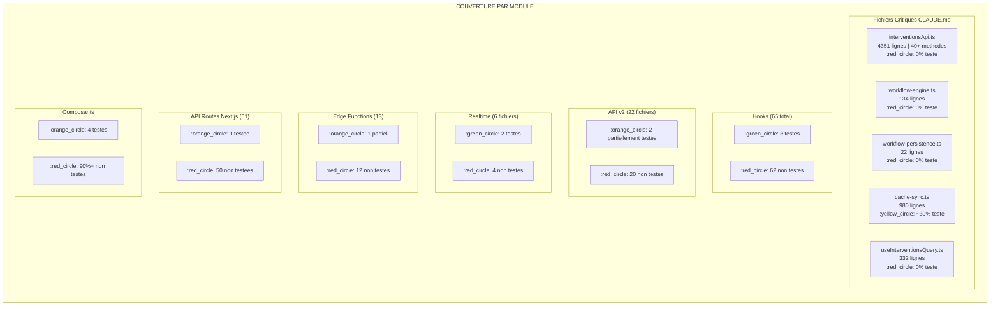
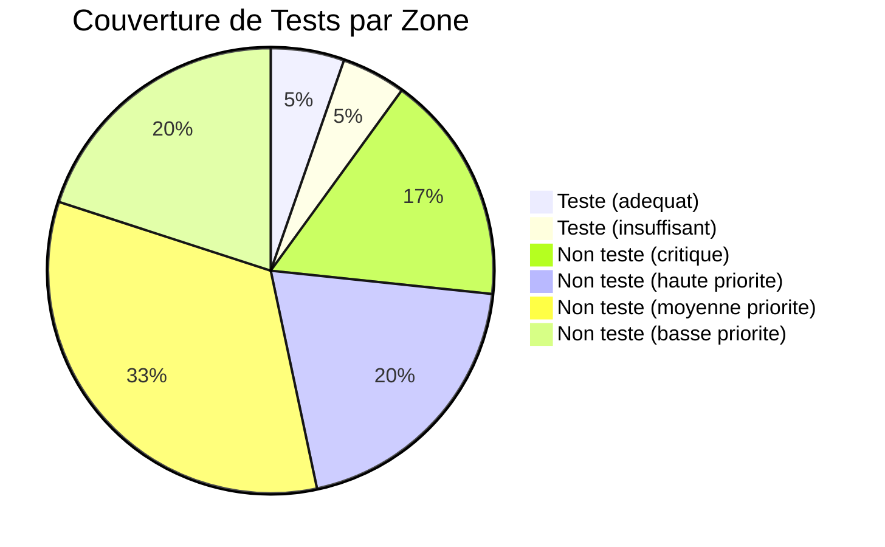
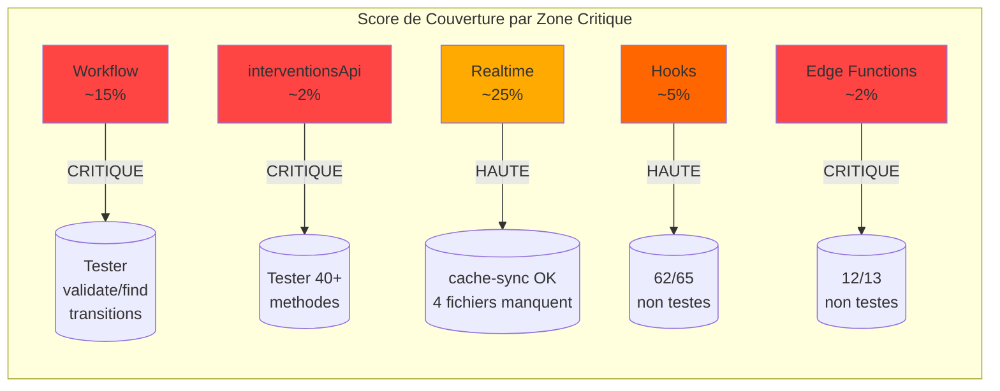

# Audit Couverture de Tests - GMBS CRM

**Date :** 10 Fevrier 2026
**Branche :** `design_ux_ui`
**Outil :** Vitest + React Testing Library

---

## Resume Executif

### Etat critique de la couverture

| Metrique | Valeur | Statut |
|----------|--------|--------|
| Fichiers source (`src/`) | **~200+** | - |
| Fichiers de test | **23** (+ 1 hors-suite) | :red_circle: |
| Tests totaux | **217** (175 passed, 41 skipped, 1 failed) | :orange_circle: |
| Tests en echec | **1** (`useProgressiveLoad`) | :red_circle: |
| Tests ignores | **41** (dashboard-stats: 10, folders-csv: 28, period-stats: 3) | :orange_circle: |
| Couverture estimee | **~8-12%** | :red_circle: CRITIQUE |
| Vulnerabilites npm | **38** (1 low, 3 moderate, 34 high) | :red_circle: |
| Dep. coverage manquante | `@vitest/coverage-v8` non installe | :orange_circle: |

### Verdict

La couverture de tests est **dangereusement basse**. Les fichiers critiques identifies dans `CLAUDE.md` sont majoritairement non testes. Sur les 5 zones critiques declarees, seule `cache-sync.ts` possede des tests d'integration significatifs. Le fichier le plus important du projet (`interventionsApi.ts`, 4 351 lignes, 40+ methodes) n'a **aucun test dedie**.

---

## Resultats d'Execution des Tests

```
Test Files  1 failed | 20 passed | 2 skipped (23)
     Tests  1 failed | 175 passed | 41 skipped (217)
  Duration  27.39s
```

### Test en echec

| Fichier | Test | Erreur |
|---------|------|--------|
| `tests/unit/hooks/useProgressiveLoad.test.ts` | `loads batches progressively until completion` | `expected 4 to be 2` - Desynchronisation entre le test et l'implementation |

### Tests ignores (41)

| Fichier | Nb ignores | Raison |
|---------|-----------|--------|
| `dashboard-stats-verification.test.ts` | 10 | Tous les tests `.skip()` - necessite rewrite |
| `interventions-folders-csv.test.ts` | 28 | Tests conditionels `.skipIf()` - absence du CSV |
| `period-stats-by-user.test.ts` | 3 | Test principal skip - desynchronise |

---

## Couverture par Module

### Diagramme de couverture



### Tableau detaille par dossier

| Dossier | Fichiers source | Tests existants | Couverture estimee | Priorite |
|---------|----------------|----------------|--------------------|----------|
| `src/lib/api/v2/` | 22 | 2 (partiels) | ~5% | CRITIQUE |
| `src/lib/interventions/` | 11 | 1 (hors-suite) | ~3% | CRITIQUE |
| `src/lib/realtime/` | 6 | 2 | ~25% | HAUTE |
| `src/lib/workflow*.ts` | 2 | 1 (partiel) | ~15% | CRITIQUE |
| `src/hooks/` | 65 | 3 | ~5% | HAUTE |
| `src/lib/artisans/` | 10 | 2 | ~40% | MOYENNE |
| `src/lib/geocode/` | 9 | 2 | ~35% | MOYENNE |
| `src/lib/services/` | 2 | 0 | 0% | HAUTE |
| `src/lib/utils/` | 5 | 1 | ~20% | MOYENNE |
| `src/components/` | 90+ | 4 | ~4% | MOYENNE |
| `src/features/` | 18 | 0 | 0% | MOYENNE |
| `supabase/functions/` | 13 | 1 (partiel) | ~2% | CRITIQUE |
| `app/api/` | 51 routes | 1 | ~2% | HAUTE |

---

## Fichiers Critiques Non Testes

### TIER 1 - CRITIQUE (Couverture 100% requise par CLAUDE.md)

#### 1. `src/lib/api/v2/interventionsApi.ts` :red_circle: ZERO TESTS

Le fichier le plus important du CRM. **4 351 lignes, 40+ methodes**.

**Methodes non testees :**

| Categorie | Methodes | Risque |
|-----------|----------|--------|
| CRUD | `getAll`, `getAllLight`, `getById`, `create`, `update`, `delete` | Perte de donnees |
| Statuts | `updateStatus`, `getStatusTransitions`, `getAllStatuses`, `getStatusByCode` | Workflow casse |
| Artisans | `setPrimaryArtisan`, `setSecondaryArtisan` | Assignation incorrecte |
| Couts | `upsertCost`, `upsertCostsBatch`, `deleteCost`, `getCosts` | Calculs financiers faux |
| Paiements | `addPayment`, `upsertPayment` | Pertes financieres |
| Stats | `getStatsByUser`, `getMarginStatsByUser`, `getMarginRankingByPeriod` | Dashboard incorrect |
| Dashboard | `getAdminDashboardStats`, `getPeriodStatsByUser`, `getWeeklyStatsByUser` | Decisions basees sur faux |
| Historique | `getRevenueHistory`, `getCycleTimeHistory`, `getMarginHistory` | Projections fausses |
| Calculs | `calculateMarginForIntervention`, `getCountsByStatus` | Marge incorrecte |
| Duplicates | `checkDuplicate`, `getDuplicateDetails` | Doublons ignores |
| Filtres | `getDistinctValues`, `getCountWithFilters`, `getTotalCountWithFilters` | UX degradee |

#### 2. `src/lib/workflow-engine.ts` :red_circle: ZERO TESTS DEDIES

**134 lignes - Moteur de workflow**

- `validateTransition()` - Validation des transitions de statut
- `findAvailableTransitions()` - Liste des transitions disponibles
- `collectMissingRequirements()` - Detection des prerequis manquants
- `evaluateConditions()` - Evaluation des conditions metier

**Risque :** Transitions de statut invalides autorisees, workflow metier casse.

#### 3. `src/hooks/useInterventionsQuery.ts` :red_circle: ZERO TESTS

**332 lignes - Hook principal du CRM**

- Gestion du cache TanStack Query avec stale time adaptatif (5-30 min)
- Pagination avec prefetch
- Mises a jour optimistes via `updateInterventionOptimistic()`
- Detection des capacites du device

**Risque :** Cache desynchronise, donnees obsoletes affichees.

#### 4. `supabase/functions/interventions-v2/index.ts` :red_circle: 1 TEST PARTIEL

**Tres haute complexite - 15+ routes, 6 methodes HTTP**

CRUD complet, transitions de statut, calcul de dossier, assignation artisans, couts/paiements, transitions automatiques.

**Risque :** Workflows serveur casses, corruption de donnees.

#### 5. `src/lib/workflow-persistence.ts` :red_circle: ZERO TESTS

**22 lignes - Persistance localStorage**

- `loadWorkflowConfig()` / `persistWorkflowConfig()`

---

### TIER 2 - HAUTE PRIORITE (80%+ couverture requise)

| Fichier | Lignes | Exports | Tests | Risque principal |
|---------|--------|---------|-------|-----------------|
| `src/lib/utils/margin-calculator.ts` | 163 | 4 fonctions | :red_circle: 0 | Calculs financiers faux |
| `src/lib/interventions/automatic-transition-service.ts` | 293 | 1 classe | :red_circle: 0 | Transitions automatiques manquees |
| `src/lib/interventions/mappers.ts` | 218 | 13+ fonctions | :red_circle: 0 | Donnees mal mappees |
| `src/lib/realtime/sync-queue.ts` | 291 | 1 classe | :red_circle: 0 | File d'attente corrompue |
| `src/lib/filter-converter.ts` | 243 | 2 fonctions | :red_circle: 0 | Filtres incorrects |
| `src/lib/interventions/checkStatus.ts` | 56 | 1 fonction | :red_circle: 0 | Retards non detectes |
| `src/lib/realtime/realtime-client.ts` | 107 | 2 fonctions | :red_circle: 0 | Deconnexions silencieuses |
| `src/lib/interventions/deposit-helpers.ts` | 34 | 5 fonctions | :red_circle: 0 | Paiements mal affiches |
| `src/lib/services/revenueProjection.ts` | 170 | 3 classes | :red_circle: 0 | Projections incorrectes |
| `src/lib/services/email-service.ts` | 198 | 3 fonctions | :red_circle: 0 | Emails non envoyes |

---

### TIER 3 - PRIORITE MOYENNE

| Fichier | Lignes | Tests | Notes |
|---------|--------|-------|-------|
| `src/lib/realtime/broadcast-sync.ts` | 159 | :red_circle: 0 | Cross-tab sync |
| `src/lib/realtime/remote-edit-indicator.ts` | 247 | :red_circle: 0 | Edition concurrente |
| `src/lib/interventions/status-display.ts` | ~100 | :red_circle: 0 | Affichage statuts |
| `src/lib/interventions/owner-tenant-helpers.ts` | ~200 | :red_circle: 0 | Multi-tenant |
| `src/lib/artisans/dossierStatus.ts` | ~80 | :red_circle: 0 | Statut dossier |
| `src/lib/artisans/helpers.ts` | ~100 | :red_circle: 0 | Helpers artisans |
| `src/lib/email-templates/*.ts` | 3 fichiers | :red_circle: 0 | Templates email |
| `src/lib/utils/encryption.ts` | ~50 | :red_circle: 0 | Chiffrement |
| `src/lib/errors/error-handler.ts` | ~80 | :red_circle: 0 | Gestion erreurs |

---

## Hooks Sans Tests (62/65)

### Critiques (Query & Data)

| Hook | Raison critique |
|------|----------------|
| `useInterventionsQuery.ts` | Query principale du CRM |
| `useInterventionsMutations.ts` | Toutes les mutations |
| `useArtisansQuery.ts` | Query artisans |
| `useCurrentUser.ts` | Etat utilisateur |
| `useReferenceData.ts` | Donnees de reference |
| `useReferenceDataQuery.ts` | Query donnees ref |
| `useInterventionsRealtime.ts` | Temps reel |
| `useInterventionHistory.ts` | Historique |
| `usePermissions.ts` | Permissions utilisateur |

### Analytics (sans tests)

`useAdminDashboardStats`, `useAnalyticsData`, `useCycleTimeHistory`, `useDashboardStats`, `useMarginHistory`, `useRevenueHistory`, `useTransformationRateHistory`

### Artisans (sans tests)

`useArtisans`, `useArtisanContextMenu`, `useArtisanModal`, `useArtisanViews`, `useGestionnaires`

### Interventions (sans tests)

`useInterventionContextMenu`, `useInterventionForm`, `useInterventionModal`, `useInterventionModalState`, `useInterventionReminders`, `useInterventionStatusMap`, `useInterventionViewCounts`, `useInterventionViews`

### UI/Utilitaires (sans tests)

`useModal`, `useModalState`, `useIsNarrow`, `useRevealTransition`, `useKeyboardShortcuts`, `useSubmitShortcut`, `usePlatformKey`, `useUnsavedChanges`, `useDebounce`, `useInfiniteScroll`, `usePagination`, `useSmartFilters`, `useFilterCounts`, `useFormDataChanges`, `useLowPowerMode`, `use-toast`, `useWorkflowConfig`, `useUserRoles`, `useUsers`, `useUniversalSearch`, `usePreloadInterventions`, `usePreloadDefaultViews`, `interventions-preload-manager`, `useDashboardPeriod`, `usePodiumPeriod`, `useBatchResolver`, `useSiretVerification`, `useDocumentUpload`

### Maps (sans tests)

`useAgencyMap`, `useMetierMap`, `useUserMap`, `useNearbyArtisans`, `useGeocodeSearch`

---

## API Routes Next.js Sans Tests (50/51)

### Routes critiques non testees

| Route | Methodes | Impact |
|-------|----------|--------|
| `/api/interventions/[id]/status` | POST | Changement de statut |
| `/api/interventions/[id]/assign` | POST | Assignation artisan |
| `/api/interventions/[id]/duplicate` | POST | Duplication |
| `/api/interventions/[id]/send-email` | POST | Envoi email |
| `/api/interventions/[id]` | GET, PATCH, DELETE | CRUD principal |
| `/api/auth/session` | POST, DELETE | Authentification |
| `/api/auth/me` | GET | Identite utilisateur |
| `/api/settings/team/user` | POST, PATCH, DELETE | Gestion equipe |
| `/api/users/[id]/permissions` | GET, PUT | Permissions |
| `/api/checkout` | POST | Paiement |
| `/api/targets` | GET, POST | Objectifs |

---

## Supabase Edge Functions Sans Tests (12/13)

| Fonction | Complexite | Routes | Tests | Priorite |
|----------|-----------|--------|-------|----------|
| `interventions-v2/index.ts` | Tres haute | 15+ | 1 partiel | CRITIQUE |
| `artisans-v2/index.ts` | Tres haute | 15+ | 0 | CRITIQUE |
| `interventions-v2-admin-dashboard-stats` | Tres haute | 4 | 0 | CRITIQUE |
| `pull/index.ts` (Google Sheets) | Haute | 1 | 0 | CRITIQUE |
| `push/index.ts` (Google Sheets) | Haute | 1 | 0 | CRITIQUE |
| `process-avatar/index.ts` | Haute | 1 | 0 | HAUTE |
| `documents/index.ts` | Haute | 7 | 0 | HAUTE |
| `comments/index.ts` | Moyenne | 7 | 0 | MOYENNE |
| `check-inactive-users/index.ts` | Moyenne | 1 | 0 | MOYENNE |
| `artisans/index.ts` (legacy) | Moyenne | 2 | 0 | MOYENNE |
| `users/index.ts` | Basse | 3 | 0 | BASSE |
| `cache/redis-client.ts` | Moyenne | N/A | 0 | MOYENNE |
| `cache/counters.ts` | Basse | N/A | 0 | BASSE |

---

## Qualite des Tests Existants

### Vue d'ensemble

| Evaluation | Fichiers | Exemples |
|-----------|----------|----------|
| EXCELLENT | 2 | `statusRules.test.ts` (45 tests), `geocode-providers.test.ts` (18 tests) |
| BON | 11 | `realtime-sync.test.ts`, `business-days.test.ts`, `interventions-api-status.test.ts` |
| MOYEN | 3 | `component-library.spec.tsx`, `workflow-config.test.tsx`, `period-stats-by-user.test.ts` |
| MAUVAIS | 4 | `FiltersBar.spec.tsx` (1 test), `InterventionCard.spec.tsx` (1 test), `dashboard-stats-verification.test.ts` (tout skip), `status-chain-calculator.test.ts` (console.assert, hors-suite) |

### Problemes identifies

1. **`dashboard-stats-verification.test.ts`** - 10 tests TOUS ignores avec `.skip()`, assertions commentees, necessite connexion Supabase live
2. **`status-chain-calculator.test.ts`** - Utilise `console.assert` au lieu de Vitest, code commente, n'est PAS execute par le test runner
3. **`useProgressiveLoad.test.ts`** - Test EN ECHEC (`expected 4 to be 2`), desynchronise avec l'implementation
4. **`FiltersBar.spec.tsx`** et **`InterventionCard.spec.tsx`** - Un seul test "smoke" chacun, aucun test de comportement

### Infrastructure de test

| Element | Statut | Notes |
|---------|--------|-------|
| Mocks Supabase | :green_circle: Bon | `tests/__mocks__/supabase.ts` + `SupabaseMockBuilder` |
| Fixtures | :orange_circle: Basiques | `tests/__fixtures__/interventions.ts` avec factory |
| Setup global | :green_circle: Present | `tests/setup.ts` + `src/test/setup.ts` |
| E2E (Playwright) | :orange_circle: Dossier vide | `tests/e2e/` existe mais pas de tests |
| Visual tests | :orange_circle: Dossier present | `tests/visual/` - statut inconnu |
| Coverage tool | :red_circle: Manquant | `@vitest/coverage-v8` non installe |

---

## Vulnerabilites npm (38 total)

| Package | Severite | Type | Fix disponible |
|---------|----------|------|----------------|
| `next` (10-15.5.9) | HIGH | DoS, Source Code Exposure | Oui |
| `fast-xml-parser` | HIGH | RangeError DoS | Oui |
| `tar` | HIGH | Arbitrary File Overwrite, Symlink Poisoning | Oui |
| `path-to-regexp` | HIGH | ReDoS (backtracking regex) | Oui |
| `@isaacs/brace-expansion` | HIGH | Uncontrolled Resource Consumption | Oui |
| `diff` (jsdiff) | HIGH | DoS in parsePatch/applyPatch | Oui |
| `undici` | MODERATE | Random Values, Decompression Chain DoS, Bad Certificate | Oui |
| `lodash` | MODERATE | Prototype Pollution (`_.unset`, `_.omit`) | Oui |

**Action :** `npm audit fix` peut resoudre toutes les vulnerabilites.

---

## Diagramme de Couverture par Module





---

## Recommandations Priorisees

### Phase 1 - URGENTE (Semaine 1-2)

1. **Installer `@vitest/coverage-v8`** pour mesurer la couverture reelle
2. **Corriger le test en echec** (`useProgressiveLoad.test.ts`)
3. **Reactiver ou rewriter les tests skip** (dashboard-stats, period-stats)
4. **Convertir `status-chain-calculator.test.ts`** en format Vitest proper
5. **Creer tests pour `interventionsApi.ts`** - Au minimum :
   - `getAll` / `getAllLight` (pagination, filtres)
   - `create` / `update` / `delete` (CRUD)
   - `updateStatus` (transitions)
   - `calculateMarginForIntervention` (calculs financiers)
6. **Creer tests pour `workflow-engine.ts`** - 100% couverture :
   - `validateTransition` (tous les cas)
   - `findAvailableTransitions` (avec/sans conditions)

### Phase 2 - HAUTE PRIORITE (Semaine 3-4)

7. **Tester `margin-calculator.ts`** - Calculs financiers critiques
8. **Tester `mappers.ts`** - Transformation de donnees
9. **Tester `automatic-transition-service.ts`** - Machine a etats
10. **Tester `useInterventionsQuery.ts`** - Cache et pagination
11. **Tester `filter-converter.ts`** - Conversion filtres
12. **Tester `sync-queue.ts`** - File d'attente hors-ligne
13. **Tester les edge functions critiques** :
    - `interventions-v2/index.ts`
    - `artisans-v2/index.ts`
    - `interventions-v2-admin-dashboard-stats/index.ts`

### Phase 3 - MOYENNE PRIORITE (Semaine 5-6)

14. **Tester les hooks d'analytics** (7 hooks)
15. **Tester les hooks d'artisans** (5 hooks)
16. **Tester `email-service.ts`** et `revenueProjection.ts`
17. **Tester les routes API Next.js critiques** (auth, interventions, settings)
18. **Enrichir les tests de composants** (FiltersBar, InterventionCard)

### Phase 4 - MAINTENANCE (Continue)

19. **Mettre en place la CI** avec seuil de couverture minimum (60%)
20. **Ajouter des tests E2E Playwright** pour les workflows critiques
21. **Executer `npm audit fix`** pour corriger les 38 vulnerabilites
22. **Enrichir les fixtures** et mocks partages

---

## Annexe : Liste Complete des Fichiers de Test

| # | Fichier | Tests | Skip | Statut | Source testee |
|---|---------|-------|------|--------|---------------|
| 1 | `tests/integration/realtime-sync.test.ts` | 3 | 0 | :green_circle: Pass | `cache-sync.ts` |
| 2 | `tests/query-engine.test.ts` | 5 | 0 | :green_circle: Pass | `query-engine.ts` |
| 3 | `tests/workflow-config.test.tsx` | 2 | 0 | :green_circle: Pass | `workflow-engine.ts` |
| 4 | `tests/unit/component-library.spec.tsx` | 11 | 0 | :green_circle: Pass | `app/component/page.tsx` |
| 5 | `tests/unit/dashboard/business-days.test.ts` | 30 | 0 | :green_circle: Pass | `business-days.ts` |
| 6 | `tests/unit/dashboard/dashboard-stats-verification.test.ts` | 10 | 10 | :orange_circle: Skip | `interventionsApi.ts` |
| 7 | `tests/unit/dashboard/period-stats-by-user.test.ts` | 6 | 3 | :orange_circle: Skip | `interventionsApi.ts` |
| 8 | `tests/unit/geocode/geocode-api.test.ts` | 6 | 0 | :green_circle: Pass | `app/api/geocode/route.ts` |
| 9 | `tests/unit/geocode/geocode-providers.test.ts` | 18 | 0 | :green_circle: Pass | `geocode/providers/*.ts` |
| 10 | `tests/unit/hooks/useColumnResize.test.tsx` | 3 | 0 | :green_circle: Pass | `useColumnResize.ts` |
| 11 | `tests/unit/hooks/useInterventionStatuses.test.tsx` | 2 | 0 | :green_circle: Pass | `useInterventionStatuses.ts` |
| 12 | `tests/unit/hooks/useProgressiveLoad.test.ts` | 2 | 0 | :red_circle: Fail | `useProgressiveLoad.ts` |
| 13 | `tests/unit/interventions/FiltersBar.spec.tsx` | 1 | 0 | :green_circle: Pass | `FiltersBar.tsx` |
| 14 | `tests/unit/interventions/InterventionCard.spec.tsx` | 1 | 0 | :green_circle: Pass | `InterventionCard.tsx` |
| 15 | `tests/unit/interventions/interventions-api-status.test.ts` | 4 | 0 | :green_circle: Pass | `interventionsApi.ts` |
| 16 | `tests/unit/interventions/interventions-folders-csv.test.ts` | 28 | 28 | :orange_circle: Skip | CSV data file |
| 17 | `tests/unit/interventions/map-intervention-user-display.test.ts` | 1 | 0 | :green_circle: Pass | `utilsApi.ts` |
| 18 | `tests/unit/interventions/supabase-api-v2-total-count.test.ts` | 4 | 0 | :green_circle: Pass | `interventionsApi.ts` |
| 19 | `tests/unit/lib/artisans/statusRules.test.ts` | 45 | 0 | :green_circle: Pass | `statusRules.ts` |
| 20 | `tests/unit/lib/artisans/statusTransition.test.ts` | 15 | 0 | :green_circle: Pass | `statusTransition.ts` |
| 21 | `tests/unit/lib/react-query/invalidate-artisan-queries.test.ts` | 2 | 0 | :green_circle: Pass | `invalidate-artisan-queries.ts` |
| 22 | `tests/unit/maplibre/maplibre-map.test.tsx` | 3 | 0 | :green_circle: Pass | `MapLibreMapImpl.tsx` |
| 23 | `tests/unit/realtime/filter-utils.test.ts` | 7 | 0 | :green_circle: Pass | `filter-utils.ts` |
| 24 | `src/lib/interventions/status-chain-calculator.test.ts` | 5* | 0 | :red_circle: Hors-suite | `status-chain-calculator.ts` |

*\* Utilise `console.assert`, non integre au test runner Vitest*

---

## Annexe : Fichiers Source Sans Aucun Test

### API v2 (20 fichiers sans tests)

- `interventionsApi.ts`, `artisansApi.ts`, `clientsApi.ts`, `commentsApi.ts`, `documentsApi.ts`, `enumsApi.ts`, `agenciesApi.ts`, `metiersApi.ts`, `ownersApi.ts`, `rolesApi.ts`, `tenantsApi.ts`, `usersApi.ts`, `interventionStatusesApi.ts`, `reminders.ts`, `utilsApi.ts`, `search.ts`, `search-utils.ts`, `common/cache.ts`, `common/utils.ts`, `common/constants.ts`

### API legacy (8 fichiers sans tests)

- `interventions.ts`, `artisans.ts`, `deepSearch.ts`, `documents.ts`, `compta.ts`, `googleMaps.ts`, `invoice2go.ts`, `permissions.ts`, `abort-controller-manager.ts`

### Services & Utilitaires (12 fichiers sans tests)

- `email-service.ts`, `revenueProjection.ts`, `margin-calculator.ts`, `encryption.ts`, `generate-id.ts`, `navigation.ts`, `filter-converter.ts`, `date-utils.ts`, `navigation-tracker.ts`, `siret-validation.ts`, `insee-token.ts`, `error-handler.ts`

---

*Rapport genere automatiquement - Audit GMBS CRM Fevrier 2026*
