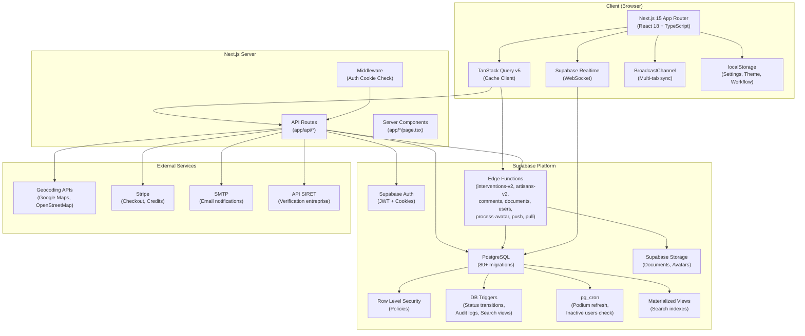
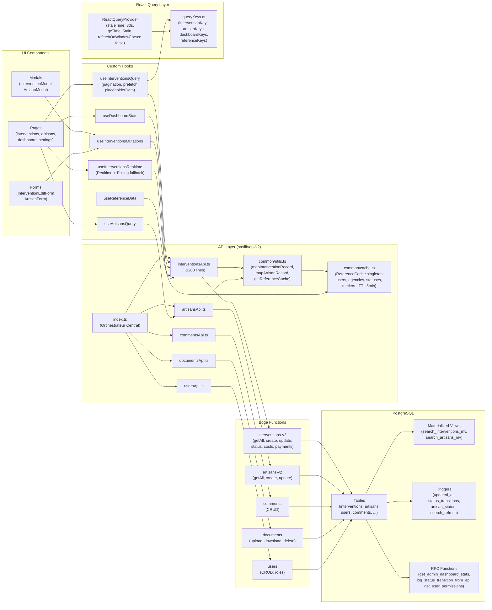
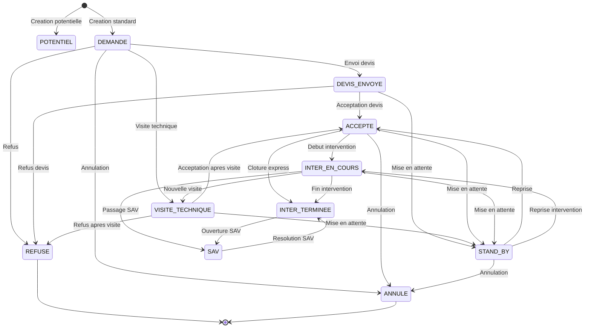
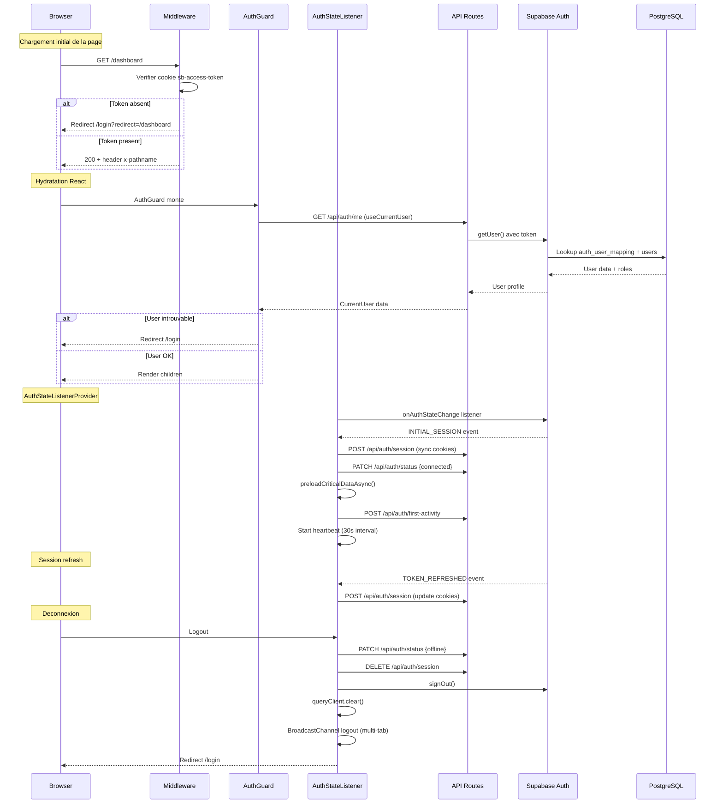
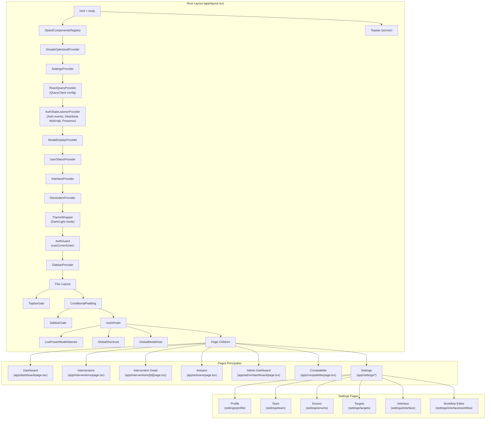
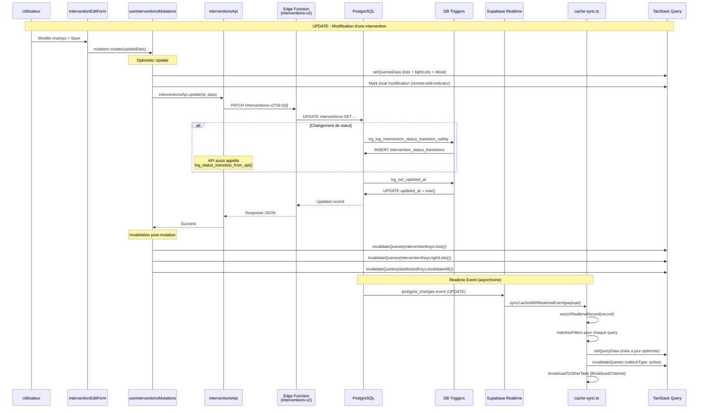
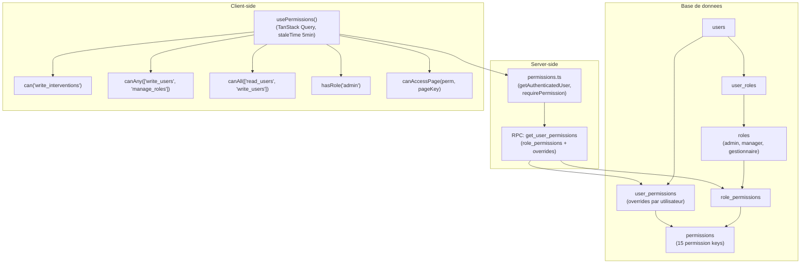

# Audit Architecture GMBS-CRM

**Date** : 10 Fevrier 2026
**Branche** : `design_ux_ui`
**Stack** : Next.js 15 (App Router), React 18, TypeScript 5, Supabase, TanStack Query v5, Tailwind CSS

---

## Table des matieres

1. [Architecture globale du systeme](#1-architecture-globale-du-systeme)
2. [Flux de donnees complet](#2-flux-de-donnees-complet)
3. [Machine a etats des interventions](#3-machine-a-etats-des-interventions)
4. [Flux d'authentification](#4-flux-dauthentification)
5. [Systeme de cache et synchronisation realtime](#5-systeme-de-cache-et-synchronisation-realtime)
6. [Arbre des composants et hierarchie](#6-arbre-des-composants-et-hierarchie)
7. [Diagramme de sequence CRUD](#7-diagramme-de-sequence-crud)
8. [Structure du projet](#8-structure-du-projet)
9. [Logique metier](#9-logique-metier)
10. [Patterns architecturaux](#10-patterns-architecturaux)
11. [Problemes architecturaux identifies](#11-problemes-architecturaux-identifies)

---

## 1. Architecture globale du systeme



### Description

L'architecture suit un pattern **hybride client-server** :
- **Client** : SPA-like avec App Router Next.js, gestion d'etat via TanStack Query, synchronisation realtime via WebSocket Supabase
- **Server** : API Routes Next.js servant de proxy/orchestrateur vers Supabase Edge Functions et la DB directe
- **Backend** : Supabase avec PostgreSQL, Edge Functions (Deno), Storage, Auth, Realtime, RLS

---

## 2. Flux de donnees complet



### Query Keys Architecture

Les query keys suivent un pattern **factory hierarchique** :

| Factory | Cle racine | Structure |
|---------|-----------|-----------|
| `interventionKeys` | `["interventions"]` | `all > lists/lightLists/summaries/details > params` |
| `artisanKeys` | `["artisans"]` | `all > lists/details > params` |
| `dashboardKeys` | `["dashboard"]` | `all > stats/margin/period/recentInterventions > params` |
| `referenceKeys` | `["references"]` | `all > allData/statuses/users/agencies/metiers` |

### Reference Cache (Singleton)

Un cache centralise (`common/cache.ts`) maintient les donnees de reference :
- **Contenu** : users, agencies, intervention_statuses, metiers
- **TTL** : 5 minutes
- **Usage** : Enrichissement des records Supabase (mapInterventionRecord, mapArtisanRecord)
- **Deduplication** : Promise singleton pour eviter les appels paralleles

---

## 3. Machine a etats des interventions



### Regles de validation par statut

| Statut | Requis pour la transition |
|--------|--------------------------|
| `DEMANDE` | Aucun (statut initial) |
| `DEVIS_ENVOYE` | `devisId`, `nomPrenomFacturation`, `assignedUser` |
| `VISITE_TECHNIQUE` | `artisan` |
| `ACCEPTE` | `devisId` |
| `INTER_EN_COURS` | `artisan`, `coutIntervention`, `coutSST`, `consigneArtisan`, `nomPrenomClient`, `telephoneClient`, `datePrevue` |
| `INTER_TERMINEE` | `artisan`, `facture`, `proprietaire` |
| `SAV` | `commentaire` |
| `STAND_BY` | `commentaire` |
| `REFUSE` | `commentaire` |
| `ANNULE` | `commentaire` |
| `ATT_ACOMPTE` | `devisId` |
| `POTENTIEL` | Aucun (statut initial) |

### Regles transversales

- **ID intervention definitif** (sans "AUTO") requis pour : `DEVIS_ENVOYE`, `VISITE_TECHNIQUE`, `ACCEPTE`, `INTER_EN_COURS`, `INTER_TERMINEE`, `STAND_BY`
- **Transitions automatiques** : Lors de la creation avec un statut avance (ex: INTER_TERMINEE), le systeme cree automatiquement toutes les transitions intermediaires (DEMANDE -> DEVIS_ENVOYE -> ... -> INTER_TERMINEE)
- **Auto-actions** : `DEVIS_ENVOYE` -> envoi email devis, `INTER_TERMINEE` -> generation facture si manquante

### Tracking des transitions (DB)

```
intervention_status_transitions (PostgreSQL)
  - id, intervention_id, from_status_id, to_status_id
  - from_status_code, to_status_code
  - changed_by_user_id, transition_date
  - source ('api' | 'trigger')
  - metadata (JSONB)
```

Deux triggers PostgreSQL assurent la traçabilite :
1. `trg_log_intervention_status_transition_on_insert` - Creation
2. `trg_log_intervention_status_transition_safety` - Modification de statut_id

---

## 4. Flux d'authentification



### Systeme de presence multi-tab

- **Heartbeat** : POST `/api/auth/heartbeat` toutes les 30s
- **Tab count** : localStorage + BroadcastChannel pour compter les onglets actifs
- **Offline** : Status `offline` uniquement quand le DERNIER onglet ferme
- **Dead tab cleanup** : Heartbeat timeout 60s, nettoyage des tabs crashees

---

## 5. Systeme de cache et synchronisation realtime

```mermaid
flowchart TB
    subgraph "Supabase"
        DB_Change["PostgreSQL Change<br/>(INSERT/UPDATE/DELETE<br/>sur table interventions)"]
        RT_Server["Supabase Realtime<br/>(WebSocket Server)"]
    end

    subgraph "Tab 1 (Actif)"
        RT1["useInterventionsRealtime<br/>(WebSocket Channel)"]
        CS1["cache-sync.ts<br/>(syncCacheWithRealtimeEvent)"]
        TQ1["TanStack Query Cache<br/>(lists, lightLists,<br/>summaries, details)"]
        REI1["Remote Edit Indicator<br/>(badges de modification)"]
        BC1["BroadcastChannel<br/>(broadcast-sync.ts)"]
    end

    subgraph "Tab 2 (Actif)"
        BC2["BroadcastChannel<br/>(listener)"]
        TQ2["TanStack Query Cache<br/>(invalidation forcee)"]
    end

    subgraph "Fallback"
        POLL["Polling Fallback<br/>(15s interval si<br/>WebSocket indisponible)"]
        RECON["Auto-reconnect<br/>(30s tentative)"]
    end

    DB_Change --> RT_Server
    RT_Server --> RT1

    RT1 --> CS1
    CS1 -->|1. Enrichir record<br/>via ReferenceCache| CS1
    CS1 -->|2. Soft delete?| CS1
    CS1 -->|3. Access revoked?| CS1
    CS1 -->|4. Update optimiste<br/>lists + lightLists| TQ1
    CS1 -->|5. Invalidate active<br/>queries| TQ1
    CS1 -->|6. Remote edit<br/>detection| REI1
    CS1 -->|7. Conflict detection<br/>+ toast warning| CS1
    CS1 -->|8. Refresh counts<br/>(debounced 500ms)| TQ1
    CS1 -->|9. Broadcast to<br/>other tabs| BC1

    BC1 --> BC2
    BC2 --> TQ2

    RT1 -.->|Si echec| POLL
    POLL -.->|Invalide active queries| TQ1
    RECON -.->|Tentative reconnexion| RT1
```

### Flux detaille de cache-sync

1. **Evenement Realtime** recu via WebSocket
2. **Enrichissement** du record brut via `mapInterventionRecord()` + `ReferenceCache`
3. **Detection soft delete** : si `is_active` passe de `true` a `false`
4. **Detection perte d'acces RLS** : si `payload.new` absent mais `payload.old` present
5. **Mise a jour optimiste** : parcours de TOUTES les queries en cache (lists + lightLists)
   - Pour chaque query, extraction des filtres via `extractFiltersFromQueryKey()`
   - Verification `matchesFilters()` pour savoir si l'intervention doit etre dans cette vue
   - INSERT/UPDATE/DELETE dans le cache selon le cas
6. **Invalidation** des queries actives (avec `setTimeout(0)` pour eviter les conflits React)
7. **Detection modifications distantes** : badge visuel si un autre user a modifie
8. **Detection conflits** : toast warning si modification simultanee
9. **Broadcast** aux autres onglets via BroadcastChannel

### Modes de connexion

| Mode | Condition | Intervalle |
|------|-----------|------------|
| `realtime` | WebSocket Supabase OK | Temps reel |
| `polling` | WebSocket en echec | 15 secondes |
| `connecting` | En cours de reconnexion | - |

---

## 6. Arbre des composants et hierarchie



### Provider Stack (12 niveaux d'imbrication)

| Ordre | Provider | Responsabilite |
|-------|----------|----------------|
| 1 | `StyledComponentsRegistry` | SSR pour styled-components |
| 2 | `SimpleOptimizedProvider` | Context pour mode optimise |
| 3 | `SettingsProvider` | Parametres utilisateur (localStorage) |
| 4 | `ReactQueryProvider` | TanStack Query client + DevTools |
| 5 | `AuthStateListenerProvider` | Auth events, heartbeat, multi-tab |
| 6 | `ModalDisplayProvider` | Preferences d'affichage modaux |
| 7 | `UserStatusProvider` | Statut de presence (connected/dnd/busy/offline) |
| 8 | `InterfaceProvider` | Preferences d'interface |
| 9 | `RemindersProvider` | Systeme de rappels |
| 10 | `ThemeWrapper` | Theme clair/sombre + accent color |
| 11 | `AuthGuard` | Protection des routes authentifiees |
| 12 | `SidebarProvider` | Etat de la sidebar (shadcn/ui) |

---

## 7. Diagramme de sequence CRUD



### Flux CREATE

1. `interventionsApi.create(data)` -> Edge Function `interventions-v2`
2. Edge Function insere dans PostgreSQL
3. Trigger `trg_log_intervention_status_transition_on_insert` cree la premiere transition
4. Si statut avance, `automaticTransitionService.createAutomaticTransitions()` cree les transitions intermediaires
5. Realtime propage l'evenement INSERT a tous les clients
6. `cache-sync.ts` enrichit le record et l'ajoute aux listes filtrees appropriees

### Flux DELETE (Soft Delete)

1. `interventionsApi.update(id, { is_active: false })`
2. Realtime propage l'UPDATE
3. `cache-sync.ts` detecte le soft delete (`isSoftDelete()`)
4. Retire l'intervention de toutes les listes en cache
5. Affiche toast "Intervention supprimee"
6. Nettoie les indicateurs et la sync queue

---

## 8. Structure du projet

```
gmbs-crm/
├── app/                          # Next.js 15 App Router
│   ├── (auth)/                   # Route group - pages auth
│   │   ├── layout.tsx            # Layout sans sidebar
│   │   ├── login/page.tsx        # Page de connexion
│   │   └── set-password/page.tsx # Setup mot de passe
│   ├── admin/
│   │   ├── analytics/page.tsx    # Analytics AI (KPI, ML, Sankey)
│   │   └── dashboard/page.tsx    # Dashboard admin (stats, funnel)
│   ├── api/                      # API Routes (55+ endpoints)
│   │   ├── admin/analytics/ai/   # AI analytics endpoint
│   │   ├── artisans/[id]/        # Archive, recalculate-status
│   │   ├── auth/                 # me, session, status, heartbeat, first-activity, resolve
│   │   ├── checkout/             # Stripe checkout + success
│   │   ├── credits/              # Credits management + sync
│   │   ├── dev/                  # Dev tools (clear-cache, seed-requests)
│   │   ├── geocode/              # Geocoding proxy
│   │   ├── interventions/        # CRUD + status + documents + assign + duplicate + email
│   │   ├── settings/             # Agency, metiers, statuses, team, lateness-email
│   │   ├── siret/verify/         # SIRET verification
│   │   ├── targets/              # Objectifs gestionnaires
│   │   └── users/[id]/permissions/ # User permissions
│   ├── artisans/                 # Page artisans
│   ├── comptabilite/             # Page comptabilite
│   ├── dashboard/                # Dashboard gestionnaire
│   ├── interventions/            # Interventions (list + [id] + new)
│   ├── settings/                 # Pages parametres (profile, team, enums, targets, interface, workflow)
│   ├── layout.tsx                # Root layout (12 providers)
│   ├── page.tsx                  # Root redirect (/ -> /dashboard ou /login)
│   └── globals.css               # Styles globaux + design tokens
│
├── src/
│   ├── analytics/                # Web vitals tracking
│   ├── components/
│   │   ├── admin-analytics/      # Analytics composants (KPI, Charts, ML, Sankey)
│   │   ├── admin-dashboard/      # Admin dashboard (FilterBar, Funnel, KPI, Performance)
│   │   ├── artisans/             # Artisan composants (Modal, Search, Form)
│   │   ├── dashboard/            # Dashboard gestionnaire (Podium, Margin, Stats)
│   │   ├── documents/            # Document management (Preview, Upload, Variants)
│   │   ├── interventions/        # Intervention composants (Form, Cards, Table, Map)
│   │   ├── layout/               # Layout (auth-guard, sidebar, topbar, theme-wrapper)
│   │   ├── providers/            # ReactQueryProvider
│   │   ├── shared/               # Composants partages (CommentSection, etc.)
│   │   └── ui/                   # shadcn/ui + custom (dialog, sheet, tabs, etc.)
│   │
│   ├── config/
│   │   ├── interventions.ts      # Status config (12 statuts, couleurs, icones)
│   │   ├── workflow-rules.ts     # Regles de workflow (transitions, validations, auto-actions)
│   │   └── intervention-status-chains.ts # Chaines de statuts intermediaires
│   │
│   ├── contexts/                 # React Contexts (9 contexts)
│   │   ├── FilterMappersContext.tsx
│   │   ├── ModalDisplayContext.tsx
│   │   ├── RemindersContext.tsx
│   │   ├── SimpleOptimizedContext.tsx
│   │   ├── interface-context.tsx
│   │   └── user-status-context.tsx
│   │
│   ├── features/                 # Feature modules
│   │   ├── interventions/        # Intervention cards, animated cards
│   │   └── settings/             # Settings pages (Enum, Profile, Targets, Team, Permissions)
│   │
│   ├── hooks/                    # Custom hooks (65+ hooks)
│   │   ├── useInterventionsQuery.ts    # Query principale interventions
│   │   ├── useInterventionsRealtime.ts # Realtime + polling fallback
│   │   ├── useInterventionsMutations.ts # Mutations CRUD
│   │   ├── usePermissions.ts           # Permissions RBAC
│   │   ├── useCurrentUser.ts           # User courant (cached)
│   │   ├── useWorkflowConfig.ts        # Workflow editor state
│   │   └── ...                         # 60+ autres hooks
│   │
│   ├── lib/
│   │   ├── api/
│   │   │   ├── v2/                     # API V2 modulaire (14 modules)
│   │   │   │   ├── index.ts            # Orchestrateur central
│   │   │   │   ├── interventionsApi.ts # ~1200 lignes (getAll, create, update, status, costs, payments, stats, dashboard)
│   │   │   │   ├── artisansApi.ts      # Artisans CRUD + nearby
│   │   │   │   ├── commentsApi.ts      # Commentaires CRUD
│   │   │   │   ├── documentsApi.ts     # Documents CRUD + upload
│   │   │   │   ├── usersApi.ts         # Users CRUD + roles
│   │   │   │   ├── common/
│   │   │   │   │   ├── types.ts        # ~1150 lignes de types
│   │   │   │   │   ├── constants.ts    # Constantes metier
│   │   │   │   │   ├── utils.ts        # Mappers, helpers
│   │   │   │   │   └── cache.ts        # ReferenceCache singleton
│   │   │   │   └── ...                 # 10 autres modules API
│   │   │   ├── permissions.ts          # Server-side permissions
│   │   │   └── ...                     # Legacy API files
│   │   │
│   │   ├── realtime/
│   │   │   ├── cache-sync.ts           # ~980 lignes (coeur du systeme realtime)
│   │   │   ├── filter-utils.ts         # Matching filtres pour le cache
│   │   │   ├── broadcast-sync.ts       # Multi-tab sync via BroadcastChannel
│   │   │   ├── realtime-client.ts      # Channel Supabase Realtime
│   │   │   ├── remote-edit-indicator.ts # Badges de modification distante
│   │   │   └── sync-queue.ts           # File d'attente de sync
│   │   │
│   │   ├── interventions/
│   │   │   ├── automatic-transition-service.ts # Transitions automatiques intermediaires
│   │   │   ├── status-chain-calculator.ts      # Calcul des chaines de statuts
│   │   │   └── checkStatus.ts                  # Detection statuts de verification
│   │   │
│   │   ├── react-query/
│   │   │   └── queryKeys.ts            # Factory centralisee (4 namespaces)
│   │   │
│   │   └── ...                         # utils, supabase client, auth, services
│   │
│   ├── providers/
│   │   └── AuthStateListenerProvider.tsx # Auth events + heartbeat + multi-tab
│   │
│   └── types/                          # Types TypeScript
│       ├── intervention-generated.ts   # Types auto-generes
│       ├── intervention-workflow.ts    # Types workflow
│       └── ...
│
├── supabase/
│   ├── functions/                # Edge Functions (10 fonctions)
│   │   ├── interventions-v2/     # CRUD interventions
│   │   ├── artisans-v2/          # CRUD artisans
│   │   ├── artisans/             # Legacy artisans
│   │   ├── comments/             # CRUD commentaires
│   │   ├── documents/            # CRUD documents
│   │   ├── users/                # CRUD users
│   │   ├── process-avatar/       # Traitement avatars
│   │   ├── check-inactive-users/ # Cron: detection inactifs
│   │   ├── push/ + pull/         # Sync operations
│   │   └── cache/                # Redis client + counters
│   │
│   ├── migrations/               # 80 migrations SQL
│   │   ├── 00001_clean_schema.sql          # Schema principal consolide
│   │   ├── 00010_status_transitions.sql    # Historique transitions
│   │   ├── 00012_rls_policies.sql          # Row Level Security
│   │   ├── 00018_admin_dashboard_v3.sql    # Dashboard admin RPC
│   │   ├── 00020_search_materialized_views.sql # Vues materialisees search
│   │   ├── 00037_intervention_audit_system.sql # Audit log
│   │   ├── 00040_seed_permissions_roles.sql    # RBAC initial
│   │   └── ...                                 # 73 autres migrations
│   │
│   ├── seeds/                    # Seed data
│   └── samples/sql/              # SQL de test/debug
│
├── tests/
│   ├── unit/                     # Tests unitaires
│   │   ├── hooks/                # Tests hooks (3 fichiers)
│   │   ├── interventions/        # Tests interventions (6 fichiers)
│   │   ├── dashboard/            # Tests dashboard (3 fichiers)
│   │   ├── lib/                  # Tests lib (3 fichiers)
│   │   └── ...
│   ├── integration/              # Tests integration (1 fichier)
│   ├── e2e/                      # Tests E2E Playwright (2 fichiers)
│   └── visual/                   # Tests visuels (2 fichiers)
│
├── middleware.ts                  # Auth middleware (cookie check + redirect)
├── tailwind.config.ts            # Config Tailwind + tokens
├── vitest.config.ts              # Config Vitest
└── package.json                  # Dependencies
```

---

## 9. Logique metier

### Systeme de permissions (RBAC)



### 15 Permission Keys

| Permission | Description |
|-----------|-------------|
| `read_interventions` | Lire les interventions |
| `write_interventions` | Creer/modifier interventions |
| `delete_interventions` | Supprimer interventions |
| `edit_closed_interventions` | Modifier interventions terminees |
| `read_artisans` | Lire les artisans |
| `write_artisans` | Creer/modifier artisans |
| `delete_artisans` | Supprimer artisans |
| `export_artisans` | Exporter artisans |
| `read_users` | Lire les utilisateurs |
| `write_users` | Creer/modifier utilisateurs |
| `delete_users` | Supprimer utilisateurs |
| `manage_roles` | Gerer les roles |
| `manage_settings` | Gerer les parametres |
| `view_admin` | Acceder au dashboard admin |
| `view_comptabilite` | Acceder a la comptabilite |

### Roles par defaut

| Role | Permissions |
|------|------------|
| **admin** | Toutes les 15 permissions |
| **manager** | read/write interventions + artisans, read users, export artisans, view comptabilite |
| **gestionnaire** | read/write interventions + artisans, read users |

### Calculs metier (Marges)

```
Revenue = somme des costs de type "intervention"
Costs = somme des costs de type "sst" + "materiel"
Margin = Revenue - Costs
MarginPercentage = (Margin / Revenue) * 100
```

Les couts supportent un **deuxieme artisan** (`artisan_order: 1 | 2`).

---

## 10. Patterns architecturaux

### Separation des concerns

| Couche | Responsabilite | Fichiers |
|--------|---------------|----------|
| **UI** | Rendu, interactions, formulaires | `app/`, `src/components/`, `src/features/` |
| **State** | Cache, queries, mutations, realtime | `src/hooks/`, `src/lib/react-query/` |
| **API** | Communication backend, mapping | `src/lib/api/v2/` |
| **Business** | Workflow, validations, calculs | `src/config/`, `src/lib/interventions/` |
| **Infra** | Auth, Supabase client, realtime | `src/lib/realtime/`, `src/providers/` |
| **Backend** | Edge Functions, DB, Triggers | `supabase/`, `app/api/` |

### Gestion d'etat

| Type | Technologie | Usage |
|------|-------------|-------|
| **Server state** | TanStack Query v5 | Donnees Supabase (interventions, artisans, users, stats) |
| **Client state** | React Context (9 contexts) | Settings, theme, sidebar, presence, modals |
| **Persistent state** | localStorage | Workflow config, preferences, theme, accent color |
| **Realtime state** | Supabase Realtime + cache-sync | Modifications en temps reel |
| **URL state** | Next.js App Router | Routes, parametres de page |

### Patterns notables

1. **Factory Pattern** pour les query keys (`interventionKeys.list(params)`)
2. **Singleton Pattern** pour le ReferenceCache et BroadcastSync
3. **Observer Pattern** pour Supabase Realtime -> cache-sync
4. **Facade Pattern** pour `src/lib/api/v2/index.ts` (orchestrateur)
5. **Strategy Pattern** pour les regles de workflow (WORKFLOW_RULES, VALIDATION_RULES)
6. **State Machine Pattern** pour les transitions de statut (AUTHORIZED_TRANSITIONS)
7. **Optimistic Update Pattern** pour les mutations (TanStack Query)
8. **Fallback Pattern** pour Realtime -> Polling avec auto-reconnect

---

## 11. Problemes architecturaux identifies

### CRITIQUE

| # | Probleme | Impact | Localisation |
|---|---------|--------|--------------|
| 1 | **interventionsApi.ts trop volumineux** (~1200 lignes) | Maintenabilite, testabilite | `src/lib/api/v2/interventionsApi.ts` |
| 2 | **cache-sync.ts trop complexe** (~980 lignes) | Risque de bugs, difficile a debugger | `src/lib/realtime/cache-sync.ts` |
| 3 | **12 niveaux de providers** dans le root layout | Performance (re-renders en cascade), complexite | `app/layout.tsx` |
| 4 | **console.log excessifs** dans le code de production | Performance, bruit en production | `cache-sync.ts`, `useInterventionsQuery.ts`, `AuthStateListenerProvider.tsx` |
| 5 | **Duplication des permissions** server vs client | Risque de desynchronisation | `src/lib/api/permissions.ts` vs `src/hooks/usePermissions.ts` |
| 6 | **Pas de dossier workflow/** (mentionne dans CLAUDE.md mais inexistant) | Documentation trompeuse | CLAUDE.md reference `src/lib/workflow/` |

### HAUTE

| # | Probleme | Impact | Localisation |
|---|---------|--------|--------------|
| 7 | **common/types.ts surdimensionne** (~1150 lignes) | Navigation difficile, types non-scopes | `src/lib/api/v2/common/types.ts` |
| 8 | **Couplage fort** entre cache-sync et la structure des query keys | Fragilite - tout changement de query key casse le realtime | `src/lib/realtime/cache-sync.ts` |
| 9 | **65+ hooks custom** sans categorisation claire | Decouverte et reutilisabilite compliquees | `src/hooks/` |
| 10 | **Reference cache duplique** dans cache-sync.ts et common/cache.ts | Deux caches de reference pourraient diverger | `src/lib/realtime/cache-sync.ts:31-80` |
| 11 | **Workflow config en localStorage** au lieu de la DB | Configuration non partageable entre utilisateurs | `useWorkflowConfig.ts` |
| 12 | **Auto-actions non implementees** (send_email_devis, generate_invoice) | Les auto-actions sont definies mais jamais executees cote client | `src/config/workflow-rules.ts:264-280` |

### MOYENNE

| # | Probleme | Impact | Localisation |
|---|---------|--------|--------------|
| 13 | **Alias de compatibilite** (`interventionsApiV2 = interventionsApi`) | Code mort, confusion | `src/lib/api/v2/index.ts:102-115` |
| 14 | **Type `any` frequents** dans les mappeurs et handlers realtime | Perte de type-safety | `cache-sync.ts`, `common/utils.ts` |
| 15 | **setTimeout(0) pour invalidation React** | Workaround fragile pour un probleme de timing | `cache-sync.ts:302-326` |
| 16 | **Script inline de 200+ lignes** dans le `<head>` | Performance du premier paint, maintenabilite | `app/layout.tsx:49-232` |
| 17 | **Pas d'Error Boundaries** visibles dans le layout | Crash non-geres peuvent casser toute l'application | `app/layout.tsx` |
| 18 | **Dependance circulaire potentielle** entre hooks et API | Certains hooks importent d'autres hooks qui importent les memes APIs | `src/hooks/` |
| 19 | **Edge Functions + API Routes** servent le meme but | Double couche inutile pour certains endpoints | `app/api/interventions/` vs `supabase/functions/interventions-v2/` |
| 20 | **Tests insuffisants** pour la couche realtime et cache-sync | Code critique non-teste | `tests/` - 1 seul test integration realtime |

### BASSE

| # | Probleme | Impact | Localisation |
|---|---------|--------|--------------|
| 21 | **Constantes deprecated** dans constants.ts | Confusion entre constantes et donnees DB | `src/lib/api/v2/common/constants.ts:8-19` |
| 22 | **Pages experimentales** non-nettoyees | Code mort, confusion | `app/artisans-ultra/`, `app/interventions-ultra/`, `app/testmodalui/`, `app/component/`, `app/previews/` |
| 23 | **Fichier `package.json`** dans `supabase/functions/pull/` et `push/` | Dependencies Edge Functions non-centralisees | `supabase/functions/*/package.json` |
| 24 | **credentials.json** dans supabase/functions | Risque securite si commit accidentel | `supabase/functions/credentials.json` |

### Recommandations d'amelioration (ordre de priorite)

1. **Decoupe `interventionsApi.ts`** en sous-modules (crud, stats, dashboard, costs, payments)
2. **Refactoring `cache-sync.ts`** en modules (enrichment, handlers, broadcasting, conflict-detection)
3. **Deplacer le workflow config** vers la DB Supabase pour partage entre utilisateurs
4. **Ajouter Error Boundaries** au root layout et aux pages critiques
5. **Consolider le reference cache** en un seul singleton utilise partout
6. **Supprimer les console.log** de production (deja configure dans next.config.mjs mais pas applique aux fichiers client)
7. **Categoriser les hooks** en sous-dossiers (interventions/, artisans/, dashboard/, auth/, ui/)
8. **Ajouter des tests** pour `cache-sync.ts`, `filter-utils.ts`, et `automatic-transition-service.ts`
9. **Nettoyer les pages experimentales** et le code deprecated
10. **Extraire le script de theme** du `<head>` vers un fichier JS externe minimifie
