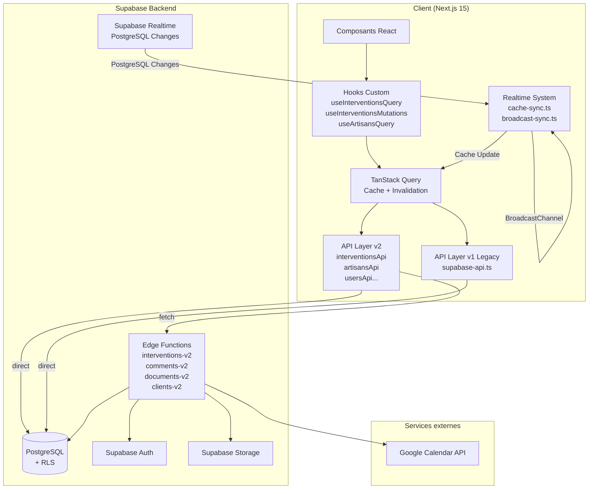
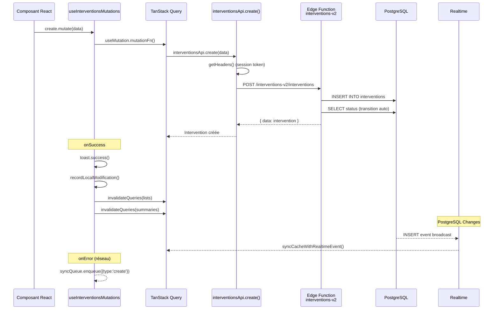
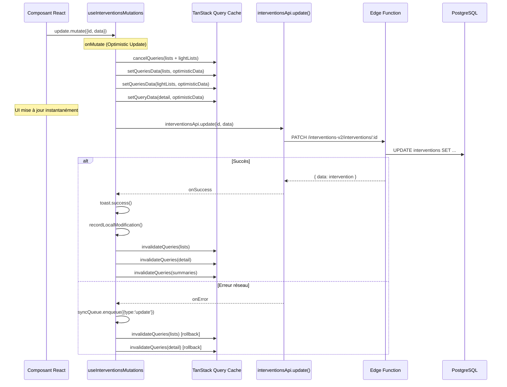
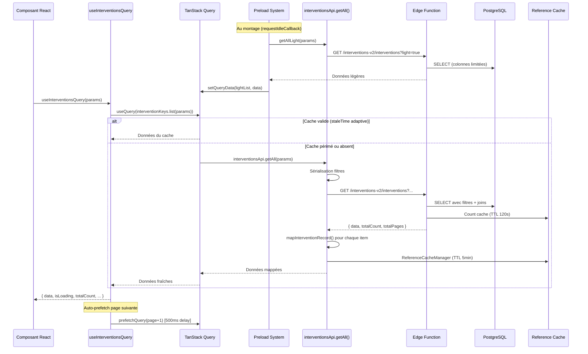
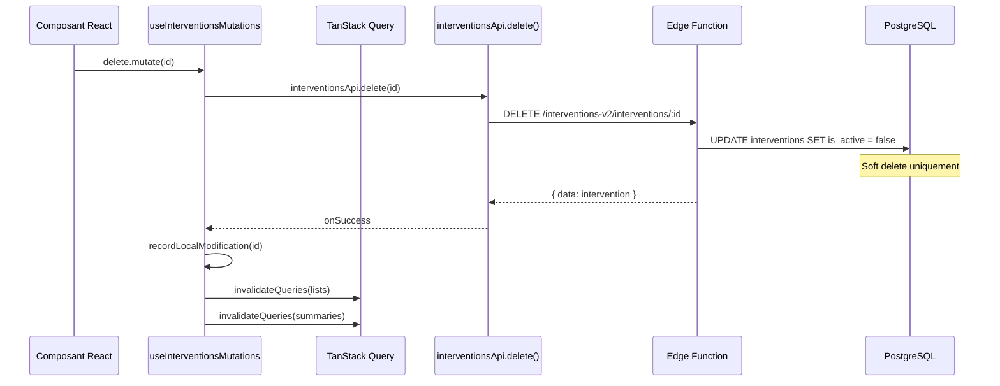
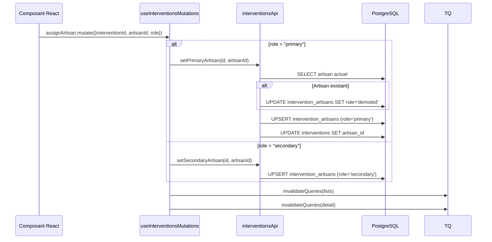
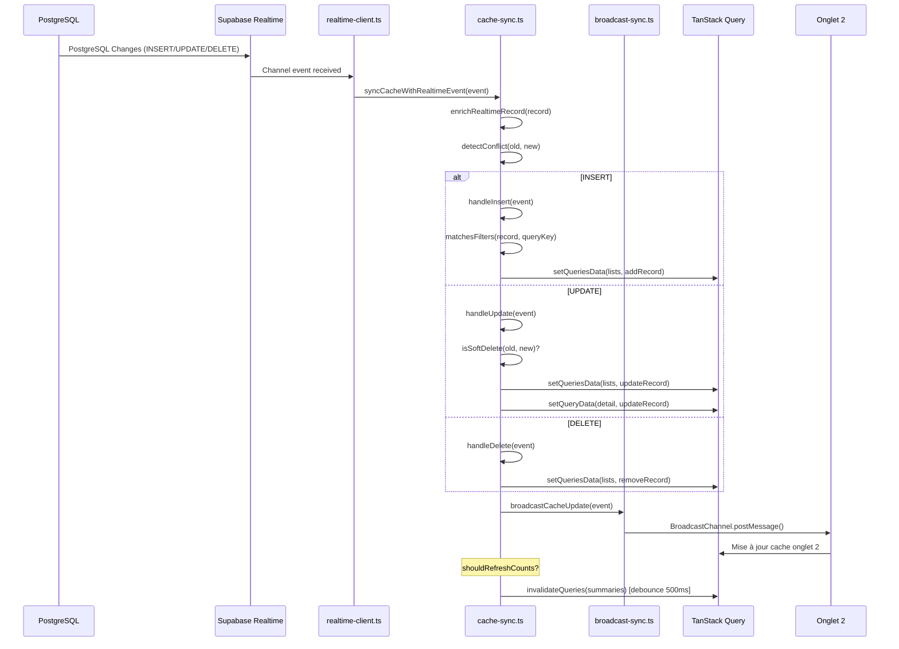
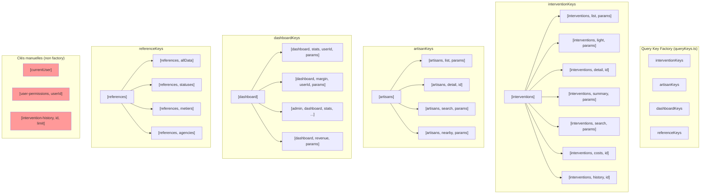
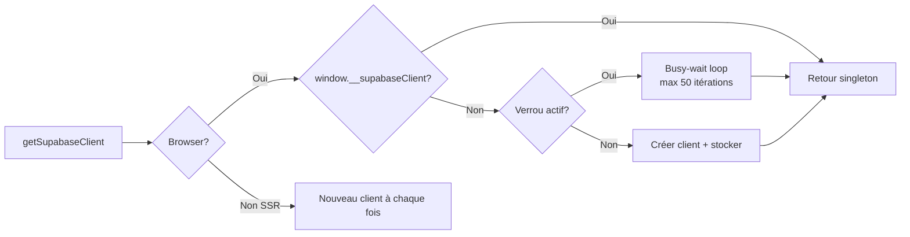
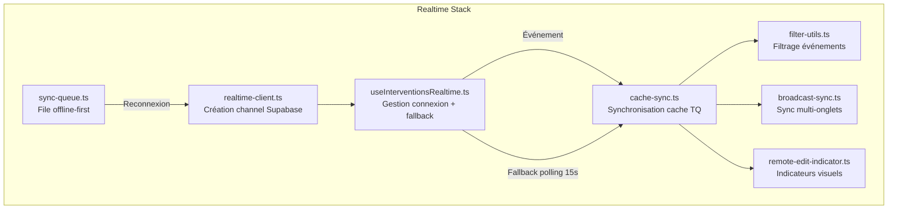

# 05 - Audit API, Base de Données et Edge Functions

**Date** : 10 février 2026
**Branche** : `design_ux_ui`
**Auditeur** : api-database-auditor

---

## Table des matières

1. [Vue d'ensemble de l'architecture](#1-vue-densemble-de-larchitecture)
2. [Inventaire complet des fonctions API](#2-inventaire-complet-des-fonctions-api)
3. [Diagrammes Mermaid des flux API](#3-diagrammes-mermaid-des-flux-api)
4. [Analyse TanStack Query et Cache](#4-analyse-tanstack-query-et-cache)
5. [Intégration Supabase](#5-intégration-supabase)
6. [Edge Functions](#6-edge-functions)
7. [Système Realtime et Synchronisation](#7-système-realtime-et-synchronisation)
8. [Types et Schéma](#8-types-et-schéma)
9. [Problèmes identifiés (avec fichier:ligne)](#9-problèmes-identifiés)
10. [Recommandations](#10-recommandations)

---

## 1. Vue d'ensemble de l'architecture

### Architecture en couches



### Organisation des fichiers

| Couche | Répertoire | Fichiers |
|--------|-----------|----------|
| API v2 | `src/lib/api/v2/` | 16 modules (index.ts + 15 APIs) |
| API v1 (legacy) | `src/lib/api/` | 9 fichiers |
| Hooks | `src/hooks/` | 14 hooks TanStack Query |
| Query Keys | `src/lib/react-query/` | queryKeys.ts, invalidate-artisan-queries.ts |
| Realtime | `src/lib/realtime/` | 6 fichiers |
| Edge Functions | `supabase/functions/` | 6 fonctions |
| Types | `src/types/` | 4 fichiers principaux |
| Utilitaires | `src/lib/api/v2/common/` | utils.ts, types.ts, constants.ts, cache.ts |

---

## 2. Inventaire complet des fonctions API

### 2.1 API v2 - Modules principaux

#### `interventionsApi` (src/lib/api/v2/interventionsApi.ts) — ~1800 lignes

| Fonction | Description | Cible |
|----------|-------------|-------|
| `getAll(params)` | Liste paginée avec filtres | Edge Function |
| `getAllLight(params)` | Liste allégée (warm-up) | Edge Function |
| `getById(id)` | Détail intervention | Edge Function |
| `create(data)` | Création + transition auto | Edge Function |
| `update(id, data)` | Mise à jour | Edge Function |
| `delete(id)` | Soft delete (is_active=false) | Edge Function |
| `assignArtisan(id, artisanId, role)` | Assignation artisan | DB direct |
| `setPrimaryArtisan(id, artisanId)` | Artisan principal | DB direct |
| `setSecondaryArtisan(id, artisanId)` | Artisan secondaire | DB direct |
| `unassignArtisan(id, artisanId)` | Désassignation | DB direct |
| `addCost(id, data)` | Ajout coût | Edge Function |
| `updateCost(costId, data)` | Mise à jour coût | Edge Function |
| `deleteCost(costId)` | Suppression coût | Edge Function |
| `upsertCost(id, data)` | Upsert coût | DB direct |
| `upsertCostsBatch(costs)` | Upsert coûts en batch | DB direct |
| `addPayment(id, data)` | Ajout paiement | Edge Function |
| `updatePayment(paymentId, data)` | Mise à jour paiement | Edge Function |
| `deletePayment(paymentId)` | Suppression paiement | Edge Function |
| `getSummary(params)` | Résumé/comptages | Edge Function |
| `getStats(params)` | Statistiques | Edge Function |
| `getDistinct(field, params)` | Valeurs distinctes | Edge Function |
| `calculateMarginForIntervention(id)` | Calcul marge | DB direct |
| `upsertDirect(data, client?)` | Import massif | DB direct |
| `search(query, options)` | Recherche | Edge Function |

#### `artisansApi` (src/lib/api/v2/artisansApi.ts) — ~2300 lignes

| Fonction | Description | Cible |
|----------|-------------|-------|
| `getAll(params)` | Liste paginée | DB direct |
| `getAllLight(params)` | Liste allégée | DB direct |
| `getById(id)` | Détail artisan | DB direct |
| `create(data)` | Création artisan | DB direct |
| `update(id, data)` | Mise à jour | DB direct |
| `delete(id)` | Soft delete | DB direct |
| `getTotalCount(params?)` | Comptage total | DB direct |
| `getCountWithFilters(params?)` | Comptage filtré | DB direct |
| `getNearbyArtisans(params)` | Recherche géo | DB direct |
| `searchArtisans(params)` | Recherche texte + géo | RPC |

#### `usersApi` (src/lib/api/v2/usersApi.ts) — 759 lignes

| Fonction | Description | Cible |
|----------|-------------|-------|
| `getAll(params?)` | Liste utilisateurs avec rôles | DB direct |
| `getById(id)` | Détail utilisateur | DB direct |
| `create(data)` | Création (auth + profil) | Auth Admin + DB |
| `update(id, data)` | Mise à jour profil | DB direct |
| `delete(id)` | Soft delete | DB direct |
| `assignRoles(userId, roleNames)` | Assignation rôles | DB direct |
| `updateRoles(userId, roleNames)` | MAJ rôles | DB direct |
| `getUserPermissions(userId)` | Permissions utilisateur | DB direct |
| `hasPermission(userId, permission)` | Vérification permission | DB direct |
| `getUsersByRole(roleName)` | Utilisateurs par rôle | DB direct |
| `syncUser(authUserId, profileData)` | Synchronisation utilisateur | DB direct |
| `getStats()` | Statistiques | DB direct |
| `createBulk(users)` | Création en masse | Auth Admin + DB |
| `getTargetByUserAndPeriod(userId, period)` | Objectif marge | API route |
| `getTargetsByUser(userId)` | Objectifs utilisateur | API route |
| `upsertTarget(data, createdBy)` | Upsert objectif | API route |
| `updateTarget(targetId, data, updatedBy)` | MAJ objectif | API route |
| `deleteTarget(targetId)` | Suppression objectif | API route |
| `getAllTargets()` | Tous les objectifs | API route |
| `getUserPreferences(userId)` | Préférences | DB direct |
| `updateUserPreferences(userId, prefs)` | MAJ préférences | DB direct |

#### `documentsApi` (src/lib/api/v2/documentsApi.ts) — 449 lignes

| Fonction | Description | Cible |
|----------|-------------|-------|
| `getAll(params?)` | Liste documents | Edge Function |
| `getById(id, entityType?)` | Détail document | Edge Function |
| `create(data)` | Création document | Edge Function |
| `upload(data)` | Upload fichier | Storage + DB |
| `update(id, data, entityType?)` | MAJ document | Edge Function |
| `delete(id, entityType?)` | Suppression | Edge Function |
| `getByIntervention(id, params?)` | Documents intervention | Edge Function |
| `getByArtisan(id, params?)` | Documents artisan | Edge Function |
| `searchByFilename(filename, params?)` | Recherche nom | Edge Function |
| `getStats(params?)` | Statistiques | Edge Function |
| `createBulk(documents)` | Création en masse | Edge Function |
| `uploadBulk(files)` | Upload en masse | Storage + DB |

#### `commentsApi` (src/lib/api/v2/commentsApi.ts) — 242 lignes

| Fonction | Description | Cible |
|----------|-------------|-------|
| `getAll(params?)` | Liste commentaires | Edge Function |
| `getByEntity(type, id, params?)` | Par entité | Edge Function |
| `create(data)` | Création | Edge Function |
| `update(id, data)` | MAJ | Edge Function |
| `delete(id)` | Suppression | Edge Function |
| `getByIntervention(id, params?)` | Par intervention | Edge Function |
| `getByArtisan(id, params?)` | Par artisan | Edge Function |
| `searchByContent(term, params?)` | Recherche contenu | Edge Function |
| `getRecent(days?, params?)` | Récents | Edge Function |
| `createBulk(comments)` | Création en masse | Edge Function |

#### `clientsApi` (src/lib/api/v2/clientsApi.ts) — 190 lignes

| Fonction | Description | Cible |
|----------|-------------|-------|
| `getAll(params?)` | Liste clients | Edge Function |
| `getById(id)` | Détail client | Edge Function |
| `create(data)` | Création | Edge Function |
| `update(id, data)` | MAJ | Edge Function |
| `delete(id)` | Suppression | Edge Function |
| `insertClients(clients)` | Insert en masse | DB direct |
| `searchByName(term, params?)` | Recherche nom | Edge Function |
| `searchByEmail(email, params?)` | Recherche email | Edge Function |
| `searchByPhone(phone, params?)` | Recherche téléphone | Edge Function |
| `getByCity(city, params?)` | Par ville | Edge Function |
| `getStats()` | Statistiques | Edge Function |

#### `rolesApi` et `permissionsApi` (src/lib/api/v2/rolesApi.ts) — 295 lignes

| Fonction | Description | Cible |
|----------|-------------|-------|
| `rolesApi.getAll()` | Tous les rôles + permissions | DB direct |
| `rolesApi.getById(id)` | Détail rôle | DB direct |
| `rolesApi.create(data)` | Création rôle | DB direct |
| `rolesApi.update(id, data)` | MAJ rôle | DB direct |
| `rolesApi.delete(id)` | Suppression rôle | DB direct |
| `rolesApi.assignPermissions(roleId, keys)` | Assignation permissions | DB direct |
| `permissionsApi.getAll()` | Toutes les permissions | DB direct |
| `permissionsApi.create(data)` | Création permission | DB direct |
| `permissionsApi.delete(id)` | Suppression permission | DB direct |

#### `enumsApi` (src/lib/api/v2/enumsApi.ts) — 597 lignes

| Fonction | Description | Cible |
|----------|-------------|-------|
| `findOrCreateAgency(name)` | Find-or-create agence | DB Admin |
| `findOrCreateUser(name)` | Find-or-create utilisateur | DB Admin |
| `findOrCreateMetier(name)` | Find-or-create métier | DB Admin |
| `findOrCreateZone(name)` | Find-or-create zone | DB Admin |
| `findOrCreateArtisanStatus(name)` | Find-or-create statut artisan | DB Admin |
| `findOrCreateInterventionStatus(name)` | Find-or-create statut intervention | DB Admin |
| `findOrCreateInterventionStatusByCode(code, label)` | Par code | DB Admin |
| `getInterventionStatusByCode(code)` | Par code (lecture) | DB direct |
| `getUserByUsername(username)` | Par username | DB direct |

#### Autres modules v2

| Module | Fichier | Fonctions | Lignes |
|--------|---------|-----------|--------|
| `tenantsApi` | tenantsApi.ts | 14 fonctions (CRUD + search + bulk) | 287 |
| `ownersApi` | ownersApi.ts | 12 fonctions (CRUD + search + bulk) | 252 |
| `agenciesApi` | agenciesApi.ts | 6 fonctions (CRUD + config) | 225 |
| `metiersApi` | metiersApi.ts | 5 fonctions (CRUD) | 177 |
| `interventionStatusesApi` | interventionStatusesApi.ts | 3 fonctions (list, get, update) | 97 |
| `remindersApi` | reminders.ts | 4 fonctions (CRUD rappels) | 231 |
| `search` | search.ts | 4 fonctions (recherche universelle) | 1076 |
| `utilsApi` | utilsApi.ts | 17 fonctions utilitaires | 352 |

### 2.2 API v1 Legacy (src/lib/api/)

| Module | Fichier | Fonctions | État |
|--------|---------|-----------|------|
| `permissions` | permissions.ts | 5 (auth + middleware) | **Actif** |
| `interventions` | interventions.ts | 1 (listInterventions) | **Actif** |
| `googleMaps` | googleMaps.ts | 2 (geocode + nearby) | **Actif** |
| `compta` | compta.ts | 4 (facturation + check) | **Actif** |
| `abort-controller` | abort-controller-manager.ts | 3 (fetch géré + abort) | **Actif** |
| `documents` | documents.ts | 3 stubs | **Stub** |
| `artisans` | artisans.ts | 1 stub | **Stub** |
| `deepSearch` | deepSearch.ts | 2 stubs | **Stub** |
| `invoice2go` | invoice2go.ts | 1 stub | **Stub** |

### 2.3 Statistiques globales

| Métrique | Valeur |
|----------|--------|
| Fonctions API v2 totales | **~250+** |
| Fonctions API v1 totales | **~30** |
| Modules API v2 | **16** |
| Fichiers legacy | **9** |
| Lignes de code API | **~9 000** |

---

## 3. Diagrammes Mermaid des flux API

### 3.1 Flux CRUD Intervention - Création



### 3.2 Flux CRUD Intervention - Mise à jour (Optimistic)



### 3.3 Flux CRUD Intervention - Lecture (avec cache)



### 3.4 Flux CRUD Intervention - Suppression



### 3.5 Flux Assignation Artisan



### 3.6 Flux Realtime et Synchronisation Multi-onglets



---

## 4. Analyse TanStack Query et Cache

### 4.1 Diagramme de la structure de cache



### 4.2 Configuration du cache par hook

| Hook | staleTime | gcTime | refetchOnFocus | refetchOnMount |
|------|-----------|--------|----------------|----------------|
| `useInterventionsQuery` | **Adaptatif** (device) | **Adaptatif** | `false` | `false` |
| `useArtisansQuery` | 30s | 5min (défaut) | défaut | défaut |
| `useReferenceDataQuery` | 5min | 15min | `false` | `false` |
| `useDashboardStats` | 30s | 5min | défaut | défaut |
| `useAdminDashboardStats` | 30s | 5min | défaut | défaut |
| `useCurrentUser` | 5min | 10min | `true` | défaut |
| `usePermissions` | 5min | 5min (défaut) | défaut | défaut |
| `useInterventionViewCounts` | 30s | 5min | défaut | défaut |
| `useInterventionHistory` | 5min (défaut) | 5min (défaut) | défaut | défaut |

**Système adaptatif** (`usePreloadInterventions`):
- Desktop haute performance : staleTime=60s, gcTime=10min
- Tablette/mobile : staleTime=120s, gcTime=5min
- Appareils limités : staleTime=300s, gcTime=3min

### 4.3 Mutations et Invalidation

| Mutation | Optimistic Update | Invalidation | Rollback |
|----------|-------------------|--------------|----------|
| `createMutation` | Non | lists + summaries | SyncQueue (réseau) |
| `updateMutation` | **Oui** (lists + detail) | lists + detail + summaries | Invalidation (pas de contexte sauvé) |
| `deleteMutation` | Non | lists + summaries | SyncQueue (réseau) |
| `assignArtisanMutation` | Non | lists + detail | Non |
| `addCostMutation` | Non | detail | Non |
| `addPaymentMutation` | Non | detail | Non |

### 4.4 Hooks non-TanStack Query (problématique)

| Hook | Pattern actuel | Problème |
|------|---------------|----------|
| `useFilterCounts` | useState + useEffect | Pas de cache, pas de déduplication, API hammering |
| `useDocumentUpload` | useState | Pas de mutation, faux progress, fuite interval |
| `useNearbyArtisans` | useState + useEffect | Batching manuel, pas de cache, calcul Haversine client |

---

## 5. Intégration Supabase

### 5.1 Client Supabase (src/lib/supabase-client.ts)

**Pattern** : Singleton via Proxy avec double-check locking



**Configuration auth** :
- `storageKey: 'gmbs-crm-auth'`
- `autoRefreshToken: true`
- `persistSession: true`
- `detectSessionInUrl: true`

### 5.2 Client Admin (src/lib/supabase-admin.ts)

- Utilise `serverEnv.SUPABASE_SERVICE_ROLE_KEY`
- Empêche l'utilisation côté client (`typeof window !== 'undefined'` → erreur)
- Singleton paresseux
- Utilisé par : enumsApi, usersApi (création auth)

### 5.3 Headers et Authentification

**API v2** (`src/lib/api/v2/common/utils.ts`):
```
Browser → Session token via supabase.auth.getSession()
Node.js → Service role key via serverEnv
```

**API v1 Legacy** (`src/lib/supabase-api.ts`):
```
⚠️ CRITIQUE: Utilise SUPABASE_ANON_KEY statique (pas de session utilisateur!)
```

### 5.4 Reference Cache (src/lib/api/v2/common/cache.ts)

**Pattern** : Singleton `ReferenceCacheManager`
- TTL : 5 minutes
- Déduplication des requêtes concurrentes via promise caching
- Méthode `invalidate()` : vide cache + promesses
- **Duplication** : implémentation similaire dans `cache-sync.ts`

---

## 6. Edge Functions

### 6.1 Inventaire

| Function | Fichier | Méthodes | Lignes |
|----------|---------|----------|--------|
| `interventions-v2` | interventions-v2/index.ts | GET, POST, PATCH, DELETE | ~1000 |
| `comments-v2` | comments-v2/index.ts | GET, POST, PATCH, DELETE | ~400 |
| `documents-v2` | documents-v2/index.ts | GET, POST, PATCH, DELETE | ~450 |
| `clients-v2` | clients-v2/index.ts | GET, POST, PATCH, DELETE | ~350 |
| `google-calendar-sync` | google-calendar-sync/index.ts | POST (sync) | ~300 |
| `send-email` | send-email/index.ts | POST (email) | ~200 |

### 6.2 Analyse détaillée interventions-v2

**Fonctionnalités** :
- Query builder configurable avec relations (artisans, costs, payments, documents, comments)
- Recherche ILIKE avec `escapeIlike()` pour caractères spéciaux
- Cache de comptage avec TTL 120s
- Recalcul automatique du statut artisan à la complétion d'intervention
- Calcul du statut dossier (INCOMPLET / À compléter / COMPLET)
- Filtres : statut, utilisateur, artisan, agence, métier, dates, recherche, soft-delete

**Architecture des routes** :
```
GET    /interventions-v2/interventions          → Liste paginée
GET    /interventions-v2/interventions/:id       → Détail
POST   /interventions-v2/interventions           → Création
PATCH  /interventions-v2/interventions/:id       → Mise à jour
DELETE /interventions-v2/interventions/:id       → Soft delete
GET    /interventions-v2/interventions/summary   → Comptages
GET    /interventions-v2/interventions/stats     → Statistiques
POST   /interventions-v2/costs                   → Ajout coût
PATCH  /interventions-v2/costs/:id               → MAJ coût
DELETE /interventions-v2/costs/:id               → Suppression coût
POST   /interventions-v2/payments                → Ajout paiement
```

### 6.3 Problèmes de sécurité Edge Functions

| Problème | Sévérité | Détails |
|----------|----------|---------|
| CORS `*` sur toutes les fonctions | **CRITIQUE** | `Access-Control-Allow-Origin: *` permet l'accès depuis n'importe quel domaine |
| Pas de vérification de token | **CRITIQUE** | Les Edge Functions ne vérifient pas le JWT Bearer token |
| `credentials.json` exposé | **CRITIQUE** | Clé privée Google Service Account dans le code |
| Pas de rate limiting | **HAUTE** | Aucune protection contre l'abus d'API |
| Pas de validation d'entrée côté serveur | **HAUTE** | Les données du body ne sont pas validées avant insertion |

---

## 7. Système Realtime et Synchronisation

### 7.1 Architecture Realtime



### 7.2 Modes de connexion

| Mode | Déclenchement | Intervalle |
|------|--------------|------------|
| `realtime` | Connexion Supabase OK | Temps réel |
| `polling` | Fallback si realtime échoue | 15 secondes |
| `connecting` | Tentative de reconnexion | 30 secondes |

### 7.3 SyncQueue (offline-first)

- **Stockage** : localStorage (`interventions-sync-queue`)
- **Taille max** : 50 modifications
- **Batch** : 10 modifications toutes les 5 secondes
- **Retry** : Backoff exponentiel (1s, 2s, 4s), max 3 tentatives
- **syncModification()** : **STUB NON IMPLÉMENTÉ** (ligne 261-262)

### 7.4 BroadcastSync (multi-onglets)

- Utilise l'API `BroadcastChannel` du navigateur
- Types de messages : `cache-update`, `invalidation`, `realtime-event`
- Déduplication via timestamps
- Cleanup automatique des timestamps expirés

---

## 8. Types et Schéma

### 8.1 Fichiers de types principaux

| Fichier | Contenu | Lignes |
|---------|---------|--------|
| `src/lib/api/v2/common/types.ts` | Types centraux (Intervention, Artisan, User, etc.) | 1151 |
| `src/types/intervention-generated.ts` | Types générés depuis DB schema | ~220 |
| `src/types/interventions.ts` | Schémas Zod pour validation | ~180 |
| `src/types/intervention-workflow.ts` | Types workflow/transitions | ~120 |
| `src/types/intervention.ts` | Re-export de compatibilité | ~10 |

### 8.2 Cohérence Types/DB

| Aspect | État | Détails |
|--------|------|---------|
| Types générés depuis DB | Partiellement | `intervention-generated.ts` import de `database.types.ts` |
| Enum sync | **Déphasé** | Enum Zod dans `interventions.ts` vs enum DB |
| Types API response | Partiel | `mapInterventionRecord()` utilise `any` massivement |
| Interface duplicata | **Oui** | `CommentStats` défini 2 fois dans types.ts |
| Champs legacy | **Nombreux** | `InterventionView` contient 70+ champs optionnels, mix snake_case/camelCase |

### 8.3 Problèmes de types

1. **Prolifération des interfaces d'intervention** :
   - `Intervention` (types.ts) — type principal
   - `InterventionRow` (intervention-generated.ts) — depuis DB
   - `InterventionView` (intervention-generated.ts) — avec 70+ champs optionnels
   - `CreateInterventionInput` (interventions.ts) — Zod
   - `CreateInterventionData` (intervention-generated.ts)

2. **Constantes hardcodées vs DB** :
   - `INTERVENTION_STATUS` dans constants.ts : marqué deprecated
   - `INTERVENTION_METIERS` dans constants.ts : marqué deprecated
   - Toujours utilisés dans certains composants

---

## 9. Problèmes identifiés

### 9.1 CRITIQUES (à corriger immédiatement)

| # | Problème | Fichier:Ligne | Impact |
|---|----------|---------------|--------|
| C1 | **credentials.json exposé** — Clé privée Google Service Account committée dans le repo | `supabase/functions/credentials.json` | Compromission du compte Google Cloud |
| C2 | **CORS `Access-Control-Allow-Origin: *`** sur toutes les Edge Functions | `supabase/functions/interventions-v2/index.ts:8` | Accès API depuis n'importe quel domaine |
| C3 | **Pas de vérification JWT** dans les Edge Functions | `supabase/functions/interventions-v2/index.ts` (global) | Toute requête avec anon key fonctionne sans auth |
| C4 | **API Legacy utilise anon key statique** au lieu du token de session | `src/lib/supabase-api.ts:getHeaders()` | Requêtes non authentifiées, bypass RLS |
| C5 | **SyncQueue.syncModification() est un STUB** — ne synchronise rien | `src/lib/realtime/sync-queue.ts:260-262` | Les modifications offline ne sont jamais renvoyées au serveur |
| C6 | **generateSecurePassword() utilise Math.random()** | `src/lib/api/v2/utilsApi.ts:109` | Mots de passe prévisibles, pas cryptographiquement sûrs |

### 9.2 HAUTS (à corriger rapidement)

| # | Problème | Fichier:Ligne | Impact |
|---|----------|---------------|--------|
| H1 | **ILIKE sans échappement** dans tenantsApi et ownersApi | `src/lib/api/v2/tenantsApi.ts:25-27` | Injection de patterns SQL via recherche |
| H2 | **Pas de rollback optimistic** sauvegardé dans updateMutation | `src/hooks/useInterventionsMutations.ts:145-204` | En cas d'erreur, pas de restauration propre du cache |
| H3 | **useFilterCounts n'utilise pas TanStack Query** | `src/hooks/useFilterCounts.ts` (global) | Pas de cache, race conditions, API hammering |
| H4 | **useDocumentUpload n'utilise pas useMutation** | `src/hooks/useDocumentUpload.tsx` (global) | Faux progress, fuites de timer, pas de déduplication |
| H5 | **useNearbyArtisans n'utilise pas TanStack Query** | `src/hooks/useNearbyArtisans.ts` (global) | Batching manuel complexe, pas de cache |
| H6 | **Pas de rate limiting** sur les Edge Functions | `supabase/functions/*/index.ts` | Vulnérable au DoS, abus d'API |
| H7 | **Pas de validation d'entrée** dans les Edge Functions | `supabase/functions/*/index.ts` | Données invalides insérées en DB |
| H8 | **documentsApi fallback vers anon key** si service role manquant | `src/lib/api/v2/documentsApi.ts:80` | Accès non-privilégié, opérations échouent silencieusement |
| H9 | **invalidateArtisanQueries n'invalide pas les listes** | `src/lib/react-query/invalidate-artisan-queries.ts` | Cache artisan lists périmé après modification |
| H10 | **Busy-wait loop** dans le singleton Supabase client | `src/lib/supabase-client.ts:~50` | Blocage du thread principal (jusqu'à 50 itérations) |
| H11 | **Pagination NOOP** dans useArtisansQuery et useInterventionsQuery | `src/hooks/useArtisansQuery.ts:155-166` | Fonctions exposées qui ne font rien (console.warn) |

### 9.3 MOYENS (à planifier)

| # | Problème | Fichier:Ligne | Impact |
|---|----------|---------------|--------|
| M1 | **Duplicate ReferenceCacheManager** — implémentation dans cache.ts ET cache-sync.ts | `src/lib/api/v2/common/cache.ts` + `src/lib/realtime/cache-sync.ts` | Code dupliqué, risque de divergence |
| M2 | **mapInterventionRecord() utilise `any` massivement** (~240 lignes) | `src/lib/api/v2/common/utils.ts:~200-440` | Pas de type safety sur le mapping |
| M3 | **Interface CommentStats dupliquée** | `src/lib/api/v2/common/types.ts` (2 définitions) | Confusion, maintenance difficile |
| M4 | **Clés de query manuelles** au lieu du factory | `src/hooks/useCurrentUser.ts`, `usePermissions.ts`, `useInterventionHistory.ts` | Pas de invalidation cohérente |
| M5 | **useInterventionViewCounts mélange query keys** (dashboard + intervention) | `src/hooks/useInterventionViewCounts.ts:48-71` | Logique spéciale pour une vue, difficile à maintenir |
| M6 | **updateUserPermissions n'est pas un useMutation** | `src/hooks/usePermissions.ts:289-305` | Pas d'optimistic update ni d'invalidation auto |
| M7 | **JSON.stringify dans query key** casse la mémoisation | `src/hooks/useAdminDashboardStats.ts:~50` | Rendu inutile si tableau non trié |
| M8 | **Logging excessif en production** | Multiples fichiers (cache-sync, remote-edit-indicator, etc.) | Performance, fuite d'information dans la console |
| M9 | **Race conditions dans useInterventionsRealtime** | `src/hooks/useInterventionsRealtime.ts` (useEffect deps) | Boucles infinies potentielles si callbacks non mémorisés |
| M10 | **TOCTOU dans enumsApi** (find-or-create) | `src/lib/api/v2/enumsApi.ts:92-101` | Doublons possibles sous haute concurrence |
| M11 | **Enum Zod vs enum DB pas synchronisés** | `src/types/interventions.ts` vs `database.types.ts` | Divergence possible des statuts |
| M12 | **Code generation collisions** (substring 10 chars + uppercase) | `src/lib/api/v2/enumsApi.ts:136-176` | Codes identiques pour inputs différents |
| M13 | **sanitizeString() enlève `<>` au lieu d'échapper proprement** | `src/lib/api/v2/utilsApi.ts:339-343` | Protection XSS insuffisante |
| M14 | **Email regex trop simpliste** | `src/lib/api/v2/utilsApi.ts:119` | Faux positifs/négatifs sur la validation email |

### 9.4 BAS (amélioration continue)

| # | Problème | Fichier:Ligne | Impact |
|---|----------|---------------|--------|
| B1 | **Constantes INTERVENTION_STATUS deprecated** mais toujours utilisées | `src/lib/api/v2/common/constants.ts` | Dette technique |
| B2 | **Type `any` dans error handling** (useCurrentUser) | `src/hooks/useCurrentUser.ts:72` | Manque de type safety |
| B3 | **USER_SCOPED_VIEW_IDS hardcodé** | `src/hooks/useInterventionViewCounts.ts` | Risque de divergence avec les vues réelles |
| B4 | **Timeouts incohérents** dans le preloading | `src/hooks/usePreloadInterventions.ts:106,150,262` | Configuration non centralisée |
| B5 | **Stubs non implémentés** dans API v1 | `src/lib/api/documents.ts`, `artisans.ts`, `deepSearch.ts`, `invoice2go.ts` | Code mort |
| B6 | **Duplicate key detection via message.includes()** | `src/lib/api/v2/agenciesApi.ts:126`, `metiersApi.ts` | Fragile si messages d'erreur changent |
| B7 | **UUID v4 implementation manuelle** | `src/lib/api/v2/utilsApi.ts:330-335` | Devrait utiliser `crypto.randomUUID()` |

---

## 10. Recommandations

### 10.1 Corrections immédiates (Sprint actuel)

#### Sécurité critique

1. **Révoquer et supprimer credentials.json** (C1)
   - Révoquer la clé Google Service Account immédiatement
   - Supprimer le fichier du repo et de l'historique git (`git filter-branch` ou `bfg`)
   - Ajouter `credentials.json` au `.gitignore`
   - Utiliser des variables d'environnement Supabase (secrets) à la place

2. **Corriger CORS sur les Edge Functions** (C2)
   - Remplacer `Access-Control-Allow-Origin: *` par le domaine de production
   - Lire l'origin depuis une variable d'environnement

3. **Ajouter vérification JWT** (C3)
   - Extraire et vérifier le token Bearer dans chaque Edge Function
   - Utiliser `supabase.auth.getUser(token)` pour valider l'utilisateur

4. **Remplacer Math.random() par crypto** (C6)
   ```typescript
   // Avant : Math.random()
   // Après : crypto.getRandomValues()
   ```

5. **Échapper les ILIKE dans tenantsApi/ownersApi** (H1)
   - Utiliser `escapeIlike()` (déjà existant dans d'autres fichiers)

### 10.2 Corrections à court terme (2-3 sprints)

#### Mutations et cache

6. **Sauvegarder le contexte de rollback** dans updateMutation (H2)
   ```typescript
   onMutate: async (variables) => {
     const previousLists = queryClient.getQueriesData(interventionKeys.lists())
     const previousDetail = queryClient.getQueryData(interventionKeys.detail(variables.id))
     // ... mise à jour optimiste
     return { previousLists, previousDetail }
   },
   onError: (error, variables, context) => {
     // Restaurer depuis context
   }
   ```

7. **Migrer useFilterCounts vers TanStack Query** (H3)
   - Utiliser `useQueries` avec déduplication
   - Limiter les requêtes concurrentes

8. **Migrer useDocumentUpload vers useMutation** (H4)
   - Progress réel au lieu de simulé
   - Nettoyage propre des intervals

9. **Migrer useNearbyArtisans vers TanStack Query** (H5)
   - Calcul de distance côté serveur (PostGIS)
   - Cache géolocalisé

10. **Implémenter SyncQueue.syncModification()** (C5)
    - Appeler l'API appropriée selon le type de modification
    - Gérer les conflits de version (updated_at)

#### Standardisation

11. **Unifier les clés de query** (M4)
    - Migrer `["currentUser"]` → `userKeys.current()`
    - Migrer `["user-permissions", id]` → `userKeys.permissions(id)`
    - Migrer `["intervention-history", id]` → `interventionKeys.history(id)`

12. **Supprimer la duplication ReferenceCacheManager** (M1)
    - Utiliser une seule instance depuis `common/cache.ts`

13. **Ajouter validation d'entrée dans les Edge Functions** (H7)
    - Utiliser Zod pour valider les body de requête
    - Retourner des erreurs 400 avec messages explicites

### 10.3 Corrections à moyen terme (prochain trimestre)

#### Architecture

14. **Supprimer l'API v1 Legacy** (B5)
    - Migrer les derniers appels de `supabase-api.ts` vers v2
    - Supprimer les fichiers stubs
    - Supprimer `supabase-api-v2.ts` (wrapper de compatibilité)

15. **Unifier le système de types** (M3, M11)
    - Générer les schémas Zod depuis `database.types.ts`
    - Consolider les interfaces d'intervention
    - Supprimer les doublons (CommentStats, etc.)

16. **Réduire l'usage de `any`** dans mapInterventionRecord (M2)
    - Typer les paramètres d'entrée et de sortie
    - Utiliser des type guards

17. **Ajouter rate limiting** (H6)
    - Implémenter au niveau Edge Function ou via Supabase config
    - Rate limit par IP/user : 100 req/min pour les lectures, 20 req/min pour les écritures

18. **Centraliser le logging** (M8)
    - Créer un logger avec niveaux (debug/info/warn/error)
    - Désactiver debug/info en production
    - Remplacer les `console.log` directs

### 10.4 Améliorations futures

19. **Ajouter des mutations hooks** pour toutes les entités
    - `useUpdateArtisan` avec onMutate/onError/onSettled
    - `useUpdateUserPermissions` comme useMutation
    - Pattern cohérent pour toutes les mutations

20. **Considérer un ORM type-safe** (Drizzle)
    - Génération de types automatique
    - Query builder type-safe
    - Migrations gérées

21. **Remplacer le busy-wait** dans supabase-client.ts (H10)
    - Utiliser un mécanisme d'attente non-bloquant (Promise + résolution)

---

## Annexe A : Résumé de santé par module

| Module | Sécurité | Qualité | Cache | Tests | Global |
|--------|----------|---------|-------|-------|--------|
| interventionsApi | 🟡 | 🟡 | ✅ | ❌ | 🟡 |
| artisansApi | 🟡 | 🟡 | ✅ | ❌ | 🟡 |
| usersApi | 🟡 | ✅ | ✅ | ❌ | 🟡 |
| documentsApi | 🔴 | 🟡 | ✅ | ❌ | 🟡 |
| commentsApi | ✅ | ✅ | ✅ | ❌ | ✅ |
| clientsApi | ✅ | ✅ | ✅ | ❌ | ✅ |
| rolesApi | ✅ | ✅ | N/A | ❌ | ✅ |
| enumsApi | 🟡 | 🟡 | N/A | ❌ | 🟡 |
| tenantsApi | 🔴 | 🟡 | N/A | ❌ | 🔴 |
| ownersApi | 🔴 | 🟡 | N/A | ❌ | 🔴 |
| Edge Functions | 🔴 | 🟡 | 🟡 | ❌ | 🔴 |
| Realtime system | 🟡 | 🟡 | ✅ | ❌ | 🟡 |
| SyncQueue | 🔴 | 🔴 | N/A | ❌ | 🔴 |
| TanStack hooks | ✅ | 🟡 | 🟡 | ❌ | 🟡 |
| Legacy API v1 | 🔴 | 🔴 | N/A | ❌ | 🔴 |

**Légende** : 🔴 Critique | 🟡 À améliorer | ✅ Satisfaisant | ❌ Absent

## Annexe B : Statistiques finales

| Métrique | Valeur |
|----------|--------|
| Problèmes critiques | **6** |
| Problèmes hauts | **11** |
| Problèmes moyens | **14** |
| Problèmes bas | **7** |
| **Total problèmes** | **38** |
| Fonctions API auditées | **280+** |
| Edge Functions auditées | **6** |
| Hooks TanStack analysés | **14** |
| Fichiers de types analysés | **5** |
| Couverture de tests API | **0%** |
