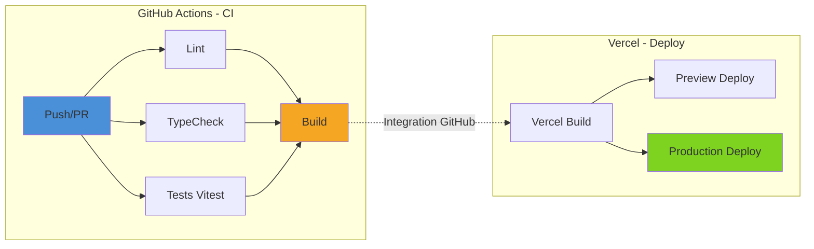
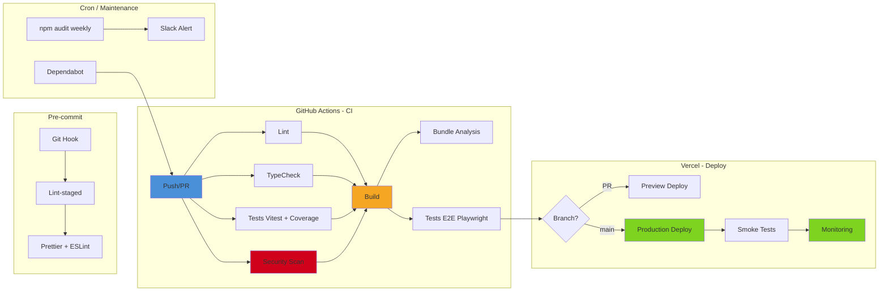
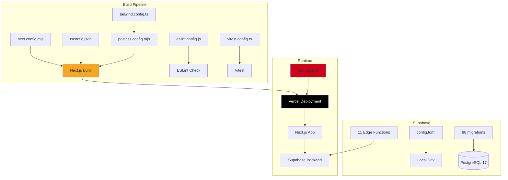

# Audit #7 - Configuration, CI/CD et DevOps

**Date** : 10 Février 2026
**Branche auditée** : `design_ux_ui`
**Projet** : GMBS-CRM

---

## Table des matières

1. [Synthese globale](#1-synthese-globale)
2. [Configuration Next.js](#2-configuration-nextjs)
3. [TypeScript](#3-typescript)
4. [ESLint & Formatting](#4-eslint--formatting)
5. [Tailwind CSS](#5-tailwind-css)
6. [Package.json & Dependances](#6-packagejson--dependances)
7. [CI/CD (GitHub Actions)](#7-cicd-github-actions)
8. [Supabase Config](#8-supabase-config)
9. [Vitest Config](#9-vitest-config)
10. [Git & Branch Strategy](#10-git--branch-strategy)
11. [Deploiement (Vercel)](#11-deploiement-vercel)
12. [Securite des secrets](#12-securite-des-secrets)
13. [Diagrammes Mermaid](#13-diagrammes-mermaid)
14. [Plan de correction prioritise](#14-plan-de-correction-prioritise)

---

## 1. Synthese globale

### Tableau de sante des configurations

| Domaine | Fichier(s) | Etat | Severite |
|---------|-----------|------|----------|
| Next.js config | `next.config.mjs` | WARNING | Moyenne |
| TypeScript | `tsconfig.json` | OK | - |
| ESLint | `eslint.config.js` | WARNING | Basse |
| Tailwind | `tailwind.config.ts` | OK | - |
| PostCSS | `postcss.config.mjs` | OK | - |
| Package.json | `package.json` | CRITIQUE | Haute |
| CI/CD | `.github/workflows/ci.yml` | WARNING | Moyenne |
| Supabase | `supabase/config.toml` | WARNING | Moyenne |
| Vitest | `vitest.config.ts` | OK | - |
| Git / .gitignore | `.gitignore` | OK | - |
| Vercel | `vercel.json` | WARNING | Basse |
| Secrets / .env | `.env`, `.env.local`, etc. | CRITIQUE | Haute |
| Middleware Next.js | (absent) | WARNING | Moyenne |
| Prettier | (absent) | WARNING | Basse |
| Git Hooks (pre-commit) | (absent) | WARNING | Moyenne |
| Dockerfile | (absent) | INFO | Basse |

**Score global** : **5/10** - Des problemes critiques dans les dependances et la gestion des secrets necessitent une attention immediate.

---

## 2. Configuration Next.js

**Fichier** : `next.config.mjs`

### Points positifs
- `styledComponents: true` active pour le SSR des styled-components
- `removeConsole` en production (garde `error` et `warn`)
- Configuration `images.remotePatterns` correcte pour Supabase storage
- Watch options optimisees pour le dev (exclusion des dossiers inutiles)
- Headers de cache pour fichiers GLB/GLTF (immutable, 1 an)

### Problemes trouves

| # | Probleme | Severite | Detail |
|---|---------|----------|--------|
| N1 | **Pas de headers de securite** | WARNING | Aucun header CSP, X-Frame-Options, X-Content-Type-Options, Referrer-Policy, Permissions-Policy configure |
| N2 | **Pas de middleware** | WARNING | Aucun fichier `middleware.ts` pour gerer l'authentification au niveau route. La protection se fait cote client uniquement (AuthGuard) |
| N3 | **IP en dur dans allowedDevOrigins** | INFO | `192.168.1.164` code en dur - devrait etre configurable via env |
| N4 | **Pas de rewrites/redirects** | INFO | Aucune redirection configuree (ex: www vers non-www, ancien URLs) |
| N5 | **Webpack custom pour GLB** | INFO | Pourrait utiliser `turbopack` en mode dev pour de meilleures performances |
| N6 | **Toutes les pages sont "use client"** | WARNING | 18/18 pages utilisent `"use client"` - aucun Server Component pour les pages. Perte du SSR/SSG de Next.js 15 |

### Server Components vs Client Components

```
Pages analysees : 18
Pages "use client" : 18 (100%)
Server Components pages : 0 (0%)
```

**Verdict** : Le projet n'exploite pas du tout les Server Components de Next.js 15. Le layout racine est bien un Server Component (utilise `cookies()` de `next/headers`), mais toutes les pages sont des Client Components. Cela signifie :
- Aucun data fetching cote serveur
- Bundle JavaScript plus lourd envoye au client
- Pas de streaming SSR
- SEO limite (rendu client uniquement)

---

## 3. TypeScript

**Fichier** : `tsconfig.json`

### Configuration actuelle

```json
{
  "compilerOptions": {
    "target": "ES2017",
    "lib": ["dom", "dom.iterable", "ES2017"],
    "strict": true,
    "module": "esnext",
    "moduleResolution": "bundler",
    "jsx": "preserve",
    "incremental": true,
    "downlevelIteration": true,
    "paths": { "@/*": ["./src/*"] }
  }
}
```

### Points positifs
- `strict: true` active
- `moduleResolution: "bundler"` (correct pour Next.js 15)
- Alias `@/*` configure
- `incremental: true` pour des builds plus rapides
- Plugin `next` configure

### Problemes trouves

| # | Probleme | Severite | Detail |
|---|---------|----------|--------|
| T1 | **target ES2017 bas** | INFO | Le projet cible Node 20+, pourrait utiliser `ES2022` pour de meilleures performances. Cependant, Next.js gere le transpile donc pas critique |
| T2 | **lib ES2017 limite** | INFO | Manque de features ES2020+ (BigInt, Promise.allSettled, etc.) - recommande `ES2022` |
| T3 | **`downlevelIteration` active** | INFO | Necessaire seulement si target < ES2015 pour les iterateurs. Avec target ES2017, c'est redondant pour la plupart des cas |
| T4 | **Options strictes avancees manquantes** | WARNING | `noUncheckedIndexedAccess`, `noUnusedLocals`, `noUnusedParameters` non actives |

### Recommandations

```json
{
  "compilerOptions": {
    "target": "ES2022",
    "lib": ["dom", "dom.iterable", "ES2022"],
    "noUncheckedIndexedAccess": true,
    "noUnusedLocals": true,
    "noUnusedParameters": true
  }
}
```

---

## 4. ESLint & Formatting

**Fichier** : `eslint.config.js` (flat config)

### Points positifs
- Utilisation du format flat config (modern ESLint)
- Extension `next/core-web-vitals` (recommande par Next.js)
- Regle `no-restricted-imports` pour forcer l'alias `@/`
- Ignores corrects (node_modules, .next, dist, etc.)
- Override pour scripts/tests qui desactive les restrictions d'import

### Problemes trouves

| # | Probleme | Severite | Detail |
|---|---------|----------|--------|
| E1 | **Pas de Prettier** | WARNING | Aucune config Prettier trouvee - pas de formatage automatique du code. Risque d'inconsistances de style |
| E2 | **Pas de plugin TypeScript ESLint** | WARNING | `@typescript-eslint` non configure - les regles TS avancees ne sont pas verifiees |
| E3 | **Pas de plugin import** | INFO | `eslint-plugin-import` non configure pour verifier l'ordre des imports |
| E4 | **Pas de regles d'accessibilite** | INFO | `eslint-plugin-jsx-a11y` non configure explicitement (inclus via `next/core-web-vitals` partiellement) |

---

## 5. Tailwind CSS

**Fichier** : `tailwind.config.ts`

### Points positifs
- `darkMode: "class"` configure (switch manuel)
- Content paths corrects (`app/`, `src/`, `components/`)
- Design system complet via CSS variables (`hsl(var(--...))`)
- Couleurs de statut metier definies (demanded, quote, accepted, etc.)
- Couleurs podium (gold, silver, bronze, cold)
- Animations custom (accordion, caret-blink, etc.)
- Plugin `tailwindcss-animate` pour les animations
- Systeme de shadows "Liquid Glass" custom

### Problemes trouves

| # | Probleme | Severite | Detail |
|---|---------|----------|--------|
| TW1 | **Tailwind v3 et non v4** | INFO | Le projet utilise Tailwind v3.4.17 alors que v4 est sorti. Migration non urgente mais a planifier |
| TW2 | **Pas de purge explicite** | INFO | La purge est implicite via `content`, mais aucune safeList n'est definie |
| TW3 | **Mix tabs/spaces dans l'indentation** | INFO | Le fichier utilise des tabs pour l'indentation extend, inconsistant avec le reste du projet |

---

## 6. Package.json & Dependances

### Informations generales

- **Nom** : gmbs-crm v0.1.0
- **Engine** : Node 20.x || 22.x
- **Dependencies** : 94 packages
- **DevDependencies** : 16 packages
- **node_modules** : 1.4 GB
- **Packages extraneous** : 138 (probablement de Vercel CLI installe globalement)

### CRITIQUE - 19 dependances en "latest"

Les dependances suivantes utilisent `"latest"` comme version, ce qui rend les builds non reproductibles :

```
@radix-ui/react-avatar: "latest"
@radix-ui/react-checkbox: "latest"
@radix-ui/react-dialog: "latest"
@radix-ui/react-dropdown-menu: "latest"
@radix-ui/react-label: "latest"
@radix-ui/react-popover: "latest"
@radix-ui/react-radio-group: "latest"
@radix-ui/react-select: "latest"
@radix-ui/react-separator: "latest"
@radix-ui/react-slot: "latest"
@radix-ui/react-switch: "latest"
@radix-ui/react-tabs: "latest"
@radix-ui/react-toast: "latest"
@radix-ui/react-tooltip: "latest"
@tanstack/react-table: "latest"
date-fns: "latest"
next-themes: "latest"
react-day-picker: "latest"
recharts: "latest"
```

**Risque** : Un `npm install` sans lock file peut casser le build a tout moment si une de ces librairies publie un breaking change.

### Dependances potentiellement inutilisees

| Package | En dep | Utilise dans src/ | Verdict |
|---------|--------|-------------------|---------|
| `@prisma/client` | Oui | 1 fichier (`prisma.ts`) | WARNING - Prisma setup mais pas de schema, pas utilise en pratique. Le projet utilise Supabase |
| `reactflow` | Oui | 0 fichiers dans src/ | CRITIQUE - Jamais importe, 800+ KB inutile |
| `dagre` | Oui | 0 fichiers dans src/ | CRITIQUE - Jamais importe, dep de reactflow unused |
| `ogl` | Oui | 0 fichiers dans src/ | WARNING - Jamais importe dans src/ |
| `react-grab` | Oui | 0 fichiers dans src/ | WARNING - Commente dans layout.tsx |
| `highlight.js` | Oui | 0 fichiers dans src/ | WARNING - Utilise via rehype-highlight, import indirect |
| `remark-footnotes` | Oui | 0 fichiers dans src/ | WARNING - Jamais importe |
| `googleapis` | Oui | 0 fichiers dans src/ | INFO - Utilise dans scripts/, pas dans l'app |
| `google-auth-library` | Oui | 0 fichiers dans src/ | INFO - Utilise dans scripts/ |
| `google-spreadsheet` | Oui | 0 fichiers dans src/ | INFO - Utilise dans scripts/ |
| `@paper-design/shaders-react` | Oui | 0 fichiers dans src/ | WARNING - Jamais importe |
| `camelcase-css` | Oui | 0 fichiers dans src/ | INFO - Dep interne de styled-components |

### Dependances lourdes (impact bundle)

| Package | Taille estimee | Justification |
|---------|---------------|--------------|
| `googleapis` | ~80 MB (node_modules) | Scripts uniquement, ne devrait pas etre en dependencies |
| `framer-motion` | ~150 KB gzipped | Utilise pour animations |
| `recharts` | ~120 KB gzipped | Charts du dashboard |
| `maplibre-gl` | ~200 KB gzipped | Cartes interactives |
| `@prisma/client` | ~8 MB (node_modules) | Non utilise en pratique |
| `styled-components` | ~30 KB gzipped | 2 fichiers seulement, pourrait etre remplace par Tailwind |
| `exceljs` | ~50 KB gzipped | Export Excel |
| `openai` | ~20 KB gzipped | Integration IA |

### Dependances a deplacer de dependencies vers devDependencies

| Package | Raison |
|---------|--------|
| `@types/nodemailer` | Type definition - devDependency |
| `@types/styled-components` | Type definition - devDependency |
| `autoprefixer` | Build-time only |
| `dotenv` | Deja gere par Next.js, potentiellement inutile |

### Dependances a deplacer vers optionalDependencies ou scripts separees

| Package | Raison |
|---------|--------|
| `googleapis` | Utilise uniquement par les scripts d'import |
| `google-auth-library` | Idem |
| `google-spreadsheet` | Idem |
| `exceljs` | Scripts d'export uniquement |
| `papaparse` | Scripts CSV |
| `nodemailer` | Edge functions / scripts |

### Problemes de versioning

| # | Probleme | Severite | Detail |
|---|---------|----------|--------|
| P1 | **19 deps en "latest"** | CRITIQUE | Builds non reproductibles |
| P2 | **@hookform/resolvers outdated** | WARNING | Current 3.10.0, Latest 5.2.2 (major bump) |
| P3 | **@prisma/client sans schema** | WARNING | Dep installee mais pas de `prisma/schema.prisma` |
| P4 | **138 packages extraneous** | INFO | Probablement Vercel CLI global, pas d'impact direct |
| P5 | **react 18 avec @types/react 19** | WARNING | Mismatch de version entre React et ses types |
| P6 | **--legacy-peer-deps requis** | WARNING | Indique des conflits de peer dependencies non resolus |
| P7 | **styled-components + Tailwind** | INFO | Double systeme de styling, inconsistance |

---

## 7. CI/CD (GitHub Actions)

**Fichier** : `.github/workflows/ci.yml`

### Pipeline actuel

4 jobs sequentiels/paralleles :

1. **Lint** (parallele) - `npm run lint`
2. **Type Check** (parallele) - `npm run typecheck`
3. **Tests** (parallele) - `npm run test` (Vitest)
4. **Build** (apres 1+2+3) - `npm run build`

### Points positifs
- Jobs Lint/TypeCheck/Test en parallele
- Build depend des 3 jobs precedents (gate correcte)
- Cache npm active via `actions/setup-node`
- Node version centralisee en env variable
- Secrets Supabase injectes correctement pour le build

### Problemes trouves

| # | Probleme | Severite | Detail |
|---|---------|----------|--------|
| CI1 | **Pas de deploiement automatise** | WARNING | Le workflow ne deploie pas. Le deploiement est delegue a Vercel (integration GitHub) |
| CI2 | **Pas de cache des deps** | INFO | `actions/setup-node` avec `cache: 'npm'` est configure, mais pas de cache granulaire |
| CI3 | **Pas de tests E2E** | WARNING | Playwright est installe mais pas execute dans la CI |
| CI4 | **Pas de coverage report** | WARNING | Les tests ne generent pas de rapport de couverture dans la CI |
| CI5 | **Pas de security scan** | WARNING | Aucun scan de vulnerabilites (npm audit, Snyk, Dependabot) |
| CI6 | **Pas de check de taille de bundle** | INFO | `@next/bundle-analyzer` est en devDep mais pas utilise dans la CI |
| CI7 | **--legacy-peer-deps en CI** | WARNING | Masque des conflits de deps qui devraient etre resolus |
| CI8 | **Branches fix_* declenchent la CI** | INFO | Pattern `fix_*` accepte les pushs mais pas les PRs - inconsistant |
| CI9 | **Pas de matrix strategy** | INFO | Test sur un seul Node version (20) alors que engines accepte 20.x et 22.x |
| CI10 | **Pas de workflow de preview** | INFO | Pas de deploiement preview pour les PRs (gere par Vercel directement) |

---

## 8. Supabase Config

**Fichier** : `supabase/config.toml`

### Points positifs
- `max_rows = 50000` documente et justifie (6K interventions, approche "load-all")
- PostgreSQL 17 (derniere version majeure)
- Realtime active
- Analytics activees (backend postgres)
- Edge runtime Deno 2
- Seeds configures de maniere ordonnee
- Auth bien configuree (redirect URLs, JWT expiry 3600s)

### Problemes trouves

| # | Probleme | Severite | Detail |
|---|---------|----------|--------|
| S1 | **TLS desactive localement** | INFO | `api.tls.enabled = false` - normal en dev local |
| S2 | **Pooler desactive** | WARNING | `db.pooler.enabled = false` - en production, un pooler est recommande |
| S3 | **`minimum_password_length = 6`** | WARNING | Trop faible. Recommandation : minimum 8, idealement 12 |
| S4 | **`password_requirements = ""`** | WARNING | Aucune exigence de complexite. Recommande : `lower_upper_letters_digits` |
| S5 | **`enable_signup = true`** | WARNING | Inscription ouverte - a verifier si c'est voulu en production |
| S6 | **`enable_confirmations = false`** | WARNING | Les emails de confirmation sont desactives - risque de comptes spam |
| S7 | **`secure_password_change = false`** | WARNING | Changement de mot de passe sans re-authentification |
| S8 | **`max_frequency = "1s"` pour emails** | INFO | Tres permissif, risque de spam de reset password |
| S9 | **URLs de production dans config locale** | INFO | Les URLs Vercel sont dans la config locale - devrait etre en variables d'env |
| S10 | **80 migrations** | INFO | Nombre eleve mais gerable. Certaines sont des "fix" sequentiels (00072-00078 pour artisan status) |

### Migrations

```
Total : 80 fichiers de migration (00001 a 00080)
Sujets couverts :
- Schema initial et vues IA
- Systeme de documents et storage
- Index et triggers
- RLS policies
- Fonctions dashboard
- Systeme d'audit
- Permissions utilisateur
- Systeme de cron (podium, inactive users)
- Historique des statuts artisan
```

### Edge Functions deployees

| Fonction | Description |
|---------|------------|
| `artisans` | CRUD artisans (legacy) |
| `artisans-v2` | CRUD artisans v2 |
| `check-inactive-users` | Cron check inactivite |
| `comments` | Gestion commentaires |
| `documents` | Gestion documents |
| `interventions-v2` | CRUD interventions |
| `interventions-v2-admin-dashboard-stats` | Stats admin dashboard |
| `process-avatar` | Traitement avatars |
| `pull` | Sync pull |
| `push` | Notifications push |
| `users` | Gestion utilisateurs |

---

## 9. Vitest Config

**Fichier** : `vitest.config.ts`

### Points positifs
- Environment `jsdom` (correct pour tests React)
- Globals actives (`describe`, `it`, `expect` sans import)
- Coverage provider `v8` avec reporters `text`, `html`, `lcov`
- Exclusion correcte des tests E2E et visuels
- Alias `@/` configure
- Setup file configure (`tests/setup.ts`)

### Problemes trouves

| # | Probleme | Severite | Detail |
|---|---------|----------|--------|
| V1 | **Seuils de coverage a 30%** | WARNING | Seuils tres bas (30% statements/branches/functions/lines). Le CLAUDE.md demande 60-100% selon les modules |
| V2 | **Pas de test timeout configure** | INFO | Pas de `testTimeout` defini, utilise le defaut (5s) |

---

## 10. Git & Branch Strategy

### .gitignore

**Etat** : OK - Bien configure

Points positifs :
- `.env*` correctement ignore
- Fichiers de credentials (`.json`, `.pem`, `.key`) ignores
- `node_modules`, `.next`, build artifacts ignores
- `.DS_Store`, `.vscode/` ignores
- Donnees sensibles (`/data`, `*.csv`) ignorees
- Coverage ignore

### Branches

```
Total branches locales : ~50
Total branches remote : ~60+
Branche principale : main
Branche actuelle : design_ux_ui
```

### Problemes trouves

| # | Probleme | Severite | Detail |
|---|---------|----------|--------|
| G1 | **Pas de git hooks** | WARNING | Aucun pre-commit hook configure (ni Husky, ni lint-staged). Le code peut etre commit sans lint ni format |
| G2 | **Pas de branch protection** | INFO | Non verifiable localement, mais a configurer sur GitHub |
| G3 | **Trop de branches** | WARNING | 50+ branches locales, beaucoup semblent obsoletes. Nettoyage recommande |
| G4 | **Convention de nommage inconsistante** | WARNING | Mix de conventions : `feat_104_139`, `feat/doc/merg`, `feature/pop_up_intervention_`, `001-context-menus-duplication`, `cursor/...`, `opti/...` |
| G5 | **Caracteres speciaux dans les noms** | INFO | Branche `remotes/origin/feature/refreshA-background-Acolor` et `remotes/origin/efeature/pop_up_intervention` contiennent des problemes d'encodage |
| G6 | **Pas de .env.example** | WARNING | Aucun fichier `.env.example` pour documenter les variables d'environnement requises |

---

## 11. Deploiement (Vercel)

**Fichier** : `vercel.json`

### Configuration actuelle

```json
{
  "git": { "deploymentEnabled": true },
  "build": {
    "env": { "NPM_FLAGS": "--legacy-peer-deps" }
  }
}
```

### Problemes trouves

| # | Probleme | Severite | Detail |
|---|---------|----------|--------|
| V1 | **`--legacy-peer-deps` en build** | WARNING | Masque les conflits de peer deps. Les deps devraient etre resolues proprement |
| V2 | **Pas de configuration de regions** | INFO | Pas de region specifiee pour les Serverless Functions |
| V3 | **Pas de rewrites/redirects** | INFO | Pas de configuration de routing avance |
| V4 | **Pas de headers de securite** | WARNING | Aucun header de securite configure cote Vercel |

---

## 12. Securite des secrets

### Fichiers .env presents localement

| Fichier | Tracke par git | Contenu |
|---------|---------------|---------|
| `.env` | Non | Secrets de production (Supabase keys, API keys) |
| `.env.local` | Non | Configuration locale |
| `.env.production` | Non | Config production |
| `.env.vercel.local` | Non | Config Vercel locale |

### CRITIQUE - Secrets dans .env

Le fichier `.env` contient des **secrets de production en clair** :
- `SUPABASE_SERVICE_ROLE_KEY` (cle admin Supabase)
- `NEXT_PUBLIC_SUPABASE_ANON_KEY` (cle publique)
- `MAPTILER_API_KEY`
- `OPENCAGE_API_KEY`
- `INSEE_API_KEY`

**Bien que le fichier ne soit pas tracke par git**, il est present sur le disque sans chiffrement. Si jamais il est accidentellement commit, toutes les cles seraient exposees.

### Problemes trouves

| # | Probleme | Severite | Detail |
|---|---------|----------|--------|
| SEC1 | **Pas de .env.example** | CRITIQUE | Pas de template documentant les variables requises sans valeurs secretes |
| SEC2 | **Service Role Key en local** | WARNING | La cle `SUPABASE_SERVICE_ROLE_KEY` est en local - devrait etre uniquement en CI/CD secrets |
| SEC3 | **API keys en clair** | WARNING | MapTiler, OpenCage, INSEE keys en clair dans .env |
| SEC4 | **NEXT_PUBLIC_SITE_URL placeholder** | INFO | `https://your-domain.com` - placeholder non remplace |

---

## 13. Diagrammes Mermaid

### Pipeline CI/CD actuel



### Pipeline CI/CD recommande



### Architecture de configuration



---

## 14. Plan de correction prioritise

### P0 - CRITIQUE (a faire immediatement)

| # | Action | Impact | Effort |
|---|--------|--------|--------|
| 1 | **Fixer les 19 deps "latest"** : Remplacer par des versions semver exactes (`^x.y.z`) | Builds reproductibles | 30 min |
| 2 | **Creer un .env.example** : Documenter toutes les variables requises sans valeurs secretes | Onboarding, securite | 1h |
| 3 | **Supprimer les deps inutilisees** : `reactflow`, `dagre`, `@prisma/client`, `ogl`, `react-grab`, `@paper-design/shaders-react` | -50+ MB en node_modules, bundle plus leger | 30 min |
| 4 | **Resoudre les conflits de peer deps** : Eliminer le besoin de `--legacy-peer-deps` | Stabilite | 2-4h |

### P1 - HAUTE (cette semaine)

| # | Action | Impact | Effort |
|---|--------|--------|--------|
| 5 | **Ajouter des headers de securite** dans `next.config.mjs` : CSP, X-Frame-Options, HSTS, etc. | Securite | 2h |
| 6 | **Creer un middleware.ts** pour l'authentification cote serveur | Securite routes | 4h |
| 7 | **Configurer Husky + lint-staged** pour pre-commit hooks | Qualite code | 1h |
| 8 | **Ajouter un scan de securite en CI** : `npm audit` ou Dependabot | Vulnerabilites | 1h |
| 9 | **Augmenter les seuils de coverage** : 30% -> 60% progressivement | Qualite tests | 30 min config |
| 10 | **Renforcer la config auth Supabase** : `minimum_password_length: 8`, `password_requirements: "lower_upper_letters_digits"` | Securite | 30 min |

### P2 - MOYENNE (ce mois)

| # | Action | Impact | Effort |
|---|--------|--------|--------|
| 11 | **Deplacer les deps de scripts** vers un workspace separe ou `optionalDependencies` | Bundle plus leger | 2h |
| 12 | **Deplacer les @types en devDependencies** | Correction semantique | 15 min |
| 13 | **Ajouter tests E2E dans la CI** (Playwright) | Couverture E2E | 4h |
| 14 | **Ajouter coverage report dans la CI** | Visibilite qualite | 1h |
| 15 | **Configurer Prettier** | Formatage consistant | 1h |
| 16 | **Ajouter `@typescript-eslint`** pour des regles TS avancees | Qualite code | 2h |
| 17 | **Nettoyer les branches git** : supprimer les 40+ branches obsoletes | Proprete repo | 1h |

### P3 - BASSE (ce trimestre)

| # | Action | Impact | Effort |
|---|--------|--------|--------|
| 18 | **Migrer des pages vers Server Components** | Performance, SEO | Variable |
| 19 | **Ajouter matrix strategy** en CI pour Node 20 + 22 | Compatibilite | 30 min |
| 20 | **Bundle analysis dans la CI** | Monitoring taille | 2h |
| 21 | **Standardiser la convention de branches** | Lisibilite | Convention + docs |
| 22 | **Evaluer la migration Tailwind v4** | Future-proofing | Variable |
| 23 | **Remplacer styled-components par Tailwind** (2 fichiers) | Elimination dep | 2h |

---

## Annexe : Commandes utiles pour les corrections

```bash
# Fixer les deps "latest" (exemple pour quelques-unes)
npm install @radix-ui/react-dialog@^1.1.0 @radix-ui/react-tooltip@^1.1.0 --save-exact
npm install date-fns@^4.0.0 recharts@^2.15.0 --save-exact

# Supprimer les deps inutilisees
npm uninstall reactflow dagre @prisma/client ogl react-grab @paper-design/shaders-react remark-footnotes

# Deplacer les @types
npm uninstall @types/nodemailer @types/styled-components
npm install -D @types/nodemailer @types/styled-components

# Installer Husky + lint-staged
npx husky-init && npm install
npm install -D lint-staged

# Creer .env.example
cp .env .env.example
# Puis remplacer toutes les valeurs par des placeholders
```
