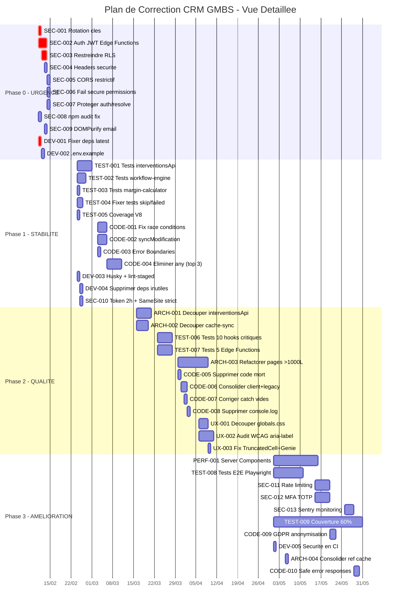
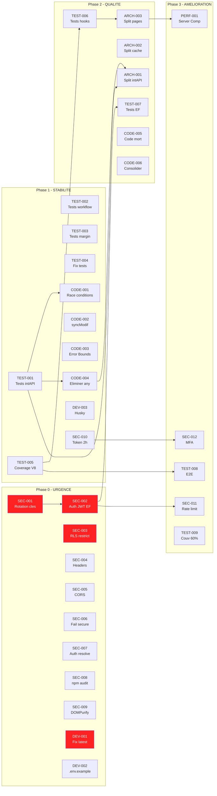

# Plan de Correction - CRM GMBS

**Date** : 10 fevrier 2026
**Basee sur** : Audit complet (7 rapports, 294 problemes identifies)
**Duree estimee** : 12-16 semaines
**Effort total** : 68-95 jours-homme

---

## Table des matieres

1. [Phase 0 - URGENCE (Semaines 1-2)](#phase-0---urgence-semaines-1-2)
2. [Phase 1 - HAUTE PRIORITE (Semaines 3-6)](#phase-1---haute-priorite-semaines-3-6)
3. [Phase 2 - MOYENNE PRIORITE (Semaines 7-12)](#phase-2---moyenne-priorite-semaines-7-12)
4. [Phase 3 - AMELIORATION CONTINUE (Mois 4+)](#phase-3---amelioration-continue-mois-4)
5. [Roadmap Gantt](#roadmap-gantt)
6. [Matrice de dependances](#matrice-de-dependances)

---

## Phase 0 - URGENCE (Semaines 1-2) - Securite critique

**Objectif** : Eliminer les risques de compromission systeme. Aucun nouveau developpement ne doit etre fait avant la completion de cette phase.

**Effort total Phase 0** : 8-10 jours-homme

---

### SEC-001 : Rotation immediate de toutes les cles exposees

| Attribut | Detail |
|----------|--------|
| **Description** | Regenerer toutes les cles API et credentials exposes dans les fichiers .env et credentials.json. Les cles actuelles doivent etre considerees comme compromises. |
| **Fichiers impactes** | `.env`, `.env.local`, `.env.production`, `.env.vercel.local`, `supabase/functions/credentials.json` |
| **Effort estime** | 0.5 jour |
| **Dependances** | Aucune - A FAIRE EN PREMIER |
| **Risque si non fait** | Compromission de tous les services externes : Google Cloud, Stripe (paiements LIVE), OpenAI, Supabase (acces DB total), Vercel |
| **Critere d'acceptation** | Toutes les cles sont regenerees, les anciennes revoquees, les nouvelles configurees dans Vercel Environment Variables et Supabase Secrets. Le fichier `credentials.json` est supprime du disque. |

**Actions detaillees** :
1. Regenerer la cle Google Service Account sur Google Cloud Console
2. Regenerer STRIPE_SECRET_KEY (live) dans le dashboard Stripe
3. Regenerer OPENAI_API_KEY dans le dashboard OpenAI
4. Regenerer SUPABASE_SERVICE_ROLE_KEY dans le dashboard Supabase
5. Regenerer EMAIL_PASSWORD_ENCRYPTION_KEY et IV
6. Supprimer `supabase/functions/credentials.json` du disque
7. Stocker toutes les cles dans Vercel Environment Variables et Supabase Secrets
8. Ajouter une verification pre-commit (git-secrets ou trufflehog)

---

### SEC-002 : Authentification JWT sur toutes les Edge Functions

| Attribut | Detail |
|----------|--------|
| **Description** | Ajouter la verification du token JWT Bearer sur les 9 Edge Functions non protegees. Chaque requete doit etre authentifiee via `supabase.auth.getUser(token)` avant tout traitement. |
| **Fichiers impactes** | `supabase/functions/artisans/index.ts`, `supabase/functions/artisans-v2/index.ts`, `supabase/functions/comments/index.ts`, `supabase/functions/documents/index.ts`, `supabase/functions/users/index.ts`, `supabase/functions/process-avatar/index.ts`, `supabase/functions/interventions-v2-admin-dashboard-stats/index.ts`, `supabase/functions/push/index.ts`, `supabase/functions/pull/index.ts` |
| **Effort estime** | 2-3 jours |
| **Dependances** | SEC-001 (cles regenerees) |
| **Risque si non fait** | Acces non authentifie a TOUTES les donnees du CRM pour quiconque connait l'URL |
| **Critere d'acceptation** | Chaque Edge Function retourne 401 si le token est absent ou invalide. Tests manuels confirment le blocage. |

---

### SEC-003 : Restreindre les policies RLS (supprimer USING(true))

| Attribut | Detail |
|----------|--------|
| **Description** | Remplacer les policies RLS `USING(true)` sur les tables `users` et `interventions` par des regles restrictives basees sur le role et le perimetre de l'utilisateur. |
| **Fichiers impactes** | `supabase/migrations/` (nouvelle migration), indirectement `supabase/migrations/00041_rls_core_tables.sql` |
| **Effort estime** | 1-2 jours |
| **Dependances** | Aucune |
| **Risque si non fait** | Tout utilisateur authentifie peut lire les donnees de tous les autres utilisateurs et de toutes les agences |
| **Critere d'acceptation** | Un gestionnaire ne peut voir que ses propres interventions et celles de son agence. Un admin voit tout. Tests SQL confirment les restrictions. |

---

### SEC-004 : Ajouter les headers de securite HTTP

| Attribut | Detail |
|----------|--------|
| **Description** | Configurer les 7 headers de securite manquants dans `next.config.mjs` : Content-Security-Policy, Strict-Transport-Security, X-Frame-Options, X-Content-Type-Options, Referrer-Policy, Permissions-Policy, X-XSS-Protection. |
| **Fichiers impactes** | `next.config.mjs` |
| **Effort estime** | 0.5 jour |
| **Dependances** | Aucune |
| **Risque si non fait** | Vulnerable au clickjacking, XSS, downgrade HTTPS, MIME sniffing |
| **Critere d'acceptation** | Les 7 headers sont presents dans les reponses HTTP. Verification via `curl -I` ou securityheaders.com |

---

### SEC-005 : Corriger le CORS wildcard sur les Edge Functions

| Attribut | Detail |
|----------|--------|
| **Description** | Remplacer `Access-Control-Allow-Origin: '*'` par une liste blanche d'origines autorisees (domaine de production + domaine preview Vercel). |
| **Fichiers impactes** | `supabase/functions/artisans/index.ts`, `supabase/functions/artisans-v2/index.ts`, `supabase/functions/comments/index.ts`, `supabase/functions/documents/index.ts`, `supabase/functions/users/index.ts`, `supabase/functions/interventions-v2/index.ts`, `supabase/functions/process-avatar/index.ts`, `supabase/functions/interventions-v2-admin-dashboard-stats/index.ts` |
| **Effort estime** | 0.5 jour |
| **Dependances** | Aucune |
| **Risque si non fait** | N'importe quel site web peut faire des requetes cross-origin vers les APIs |
| **Critere d'acceptation** | Les requetes cross-origin sont rejetees sauf depuis les domaines autorises. |

---

### SEC-006 : Fail secure sur les permissions (supprimer fallback silencieux)

| Attribut | Detail |
|----------|--------|
| **Description** | Modifier le fallback de permissions pour refuser l'acces si la fonction RPC `get_user_permissions` echoue, au lieu de revenir silencieusement aux permissions par defaut du role. |
| **Fichiers impactes** | `src/lib/api/permissions.ts:172-196` |
| **Effort estime** | 0.25 jour |
| **Dependances** | Aucune |
| **Risque si non fait** | Un attaquant provoquant une erreur RPC obtient les permissions par defaut du role |
| **Critere d'acceptation** | En cas d'erreur RPC, l'acces est refuse (permissions vides). Un log d'erreur est emis. |

---

### SEC-007 : Proteger la route d'enumeration d'utilisateurs

| Attribut | Detail |
|----------|--------|
| **Description** | Ajouter une authentification et un rate limiting sur `/api/auth/resolve` qui permet actuellement a quiconque de resoudre un username en email. |
| **Fichiers impactes** | `app/api/auth/resolve/route.ts` |
| **Effort estime** | 0.25 jour |
| **Dependances** | Aucune |
| **Risque si non fait** | Enumeration complete de tous les utilisateurs du systeme |
| **Critere d'acceptation** | La route necessite une authentification. Les reponses ne revelent pas si l'utilisateur existe. Rate limit de 5 req/min par IP. |

---

### SEC-008 : Executer npm audit fix et corriger les 38 vulnerabilites

| Attribut | Detail |
|----------|--------|
| **Description** | Executer `npm audit fix` pour corriger les 38 vulnerabilites npm connues (1 low, 3 moderate, 34 high). Mettre a jour `next` vers la derniere version patchee. |
| **Fichiers impactes** | `package.json`, `package-lock.json` |
| **Effort estime** | 0.5 jour |
| **Dependances** | Aucune |
| **Risque si non fait** | 4 CVEs dans Next.js (dont Source Code Exposure), DoS via fast-xml-parser, Arbitrary File Overwrite via tar |
| **Critere d'acceptation** | `npm audit` retourne 0 vulnerabilites critiques et hautes. |

---

### DEV-001 : Fixer les 19 dependances en "latest"

| Attribut | Detail |
|----------|--------|
| **Description** | Remplacer les 19 dependances utilisant `"latest"` comme version par des versions semver pinned (`^x.y.z`). Les packages Radix UI, TanStack Table, date-fns, recharts, et autres doivent avoir des versions explicites. |
| **Fichiers impactes** | `package.json` |
| **Effort estime** | 0.5 jour |
| **Dependances** | Aucune |
| **Risque si non fait** | Un `npm install` sans lock file peut casser le build a tout moment |
| **Critere d'acceptation** | Aucune dependance n'utilise "latest". `npm install` avec un lockfile propre fonctionne. |

---

### DEV-002 : Creer un fichier .env.example

| Attribut | Detail |
|----------|--------|
| **Description** | Creer un fichier `.env.example` documentant toutes les variables d'environnement requises sans valeurs secretes, avec des placeholders explicatifs. |
| **Fichiers impactes** | `.env.example` (nouveau fichier) |
| **Effort estime** | 0.25 jour |
| **Dependances** | Aucune |
| **Risque si non fait** | Onboarding difficile pour les nouveaux developpeurs, risque de commit accidentel de secrets |
| **Critere d'acceptation** | Le fichier .env.example contient toutes les variables necessaires avec des placeholders. Il est commit dans le repo. |

---

### SEC-009 : Installer DOMPurify pour les previews email (XSS)

| Attribut | Detail |
|----------|--------|
| **Description** | Installer et configurer DOMPurify pour sanitiser le HTML avant injection via `dangerouslySetInnerHTML` dans le preview email. |
| **Fichiers impactes** | `src/components/interventions/EmailEditModal.tsx:489` |
| **Effort estime** | 0.25 jour |
| **Dependances** | Aucune |
| **Risque si non fait** | XSS via injection de JavaScript dans les templates email |
| **Critere d'acceptation** | Le HTML est sanitise via DOMPurify avant rendu. Les scripts injectes sont supprimes. |

---

## Phase 1 - HAUTE PRIORITE (Semaines 3-6) - Stabilite

**Objectif** : Couvrir les modules critiques par des tests, corriger les race conditions, stabiliser le workflow metier.

**Effort total Phase 1** : 15-20 jours-homme

---

### TEST-001 : Tests unitaires pour interventionsApi.ts (methodes critiques)

| Attribut | Detail |
|----------|--------|
| **Description** | Ecrire des tests unitaires pour les methodes critiques de interventionsApi : CRUD (getAll, create, update, delete), transitions de statut (updateStatus), calculs financiers (calculateMarginForIntervention), gestion des couts (upsertCost, upsertCostsBatch). Minimum 30 tests. |
| **Fichiers impactes** | `tests/unit/lib/api/interventionsApi.test.ts` (nouveau) |
| **Effort estime** | 5 jours |
| **Dependances** | Aucune |
| **Risque si non fait** | Toute modification de l'API principale peut casser le CRM sans detection |
| **Critere d'acceptation** | 30+ tests passent. CRUD, transitions, calculs financiers couverts. Couverture > 60% de interventionsApi.ts. |

---

### TEST-002 : Tests workflow-engine.ts - 100% couverture

| Attribut | Detail |
|----------|--------|
| **Description** | Ecrire des tests exhaustifs pour le moteur de workflow : `validateTransition()` (tous les cas valides et invalides), `findAvailableTransitions()` (avec/sans conditions), `collectMissingRequirements()`, `evaluateConditions()`. |
| **Fichiers impactes** | `tests/unit/lib/workflow-engine.test.ts` (nouveau) |
| **Effort estime** | 3 jours |
| **Dependances** | Aucune |
| **Risque si non fait** | Transitions de statut invalides autorisees, workflow metier casse |
| **Critere d'acceptation** | 100% des branches de workflow-engine.ts couvertes. Tous les statuts et transitions valides/invalides testes. |

---

### TEST-003 : Tests margin-calculator.ts

| Attribut | Detail |
|----------|--------|
| **Description** | Tester les 4 fonctions de calcul de marge : calcul revenue, calcul costs, calcul margin, calcul margin percentage. Cas nominaux, cas limites (0, negatif), cas avec deuxieme artisan. |
| **Fichiers impactes** | `tests/unit/lib/utils/margin-calculator.test.ts` (nouveau) |
| **Effort estime** | 1 jour |
| **Dependances** | Aucune |
| **Risque si non fait** | Calculs financiers faux en production |
| **Critere d'acceptation** | 100% couverture. Cas limites couverts. |

---

### TEST-004 : Corriger le test en echec et reactiver les tests skip

| Attribut | Detail |
|----------|--------|
| **Description** | Corriger `useProgressiveLoad.test.ts` (expected 4 to be 2). Reactiver ou rewriter les 41 tests skip (dashboard-stats: 10, folders-csv: 28, period-stats: 3). Convertir `status-chain-calculator.test.ts` en format Vitest. |
| **Fichiers impactes** | `tests/unit/hooks/useProgressiveLoad.test.ts`, `tests/unit/dashboard/dashboard-stats-verification.test.ts`, `tests/unit/interventions/interventions-folders-csv.test.ts`, `tests/unit/dashboard/period-stats-by-user.test.ts`, `src/lib/interventions/status-chain-calculator.test.ts` |
| **Effort estime** | 2 jours |
| **Dependances** | Aucune |
| **Risque si non fait** | 42 tests ignores ou en echec, false confidence dans la suite de tests |
| **Critere d'acceptation** | 0 tests en echec. < 5 tests skip (justifies). |

---

### TEST-005 : Installer @vitest/coverage-v8

| Attribut | Detail |
|----------|--------|
| **Description** | Installer le provider de couverture V8 pour Vitest et configurer le reporting. Augmenter les seuils de couverture dans la CI de 30% a 50% (etape intermediaire vers 60%). |
| **Fichiers impactes** | `package.json`, `vitest.config.ts`, `.github/workflows/ci.yml` |
| **Effort estime** | 0.5 jour |
| **Dependances** | Aucune |
| **Risque si non fait** | Pas de mesure de la couverture reelle, seuils trop bas en CI |
| **Critere d'acceptation** | `npm run test -- --coverage` genere un rapport. Seuils CI a 50%. |

---

### CODE-001 : Corriger les race conditions dans les transitions de statut

| Attribut | Detail |
|----------|--------|
| **Description** | Ajouter des transactions atomiques ou du verrouillage optimiste (version/timestamp) pour les transitions de statut d'intervention. Le statut actuel ne doit plus etre lu separement de la mise a jour. |
| **Fichiers impactes** | `src/lib/api/v2/interventionsApi.ts:604-667` |
| **Effort estime** | 3 jours |
| **Dependances** | TEST-001 (tests existants pour verifier la non-regression) |
| **Risque si non fait** | Deux utilisateurs modifiant simultanement causent des etats inconstants |
| **Critere d'acceptation** | Un test de concurrence prouve que deux modifications simultanees ne causent pas d'etat invalide. |

---

### CODE-002 : Implementer ou supprimer syncModification()

| Attribut | Detail |
|----------|--------|
| **Description** | Soit implementer la methode `syncModification()` de la queue offline pour appeler l'API appropriee selon le type de modification et gerer les conflits de version, soit supprimer la queue offline et informer l'utilisateur que les modifications hors-ligne ne sont pas supportees. |
| **Fichiers impactes** | `src/lib/realtime/sync-queue.ts:260-262`, potentiellement `src/hooks/useInterventionsMutations.ts` |
| **Effort estime** | 3 jours (implementation) ou 0.5 jour (suppression) |
| **Dependances** | Aucune |
| **Risque si non fait** | Modifications offline definitivement perdues sans avertissement |
| **Critere d'acceptation** | Option A : Les modifications en queue sont synchronisees avec le serveur au retour de la connexion. Option B : La queue est supprimee et un message informe l'utilisateur. |

---

### CODE-003 : Ajouter Error Boundaries sur les pages critiques

| Attribut | Detail |
|----------|--------|
| **Description** | Activer le `FeatureBoundary.tsx` existant (actuellement 0 imports) ou utiliser `react-error-boundary`. Wrapper les pages principales (dashboard, interventions, artisans, settings) avec un Error Boundary affichant un fallback utilisable. |
| **Fichiers impactes** | `src/components/FeatureBoundary.tsx`, `app/layout.tsx`, `app/dashboard/page.tsx`, `app/interventions/page.tsx`, `app/artisans/page.tsx` |
| **Effort estime** | 1 jour |
| **Dependances** | Aucune |
| **Risque si non fait** | Une erreur React dans un composant enfant fait crasher toute l'application |
| **Critere d'acceptation** | Une erreur dans un composant enfant affiche un fallback au lieu de crasher. L'erreur est loggee. |

---

### CODE-004 : Eliminer les `any` les plus critiques (top 3 fichiers)

| Attribut | Detail |
|----------|--------|
| **Description** | Remplacer les usages de `any` dans les 3 fichiers les plus critiques : `interventionsApi.ts` (67 `any`), `artisansApi.ts` (45 `any`), `useInterventionContextMenu.ts` (43 `any`). Creer les interfaces TypeScript manquantes (InterventionCost, InterventionPayment, etc.). |
| **Fichiers impactes** | `src/lib/api/v2/interventionsApi.ts`, `src/lib/api/v2/artisansApi.ts`, `src/hooks/useInterventionContextMenu.ts`, `src/lib/api/v2/common/types.ts` |
| **Effort estime** | 5 jours |
| **Dependances** | TEST-001 (tests pour verifier la non-regression) |
| **Risque si non fait** | Type safety absente sur les modules les plus critiques, erreurs de typage en production |
| **Critere d'acceptation** | < 20 `any` restants dans ces 3 fichiers. Interfaces TypeScript propres pour les couts, paiements, et contexte. |

---

### DEV-003 : Configurer Husky + lint-staged

| Attribut | Detail |
|----------|--------|
| **Description** | Installer et configurer Husky pour les git hooks pre-commit et lint-staged pour linter/formater uniquement les fichiers modifies. Ajouter la detection de secrets via git-secrets. |
| **Fichiers impactes** | `package.json`, `.husky/pre-commit` (nouveau), `.lintstagedrc` (nouveau) |
| **Effort estime** | 0.5 jour |
| **Dependances** | Aucune |
| **Risque si non fait** | Du code non linte et des secrets peuvent etre commites |
| **Critere d'acceptation** | Un commit avec des erreurs ESLint est bloque. Un commit avec des secrets est bloque. |

---

### DEV-004 : Supprimer les dependances inutilisees

| Attribut | Detail |
|----------|--------|
| **Description** | Desinstaller les packages jamais importes : `reactflow`, `dagre`, `@prisma/client`, `ogl`, `react-grab`, `@paper-design/shaders-react`, `remark-footnotes`. Deplacer les @types en devDependencies. |
| **Fichiers impactes** | `package.json`, `package-lock.json` |
| **Effort estime** | 0.5 jour |
| **Dependances** | Aucune |
| **Risque si non fait** | ~50+ MB inutiles en node_modules, bundle potentiellement alourdi |
| **Critere d'acceptation** | `npm ls --depth=0` ne montre plus les packages supprimes. Le build passe. |

---

### SEC-010 : Reduire la duree de vie des tokens a 2h

| Attribut | Detail |
|----------|--------|
| **Description** | Reduire le `maxAge` des cookies de session de 7 jours a 2 heures. Passer `SameSite` de `lax` a `strict`. |
| **Fichiers impactes** | `app/api/auth/session/route.ts:10-13` |
| **Effort estime** | 0.25 jour |
| **Dependances** | Aucune |
| **Risque si non fait** | Un token vole reste valide pendant 7 jours |
| **Critere d'acceptation** | Le cookie expire apres 2h. SameSite est strict. Le refresh token renouvelle la session. |

---

## Phase 2 - MOYENNE PRIORITE (Semaines 7-12) - Qualite

**Objectif** : Refactorer les fichiers monolithiques, augmenter la couverture de tests, ameliorer l'UX et l'accessibilite.

**Effort total Phase 2** : 25-35 jours-homme

---

### ARCH-001 : Decouper interventionsApi.ts en sous-modules

| Attribut | Detail |
|----------|--------|
| **Description** | Separer le fichier monolithique de 4351 lignes en 5+ modules : `interventions-crud.ts`, `interventions-status.ts`, `interventions-costs.ts`, `interventions-stats.ts`, `interventions-dashboard.ts`. Maintenir l'export centralise via `interventionsApi`. |
| **Fichiers impactes** | `src/lib/api/v2/interventionsApi.ts` -> 5+ nouveaux fichiers |
| **Effort estime** | 5 jours |
| **Dependances** | TEST-001, CODE-004 |
| **Risque si non fait** | Fichier inmaintenable, impossible a tester unitairement |
| **Critere d'acceptation** | Aucun fichier > 1000 lignes. Tous les tests existants passent. Imports inchanges pour les consommateurs. |

---

### ARCH-002 : Decouper cache-sync.ts en modules

| Attribut | Detail |
|----------|--------|
| **Description** | Separer `cache-sync.ts` (980 lignes) en modules : `enrichment.ts`, `event-handlers.ts`, `broadcasting.ts`, `conflict-detection.ts`. |
| **Fichiers impactes** | `src/lib/realtime/cache-sync.ts` -> 4 nouveaux fichiers |
| **Effort estime** | 4 jours |
| **Dependances** | Aucune |
| **Risque si non fait** | Code critique non testable, race conditions difficiles a identifier |
| **Critere d'acceptation** | Chaque module < 300 lignes. Les tests integration existants passent. |

---

### TEST-006 : Tests des hooks critiques (10 hooks)

| Attribut | Detail |
|----------|--------|
| **Description** | Ecrire des tests pour les 10 hooks les plus critiques : `useInterventionsQuery`, `useInterventionsMutations`, `useArtisansQuery`, `useCurrentUser`, `usePermissions`, `useReferenceData`, `useInterventionsRealtime`, `useInterventionHistory`, `useWorkflowConfig`, `useFilterCounts`. |
| **Fichiers impactes** | `tests/unit/hooks/` (10 nouveaux fichiers de test) |
| **Effort estime** | 5 jours |
| **Dependances** | TEST-005 (couverture mesuree) |
| **Risque si non fait** | 62/65 hooks non testes, regressions non detectees |
| **Critere d'acceptation** | 60%+ couverture sur chaque hook teste. Cache, pagination, mutations couverts. |

---

### TEST-007 : Tests des Edge Functions critiques (5)

| Attribut | Detail |
|----------|--------|
| **Description** | Ecrire des tests pour les 5 Edge Functions les plus critiques : `interventions-v2`, `artisans-v2`, `comments`, `documents`, `interventions-v2-admin-dashboard-stats`. |
| **Fichiers impactes** | `tests/unit/edge-functions/` (5 nouveaux fichiers) |
| **Effort estime** | 5 jours |
| **Dependances** | SEC-002 (auth implementee) |
| **Risque si non fait** | 12/13 Edge Functions sans tests, regressions serveur non detectees |
| **Critere d'acceptation** | CRUD teste pour chaque Edge Function. Cas d'erreur couverts. Auth testee. |

---

### ARCH-003 : Refactorer les pages > 1000 lignes

| Attribut | Detail |
|----------|--------|
| **Description** | Decouper les 5 pages les plus volumineuses en sous-composants : `app/interventions/page.tsx` (1831L), `app/artisans/page.tsx` (1435L), `UserPermissionsDialog.tsx` (1325L), `TeamSettings.tsx` (1071L), `app/admin/dashboard/page.tsx` (925L). Extraire les hooks custom depuis les God components. |
| **Fichiers impactes** | 5 fichiers page + 15-20 nouveaux sous-composants/hooks |
| **Effort estime** | 10 jours |
| **Dependances** | TEST-006 (tests hooks pour verifier non-regression) |
| **Risque si non fait** | Complexite excessive, 20+ useState par page, regressions frequentes |
| **Critere d'acceptation** | Aucune page > 500 lignes. Aucun composant > 25 useState. |

---

### CODE-005 : Supprimer le code mort (14 composants orphelins)

| Attribut | Detail |
|----------|--------|
| **Description** | Supprimer les 14 composants avec 0 imports : BubbleBackground, ConversionSankey, date-range-picker, recent-sales, StatusChart, GestionnairePerformanceTable, ManagerPerformanceTable, intervention-stats-piechart, Skeletons, ResizableTableHeader, StatusSelector, ScrollableTableCard, InterventionNotifications, NavigationContext. Deplacer les pages test (testmodalui, component, previews) dans `_dev/`. |
| **Fichiers impactes** | 14 fichiers composants + 3 pages test |
| **Effort estime** | 1 jour |
| **Dependances** | Aucune |
| **Risque si non fait** | Code mort polluant le codebase, confusion pour les developpeurs |
| **Critere d'acceptation** | 0 composant avec 0 imports (sauf FeatureBoundary qui est utilise apres CODE-003). Build passe. |

---

### CODE-006 : Consolider getSupabaseClientForNode() et supprimer API legacy

| Attribut | Detail |
|----------|--------|
| **Description** | Extraire `getSupabaseClientForNode()` duplique 4 fois dans un seul fichier `common/client.ts`. Supprimer les modules API legacy (`supabase-api.ts`, `supabase-api-v2.ts`). |
| **Fichiers impactes** | `src/lib/api/v2/common/client.ts` (nouveau), `src/lib/api/v2/interventionsApi.ts`, `src/lib/api/v2/artisansApi.ts`, `src/lib/api/v2/enumsApi.ts`, `src/lib/api/v2/documentsApi.ts`, `src/lib/supabase-api.ts` (suppression), `src/lib/supabase-api-v2.ts` (suppression) |
| **Effort estime** | 2 jours |
| **Dependances** | TEST-001 |
| **Risque si non fait** | ~1000+ lignes dupliquees, 3 couches d'indirection |
| **Critere d'acceptation** | Un seul endroit pour obtenir le client Supabase. Les modules legacy sont supprimes. |

---

### CODE-007 : Remplacer les 32 catch vides par une gestion d'erreur

| Attribut | Detail |
|----------|--------|
| **Description** | Auditer et corriger les 32 blocs `catch {}` vides identifies dans le codebase. Ajouter au minimum un `console.warn()` avec contexte, idealement un systeme de logging centralise. |
| **Fichiers impactes** | `src/components/layout/settings-provider.tsx` (4), `src/components/documents/useDocumentManager.ts` (2), `src/stores/settings.ts` (2), et 12 autres fichiers |
| **Effort estime** | 1 jour |
| **Dependances** | Aucune |
| **Risque si non fait** | Erreurs completement ignorees, bugs invisibles, debugging impossible |
| **Critere d'acceptation** | 0 catch vide dans le codebase. Chaque catch log ou gere l'erreur. |

---

### CODE-008 : Supprimer les 136+ console.log de production

| Attribut | Detail |
|----------|--------|
| **Description** | Supprimer ou remplacer par un logger centralise les 136+ console.log/warn/error dans les fichiers de production. Les plus pollues : AuthStateListenerProvider (35), artisansApi (17), geocode-service (12). |
| **Fichiers impactes** | 30+ fichiers dans `src/` |
| **Effort estime** | 1 jour |
| **Dependances** | Aucune |
| **Risque si non fait** | Pollution des logs, fuite d'information, performance degradee |
| **Critere d'acceptation** | 0 console.log dans les fichiers source (hors tests). console.error autorise pour les erreurs critiques. |

---

### UX-001 : Decouper globals.css en modules

| Attribut | Detail |
|----------|--------|
| **Description** | Separer `globals.css` (4738 lignes, 141KB) en modules thematiques : `variables.css`, `glass-system.css`, `tables.css`, `modals.css`, `responsive.css`. |
| **Fichiers impactes** | `app/globals.css` -> 5+ fichiers CSS |
| **Effort estime** | 3 jours |
| **Dependances** | Aucune |
| **Risque si non fait** | Fichier CSS inmaintenable, risque d'effets de bord |
| **Critere d'acceptation** | Aucun fichier CSS > 1000 lignes. Rendu visuel identique. |

---

### UX-002 : Audit systematique aria-label et contrastes WCAG

| Attribut | Detail |
|----------|--------|
| **Description** | Ajouter les aria-label manquants sur ~80% des composants interactifs. Corriger les contrastes insuffisants : Toast destructive, status "En cours"/"STAND BY", dropdown shortcuts. Ajouter skip links, aria-busy sur Skeleton, `prefers-reduced-motion` dans les composants animes. |
| **Fichiers impactes** | ~33 fichiers composants UI, `app/layout.tsx`, `src/styles/tokens.css`, `src/components/ui/skeleton.tsx`, `src/components/ui/toast.tsx` |
| **Effort estime** | 5 jours |
| **Dependances** | Aucune |
| **Risque si non fait** | Score WCAG 68/100, non-conformite pour les utilisateurs handicapes |
| **Critere d'acceptation** | Score WCAG >= 80/100. Contrastes AA (4.5:1) sur tous les textes. Skip links presents. |

---

### UX-003 : Fixer TruncatedCell et GenieEffect

| Attribut | Detail |
|----------|--------|
| **Description** | Rendre TruncatedCell accessible au clavier (tabIndex, onFocus/onBlur). Remplacer innerHTML par cloneNode dans GenieEffect et ajouter `prefers-reduced-motion`. |
| **Fichiers impactes** | `src/components/ui/truncated-cell.tsx`, `src/components/ui/genie-effect/GenieEffect.tsx` |
| **Effort estime** | 1 jour |
| **Dependances** | Aucune |
| **Risque si non fait** | TruncatedCell inaccessible au clavier, GenieEffect vulnerable XSS |
| **Critere d'acceptation** | TruncatedCell focusable au Tab. GenieEffect sans innerHTML. |

---

## Phase 3 - AMELIORATION CONTINUE (Mois 4+)

**Objectif** : Optimisations long terme, dette technique restante, preparation future.

**Effort total Phase 3** : 20-30 jours-homme

---

### PERF-001 : Migration vers Server Components

| Attribut | Detail |
|----------|--------|
| **Description** | Migrer progressivement les pages du CRM vers des Server Components Next.js 15. Commencer par les pages les moins interactives (settings, comptabilite). Garder les composants interactifs en Client Components avec la directive `"use client"` au plus bas niveau possible. |
| **Fichiers impactes** | `app/*/page.tsx` (18 pages) |
| **Effort estime** | 10-15 jours |
| **Dependances** | ARCH-003 |
| **Risque si non fait** | 100% Client Components, bundle JS lourd, pas de SSR/SSG, SEO limite |
| **Critere d'acceptation** | Au moins 5 pages migrees en Server Components. Bundle JS reduit de 20%+. |

---

### TEST-008 : Tests E2E Playwright pour workflows critiques

| Attribut | Detail |
|----------|--------|
| **Description** | Ecrire des tests E2E Playwright pour les 5 workflows critiques : login, creation intervention, transition de statut, assignation artisan, creation utilisateur. Integrer dans la CI. |
| **Fichiers impactes** | `tests/e2e/` (5+ fichiers), `.github/workflows/ci.yml` |
| **Effort estime** | 5-10 jours |
| **Dependances** | TEST-005 |
| **Risque si non fait** | Aucun test de bout en bout, regressions visuelles et fonctionnelles non detectees |
| **Critere d'acceptation** | 5 workflows critiques couverts. Tests executent dans la CI. |

---

### SEC-011 : Implementer le rate limiting

| Attribut | Detail |
|----------|--------|
| **Description** | Implementer le rate limiting via @upstash/ratelimit sur les endpoints sensibles : auth, creation de comptes, envoi d'emails, operations de masse. |
| **Fichiers impactes** | `app/api/auth/*/route.ts`, `app/api/settings/team/user/route.ts`, `supabase/functions/*/index.ts` |
| **Effort estime** | 3-5 jours |
| **Dependances** | SEC-002 |
| **Risque si non fait** | Vulnerable au brute force, spam de creation de comptes, DoS |
| **Critere d'acceptation** | Rate limit de 100 req/min pour lectures, 20 req/min pour ecritures, 5 req/min pour auth. |

---

### SEC-012 : Implementer MFA (TOTP)

| Attribut | Detail |
|----------|--------|
| **Description** | Ajouter l'authentification multi-facteur via TOTP (Time-based One-Time Password) pour les comptes admin et manager. Utiliser Supabase Auth MFA. |
| **Fichiers impactes** | `app/(auth)/login/page.tsx`, `app/api/auth/`, `src/providers/AuthStateListenerProvider.tsx` |
| **Effort estime** | 3-5 jours |
| **Dependances** | SEC-010 |
| **Risque si non fait** | Comptes admin vulnerables au vol de mot de passe |
| **Critere d'acceptation** | Les admins peuvent activer le MFA. La connexion exige le code TOTP si active. |

---

### SEC-013 : Monitoring et alertes securite (Sentry)

| Attribut | Detail |
|----------|--------|
| **Description** | Configurer Sentry (ou equivalent) pour le monitoring d'erreurs en production. Configurer des alertes pour les echecs d'authentification repetes, les erreurs 500, les erreurs de permissions. |
| **Fichiers impactes** | `app/layout.tsx`, `next.config.mjs`, `sentry.client.config.ts` (nouveau) |
| **Effort estime** | 2-3 jours |
| **Dependances** | Aucune |
| **Risque si non fait** | Erreurs en production non detectees, pas d'audit trail |
| **Critere d'acceptation** | Sentry capture les erreurs JS et les erreurs API. Alertes configurees pour les evenements critiques. |

---

### TEST-009 : Atteindre 60% de couverture globale

| Attribut | Detail |
|----------|--------|
| **Description** | Continuer a ecrire des tests unitaires pour atteindre 60% de couverture globale. Focus sur les modules restants : hooks d'analytics (7), hooks artisans (5), email-service, revenueProjection, routes API critiques, composants avec logique. |
| **Fichiers impactes** | `tests/` (20+ nouveaux fichiers de test) |
| **Effort estime** | 10-15 jours (continu) |
| **Dependances** | TEST-001 a TEST-007 |
| **Risque si non fait** | Couverture insuffisante pour les deployments confiants |
| **Critere d'acceptation** | Couverture globale >= 60% mesuree par @vitest/coverage-v8. 0 module critique < 80%. |

---

### CODE-009 : Anonymisation GDPR sur soft delete

| Attribut | Detail |
|----------|--------|
| **Description** | Lors de l'archivage (soft delete) d'un utilisateur, anonymiser ses donnees personnelles (email, nom, prenom) dans la base de donnees pour conformite RGPD Art. 17. |
| **Fichiers impactes** | `app/api/settings/team/user/route.ts:355-368` |
| **Effort estime** | 1-2 jours |
| **Dependances** | Aucune |
| **Risque si non fait** | Non-conformite RGPD, donnees personnelles conservees indefiniment |
| **Critere d'acceptation** | Les champs personnels sont remplaces par des valeurs anonymisees lors de l'archivage. |

---

### DEV-005 : Ajouter un scan de securite en CI

| Attribut | Detail |
|----------|--------|
| **Description** | Ajouter `npm audit` dans le workflow CI et configurer Dependabot pour les mises a jour automatiques de securite. Ajouter une etape de bundle analysis. |
| **Fichiers impactes** | `.github/workflows/ci.yml`, `.github/dependabot.yml` (nouveau) |
| **Effort estime** | 1 jour |
| **Dependances** | Aucune |
| **Risque si non fait** | Vulnerabilites introduites sans detection |
| **Critere d'acceptation** | La CI echoue si `npm audit` trouve des vulnerabilites hautes. Dependabot cree des PRs automatiques. |

---

### ARCH-004 : Consolidation du reference cache

| Attribut | Detail |
|----------|--------|
| **Description** | Fusionner les deux implementations de ReferenceCacheManager (dans `cache.ts` et `cache-sync.ts`) en un seul singleton utilise partout. |
| **Fichiers impactes** | `src/lib/api/v2/common/cache.ts`, `src/lib/realtime/cache-sync.ts` |
| **Effort estime** | 1 jour |
| **Dependances** | ARCH-002 |
| **Risque si non fait** | Deux caches pourraient diverger |
| **Critere d'acceptation** | Un seul ReferenceCacheManager dans tout le codebase. |

---

### CODE-010 : Remplacer error.message par messages generiques

| Attribut | Detail |
|----------|--------|
| **Description** | Creer un helper `safeErrorResponse()` et remplacer les 50+ endpoints qui retournent `error.message` directement au client par des messages generiques. Logger l'erreur originale en interne. |
| **Fichiers impactes** | 50+ fichiers dans `app/api/` et `supabase/functions/` |
| **Effort estime** | 2 jours |
| **Dependances** | SEC-013 (Sentry pour le logging) |
| **Risque si non fait** | Messages d'erreur PostgreSQL exposes aux utilisateurs, revelant la structure de la DB |
| **Critere d'acceptation** | Aucun endpoint ne retourne `error.message` de Supabase/PostgreSQL. |

---

## Roadmap Gantt

---

## Matrice de dependances

---

## Recapitulatif des actions

### Comptage par phase

| Phase | Actions | Effort | Periode |
|-------|---------|--------|---------|
| Phase 0 - URGENCE | 11 actions | 8-10 j/h | Semaines 1-2 |
| Phase 1 - STABILITE | 12 actions | 15-20 j/h | Semaines 3-6 |
| Phase 2 - QUALITE | 13 actions | 25-35 j/h | Semaines 7-12 |
| Phase 3 - AMELIORATION | 10 actions | 20-30 j/h | Mois 4+ |
| **TOTAL** | **46 actions** | **68-95 j/h** | **~16 semaines** |

### Comptage par domaine

| Domaine | Actions | IDs |
|---------|---------|-----|
| Securite | 13 | SEC-001 a SEC-013 |
| Tests | 9 | TEST-001 a TEST-009 |
| Code | 10 | CODE-001 a CODE-010 |
| Architecture | 4 | ARCH-001 a ARCH-004 |
| DevOps | 5 | DEV-001 a DEV-005 |
| UX/UI | 3 | UX-001 a UX-003 |
| Performance | 1 | PERF-001 |

---

*Plan de correction genere le 10 fevrier 2026*
*Base sur l'audit complet de 7 rapports specialises*
*46 actions, 68-95 jours-homme estimes*
