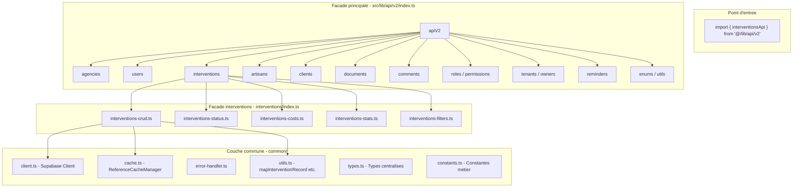
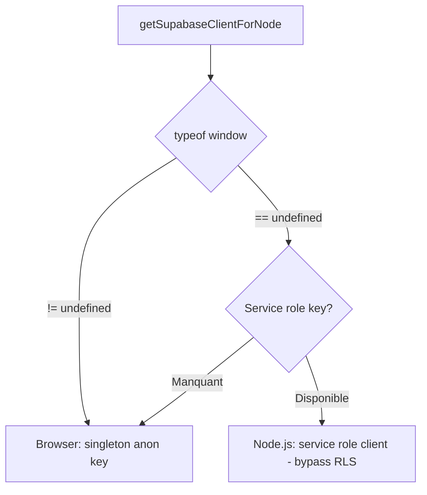
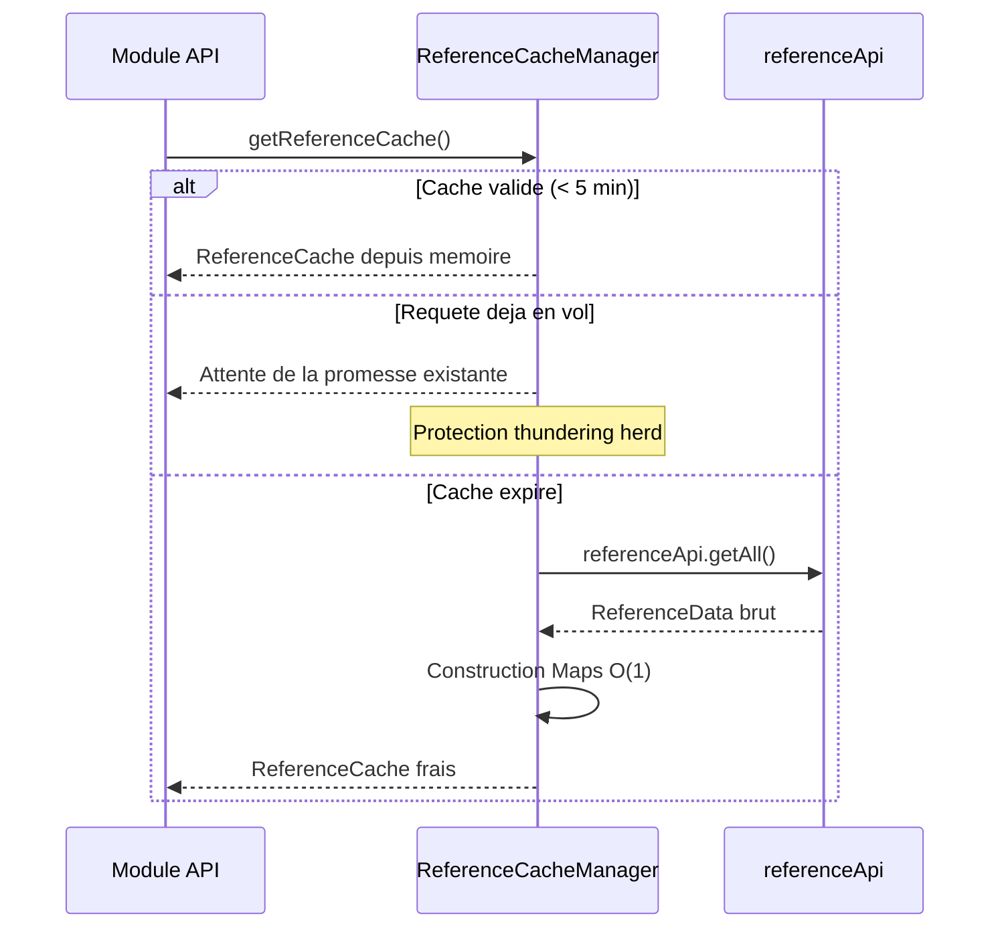
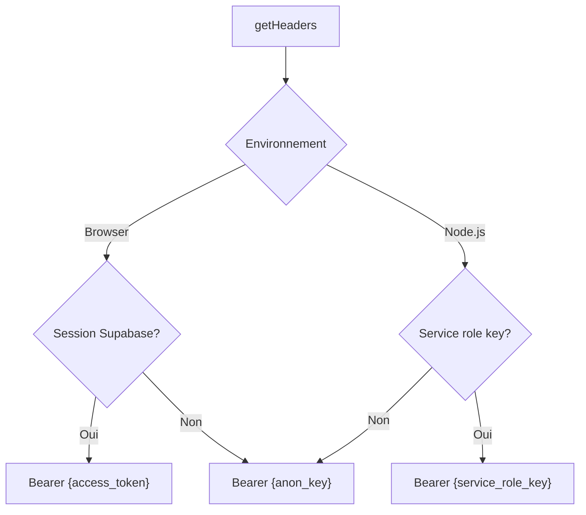

# Architecture API V2

> Couche d'acces aux donnees de GMBS-CRM. L'API V2 est organisee en modules specialises exposes via un pattern Facade a deux niveaux.

---

## Vue d'ensemble



---

## Structure des fichiers

```
src/lib/api/v2/
├── index.ts                    # Facade principale (14 APIs)
├── common/
│   ├── client.ts               # Client Supabase (browser + Node.js)
│   ├── cache.ts                # Singleton cache donnees de reference
│   ├── error-handler.ts        # Messages d'erreur securises
│   ├── utils.ts                # mapInterventionRecord, getHeaders, etc.
│   ├── types.ts                # Types centralises (Intervention, Artisan, etc.)
│   └── constants.ts            # Constantes metier (statuts, types documents, etc.)
├── interventions/
│   ├── index.ts                # Facade unifiant 5 sous-modules
│   ├── interventions-crud.ts   # CRUD complet (12 methodes)
│   ├── interventions-status.ts # Gestion statuts et artisans (8 methodes)
│   ├── interventions-costs.ts  # Couts et paiements (9 methodes)
│   ├── interventions-stats.ts  # Statistiques et dashboard (16 methodes)
│   └── interventions-filters.ts # Filtres et comptages (5 methodes)
├── artisansApi.ts
├── usersApi.ts
├── commentsApi.ts
├── documentsApi.ts
├── clientsApi.ts
├── agenciesApi.ts
├── ownersApi.ts
├── tenantsApi.ts
├── rolesApi.ts
├── reminders.ts
├── enumsApi.ts
├── utilsApi.ts
├── metiersApi.ts
├── search.ts
└── search-utils.ts
```

**Total : ~22 modules, ~50 methodes pour les interventions seules.** (Inclut les nouveaux `analyticsApi.ts`, `artisanStatusesApi.ts`, `interventionStatusesApi.ts`, `updatesApi.ts`.)

---

## Facade principale

Le fichier `src/lib/api/v2/index.ts` est le point d'entree unique. Il re-exporte tous les modules API, les types, les constantes et les utilitaires.

```typescript
// Importation recommandee
import { interventionsApi, artisansApi } from '@/lib/api/v2';
import type { Intervention, Artisan } from '@/lib/api/v2';

// Ou via l'objet unifie
import apiV2 from '@/lib/api/v2';
apiV2.interventions.getAll(params);
```

L'objet `apiV2` regroupe les 14 APIs :

| API | Module | Responsabilite |
|-----|--------|----------------|
| `agencies` | `agenciesApi.ts` | CRUD agences |
| `users` | `usersApi.ts` | CRUD utilisateurs, roles, objectifs |
| `interventions` | `interventions/index.ts` | CRUD, statuts, couts, stats, filtres |
| `artisans` | `artisansApi.ts` | CRUD artisans, proximite, metiers |
| `clients` | `clientsApi.ts` | CRUD clients, import batch |
| `documents` | `documentsApi.ts` | Upload/gestion fichiers (Supabase Storage) |
| `comments` | `commentsApi.ts` | CRUD commentaires multi-entites |
| `roles` | `rolesApi.ts` | Gestion roles et permissions |
| `permissions` | `rolesApi.ts` | Assignation permissions |
| `tenants` | `tenantsApi.ts` | CRUD locataires |
| `owners` | `ownersApi.ts` | CRUD proprietaires |
| `reminders` | `reminders.ts` | Rappels interventions |
| `enums` | `enumsApi.ts` | Recherche/creation valeurs enumerees |
| `utils` | `utilsApi.ts` | Utilitaires divers |

Des alias de compatibilite sont fournis pour la migration progressive : `interventionsApiV2`, `artisansApiV2`, etc.

---

## Facade interventions

La facade interventions (`src/lib/api/v2/interventions/index.ts`) unifie 5 sous-modules en une interface plate :

```typescript
export const interventionsApi = {
  // === CRUD (12 methodes) ===
  getAll, getAllLight, getTotalCount, getById,
  create, update, delete, checkDuplicate, getDuplicateDetails,
  upsert, upsertDirect, createBulk,

  // === STATUS & WORKFLOW (8 methodes) ===
  updateStatus, setPrimaryArtisan, setSecondaryArtisan, assignArtisan,
  getAllStatuses, getStatusByCode, getStatusByLabel, getStatusTransitions,

  // === COSTS & PAYMENTS (9 methodes) ===
  upsertCost, upsertCostsBatch, getCosts, deleteCost, addCost,
  addPayment, upsertPayment, insertInterventionCosts,
  calculateMarginForIntervention,

  // === STATS & DASHBOARD (16 methodes) ===
  getStatsByUser, getMarginStatsByUser, getMarginRankingByPeriod,
  getWeeklyStatsByUser, getPeriodStatsByUser, getAdminDashboardStats,
  getRevenueHistory, getInterventionsHistory, getCycleTimeHistory,
  getMarginHistory, ...

  // === FILTERS & COUNTING (5 methodes) ===
  getTotalCountWithFilters, getCountsByStatus, getCountByPropertyValue,
  getDistinctValues, getCountWithFilters,
};
```

### Injection de references croisees

Les sous-modules ont des dependances entre eux (par exemple, `interventions-stats` a besoin de `interventions-costs` pour calculer les marges). Ces dependances sont injectees au demarrage pour eviter les imports circulaires :

```typescript
// interventions/index.ts
import { interventionsCrud } from "./interventions-crud";
import { interventionsStatus, _setCrudRef } from "./interventions-status";
import { interventionsCosts } from "./interventions-costs";
import { interventionsStats, _setCostsRef } from "./interventions-stats";

// Injection des references croisees
_setCrudRef(interventionsCrud);
_setCostsRef(interventionsCosts);
```

---

## Couche commune (common/)

### Client Supabase (`client.ts`)

Deux modes de fonctionnement selon l'environnement :



```typescript
// Browser : client singleton avec anon key (respecte les RLS)
import { supabase } from "@/lib/supabase-client";

// Node.js : client service role (bypass RLS pour les scripts)
export function getSupabaseClientForNode() {
  if (typeof window !== "undefined") return supabase;
  return createClient(url, serviceRoleKey, {
    auth: { autoRefreshToken: false, persistSession: false },
  });
}
```

### Cache de reference (`cache.ts`)

Le `ReferenceCacheManager` est un singleton qui met en cache les donnees de reference (utilisateurs, agences, statuts, metiers) avec un TTL de 5 minutes.



Structure du cache :

```typescript
type ReferenceCache = {
  data: ReferenceData;             // Donnees brutes
  fetchedAt: number;               // Timestamp de creation
  usersById: Map<string, User>;    // Lookup O(1)
  allUsersById: Map<string, User>; // Inclut utilisateurs inactifs
  agenciesById: Map<string, Agency>;
  interventionStatusesById: Map<string, Status>;
  artisanStatusesById: Map<string, Status>;
  metiersById: Map<string, Metier>;
};
```

La protection **thundering herd** est assuree par le champ `fetchPromise` : si une requete est deja en vol, les appelants suivants recoivent la meme promesse au lieu de lancer des requetes en parallele.

### Gestionnaire d'erreurs (`error-handler.ts`)

Les messages d'erreur sont filtres selon l'environnement :

```typescript
export function safeErrorMessage(error: unknown, context: string): string {
  if (isDev) return fullMessage;     // Dev: details complets
  console.error(`[safeErrorMessage] Erreur lors de ${context}:`, error);
  return `Erreur lors de ${context}`; // Prod: message generique
}
```

En production, les details internes (messages Supabase, stack traces) ne sont jamais exposes au client. Le detail complet est logue cote serveur.

### Headers dynamiques (`utils.ts`)

La fonction `getHeaders()` construit les headers d'authentification selon le contexte :



### Enrichissement des records (`utils.ts`)

La fonction `mapInterventionRecord(item, refs)` transforme un enregistrement brut en objet metier avec 50+ champs. Elle effectue :

1. **Resolution des cles etrangeres** via le ReferenceCacheManager (O(1) par lookup)
2. **Extraction des artisans** depuis `intervention_artisans` (primaire/secondaire)
3. **Calcul des couts** depuis `intervention_costs` avec priorite : `costs_cache` > calcule > champs legacy
4. **Extraction des relations jointes** : aplatit les objets Supabase `item.tenants` et `item.owner` en champs plats (`prenomClient`, `nomClient`, `prenomProprietaire`, `nomProprietaire`, `nomPrenomFacturation`, etc.)
5. **Chaine de fallback pour les noms** : objet joint > champs plats > `plain_nom` > concatenation prenom+nom
6. **Alias legacy** : snake_case -> camelCase pour compatibilite

> **Important :** Quand l'Edge Function retourne des relations jointes (ex: `tenants: {firstname, lastname}`), `mapInterventionRecord` extrait ces champs dans des proprietes plates. Par exemple `item.tenants.firstname` → `prenomClient`, `item.owner.owner_firstname` → `prenomProprietaire`, `item.owner.plain_nom_facturation` → `nomPrenomFacturation`.

### Constantes metier (`constants.ts`)

Centralise toutes les constantes :

| Constante | Description |
|-----------|-------------|
| `INTERVENTION_STATUS` | 10 statuts (deprecated, preferer DB) |
| `INTERVENTION_METIERS` | 8 metiers (deprecated, preferer DB) |
| `DOCUMENT_TYPES` | Types de documents par entite |
| `COMMENT_TYPES` | 8 types de commentaires |
| `COST_TYPES` | 4 types de couts (`sst`, `materiel`, `intervention`, `marge`) |
| `ENTITY_TYPES` | 3 entites (`intervention`, `artisan`, `client`) |
| `USER_STATUS` | 4 etats de presence |
| `MAX_BATCH_SIZE` | 100 (limite `.in()` pour eviter les URL trop longues) |
| `REFERENCE_CACHE_DURATION` | 5 minutes |

### Taches post-mutation (`post-mutation-tasks.ts`)

Le module `src/lib/interventions/post-mutation-tasks.ts` centralise les taches secondaires executees apres une mutation d'intervention. Il est concu en **fire-and-forget** : la fonction retourne immediatement (`void`) pendant que les taches s'executent en arriere-plan.

**Taches gerees :**

| Tache | API appelee | Condition |
|-------|------------|-----------|
| Artisan primaire | `setPrimaryArtisan(id, artisanId)` | Si `current !== next` |
| Artisan secondaire | `setSecondaryArtisan(id, artisanId)` | Si `current !== next` |
| Couts (batch) | `upsertCostsBatch(id, costs)` | Si `costs.length > 0` |
| Suppression couts 2eme artisan | `deleteCost(id, type, 2)` | Si `deleteSecondaryCosts` |
| Paiements | `upsertPayment(id, payment)` | Pour chaque paiement |
| Commentaire | `commentsApi.create(...)` | Si `comment` fourni |

**Invalidation du cache apres completion :**

Apres `Promise.allSettled(tasks)`, les caches suivants sont invalides :

- `['interventions', 'detail', interventionId]` → **toujours** (garantit que couts/paiements sont visibles)
- `['admin', 'dashboard']` + `['podium']` → si `invalidateDashboard: true`
- `['comments', 'intervention', interventionId]` → si `invalidateComments: true`

**Isolation des erreurs :** chaque tache individuelle catch ses propres erreurs pour eviter les cascades. Si une tache echoue, les autres continuent normalement.

---

## Edge Functions

Les Edge Functions (Deno + Supabase JS) gerent la logique metier complexe cote serveur.

### Pattern commun

```typescript
// supabase/functions/<name>/index.ts
import { createClient } from '@supabase/supabase-js'
import { corsHeaders, handleCors } from '../_shared/cors.ts'

Deno.serve(async (req: Request) => {
  if (req.method === 'OPTIONS') return handleCors()

  const supabase = createClient(
    Deno.env.get('SUPABASE_URL')!,
    Deno.env.get('SUPABASE_SERVICE_ROLE_KEY')!
  )

  // ... logique metier

  return new Response(JSON.stringify(result), {
    headers: { ...corsHeaders, 'Content-Type': 'application/json' }
  })
})
```

### Liste des Edge Functions

| Fonction | Taille | Responsabilite |
|----------|--------|----------------|
| `interventions-v2` | 27K lignes | CRUD complet, artisans, comments, documents, costs |
| `artisans-v2` | Large | CRUD artisans, metiers, zones, absences |
| `comments` | Medium | CRUD commentaires (multi-entites) |
| `documents` | Medium | Upload/gestion fichiers + Supabase Storage |
| `users` | Small | Liste utilisateurs actifs avec roles |
| `pull` | Medium | Google Sheets -> Supabase (sync artisans/interventions) |
| `push` | Medium | Supabase -> Google Sheets (sync inverse) |
| `check-inactive-users` | Small | Cron 60s : marquer offline si > 90s inactif |
| `clients` | Small | CRUD clients |
| `tenants` | Small | CRUD locataires |
| `owners` | Small | CRUD proprietaires |
| `enums` | Small | Find/create enum values |
| `utils` | Small | Utilitaires divers |

### Construction de l'URL

L'URL des Edge Functions est construite dynamiquement par `getSupabaseFunctionsUrl()` :

```typescript
// Priorite :
// 1. NEXT_PUBLIC_SUPABASE_FUNCTIONS_URL (explicite)
// 2. Construction depuis NEXT_PUBLIC_SUPABASE_URL + /functions/v1
// 3. Fallback: http://localhost:54321/functions/v1

// Normalisation : 127.0.0.1 -> localhost (eviter problemes CORS)
// Nettoyage : /rest/v1 -> /functions/v1
```

---

## Calcul de marge

La methode `calculateMarginForIntervention` effectue un calcul synchrone a partir des couts :

```typescript
const margin = interventionsApi.calculateMarginForIntervention([
  { cost_type: 'intervention', amount: 800 },  // CA (chiffre d'affaires)
  { cost_type: 'sst', amount: 250 },           // Cout sous-traitance
  { cost_type: 'materiel', amount: 100 },       // Cout materiel
]);
// Resultat:
// { revenue: 800, costs: 350, margin: 450, marginPercentage: 56.25 }
```

---

## Ajouter un nouveau module API

Pour ajouter un nouveau module API (par exemple `invoicesApi`) :

1. **Creer le fichier** `src/lib/api/v2/invoicesApi.ts` :

```typescript
import { supabase } from "./common/client";
import { safeErrorMessage } from "./common/error-handler";

class InvoicesApi {
  async getAll() {
    const { data, error } = await supabase
      .from("invoices")
      .select("*")
      .order("created_at", { ascending: false });
    if (error) throw new Error(safeErrorMessage(error, "la recuperation des factures"));
    return data;
  }
  // ... autres methodes
}

export const invoicesApi = new InvoicesApi();
```

2. **Enregistrer dans la facade** `src/lib/api/v2/index.ts` :

```typescript
import { invoicesApi } from "./invoicesApi";

export { invoicesApi };

const apiV2 = {
  // ... APIs existantes
  invoices: invoicesApi,
};
```

3. **Creer les query keys** dans `src/lib/react-query/queryKeys.ts` :

```typescript
export const invoiceKeys = {
  all: ["invoices"] as const,
  lists: () => [...invoiceKeys.all, "list"] as const,
  list: (params: any) => [...invoiceKeys.lists(), params] as const,
  detail: (id: string) => [...invoiceKeys.all, "detail", id] as const,
};
```

4. **Creer un hook** dans `src/hooks/useInvoicesQuery.ts` pour le fetching avec TanStack Query.
