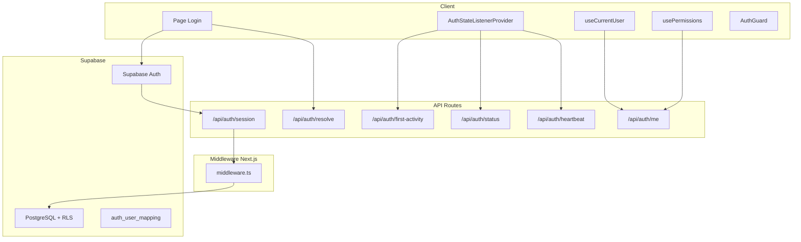
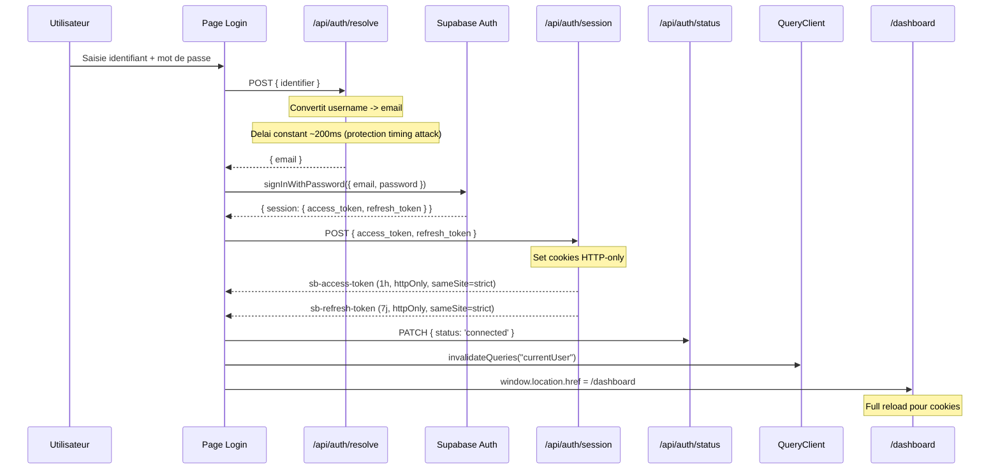
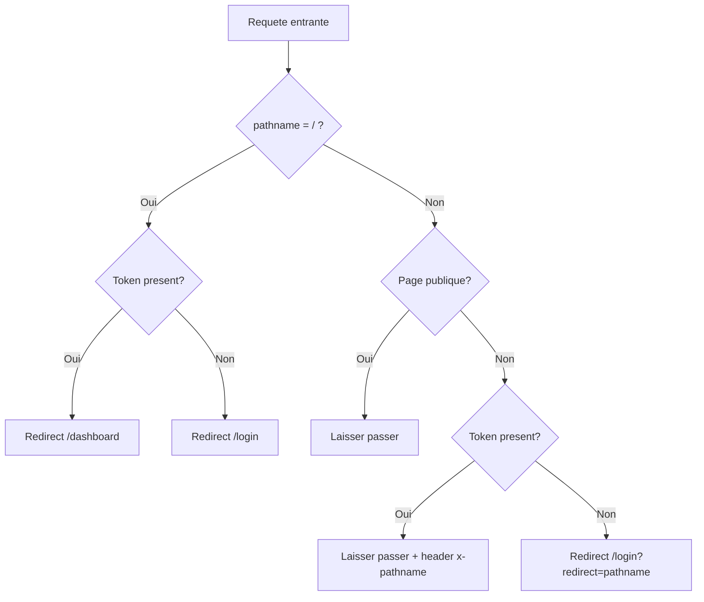
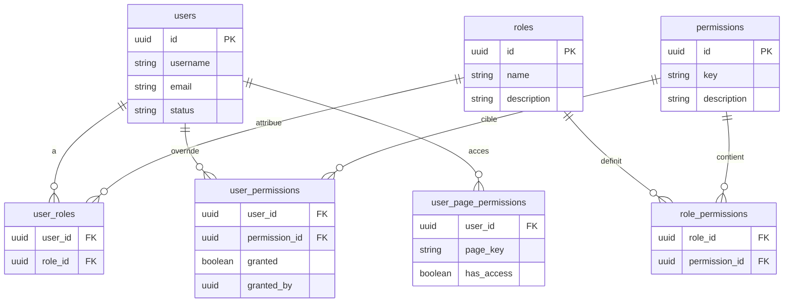
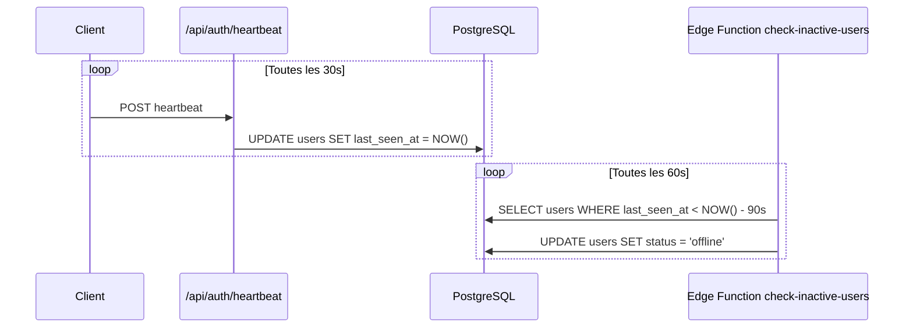
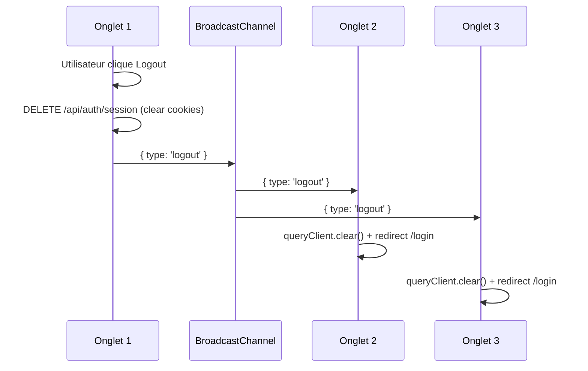
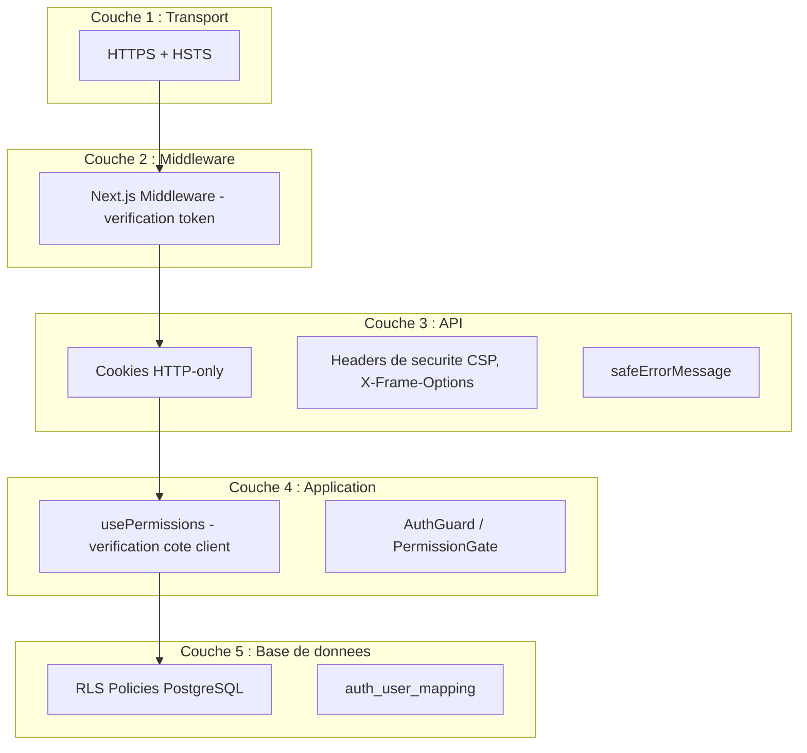

# Authentification et securite

> Systeme d'authentification base sur Supabase Auth avec cookies HTTP-only, middleware Next.js, RLS PostgreSQL, et gestion fine des permissions.

---

## Vue d'ensemble



---

## Flux d'authentification

### Login complet



### Resolution d'identifiant (/api/auth/resolve)

Cette route permet aux utilisateurs de se connecter avec leur username au lieu de leur email :

```typescript
// Convertit username -> email
// Protection timing attack : delai constant ~200ms
// meme si l'utilisateur n'existe pas
```

### Cookies de session

| Cookie | Duree | Flags |
|--------|-------|-------|
| `sb-access-token` | 1 heure | `httpOnly`, `sameSite=strict`, `secure` (prod) |
| `sb-refresh-token` | 7 jours | `httpOnly`, `sameSite=strict`, `secure` (prod) |

Les cookies sont **HTTP-only** pour empecher l'acces depuis JavaScript (protection XSS). Le `sameSite=strict` protege contre les attaques CSRF.

---

## Middleware Next.js

Le middleware (`middleware.ts`) s'execute avant chaque requete pour gerer les redirections d'authentification :



### Pages publiques

Les chemins suivants ne requierent pas d'authentification :
- `/login`
- `/landingpage`
- `/set-password`
- `/auth/callback`
- `/portail`

### Assets exclus

Le matcher du middleware exclut automatiquement :
- `_next/static`, `_next/image`
- `favicon.ico`
- Fichiers statiques (`.svg`, `.png`, `.jpg`, etc.)
- Routes API auth (`/api/auth/`)
- Routes API portail (`/api/portail/`, `/api/portal-external/`)

---

## API Routes d'authentification

| Route | Methode | Responsabilite |
|-------|---------|----------------|
| `/api/auth/session` | POST | Set cookies HTTP-only pour la session |
| `/api/auth/session` | DELETE | Clear cookies (logout) |
| `/api/auth/me` | GET | Profil utilisateur + roles + permissions |
| `/api/auth/resolve` | POST | Conversion username -> email (timing-safe) |
| `/api/auth/status` | PATCH | Mise a jour presence (connected/busy/dnd/offline) |
| `/api/auth/heartbeat` | POST | Ping presence toutes les 30s |
| `/api/auth/first-activity` | POST | Tracking du premier acces quotidien (retard) |
| `/api/auth/callback` | GET | Echange code PKCE (reset password) |

---

## Hooks d'authentification

### useCurrentUser

Recupere le profil de l'utilisateur connecte via `/api/auth/me` :

```typescript
// src/hooks/useCurrentUser.ts
const { data: user, isLoading } = useCurrentUser();
// user = { id, username, email, firstname, lastname, roles, permissions, ... }
```

L'endpoint `/api/auth/me` retourne l'utilisateur avec ses roles et permissions resolus cote serveur en une seule requete.

### usePermissions

Fournit des helpers pour verifier les permissions de l'utilisateur courant :

```typescript
// src/hooks/usePermissions.ts
const { can, canAny, canAll, hasRole, canAccessPage } = usePermissions();

// Verifier une permission unique
if (can('write_interventions')) { ... }

// Verifier au moins une permission parmi plusieurs
if (canAny(['write_interventions', 'write_artisans'])) { ... }

// Verifier toutes les permissions
if (canAll(['read_interventions', 'write_interventions'])) { ... }

// Verifier un role
if (hasRole('admin')) { ... }

// Verifier l'acces a une page
if (canAccessPage('/admin')) { ... }
```

### useUserRoles

Verification simplifiee des roles :

```typescript
const { isAdmin, isManager, isGestionnaire } = useUserRoles();
```

---

## Systeme de permissions

### Structure



### Roles

| Role | Description |
|------|-------------|
| `admin` | Acces complet, gestion roles et permissions |
| `manager` | Gestion equipe, stats, parametres |
| `gestionnaire` | CRUD interventions et artisans |
| `viewer` | Lecture seule |

### Permissions

Les permissions suivent le pattern `<action>_<ressource>` :

| Categorie | Permissions |
|-----------|------------|
| Interventions | `read_interventions`, `write_interventions`, `delete_interventions` |
| Artisans | `read_artisans`, `write_artisans`, `export_artisans` |
| Comptabilite | `view_comptabilite` |
| Administration | `manage_roles`, `manage_settings`, `view_admin` |

### Override par utilisateur

La table `user_permissions` permet de surcharger les permissions d'un role pour un utilisateur specifique :

```sql
-- Accorder une permission supplementaire
INSERT INTO user_permissions (user_id, permission_id, granted, granted_by)
VALUES ('user-id', 'perm-id', true, 'admin-id');

-- Revoquer une permission du role
INSERT INTO user_permissions (user_id, permission_id, granted, granted_by)
VALUES ('user-id', 'perm-id', false, 'admin-id');
```

### Acces par page

La table `user_page_permissions` controle l'acces a des pages specifiques independamment des permissions :

```sql
-- Donner acces a la page comptabilite
INSERT INTO user_page_permissions (user_id, page_key, has_access)
VALUES ('user-id', '/comptabilite', true);
```

---

## Composant AuthGuard

Le composant `AuthGuard` protege les pages cote client en verifiant les permissions :

```tsx
// src/components/layout/auth-guard.tsx
<AuthGuard requiredPermission="view_admin">
  <AdminDashboard />
</AuthGuard>

// Ou avec role
<AuthGuard requiredRole="admin">
  <AdminSettings />
</AuthGuard>
```

Le `PermissionGate` est un composant similaire pour masquer conditionnellement des elements UI :

```tsx
<PermissionGate permission="write_interventions">
  <EditButton />
</PermissionGate>
```

---

## Presence en temps reel

### Heartbeat

Le systeme de presence utilise des heartbeats plutot que l'evenement `beforeunload` (qui est peu fiable) :



| Parametre | Valeur |
|-----------|--------|
| Intervalle heartbeat | 30 secondes |
| Intervalle cron | 60 secondes |
| Seuil inactivite | 90 secondes |

Ce systeme fonctionne meme si l'onglet crash, est kill, ou si le reseau est coupe.

### Tracking inactivite client

Le `UserStatusContext` detecte l'inactivite cote client :
- Ecoute les evenements `mousemove`, `keydown`, `click`, `scroll` (passive)
- Throttle a 300ms
- Passe automatiquement en `appear-away` apres 1 heure d'inactivite
- Verification toutes les 60 secondes

---

## Row Level Security (RLS)

Les RLS policies PostgreSQL protegent les donnees au niveau de la base :

### Mapping auth -> public

La table `auth_user_mapping` fait le lien entre `auth.users` (Supabase Auth) et `public.users` (donnees metier) :

```sql
CREATE TABLE auth_user_mapping (
  auth_user_id UUID REFERENCES auth.users(id),
  public_user_id UUID REFERENCES users(id),
  PRIMARY KEY (auth_user_id)
);
```

### Policies typiques

```sql
-- Lecture : utilisateurs actifs voient les interventions actives
CREATE POLICY "Users can view active interventions"
ON interventions FOR SELECT
USING (is_active = true);

-- Ecriture : seuls les utilisateurs assignes ou admins peuvent modifier
CREATE POLICY "Users can update their interventions"
ON interventions FOR UPDATE
USING (
  assigned_user_id IN (
    SELECT public_user_id FROM auth_user_mapping
    WHERE auth_user_id = auth.uid()
  )
  OR EXISTS (
    SELECT 1 FROM user_roles ur
    JOIN roles r ON ur.role_id = r.id
    WHERE ur.user_id IN (
      SELECT public_user_id FROM auth_user_mapping
      WHERE auth_user_id = auth.uid()
    )
    AND r.name = 'admin'
  )
);
```

### Bypass RLS (scripts Node.js)

Le client `getSupabaseClientForNode()` utilise la `SUPABASE_SERVICE_ROLE_KEY` pour bypass les RLS dans les contextes serveur (scripts d'import, Edge Functions) :

```typescript
// src/lib/api/v2/common/client.ts
export function getSupabaseClientForNode() {
  if (typeof window !== "undefined") return supabase; // Browser: respecte RLS
  return createClient(url, serviceRoleKey, {          // Node.js: bypass RLS
    auth: { persistSession: false },
  });
}
```

---

## Securite

### Mesures implementees

| Mesure | Implementation |
|--------|---------------|
| **Cookies HTTP-only** | Tokens dans cookies inaccessibles au JS (anti-XSS) |
| **sameSite=strict** | Protection CSRF |
| **PKCE Flow** | Reset password via code exchange securise |
| **Timing attack protection** | Delai constant ~200ms sur `/api/auth/resolve` |
| **SMTP password chiffre** | Credentials SMTP stockes chiffres en DB |
| **Soft deletes** | Jamais de hard delete utilisateurs (`delete_date` + `deleted_by`) |
| **CSP** | Content Security Policy restrictive |
| **X-Frame-Options: DENY** | Protection clickjacking |
| **HSTS** | HTTP Strict Transport Security |
| **X-Content-Type-Options: nosniff** | Protection MIME sniffing |
| **safeErrorMessage** | Messages d'erreur generiques en production |

### Headers de securite

Les headers sont configures dans `next.config.mjs` :

```typescript
const securityHeaders = [
  { key: 'X-Frame-Options', value: 'DENY' },
  { key: 'X-Content-Type-Options', value: 'nosniff' },
  { key: 'Strict-Transport-Security', value: 'max-age=31536000; includeSubDomains' },
  { key: 'Content-Security-Policy', value: '...' },
];
```

### Multi-tab synchronisation

Le logout est propage a tous les onglets via `BroadcastChannel` :



De plus, chaque onglet emet des heartbeats dans `localStorage` pour permettre de detecter les onglets encore actifs.

---

## Resume des couches de securite


