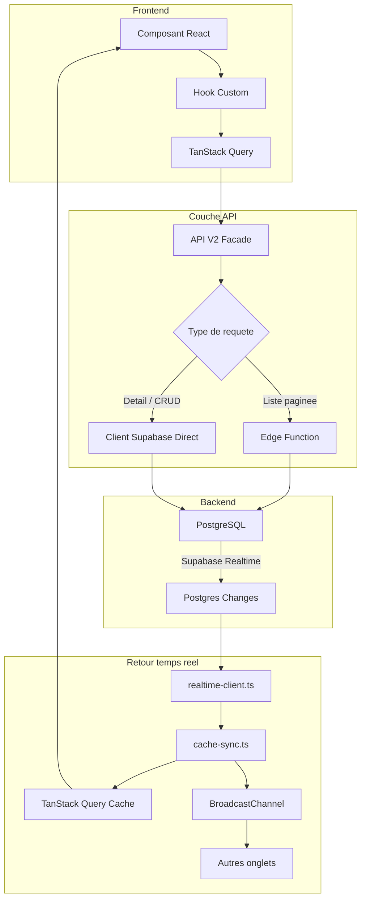
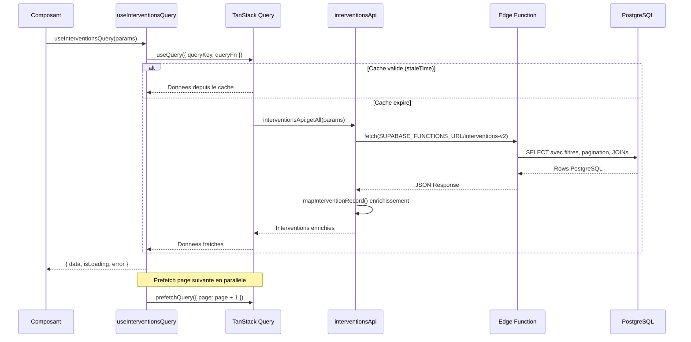
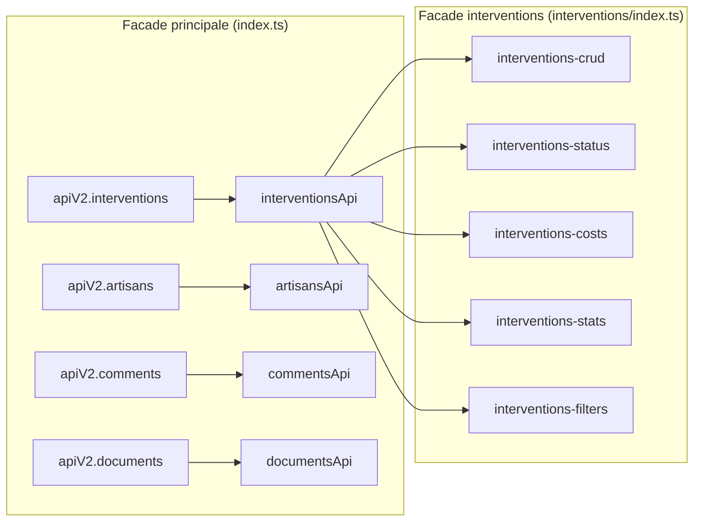
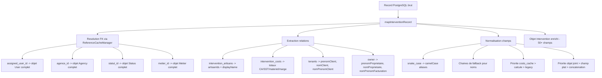
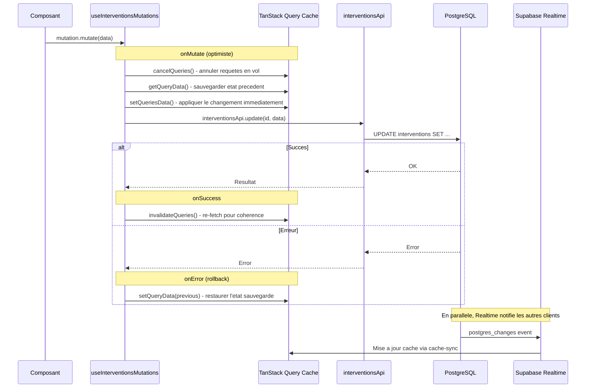
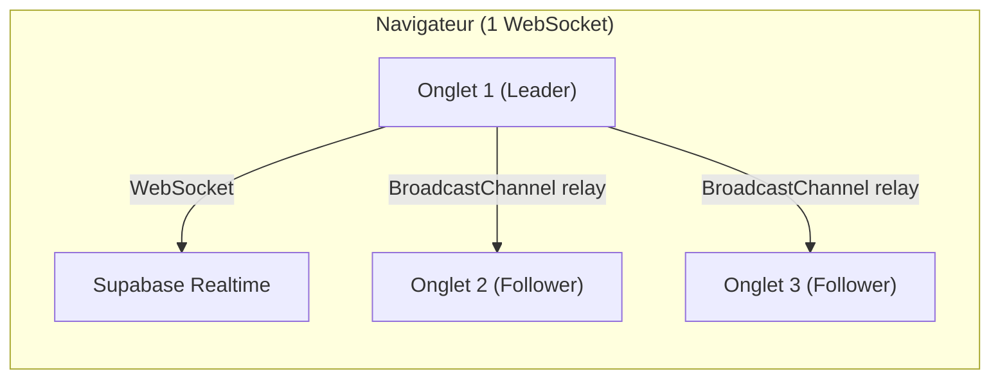
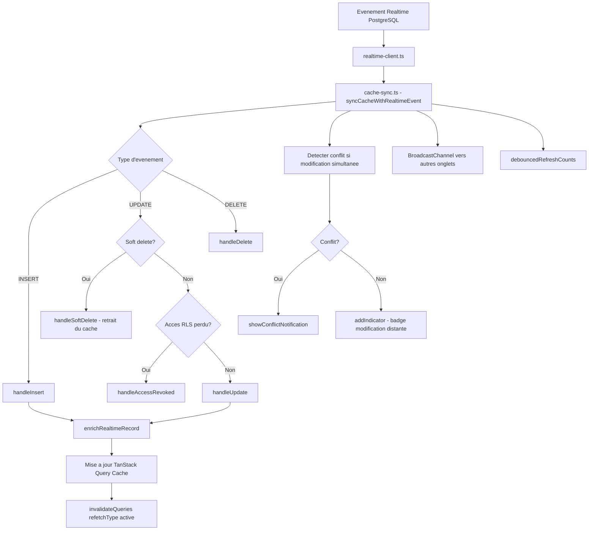
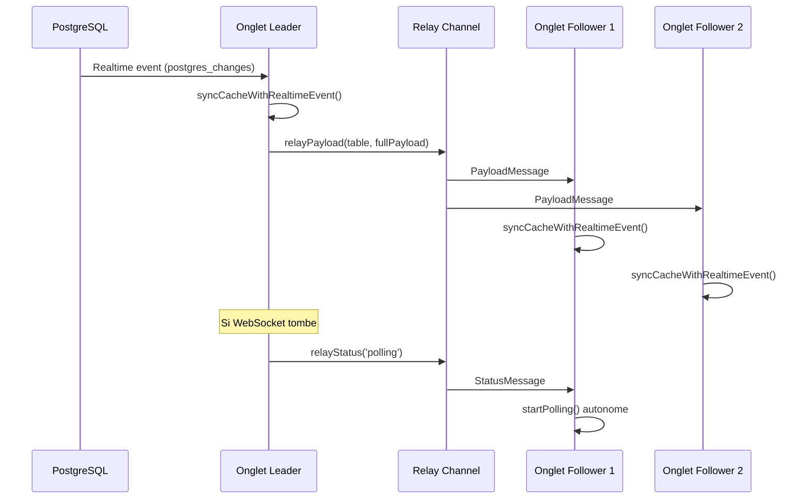
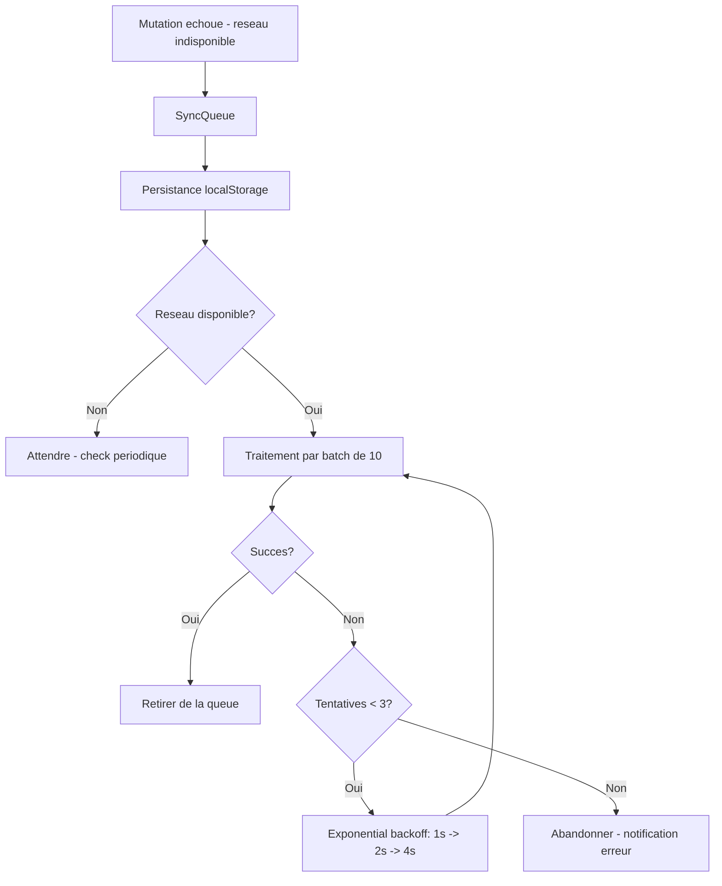
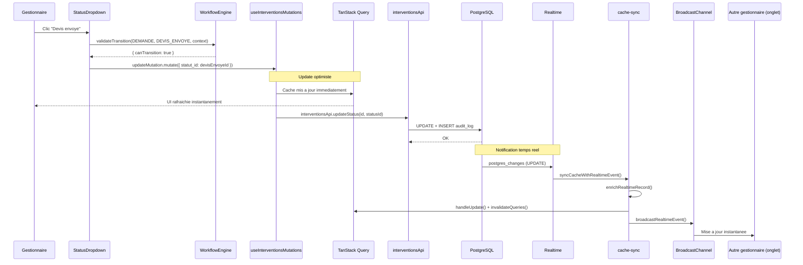

# Flux de donnees

> Architecture du flux de donnees complet dans GMBS-CRM, de l'interface utilisateur jusqu'a la base de donnees et retour.

---

## Vue d'ensemble

Le flux de donnees dans GMBS-CRM suit un pipeline en couches qui garantit la coherence, la performance et la reactivite en temps reel.



---

## Flux aller : lecture des donnees

### 1. Composant React

Le composant declare ses besoins en donnees via un hook custom. Il ne connait ni l'API ni le cache.

```tsx
// app/interventions/page.tsx
function InterventionsPage() {
  const { data, isLoading } = useInterventionsQuery({
    page: 1,
    pageSize: 50,
    status: ['DEMANDE', 'DEVIS_ENVOYE'],
    user: currentUser.id,
  });

  return <InterventionsViewRenderer data={data} />;
}
```

### 2. Hook custom (useInterventionsQuery)

Le hook orchestre le fetching avec TanStack Query. Il gere :
- La construction des query keys via la factory `interventionKeys`
- Le `staleTime` adaptatif selon le contexte
- Le prefetch de la page suivante
- Le `placeholderData` pour eviter les flashs de chargement



### 3. TanStack Query (cache client)

TanStack Query gere le cache cote client avec des query keys structurees :

```typescript
// src/lib/react-query/queryKeys.ts
export const interventionKeys = {
  all: ["interventions"] as const,
  lists: () => [...interventionKeys.all, "list"] as const,
  list: (params) => [...interventionKeys.lists(), params] as const,
  lightLists: () => [...interventionKeys.all, "light"] as const,
  lightList: (params) => [...interventionKeys.lightLists(), params] as const,
  details: () => [...interventionKeys.all, "detail"] as const,
  detail: (id, include?) => [...interventionKeys.details(), id, include] as const,
};
```

La hierarchie de cles permet une invalidation granulaire :
- `interventionKeys.all` invalide tout
- `interventionKeys.lists()` invalide toutes les listes mais pas les details
- `interventionKeys.list(params)` invalide une seule liste avec ses filtres

### 4. API V2 Facade

L'API V2 utilise le pattern Facade a deux niveaux :



### 5. Edge Function vs Client Supabase Direct

Le choix du transport depend de l'operation :

| Operation | Transport | Raison |
|-----------|-----------|--------|
| `getAll` (liste paginee) | Edge Function `interventions-v2` | Logique metier complexe, filtres avances, JOINs |
| `getAllLight` (warm-up) | Edge Function `interventions-v2` | Version allegee pour prefetch |
| `getById` (detail) | Client Supabase Direct | JOINs simples, pas besoin de logique serveur |
| `create` / `update` | Client Supabase Direct | CRUD standard + transition automatique |
| `upsert` (import) | Edge Function `interventions-v2` | Logique de deduplication |

### 6. Enrichissement des donnees (mapInterventionRecord)

Chaque enregistrement brut PostgreSQL est transforme en objet metier enrichi par `mapInterventionRecord`. Cette fonction, definie dans `src/lib/api/v2/common/utils.ts`, effectue :



Le `ReferenceCacheManager` (singleton, TTL 5 minutes) fournit des lookups O(1) via des `Map<string, T>` pour les donnees de reference :
- `usersById`, `allUsersById`
- `agenciesById`
- `interventionStatusesById`
- `artisanStatusesById`
- `metiersById`

---

## Flux aller : ecriture des donnees

### Mutations avec updates optimistes

Les mutations suivent un pattern en 4 etapes pour garantir une experience fluide :



### Taches post-mutation (fire-and-forget)

Apres le succes de la mutation principale, certaines donnees secondaires (couts, paiements, artisans) sont sauvegardees en arriere-plan via `runPostMutationTasks()` (`src/lib/interventions/post-mutation-tasks.ts`).

Le pattern est le suivant :

1. **Modal ferme immediatement** apres le `mutateAsync()` pour la fluidite UX
2. **Toast loading** indique que l'enregistrement est en cours
3. **Taches secondaires** (couts, paiements, artisans) s'executent en parallele en arriere-plan
4. **Invalidation du cache** intervention detail apres completion des taches → TanStack Query refetch → l'UI se met a jour automatiquement

```typescript
// Apres le succes de la mutation principale
runPostMutationTasks({
  interventionId: id,
  costs: allCosts,
  payments: payments,
  artisans: { primary, secondary },
  queryClient,  // Pour l'invalidation du cache apres completion
  invalidateDashboard: true,
})
// → fire-and-forget : ne bloque pas le thread
// → invalide ['interventions', 'detail', id] apres completion
```

> **Important :** `runPostMutationTasks` invalide systematiquement le cache du detail intervention (`['interventions', 'detail', interventionId]`) apres la sauvegarde des couts/paiements. Cela garantit que l'UI affiche les donnees a jour sans que l'utilisateur ait besoin de recharger manuellement.

---

## Flux retour : temps reel

### Canal Supabase Realtime (multiplexe)

Le systeme ecoute 3 tables sur un seul canal Supabase Realtime (1 connexion WebSocket) :

```typescript
// src/lib/realtime/realtime-client.ts
const channel = supabase
  .channel('crm-sync')
  .on('postgres_changes', {
    event: '*', schema: 'public', table: 'interventions',
    filter: 'is_active=eq.true',  // -50% trafic (soft deletes ignores)
  }, handlers.onInterventionEvent)
  .on('postgres_changes', {
    event: '*', schema: 'public', table: 'artisans',
    filter: 'is_active=eq.true',
  }, handlers.onArtisanEvent)
  .on('postgres_changes', {
    event: '*', schema: 'public', table: 'intervention_artisans',
  }, handlers.onJunctionEvent)
```

### Leader Election (Web Locks API)

Un seul onglet par navigateur maintient la connexion WebSocket. Les autres onglets (followers)
recoivent les evenements via BroadcastChannel relay (gratuit, local-only) :



| Composant | Connexions/utilisateur | Total (30 users) |
| --------- | ---------------------- | ----------------- |
| Realtime channel (leader uniquement) | 1 | 30 |
| BroadcastChannel (API navigateur) | 0 | 0 |
| Polling fallback (REST, pas WS) | 0 | 0 |
| **Total** | **1** | **30** (15% du plan Free) |

Fichiers cles :

- `src/lib/realtime/leader-election.ts` — Election via Web Locks API
- `src/lib/realtime/realtime-relay.ts` — Relay BroadcastChannel leader→followers
- `src/hooks/useCrmRealtime.ts` — Orchestrateur global (hook principal, monte une fois en racine)
- `src/hooks/useInterventionRealtime.ts` — Hook **scoped** consomme par les formulaires d'intervention pour reagir aux mises a jour distantes du record courant (refacto avril 2026). Ne souscrit pas a un canal supplementaire : il s'abonne aux invalidations cache emises par `useCrmRealtime` et expose un signal "remoteUpdated" aux composants form-sections.

Fallback : si Web Locks n'est pas disponible, chaque onglet souscrit independamment (comportement historique).

### Pipeline de traitement des evenements



### Les 4 cas d'un UPDATE

Lors d'un UPDATE, le systeme determine l'action en fonction de la correspondance avec les filtres actifs :

| Situation | Action |
|-----------|--------|
| Pas dans la liste + ne match pas les filtres | Aucun changement |
| Pas dans la liste + match les filtres maintenant | Ajout a la liste |
| Dans la liste + match toujours les filtres | Mise a jour du record |
| Dans la liste + ne match plus les filtres | Retrait de la liste |

### Synchronisation cross-tab (Leader Election)

Avec la leader election (Web Locks API), un seul onglet maintient la connexion WebSocket.
Le leader relaie les payloads Realtime complets aux followers via un `BroadcastChannel` dedie (`crm-realtime-relay`).
Les followers traitent les evenements a travers le meme pipeline cache-sync (updates optimistes, detection de conflits, indicateurs).



Quand le leader ferme son onglet, le Web Lock est automatiquement libere
et le prochain onglet en attente est promu leader (zero configuration, zero race condition).

Fallback sans Web Locks : chaque onglet souscrit independamment et utilise
`broadcast-sync.ts` pour propager les invalidations (comportement historique).

---

## Flux offline : SyncQueue

Quand le reseau est indisponible, les mutations sont mises en file d'attente :



---

## Flux complet : exemple concret

Voici le flux complet lorsqu'un gestionnaire change le statut d'une intervention de DEMANDE a DEVIS_ENVOYE :



---

## Resume des couches

| Couche | Fichier(s) | Responsabilite |
|--------|-----------|----------------|
| Composant | `app/**/page.tsx`, `src/components/` | Affichage, interaction utilisateur |
| Hook | `src/hooks/useInterventionsQuery.ts` | Orchestration fetching, prefetch, staleTime |
| Cache client | TanStack Query + `queryKeys.ts` | Cache, invalidation, updates optimistes |
| API Facade | `src/lib/api/v2/index.ts` | Point d'entree unique, routage |
| API Modules | `src/lib/api/v2/interventions/*.ts` | Logique metier par domaine |
| Transport | Edge Functions / Supabase Client | Communication avec la base |
| Base de donnees | PostgreSQL (Supabase) | Stockage, RLS, triggers |
| Realtime | `src/lib/realtime/realtime-client.ts` | Reception evenements (channel multiplex) |
| Leader Election | `src/lib/realtime/leader-election.ts` | 1 WebSocket par navigateur (Web Locks API) |
| Realtime Relay | `src/lib/realtime/realtime-relay.ts` | Relay leader→followers (BroadcastChannel) |
| Cache Sync | `src/lib/realtime/cache-sync.ts` | Orchestration mise a jour cache |
| Cross-tab | `src/lib/realtime/broadcast-sync.ts` | Propagation inter-onglets (fallback) |
| Offline | `src/lib/realtime/sync-queue.ts` | File d'attente mode deconnecte |

---

## Recherche universelle : pattern hybride MV + buffer live

La barre de recherche globale (`search_global` RPC) combine deux sources pour offrir une recherche full-text quasi temps reel sans timeout sur les ecritures.

### Probleme historique

La recherche reposait initialement sur des materialized views (`global_search_mv`, `interventions_search_mv`, `artisans_search_mv`) rafraichies par un job pg_cron toutes les 60s (cf. migration `00035_async_search_views_refresh.sql`). Une intervention creee venait dans la barre de recherche apres un delai de 0 a 60s — frustrant pour le gestionnaire qui cree puis cherche immediatement.

### Solution : pattern Near-Real-Time Search

Inspire du pattern Elasticsearch (segments + translog), `search_global` combine :

1. **Materialized View (bulk)** — `global_search_mv` pre-calcule l'index full-text avec tous les JOINs (agence, tenant, owner, artisan, commentaires). Refresh par cron toutes les 60s.
2. **Buffer live** — scan direct des tables `interventions` et `artisans` pour les lignes modifiees depuis le dernier refresh (`updated_at > last_refresh`). Borne a 500 lignes par type d'entite (garde-fou si le cron prend du retard).
3. **Deduplication** — si une ligne est presente dans les deux sources, la version live gagne (priorite source 0 > 1).

```
search_global(query)
  |
  +--> mv_results (bulk, MV pre-calcule, JOINs riches)
  |    \-- LIMIT p_limit * 3 (sur-fetch pour le merge)
  |
  +--> recent_interventions (buffer live, GIN sur interventions.search_vector)
  |    \-- WHERE updated_at > last_refresh
  |    \-- ORDER BY updated_at DESC LIMIT 500
  |
  +--> recent_artisans (buffer live, GIN sur artisans.search_vector)
  |    \-- WHERE updated_at > last_refresh
  |    \-- ORDER BY updated_at DESC LIMIT 500
  |
  +--> UNION ALL + DISTINCT ON (entity_type, entity_id)
       ORDER BY source_priority ASC  -- live (0) gagne sur MV (1)
       \-- ORDER BY rank DESC LIMIT p_limit OFFSET p_offset
```

### Composants

| Composant | Fichier | Role |
|-----------|---------|------|
| Fonction RPC | `supabase/migrations/99026_fix_search_global_rank_type.sql` | Implementation `search_global` |
| Colonnes generees | `interventions.search_vector`, `artisans.search_vector` (tsvector) | Buffer live, GENERATED ALWAYS AS STORED |
| Indexes GIN | `idx_interventions_search_vector_live`, `idx_artisans_search_vector_live` | Full-text sur tables de base |
| Indexes B-tree partiels | `idx_interventions_updated_at`, `idx_artisans_updated_at` (WHERE is_active = true) | Fenetre temporelle du buffer |
| Wrapper IMMUTABLE | `f_unaccent(text)` | Permet d'utiliser unaccent dans une colonne GENERATED |
| Cron de refresh | Job `refresh_search_views` (toutes les 60s) | Maintient la MV |
| Flags de refresh | Table `search_views_refresh_flags` | Source de verite pour `last_refresh` |

### Limites connues

- Le `search_vector` des tables de base ne contient **que les champs propres** (pas les JOINs). Une intervention fraichement creee sera trouvable par son `id_inter`, son contexte, son adresse, mais **pas par le nom du tenant ou de l'agence** avant le prochain refresh MV. La MV enrichie prend le relais sous 60s.
- Le `metadata` JSONB du buffer live est simplifie (pas d'agence, pas d'artisan lie). Sans impact UI : le frontend re-fetch les donnees completes par ID via `fetchInterventionsByIds` / `fetchArtisansByIds`.
- Pagination profonde instable si un refresh a lieu entre deux pages. Cas d'usage rare en pratique (la recherche universelle affiche peu de resultats par defaut).

### Deploiement

- Sur dev/staging : `99024_hybrid_search_global.sql` peut s'appliquer directement (volumes faibles).
- En prod, en 2 etapes pour eviter les locks long :
  1. `supabase/samples/sql/search/prod_deploy_1_search_columns.sql` — ALTER TABLE ADD COLUMN (transactionnel OK, mais rewrite de table).
  2. `supabase/samples/sql/search/prod_deploy_2_search_indexes_concurrent.sql` — `CREATE INDEX CONCURRENTLY`, **statement par statement** (interdit en transaction).
  
  La migration 99024 devient ensuite no-op grace aux `IF NOT EXISTS`.

### Tests

`supabase/samples/sql/search/test_hybrid_search.sql` contient les tests manuels (buffer live, dedup, type de retour, bornage).

### Spec complete

[docs/specs/hybrid-search-freshness.md](../specs/hybrid-search-freshness.md) — design detaille, alternatives ecartees, evolution future trigger-based.
