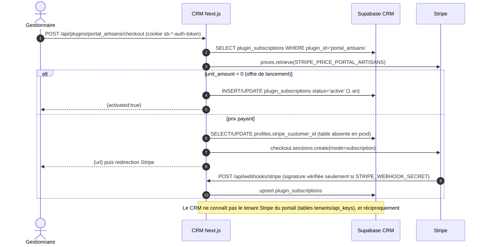
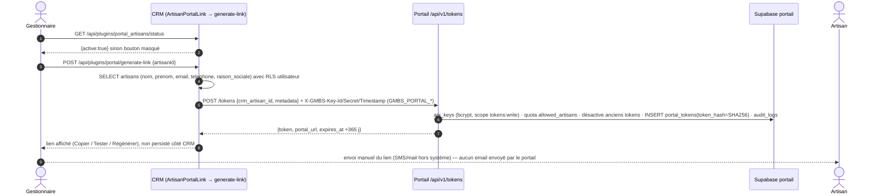
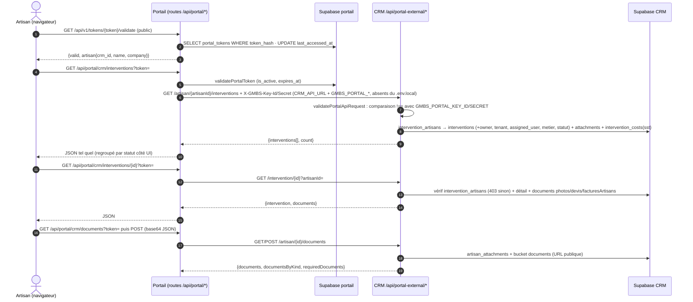
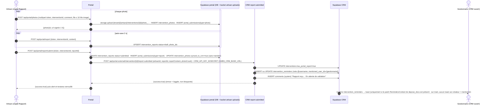
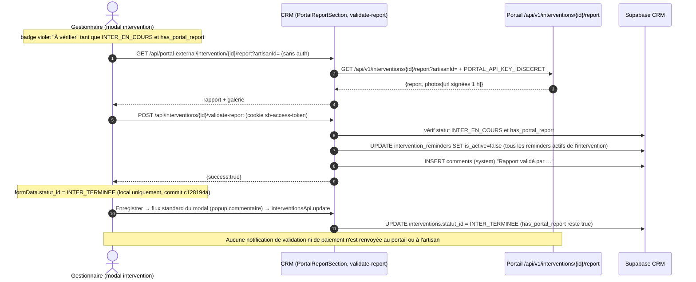
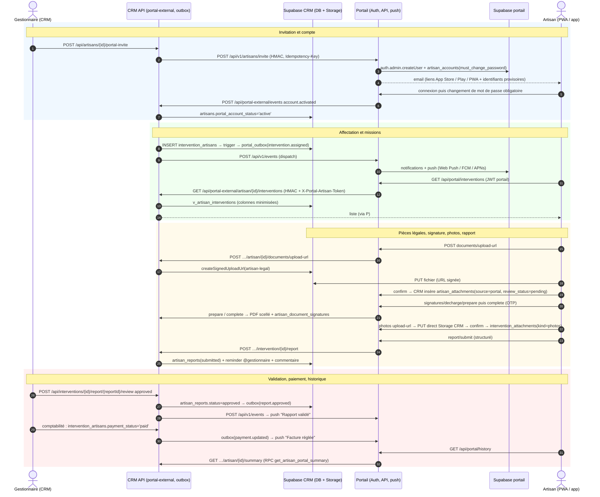

# Portail artisans v2 — état des lieux, communication CRM↔portail, écart, plan de reprise, vision cible

> Date : 2026-09-02. Rédigé à partir de la lecture des trois sources (CRM `main`, branche `origin/depose_docs`, dépôt `portal_gmbs`) ; chaque affirmation renvoie à un fichier et, quand c'est utile, à un numéro de ligne. Aucune valeur de secret n'est reproduite (noms de variables uniquement). « non trouvé » signale une absence vérifiée.

Conventions de chemins : `CRM:` = `/Users/andrebertea/Projects/gmbs-crm` (branche `deposedocsv2`) ; `DD:` = worktree lecture seule de `origin/depose_docs` ; `PORTAIL:` = `/Users/andrebertea/Projects/GMBS/portal_gmbs`.

---

## 1. Résumé exécutif

1. En janvier 2026, deux portails ont été construits en parallèle et jamais fusionnés : un portail **interne** au CRM (`DD: app/portail/[token]`, abandonné le 19/01, incompatible avec le schéma de prod) et un portail **externe** `portal_gmbs` (Next 16, Supabase propre) qui appelle le CRM par HTTP via `DD: app/api/portal-external/*`.
2. Sur `main`, il ne reste **rien** de ce code : aucun commit de `depose_docs` n'a été fusionné (`git merge-base --is-ancestor 697c9336 origin/depose_docs` → faux ; `git cherry` ne trouve aucun équivalent) ; `main` porte son propre commit `697c9336` (2026-01-21, « fix: allow portal-external API routes without authentication ») qui ajoute les mêmes exclusions `portail`, `api/portail/`, `api/portal-external/` que `958e565f`/`ce1e4bd0` de `depose_docs` ; ces exclusions (`CRM: middleware.ts` l. 23 et l. 71) sont orphelines.
3. En revanche, les objets de base **existent en production** (appliqués à la main, hors dépôt) : `artisan_portal_tokens`, `artisan_reports`, `artisan_report_photos`, `plugin_subscriptions`, `interventions.has_portal_report`, `intervention_attachments.metadata` (`CRM: src/lib/database.types.ts` l. 346, 394, 475, 1385, 1943, 2486, régénéré le 2026-08-02).
4. Le flux réellement câblé côté portail est : lien tokenisé 1 an (`/t/{token}`), lecture des interventions/documents par proxy vers le CRM, rapport texte + photos stockés **chez le portail**, notification `report-submitted` vers le CRM (flag + reminder + commentaire), puis le CRM va **rechercher** le rapport par HTTP au moment de l'affichage. Les photos ne sont jamais copiées dans le CRM.
5. La configuration est incohérente : `PORTAIL: src/lib/crm/client.ts` l. 148-150 lit `CRM_API_URL` / `GMBS_PORTAL_KEY_ID` / `GMBS_PORTAL_SECRET`, absents du `.env.local` du portail (qui définit `GMBS_CRM_BASE_URL` / `CRM_API_KEY_ID` / `CRM_API_SECRET`, utilisés seulement par `report/submit`). Sans variables Vercel ajoutées à la main, les proxys pointent sur `http://localhost:3000` avec une clé vide.
6. Sécurité : secret partagé comparé par `!==` (`DD: src/lib/portal-external/auth.ts` l. 36), route CRM `GET .../intervention/[id]/report` **sans aucune auth** (`DD:` l. 9), policy RLS `anon` qui lit tous les tokens actifs (`DD: 00065` l. 43-46, en prod), bucket `documents` **public** (`CRM: 00004` l. 9), deux endpoints `debug` déployés, et une clé `service_role` de prod commitée dans `DD: scripts/apply-migration-68.js` l. 5 (branche poussée → à faire tourner).
7. Le modèle « plugin payant » (Stripe côté CRM + tenant Stripe côté portail) dépend d'une table `profiles` inexistante et d'une variable `STRIPE_WEBHOOK_SECRET` absente côté CRM ; il n'apporte rien à la cible produit mono-tenant.
8. Écart avec la cible produit (PWA + iOS/Android, identifiants provisoires, signature, validation notifiée, statut de paiement, historique) : **aucune** de ces briques n'existe dans les deux dépôts ; les seuls socles réutilisables sont les routes `portal-external` de lecture, le flux `report-submitted` → « À vérifier » → validation, et les compteurs de missions (`recalculate_artisan_status`).
9. Plan de reprise sur `deposedocsv2` : converger d'abord la base (migration `99076`, idempotente, `migration repair`), durcir l'auth M2M, porter les routes de lecture, rapatrier le rapport dans `artisan_reports`, brancher la validation, puis l'UI. Ordre de grandeur : **12 à 14 jours** hors plugin Stripe.
10. Vision cible recommandée : le portail devient le **service d'identité + notification** des artisans (Supabase Auth du portail, invitations par mail, push), le CRM reste la **seule source de vérité métier** (interventions, pièces, photos, rapports, paiement) ; livraison en lots : PWA d'abord, coque Capacitor ensuite pour les stores.

### Dépôts, branches, SHA, dates

| Dépôt | Branche | SHA | Date | Remarque |
|---|---|---|---|---|
| CRM `gmbs-crm` | `deposedocsv2` | `91b22a18` | créée le 2026-09-02 depuis `origin/main` (2026-08-31) | branche de travail ; `main` intouchée |
| CRM `gmbs-crm` | `origin/depose_docs` | `c3a70e8b` | 2026-01-22 | 30 commits, 69 fichiers, jamais fusionnée ; merge-base `01b2296e` (2026-01-13) ; `main` a avancé de 491 commits depuis |
| CRM `gmbs-crm` | `origin/main` | contient `697c9336` | 2026-01-21 | commit **propre à `main`** (pas un commit de `depose_docs`) qui réimplémente les exclusions middleware ; `git cherry origin/main origin/depose_docs` ne trouve aucun équivalent (0 ligne `-`) |
| Portail `portal_gmbs` | `main` (unique) | `151bd14` | 2026-01-21 | 28 commits, aucune autre branche |
| CRM — **clone secondaire** `/Users/andrebertea/Projects/GMBS/gmbs-crm` | `preview` (courante) | `ebb7677` | 2026-03-06 | remote `origin` = fork `git@github.com:AndreBertea/gmbs-crm.git` (pas `gmbsfactory`), 72 branches locales dont `depose_docs` (= `c3a70e8`) ; `ebb7677` existe aussi comme `origin/preview` du clone `gmbsfactory` et est entièrement contenu dans `origin/main` (rien de perdu). **Ne pas l'utiliser pour la reprise** : vérifier `git remote -v` avant toute commande de §8.a (le lien `supabase/.temp`/Vercel peut différer) |

---

## 2. Les deux systèmes

| Dimension | CRM `gmbs-crm` (`main` / `deposedocsv2`) | Portail `portal_gmbs` (`151bd14`) |
|---|---|---|
| Framework | Next.js 15 (App Router), React 18, TypeScript 5, TanStack Query v5, Zustand, Tailwind, shadcn/ui | Next.js 16.1.3, React 19.2.3, React Compiler (`next.config.ts` l. 5), Tailwind 4, Radix, lucide |
| Tests / CI | Vitest jsdom (~165 fichiers `tests/**/*.{test,spec}.{ts,tsx}`, `vitest.config.ts` l. 12-22, e2e/visual exclus), Playwright (`playwright.config.ts` racine, tests `tests/e2e/*.playwright.ts`), CI GitHub lint → typecheck → test → build (`.github/workflows/ci.yml`) | **Aucun** test, aucun CI ; scripts npm limités à `dev/build/start/lint` (`package.json` l. 5-10) |
| Hébergement | Vercel (Pro, région Paris `cdg1` — mémoire projet) | Vercel projet `portal_gmbs`, `vercel.json` : `regions: ["cdg1"]`, CORS `*` sur `/api/(.*)` avec en-têtes `X-GMBS-Key-Id, X-GMBS-Secret, X-GMBS-Timestamp` |
| Base de données | Supabase CRM (projet lié = **production**, `supabase db push --linked`), 164 fichiers de migration, dernier `99075_csv_export_admin_only.sql` | Supabase portail (projet `portal-gmbs-prod`, ref codée en dur dans 4 scripts), 2 migrations (`001_initial_schema.sql`, `002_storage_and_documents.sql`), pas de `config.toml`, pas de seed |
| Tables portail | `artisan_portal_tokens`, `artisan_reports`, `artisan_report_photos`, `plugin_subscriptions`, `interventions.has_portal_report` (prod, non versionnées) | `tenants`, `api_keys`, `portal_tokens`, `portal_submissions`, `audit_logs`, `tenant_usage`, `artisan_documents`, `intervention_photos`, `intervention_reports` |
| RLS | policies `authenticated USING (true)` (CRM interne) ; `artisan_reports*` lecture `authenticated` / écriture `service_role` (00068) | RLS activée sur les 9 tables **sans aucune policy** → tout passe par la clé service role (`src/lib/supabase/admin.ts`) |
| Storage | bucket `documents` **public**, 100 Mo (`00004_documents_bucket.sql` l. 6-10, policy SELECT `TO public` l. 66-69) | bucket privé `artisan-uploads` (10 Mo, image + pdf) créé par `scripts/setup-storage.ts` l. 22 (aucune migration) ; lecture par URL signées 3600 s |
| Auth utilisateurs | Supabase Auth + cookies (`@supabase/ssr`), `requirePermission(request, key)` (`src/lib/auth/permissions.ts` l. 234), 18 permissions ; session quotidienne (`middleware.ts` l. 37-52) | **Aucun compte** : identité = token artisan (32 octets hex, SHA-256 en base, 365 j, transmis en `?token=`) ; validation `src/lib/auth/portal-token.ts` |
| Auth machine-to-machine | `DD: src/lib/portal-external/auth.ts` : `X-GMBS-Key-Id` / `X-GMBS-Secret` comparés aux env par `!==` | `src/lib/auth/tenant-auth.ts` : mêmes en-têtes, `bcrypt.compare` contre `api_keys.key_secret_hash`, scopes, `revoked_at`, `X-GMBS-Timestamp` **optionnel** (±5 min, l. 58-68) ; HMAC écrite (`src/lib/crypto/tokens.ts` l. 62-71) mais jamais branchée |
| Email | nodemailer **Gmail SMTP personnel de chaque gestionnaire** (`src/lib/services/email-service.ts` l. 48-53) | `sendWelcomeEmail` = stub `console.log` (`src/lib/email/templates.ts`), aucun provider |
| Push / PWA | non trouvé | non trouvé (pas de manifest, pas de service worker) |
| Stripe | rien sur `main` ; `DD:` `stripe ^20.2.0` + `@stripe/stripe-js` + `app/api/webhooks/stripe`, `plugin_subscriptions` | `stripe ^20.2.0`, webhook `POST /api/v1/webhooks/stripe`, `PLAN_LIMITS` codés en dur (`route.ts` l. 8-13) |
| Variables d'env (noms) | `.env.local` : `GMBS_PORTAL_BASE_URL`, `GMBS_PORTAL_KEY_ID`, `GMBS_PORTAL_SECRET`, `PORTAL_API_KEY_ID`, `PORTAL_API_SECRET`, `PORTAL_GMBS_BASE_URL`, `STRIPE_PRICE_PORTAL_ARTISANS`, `STRIPE_SECRET_KEY`, `NEXT_PUBLIC_STRIPE_PUBLISHABLE_KEY`, `OPENAI_API_KEY`, `NEXT_PUBLIC_SUPABASE_URL`, `SUPABASE_SERVICE_ROLE_KEY`, … ; **absent** : `STRIPE_WEBHOOK_SECRET` | `.env.local` : `SUPABASE_URL`, `SUPABASE_ANON_KEY`, `SUPABASE_SERVICE_ROLE_KEY`, `DATABASE_URL`, `NEXT_PUBLIC_PORTAL_URL`, `GMBS_CRM_BASE_URL`, `CRM_API_KEY_ID`, `CRM_API_SECRET`, `STRIPE_SECRET_KEY`, `STRIPE_WEBHOOK_SECRET`, `STRIPE_PUBLISHABLE_KEY`, `STRIPE_PRODUCT_PORTAL_ARTISANS`, `STRIPE_PRICE_PORTAL_ARTISANS_STARTER` ; **absents mais lus par le code** : `CRM_API_URL`, `GMBS_PORTAL_KEY_ID`, `GMBS_PORTAL_SECRET` |

---

## 3. Carte complète de la communication (telle qu'implémentée en janvier 2026)

### 3.a Tous les échanges HTTP entre les deux applications

Légende auth : **K/S** = en-têtes `X-GMBS-Key-Id` + `X-GMBS-Secret` ; **T** = `X-GMBS-Timestamp` ; **token** = token artisan du portail.

| # | Sens | Appelant (fichier) | Endpoint appelé (méthode, chemin) | Auth : en-têtes, secret, env de chaque côté | Données échangées |
|---|---|---|---|---|---|
| 1 | CRM → portail | `DD: app/api/plugins/portal/generate-link/route.ts` l. 52 → SDK `DD: src/lib/gmbs-plugins/portal-sdk.ts` l. 136 | `POST {GMBS_PORTAL_BASE_URL}/tokens` = `PORTAIL: src/app/api/v1/tokens/route.ts` | K/S + T (SDK l. 100-105) ; CRM : `GMBS_PORTAL_KEY_ID`, `GMBS_PORTAL_SECRET`, `GMBS_PORTAL_BASE_URL` (défaut `https://portal.gmbs.io/api/v1`, SDK l. 75) ; portail : `api_keys.key_id` + `key_secret_hash` (bcrypt), scope `tokens:write` (l. 11), tenant `active|trial` | corps `{crm_artisan_id, crm_intervention_id?, metadata{name,email,phone,company}}` → `{token, portal_url = NEXT_PUBLIC_PORTAL_URL/t/{token}, expires_at (+365 j, l. 80), created_at}` ; quota `allowed_artisans` sur les **tokens** actifs (l. 52-58) ; rotation (l. 69-76) |
| 2 | CRM → portail | `DD: app/api/plugins/portal/status/route.ts` (aucun appelant UI) → SDK l. 129 | `GET {GMBS_PORTAL_BASE_URL}/subscription/status` = `PORTAIL: src/app/api/v1/subscription/status/route.ts` | K/S + T ; pas de scope | `{active, status, plan, limits{artisans}, usage{artisans}, features[]}` |
| 3 | CRM → portail | SDK `getSubmissions` l. 160 / `markSubmissionsSynced` l. 167 — **aucun appelant** dans le CRM | `GET {…}/submissions?since&unsynced&limit` ; `POST {…}/submissions/mark-synced {ids}` (`PORTAIL: src/app/api/v1/submissions/*`) | K/S + T ; scope `submissions:read` | modèle « pull » : `portal_submissions` non synchronisées (≤ 500), marquage `synced_to_crm` (≤ 100 ids) |
| 4 | CRM → portail | `DD: app/api/portal-external/intervention/[interventionId]/report/route.ts` l. 44-53 (proxy appelé par le front CRM `DD: src/components/interventions/PortalReportSection.tsx` l. 64) | `GET {PORTAL_GMBS_BASE_URL}/api/v1/interventions/{id}/report?artisanId=` = `PORTAIL: src/app/api/v1/interventions/[interventionId]/report/route.ts` | K/S **sans T** ; CRM : `PORTAL_API_KEY_ID`, `PORTAL_API_SECRET`, `PORTAL_GMBS_BASE_URL` ; portail : `validateTenantRequest` sans scope (l. 23). La route CRM elle-même est **sans auth** (`DD:` l. 9) et exclue du middleware | `{report{id,content,status,createdAt,submittedAt}, photos[{id, url signée 1 h, filename, comment}]}` ; le portail renvoie déjà `200 {report:null, photos:[]}` sans rapport (`PORTAIL:` l. 59-60) — la branche `if (portalResponse.status === 404)` du proxy CRM (`DD:` l. 59-61) est inatteignable |
| 5 | portail → CRM | `PORTAIL: src/lib/crm/client.ts` l. 185 (`getArtisanInterventions`) via proxy `PORTAIL: src/app/api/portal/crm/interventions/route.ts` (UI `t/[token]/interventions/page.tsx` l. 278) | `GET {CRM_API_URL}/api/portal-external/artisan/{artisanId}/interventions` = `DD: app/api/portal-external/artisan/[artisanId]/interventions/route.ts` | K/S sans T (client l. 161-164) ; portail : `CRM_API_URL`, `GMBS_PORTAL_KEY_ID`, `GMBS_PORTAL_SECRET` (**absents du `.env.local`**) ; CRM : `validatePortalApiRequest` (`DD: auth.ts` l. 17-41) contre `GMBS_PORTAL_KEY_ID`/`GMBS_PORTAL_SECRET` ; `artisanId` issu du token portail, non vérifié côté CRM | `{interventions[{id,id_inter,name,context,consigne,address,city,postal_code,client_name,owner_name,owner_phone,metier,status,statusCode,statusLabel,date,date_prevue,dueAt,createdAt,updatedAt,photos_count,has_devis,has_facture_artisan,cout_sst,assigned_user{…,email},owner{name,phone},tenant{name,phone}}], count}` (mapping `DD:` l. 224-274) |
| 6 | portail → CRM | `client.ts` l. 192 via proxy `crm/interventions/[interventionId]/route.ts` (UI `[interventionId]/page.tsx` l. 130) | `GET …/intervention/{id}?artisanId=` = `DD: …/intervention/[interventionId]/route.ts` | idem 5 ; `artisanId` obligatoire (l. 61-64), 403 si absent de `intervention_artisans` (l. 72-79) | `{intervention{… + cout_sst}, documents{photos[], devis[], facturesArtisans[]}}` (URL publiques du bucket `documents`) |
| 7 | portail → CRM | `client.ts` l. 202 via proxy `crm/interventions/[interventionId]/documents/route.ts` — **non appelé par l'UI** | `GET …/intervention/{id}/documents?artisanId=` = `DD: …/intervention/[interventionId]/documents/route.ts` | idem 5 ; `artisanId` **optionnel** (l. 32) → sans lui, aucune vérification d'assignation | `{documents[{id,kind,kindLabel,filename,mimeType,url,sizeBytes,createdAt,metadata}], count}` |
| 8 | portail → CRM | `client.ts` l. 209 via proxy `crm/documents/route.ts` GET (UI `t/[token]/page.tsx` l. 66) | `GET …/artisan/{id}/documents` = `DD: …/artisan/[artisanId]/documents/route.ts` | idem 5 | `{artisan{id,name,email,phone,company}, documents[], documentsByKind{kind→doc|null}, requiredDocuments[5]}` ; kinds `kbis, assurance, cni_recto_verso, iban, decharge_partenariat, autre` (`DD:` l. 8) |
| 9 | portail → CRM | `client.ts` l. 229 via proxy `crm/documents/route.ts` POST (UI `t/[token]/page.tsx` l. 109) | `POST …/artisan/{id}/documents` | idem 5 | corps JSON `{kind, filename, mimeType, base64Data}` (`Buffer.from(base64)` l. 148, **sans limite de taille ni contrôle MIME**) → bucket `documents` `artisans/{id}/{kind}/{ts}-{filename}` + `getPublicUrl` (l. 166) → UPDATE de la ligne `artisan_attachments` du même `kind` (l. 182) ou INSERT (l. 202) → `{success, documentId, url, message}` |
| 10 | portail → CRM | `client.ts` l. 241 via proxy `crm/interventions/[interventionId]/report/route.ts` GET — **non appelé par l'UI** | `GET …/intervention/{id}/report?artisanId=` | la route CRM n'a **pas d'auth** et proxifie vers le portail (ligne 4) | `{report, photos}` |
| 11 | portail → CRM | `client.ts` l. 265 (`submitInterventionReport`) via proxy `…/report` POST — **non appelé par l'UI** | `POST …/intervention/{id}/report` | — | la route CRM n'expose que `GET` → **405**. Le seul chemin réel de soumission est la ligne 12 |
| 12 | portail → CRM | `PORTAIL: src/app/api/portal/report/submit/route.ts` l. 117-146 (UI `InterventionReportTab.tsx` l. 114) | `POST {GMBS_CRM_BASE_URL}/api/portal-external/intervention/{id}/report-submitted` = `DD: …/report-submitted/route.ts` | K/S sans T ; portail : `GMBS_CRM_BASE_URL`, `CRM_API_KEY_ID`, `CRM_API_SECRET` (présents) ; CRM : `validatePortalApiRequest` (l. 21) | corps `{artisanId, reportId, reportContent, photoCount}` (`reportId`/`reportContent` **ignorés**) → `interventions.has_portal_report=true` (l. 87-93), reminder `@username 📋 Rapport de l'inter #… à vérifier` avec `mentioned_user_ids=[assigned_user_id]` (l. 103-142), commentaire `system` (l. 151-160) → `{success:true}`. Appel **non bloquant** côté portail (erreur loggée, l. 148-158), sans retry ni idempotence |
| 13 | portail → CRM | `PORTAIL: src/app/api/portal/crm/debug/route.ts` | `GET {CRM_API_URL}/api/portal-external/debug` = `DD: app/api/portal-external/debug/route.ts` | aucune ; renvoie les préfixes des secrets (portail l. 47 : 10 caractères de `GMBS_PORTAL_SECRET` ; CRM l. 21-31, 58-65, 80 : préfixes clé/secret/service_role) | diagnostic — **à supprimer** |
| 14 | Stripe → portail | Stripe | `POST /api/v1/webhooks/stripe` (`PORTAIL: src/app/api/v1/webhooks/stripe/route.ts`) | `stripe-signature` + `STRIPE_WEBHOOK_SECRET` (portail) ; 200 « Webhook not configured » si absent (l. 31-35) | `checkout.session.completed` → crée `tenants` + `api_keys` (secret loggé en clair sans email) ; `subscription.updated/deleted`, `invoice.payment_failed` ; toute erreur interne → 200 (l. 286-293) |
| 15 | Stripe → CRM | Stripe | `POST /api/webhooks/stripe` (`DD: app/api/webhooks/stripe/route.ts`) | `stripe-signature` vérifiée **seulement si** `STRIPE_WEBHOOK_SECRET` défini (l. 25-38), sinon `JSON.parse` du corps sans vérification ; la variable n'est pas dans le `.env.local` CRM | upsert `plugin_subscriptions` |

Échanges internes qui bornent le système (pour mémoire) : navigateur artisan → portail (`GET /api/v1/tokens/{token}/validate` public l. 67 du layout ; `GET/POST /api/portal/photos`, `DELETE /api/portal/photos/{id}` ; `GET/POST /api/portal/report` ; `POST /api/portal/report/submit`) et navigateur gestionnaire → CRM (`DD: ArtisanPortalLink.tsx` l. 50/60 → `GET /api/plugins/portal_artisans/status`, `POST /api/plugins/portal/generate-link` ; `DD: InterventionEditForm.tsx` l. 2968 → `POST /api/interventions/{id}/validate-report` ; pages `settings/plugins` → `checkout`/`cancel`/`status`).

#### Appariement des variables d'environnement (noms seulement)

L'ancre est `PORTAIL: scripts/setup-crm-tenant.ts` l. 24-25 : il lit `CRM_API_KEY_ID` / `CRM_API_SECRET` et écrit la ligne `api_keys` (`key_id` en clair, secret en bcrypt) du tenant « GMBS CRM Production ». Tout le reste doit être égal à cette paire.

| Rôle | Nom côté CRM | Nom côté portail | Doit être égal à |
|---|---|---|---|
| Identifiant de clé présenté par le portail au CRM, et par le CRM au portail | `GMBS_PORTAL_KEY_ID` (attendu par `DD: auth.ts` l. 28 et par le SDK l. 73) | `CRM_API_KEY_ID` (`report/submit` l. 118, `setup-crm-tenant.ts` l. 24) ; `GMBS_PORTAL_KEY_ID` attendu par `client.ts` l. 149 (**absent**) | `api_keys.key_id` (base portail) |
| Secret associé | `GMBS_PORTAL_SECRET` | `CRM_API_SECRET` ; `GMBS_PORTAL_SECRET` attendu par `client.ts` l. 150 (**absent**) | bcrypt = `api_keys.key_secret_hash` |
| Clé utilisée par le proxy rapport CRM → portail | `PORTAL_API_KEY_ID` / `PORTAL_API_SECRET` (`DD: report/route.ts` l. 25-26) | — | une ligne `api_keys` active (peut être la même paire ; valeurs non lues, **non vérifié**) |
| Base du portail vue du CRM | `GMBS_PORTAL_BASE_URL` (= `{portail}/api/v1`) ; `PORTAL_GMBS_BASE_URL` (= `{portail}` sans suffixe) | `NEXT_PUBLIC_PORTAL_URL` | même origine |
| Base du CRM vue du portail | — | `GMBS_CRM_BASE_URL` (`report/submit` l. 117) ; `CRM_API_URL` attendu par `client.ts` l. 148 (**absent**) | origine du CRM |

Deux familles de noms coexistent donc dans le portail (`CRM_API_URL`/`GMBS_PORTAL_*` vs `GMBS_CRM_BASE_URL`/`CRM_API_*`) : à unifier avant tout redéploiement (voir §5, étape 8).

### 3.b Diagrammes de séquence

#### Activation du plugin (Stripe, côté CRM — `depose_docs`)



#### Génération du lien artisan



#### Ouverture du portail, lecture des interventions et des documents



#### Soumission du rapport et des photos



#### Validation par le gestionnaire



### 3.c « Pull-based sync » vs notifications push : ce qui est réellement câblé

- **Conçu (portail)** : un modèle **pull** — chaque photo / rapport / document crée une ligne `portal_submissions` (`synced_to_crm=false`) ; le CRM est censé appeler `GET /api/v1/submissions?unsynced=true` puis `POST /api/v1/submissions/mark-synced` (SDK `getSubmissions` / `markSubmissionsSynced`). Un modèle **push V2** est esquissé par `tenants.webhook_url` / `webhook_secret` (`001_initial_schema.sql` l. 25-27) et la fonction `computeHmacSignature`, sans aucun code appelant.
- **Câblé réellement** : un **push unique et non fiable** (`report/submit` → `report-submitted`, fire-and-forget, sans retry, sans idempotence, sans transfert du contenu ni des photos), suivi d'un **pull à la demande** du contenu par le CRM (`GET /api/v1/interventions/{id}/report`) au moment où le gestionnaire ouvre le modal. `getSubmissions`/`markSubmissionsSynced` n'ont aucun appelant dans le CRM ; les submissions `photo` restent `synced_to_crm=false` à jamais, tandis que `intervention_photos.synced_to_crm` est mis à `true` **sans transfert** (`submit/route.ts` l. 108-113).
- **Conséquences** : le CRM ne possède ni le texte ni les photos du rapport (dépendance de disponibilité au portail, URL signées 1 h, aucune archive dans `intervention_attachments`) ; les tables CRM `artisan_reports` / `artisan_report_photos` (prod) ne sont ni lues ni écrites ; une panne du CRM au moment du submit perd la notification (le portail répond 200 à l'artisan quand même).
- **Cible (voir §6)** : rapport + photos rapatriés dans le CRM au moment de la soumission (source de vérité unique), événements CRM → portail via une **outbox** avec HMAC + `Idempotency-Key` + reprise, et push vers l'artisan côté portail.

### 3.d Le vestige « portail interne » (`app/portail`) et la décision recommandée

- Contenu : `DD: app/portail/[token]/{layout,page,interventions/page,interventions/[interventionId]/page}.tsx`, `DD: app/api/portail/*` (validate, documents, interventions, photos, report, report/submit), `DD: src/lib/portail/*`, `DD: app/api/artisans/[id]/portal-token/route.ts` (aucun appelant), migrations `00064` à `00066`, plus les gates layout (`auth-guard`, `sidebar-gate`, `topbar-gate`, `conditional-padding`).
- Créé d'un bloc dans `ce1e4bd0` (2026-01-18), jamais retouché ensuite ; abandonné dès le pivot `90c3225b` (2026-01-19).
- Incompatible avec la prod : `app/api/portail/photos/route.ts` insère `storage_path`/`size_bytes` sans `kind`/`url` alors que la table réelle a `kind NOT NULL (CHECK)`, `url NOT NULL`, `file_size` (`database.types.ts` l. 1373-1388) ; bucket `intervention-attachments` créé par aucune migration ; colonnes `contexte`/`consigne` inexistantes (réel : `contexte_intervention`/`consigne_intervention`) ; `POST /api/interventions/[id]/report` appelle `auth.getUser()` sur un client anon → 401 permanent.
- Ce qui subsiste en prod : la table `artisan_portal_tokens` (token **en clair**, colonne `token` l. 355 des types) avec la policy `"Anonymous can validate tokens" FOR SELECT TO anon` (`DD: 00065` l. 43-46) et les RPC `generate_artisan_portal_token` / `validate_artisan_portal_token` (types l. 3561, 3831), sans aucun consommateur sur `main`.
- **Décision recommandée** : **abandonner** le portail interne (ne porter aucun fichier de `app/portail`, `app/api/portail`, `src/lib/portail`, ni les gates layout), **supprimer** en prod la policy `anon`, les deux RPC et la table `artisan_portal_tokens` dans la migration de convergence (après vérification qu'elle ne contient rien d'utile), et retirer `/portail` et `api/portail/` de `CRM: middleware.ts` l. 23 et l. 71 (ne garder que `api/portal-external/`) — action rattachée à l'étape 2 du §5. Conserver de ce vestige uniquement la liste des 5 documents obligatoires (déjà dans `CRM: src/lib/artisans/dossierStatus.ts` l. 32-38) et, comme référence produit, le prompt IA.

---

## 4. Écart `depose_docs` → `main`

### 4.a Déjà sur `main` (rien à porter)

| Élément | Preuve |
|---|---|
| `middleware.ts` : `x-pathname` (l. 13), `/portail` dans `publicPaths` (l. 23), exclusions `portail`, `api/portail/`, `api/portal-external/` (l. 71) | commit `697c9336` (2026-01-21, propre à `main`) ; le middleware a depuis été réécrit sur `@supabase/ssr` (`updateSession`) + cookie `crm_session_date` |
| Objets en base de production : `artisan_portal_tokens`, `artisan_report_photos`, `plugin_subscriptions`, `interventions.has_portal_report`, `intervention_attachments.metadata` (identiques aux DDL `00064`-`00069`) ; `artisan_reports` **sans** `reviewed_at`/`reviewed_by` ni FK (`Relationships: []`) | `src/lib/database.types.ts` l. 346, 394, 475-489, 1385, 1943, 2486 (régénéré `151c0abf`, 2026-08-02) |
| Policies RLS `intervention_attachments` : **état réel inconnu**, aucune policy versionnée sur `main` | aucune migration de `main` ne contient de `CREATE POLICY` sur `intervention_attachments` (`00005`, `00037`, `99019` n'en créent pas). `99057_restore_artisan_child_tables_rls_policies.sql` l. 23-26 décrit la prod comme « accès complet pour le rôle `authenticated`, `USING (true)` » — sans citer `00064` — ce qui **diffère** de la DDL `DD: 00064` l. 36-58 (4 policies dont un `INSERT WITH CHECK (auth.uid() = created_by)`). Lire `pg_policies` (MCP Supabase) à l'étape 0 avant de versionner quoi que ce soit dans `99076` ; ne pas recopier les policies de `00064` telles quelles |
| `.gitignore` (`.env*`), `FeatureBoundary.tsx` (message d'erreur typé), dépendance `openai` | déjà présents |

### 4.b Fichier par fichier : conflits attendus sur les 20 fichiers modifiés

| Fichier (`depose_docs`) | Ce que `depose_docs` y faisait | État sur `main` | Verdict |
|---|---|---|---|
| `.gitignore` | + `.env*.local` | couvert (`.env*`) | déjà couvert |
| `middleware.ts` | ouverture `/portail`, `api/portail/`, `api/portal-external/` | présent (697c9336) | déjà présent ; **nettoyer** `/portail` et `api/portail/` (§3.d) |
| `package.json` | + `stripe ^20.2.0`, `@stripe/stripe-js ^8.6.1`, `vercel ^50.4.5` (dev) | aucun des trois | à ajouter seulement si le lot Stripe est retenu |
| `app/comptabilite/page.tsx` | casts `(i as any)` | page réécrite | ne pas porter |
| `src/components/FeatureBoundary.tsx` | cast erreur | déjà `error instanceof Error` (l. 12) | déjà couvert |
| `src/components/interventions/InterventionEditForm.tsx` | section « Rapport d'intervention » (`PortalReportSection`), badge « À vérifier » sur le select statut, `onValidateReport` | 59 commits, ~3 000 → 1 122 lignes, éclaté en `form-sections/` + hooks ; le select statut est dans `form-sections/InterventionHeaderFields.tsx` l. 54-78 ; `DocumentSection` l. 961, `SecondArtisanSection` l. 980 | **réécrire** : nouvelle section `form-sections/PortalReportSection.tsx` insérée entre `DocumentSection` et `SecondArtisanSection` ; override d'affichage dans `InterventionHeaderFields.tsx` |
| `src/components/interventions/views/TableView.tsx` | passe `hasPortalReport` à `getStatusDisplay` | déplacé vers `views/table/TableView.tsx` ; rendu statut dans `views/table/cells/StatusCell.tsx` l. 18-24 | réappliquer 2 lignes dans `StatusCell.tsx` |
| `src/components/layout/{auth-guard,conditional-padding,sidebar-gate,topbar-gate}.tsx` | mode « sans chrome » pour `/portail` | inchangés | ne pas porter (portail interne abandonné) |
| `src/components/ui/artisan-modal/ArtisanModalContent.tsx` | `<ArtisanPortalLink>` dans le footer (l. 2094) | footer extrait dans `_components/ArtisanModalFooter.tsx` | réappliquer dans `ArtisanModalFooter.tsx` (si le lien tokenisé est conservé pendant la transition) |
| `src/components/ui/searchable-badge-select.tsx` | props `displayLabel`, `displayColor` | absentes ; composant enrichi (`presenceFieldName`, navigation clavier) | patch propre (2 props) |
| `src/contexts/RemindersContext.tsx` | toast si mentionné même si créateur ; titre « Nouveau rapport à vérifier » | **supprimé** (`3aed5107`, 2026-04-12) ; logique dans `src/hooks/useRemindersQuery.ts` l. 279-281 (`!isCreator`) | réécrire : `isMentioned || !isCreator` dans `useRemindersQuery.ts`, titre générique conservé |
| `src/features/settings/SettingsNav.tsx` | onglet `plugins` | absent | seulement si lot Stripe |
| `src/lib/api/documents.ts` | implémentation Storage (`intervention-attachments`, `storage_path`) | **supprimé** (`cce67585`) ; couche réelle = `src/lib/api/documentsApi.ts` → Edge Function `documents` (bucket `documents`, base64) | **abandonner**, réécrire sur `documentsApi` |
| `src/lib/api/v2/common/utils.ts` | `mapInterventionRecord` : label « À vérifier » `#9333EA` si `INTER_EN_COURS && has_portal_report` | déplacé vers `src/lib/api/common/utils.ts` (`mapInterventionRecord` l. 242, `statusLabel` l. 359, `statusColor` l. 441) | réappliquer ~12 lignes |
| `src/lib/interventions/status-display.ts` | option `hasPortalReport` (l. 34) + court-circuit (l. 77-83) | identique au merge-base | patch propre |
| `src/lib/supabase/server.ts` | 2 `console.log` dont 20 caractères de la service_role | `createServerSupabase`/`bearerFrom` supprimés, seul `createServerSupabaseAdmin` reste | ne pas porter |
| `supabase/functions/interventions-v2/index.ts` | `'has_portal_report'` dans `DEFAULT_INTERVENTION_COLUMNS` | liste déplacée dans `_lib/helpers.ts` l. 167-197, flag absent | 1 ligne dans `helpers.ts` + `supabase functions deploy interventions-v2` |

Imports cassés sur `main` à corriger dans les fichiers nouveaux : `@/lib/api/permissions` → `@/lib/auth/permissions` (`portal-token/route.ts`) ; `createServerSupabase`, `bearerFrom` (`generate-link`, `validate-report`, `cancel`, `report`) → `requirePermission` ; `@/lib/api/documents` (`report/route.ts`, `PhotoGallery.tsx`) → `documentsApi` ; `getIntervention` de `@/lib/api/interventions` → `@/lib/api/interventions/server`.

### 4.c Ce qui se porte tel quel, ce qui se réécrit, ce qui s'abandonne

- **Tel quel (petits patchs)** : `src/lib/interventions/status-display.ts`, `src/components/ui/searchable-badge-select.tsx`, `helpers.ts` (+1 ligne), `src/lib/portal-external/auth.ts` (à durcir), routes `app/api/portal-external/{artisan/[artisanId]/{documents,interventions},intervention/[interventionId],intervention/[interventionId]/{documents,report-submitted}}` (elles utilisent déjà le schéma prod `kind/url/file_size`, `intervention_artisans`, `intervention_costs.cost_type='sst'`), `src/lib/gmbs-plugins/portal-sdk.ts` (si le lien tokenisé est conservé en transition).
- **À réécrire** : `InterventionEditForm` (section), `mapInterventionRecord`, `StatusCell`, `ArtisanModalFooter`, `useRemindersQuery`, `validate-report` (auth `requirePermission('write_interventions')`, ne désactiver que le reminder du rapport), `report-submitted` (écrire `artisan_reports`, idempotence sur `portal_report_id`), `intervention/[id]/report` (auth session + lecture locale), `PortalReportSection`, `PhotoGallery`/`ReportView` sur `documentsApi` (ou abandon), `checkout` (table `profiles` inexistante).
- **À abandonner** : `app/portail/**`, `app/api/portail/**`, `src/lib/portail/**`, `app/api/artisans/[id]/portal-token`, `app/api/interventions/[id]/report` (OpenAI, 401 permanent), `app/api/portal-external/debug`, `app/api/plugins/portal_artisans/debug`, `src/lib/intervention-status-display.ts` (doublon), `app/api/portail/_utils/validateToken.ts` (doublon), `scripts/apply-migration-68.js` (clé service_role en clair), `app/comptabilite/page.tsx`, `src/lib/supabase/server.ts`, `specs/photo-to-report/SPECIFICATION_COMPLETE.md` (tronquée après 937 lignes ; garder hors code comme référence).

### 4.d Migrations : stratégie

1. **Numérotation** : la convention actuelle est `99xxx` (`docs/database/migrations.md` l. 196-198) ; dernier fichier `99075_csv_export_admin_only.sql` (`99068`/`99069` inexistants). Les six fichiers `00064`-`00069` de `depose_docs` **ne doivent pas** être copiés : ils sont remplacés par **une migration de convergence `99076_portal_artisans_convergence.sql`** (et, si besoin, `99077_portal_artisans_cleanup.sql` pour les suppressions).
2. **Idempotence obligatoire** car les objets existent déjà en prod : `CREATE TABLE IF NOT EXISTS`, `ADD COLUMN IF NOT EXISTS`, `DROP POLICY IF EXISTS` avant chaque `CREATE POLICY`, `DROP FUNCTION IF EXISTS` avant redéfinition d'une signature (leçon 42P13, mémoire projet), `CREATE INDEX IF NOT EXISTS`. Pas de `DO $$ … $$` pour les triggers sans test d'existence (`pg_trigger`).
3. **Contenu de `99076`** : (a) `artisan_reports` : `ADD COLUMN IF NOT EXISTS reviewed_at timestamptz, reviewed_by uuid REFERENCES public.users(id)` (référence `users`, pas `auth.users`, cohérent avec `assigned_user_id`), FK `intervention_id`/`artisan_id` recréées, CHECK `status IN ('draft','submitted','approved','rejected')` (drop/recreate), `review_comment text`, `version int DEFAULT 1` ; (b) `intervention_attachments` : `source text DEFAULT 'crm'`, `uploaded_by_artisan_id uuid`, `artisan_report_id uuid`, `storage_path text` (§6) ; (c) policies `intervention_attachments` versionnées (aujourd'hui non versionnées) ; (d) `DROP POLICY IF EXISTS "Anonymous can validate tokens" ON artisan_portal_tokens` ; `REVOKE EXECUTE` sur `validate_artisan_portal_token` pour `anon` ; puis `DROP FUNCTION`/`DROP TABLE artisan_portal_tokens` si le lien tokenisé interne est abandonné (décision §7) ; (e) `plugin_subscriptions` : conserver telle quelle (drop uniquement si le lot Stripe est abandonné définitivement) ; (f) **un seul mécanisme pour `interventions.has_portal_report`** : trigger `trg_artisan_reports_sync_flag AFTER INSERT OR UPDATE OF status ON artisan_reports` qui pose `interventions.has_portal_report = EXISTS (SELECT 1 FROM artisan_reports WHERE intervention_id = NEW.intervention_id AND status = 'submitted')` — la route `report-submitted` (étape 4) et la route de validation (étape 5) n'écrivent plus le drapeau ; un rejet ou une resoumission (`version n`) le fait retomber/remonter sans divergence route/base (test « rejet → drapeau retombe » dans `validate-report.test.ts`, ligne `docs/database/schema.md`).
4. **Avant d'écrire** : lister l'historique appliqué (`supabase migration list --linked`) et vérifier via MCP Supabase l'état réel des policies/triggers de `00064` (le trigger `update_intervention_attachments_updated_at` référence `updated_at` ; `99019` l'ajoute avec `IF NOT EXISTS` mais les types du 02/08 ne montrent pas la colonne → **non tranché**, à vérifier en prod), et le bucket `intervention-attachments` (aucune migration ne le crée).
5. **Application** : `supabase db push --linked` ; si l'historique diverge, `supabase migration repair --status applied <version>` (déjà pratiqué : 99007-99059+99061). Puis `supabase gen types typescript --linked > src/lib/database.types.ts`.
6. **Rejeu local** : sans policies `intervention_attachments` versionnées, un `supabase db reset` local ne reproduit pas la prod ; `99076` corrige cela en versionnant les policies **telles que lues dans `pg_policies` à l'étape 0** (pas celles de `DD: 00064`, dont l'`INSERT WITH CHECK (auth.uid() = created_by)` contredit le commentaire de `99057`).

### 4.d-bis Migrations côté portail

Le dépôt `portal_gmbs` n'a que `supabase/migrations/001_initial_schema.sql` et `002_storage_and_documents.sql`, pas de `supabase/config.toml`, le bucket `artisan-uploads` est créé par `scripts/setup-storage.ts` (aucune migration), le `README` l. 53-57 indique `supabase db push` sans `supabase link`, et rien ne dit si `001`/`002` ont été appliquées par CLI ou par le SQL Editor (historique `supabase_migrations` inconnu). Les tables de la cible (§6 : `artisan_accounts`, `devices`, `notifications`, `inbound_events`, `report_drafts`, `upload_jobs`, `crm_outbox`) et le passage à Supabase Auth n'ont donc ni numéro, ni procédure, ni rejeu local. Stratégie :

1. `supabase init` dans `portal_gmbs` (crée `config.toml` → stack locale possible, plan de tests §1.3), puis `supabase link --project-ref <ref>` (la ref est celle codée en dur dans `scripts/setup-crm-tenant.ts` l. 11).
2. `supabase migration list --linked` ; si `001`/`002` ont été appliquées à la main : `supabase migration repair --status applied 001 002` (même leçon que le CRM, mémoire projet).
3. Numérotation continue : `003_storage_buckets.sql` (reprend `setup-storage.ts` : bucket `artisan-uploads` privé, 10 Mo, MIME image + pdf), `004_artisan_accounts_devices.sql`, `005_notifications_inbound_events.sql`, `006_report_drafts_upload_jobs.sql`, `007_crm_outbox.sql` ; chaque table avec RLS et policies `auth.uid() = (SELECT auth_user_id FROM artisan_accounts WHERE id = account_id)` (aujourd'hui : RLS activée sur les 9 tables sans aucune policy, tout passe par le service role).
4. `supabase gen types typescript --linked > src/lib/supabase/database.types.ts` et remplacement des types manuels.
5. Ces fichiers font partie du lot 2 (§6.e) ; critère : `supabase db reset` local rejoue `001` → `007` sans erreur.

### 4.e Nettoyage des endpoints et du code de debug

- Supprimer : `DD: app/api/portal-external/debug/route.ts`, `DD: app/api/plugins/portal_artisans/debug/route.ts`, `PORTAIL: src/app/api/portal/crm/debug/route.ts`.
- Retirer les `console.log` de secrets : `DD: src/lib/supabase/server.ts` l. 20-21 (ne pas porter), `DD: app/api/artisans/[id]/portal-token/route.ts` l. 90 (token loggé), `PORTAIL: src/app/api/v1/webhooks/stripe/route.ts` l. 148 (secret API en clair), `PORTAIL: scripts/setup-crm-tenant.ts` l. 42 (20 caractères du secret), `PORTAIL: src/app/api/portal/crm/documents/route.ts` l. 78-83 (stack + `crmUrl` renvoyés au client).
- Faire tourner la clé `service_role` du projet Supabase CRM (commitée dans `origin/depose_docs`, `scripts/apply-migration-68.js` l. 4-5) — action hors code, prioritaire.
- Journaux à conserver mais à passer sur un logger structuré sans corps de requête : `[submit-report]` (5, dont le corps de la réponse CRM), `[CRM Client] Request:`, `[portal-report]`, `[get-report]`, `[checkout]` (liste des cookies).

---

## 5. Plan de reprise sur `deposedocsv2`

Ordre imposé : socle auth M2M → routes `portal-external` de lecture → migrations/rapport → validation → plugin/Stripe (optionnel) → UI CRM. Chaque étape = une PR vers `deposedocsv2`, `npm run build` avant push (mémoire projet), tests + doc dans la même PR.

| # | Étape | Fichiers à créer / modifier | Tests unitaires (Vitest) | Doc à mettre à jour | Critère de « done » | Estim. |
|---|---|---|---|---|---|---|
| 0 | **Hygiène et sécurité préalables** | aucun fichier de code ; (a) rotation de la clé `service_role` CRM ; (b) **rotation de la paire M2M** `CRM_API_KEY_ID`/`CRM_API_SECRET` = `GMBS_PORTAL_KEY_ID`/`GMBS_PORTAL_SECRET` (exposée : `PORTAIL: scripts/seed-test-tenant.ts` l. 76-77 imprime le secret, `scripts/setup-crm-tenant.ts` l. 42 en loggue 20 caractères, `src/app/api/v1/webhooks/stripe/route.ts` l. 148 loggue `secret=${secret}` dans les journaux Vercel, `api/portal/crm/debug` l. 47 renvoie 10 caractères) — procédure §5.1 ; (c) inventaire prod exécutable (§5.1) : `supabase migration list --linked`, comptages des 4 tables, buckets, `pg_policy`/`pg_trigger` sur `intervention_attachments` et `artisan_portal_tokens` | — | `docs/database/migrations.md` (état réel 164 fichiers / 99075) ; `docs/architecture/auth-and-security.md` (section « API externe portail : rotation des clés ») ; `llms.txt` (+2 liens : ce document et le plan de tests) ; `CLAUDE.md` (compte des Edge Functions dès que `portal-dispatch` existe) | clés tournées (`service_role` + paire M2M, AUTH-17 et ROT-01 verts) ; inventaire consigné dans la PR de l'étape 1 | 1 j |
| 1 | **Migration de convergence** | `supabase/migrations/99076_portal_artisans_convergence.sql` (§4.d) ; `src/lib/database.types.ts` régénéré | `tests/unit/lib/artisans/dossierStatus*.test.ts` inchangés doivent rester verts | `docs/database/schema.md` (4 tables + colonnes), `docs/database/rls-policies.md` (policies `intervention_attachments`, `artisan_reports`), `docs/database/migrations.md` | sauvegarde des 4 tables faite (§5.1) et `docs/database/rollback/99076_down.sql` relu ; `supabase db push --linked` sans erreur ; types régénérés montrent `reviewed_*` ; policy `anon` disparue | 1 j |
| 2 | **Socle auth machine-to-machine** | `src/lib/portal-external/auth.ts` réécrit : `crypto.timingSafeEqual` sur des buffers de même longueur, `X-GMBS-Timestamp` **obligatoire** (±5 min), `X-GMBS-Signature = HMAC-SHA256(secret, ts.method.path.sha256(body))` (format de `PORTAIL: src/lib/crypto/tokens.ts` l. 62-71) avec drapeau de compatibilité `PORTAL_HMAC_REQUIRED` le temps que le portail signe ; réponse 503 (et non 401) si `GMBS_PORTAL_KEY_ID`/`GMBS_PORTAL_SECRET` absents ; helper `portalAuthErrorResponse()` ; **`middleware.ts`** : retirer `'/portail'` de `publicPaths` (l. 23) et `portail`, `api/portail/` du matcher (l. 71), ne garder que `api/portal-external/` (§3.d) | `tests/unit/lib/portal-external/auth.test.ts` : en-têtes absents → 401 ; mauvais secret → 401 ; secret de longueur différente → 401 sans exception ; timestamp périmé → 401 ; bonne signature → ok ; env absentes → 503 ; **`tests/unit/middleware.test.ts`** (aucun test middleware n'existe : `find tests -iname '*middleware*'` ne renvoie que `tests/unit/lib/realtime/event-router/middleware`) : `/api/portal-external/x` sans cookie → pas de redirection ; `/portail/x` → redirigé vers `/login` (plan de tests AUTH-07) | `docs/architecture/auth-and-security.md` (nouvelle section « API externe portail : X-GMBS-* ») ; `env.example` et `env.production.example` du CRM (aucun des noms `GMBS_PORTAL_KEY_ID`, `GMBS_PORTAL_SECRET`, `GMBS_PORTAL_BASE_URL`, `PORTAL_API_KEY_ID`, `PORTAL_API_SECRET`, `PORTAL_GMBS_BASE_URL`, `PORTAL_HMAC_REQUIRED` n'y figure aujourd'hui) | 100 % des branches couvertes (fichier critique) | 1 j |
| 3 | **Routes `portal-external` de lecture** | reprendre depuis `origin/depose_docs` (`git restore --source=origin/depose_docs -- app/api/portal-external/artisan app/api/portal-external/intervention/[interventionId]/route.ts …/documents/route.ts`), puis : `artisanId` **obligatoire** partout (`…/documents/route.ts` l. 32), minimisation RGPD (retirer `owner.phone`, `assigned_user.email`, exposer le locataire seulement si statut ∈ `ACCEPTE/INTER_EN_COURS/SAV`), limite de taille (≤ 4 Mo base64) et MIME (`application/pdf`, `image/*`) sur le POST documents, plus d'écrasement : nouvelle ligne `artisan_attachments` (la précédente reste, `superseded_by` si ajouté en 99076) ; lecture via une vue `v_artisan_interventions` (optionnel, sinon `select` explicite) | `tests/unit/api/portal-external/artisan-interventions.test.ts`, `artisan-documents.test.ts`, `intervention-detail.test.ts`, `intervention-documents.test.ts` (pattern `tests/unit/api/auth-presence.test.ts` : `vi.hoisted` + `vi.mock('@/lib/supabase/server')` + `new NextRequest`) : 401 sans en-têtes, 404 artisan/intervention, 403 artisan non assigné, forme JSON, filtrage des champs sensibles | nouveau `docs/api-reference/portal-external.md` (contrat complet : chemins, en-têtes, codes, JSON) ; `docs/api-reference/documents.md` (corriger `src/lib/api/v2/documentsApi.ts` → `src/lib/api/documentsApi.ts`, l. 3 et l. 10) | curl de la matrice AUTH/INT/DOC du plan de tests verts en local | 2 j |
| 4 | **Rapport et `report-submitted`** | `app/api/portal-external/intervention/[interventionId]/report-submitted/route.ts` réécrit : INSERT `artisan_reports` (`content`, `portal_report_id`, `synced_from_portal=true`, `status='submitted'`, `version`) avec **idempotence** sur `(intervention_id, artisan_id, portal_report_id)` ; vérification `intervention_artisans` bloquante (403) ; `has_portal_report` **non écrit par la route** (posé par le trigger `trg_artisan_reports_sync_flag`, §4.d (f)) ; reminder + commentaire (logique existante l. 103-160 conservée) avec un **repli** quand `assigned_user_id IS NULL` (aujourd'hui `DD:` l. 103 `if (intervention.assigned_user_id)` → aucun reminder, aucun destinataire, plan de tests NOTIF-02) : mentionner tous les utilisateurs ayant `write_interventions` sur l'agence de l'intervention, ou l'utilisateur `PORTAL_FALLBACK_USER_ID` ; nouvelle route `POST /api/portal-external/events` (contrat §6.c « Canal portail → CRM » : `Idempotency-Key`, table `portal_inbound_events`) ; `POST …/intervention/[interventionId]/report` (nouvelle route, aujourd'hui 405) acceptant `{content, photos[]}` ; `GET …/report` réécrit en lecture **locale** `artisan_reports` sous `requirePermission('read_interventions')` (plus de proxy vers le portail) ; `supabase/functions/interventions-v2/_lib/helpers.ts` : `'has_portal_report'` dans `DEFAULT_INTERVENTION_COLUMNS` + déploiement | `tests/unit/api/portal-external/report-submitted.test.ts` (401, 400 sans `artisanId`, 404, 403 non assigné, effets : `artisan_reports`, reminder créé/mis à jour, commentaire ; sans `assigned_user_id` → reminder pour le repli ; double appel → une seule ligne) ; `tests/unit/api/portal-external/report-get.test.ts` ; `tests/unit/api/portal-external/events.test.ts` (double envoi même `Idempotency-Key` → un seul effet) | `docs/api-reference/interventions.md` (`has_portal_report`, `artisan_reports`), `docs/api-reference/edge-functions.md` (colonne ajoutée), `docs/architecture/data-flow.md` (flux portail → CRM → realtime) | un submit réel depuis le portail local crée la ligne `artisan_reports` et le reminder ; le modal CRM affiche le rapport sans appel au portail | 1,5 j |
| 5 | **Validation gestionnaire** | `app/api/interventions/[id]/validate-report/route.ts` (ou `…/report/[reportId]/review`) : `requirePermission(request, 'write_interventions')`, `{decision:'approved'|'rejected', comment}`, met `artisan_reports.status/reviewed_by/reviewed_at/review_comment`, désactive **uniquement** les reminders dont la note commence par `@… 📋 Rapport` (ou marqués `metadata.kind='portal_report'`), commentaire système, `has_portal_report=false` si rejet ; décision statut : laisser le modal (comme `c3a70e8b`) ou appeler `transitionStatus(id, {status:'INTER_TERMINEE'})` (`src/lib/api/interventions/server.ts` l. 262). Attention : `transitionStatus` n'impose que la présence d'un artisan (`assertBusinessRules` l. 80-84 : `artisanId` requis pour `VISITE_TECHNIQUE`/`INTER_EN_COURS`/`INTER_TERMINEE`) ; les prérequis `facture`/`proprietaire`/`factureGmbsFile` de `src/config/workflow-rules.ts` l. 85-86 ne sont **pas** vérifiés côté serveur (aucun import de `workflow-rules` dans `server.ts`, cohérent avec la mémoire projet « 3 chemins, 3 contrôles différents »). Si l'étape 5 passe automatiquement en `INTER_TERMINEE`, appeler explicitement la validation du moteur workflow (`src/lib/workflow/`) avant `transitionStatus`, ou laisser le modal — voir §7 | `tests/unit/api/interventions/validate-report.test.ts` : 401, 403 sans permission, 400 statut ≠ `INTER_EN_COURS`, 400 sans rapport, effets ; rejet → `has_portal_report` retombe à `false` (trigger) | `docs/architecture/workflow-engine.md` (override d'affichage « À vérifier », sémantique approved/rejected) | validation depuis le modal → ligne `artisan_reports` `approved`, reminder clos, commentaire, badge disparaît | 1,5 j |
| 6 | **Plugin / Stripe (optionnel — à décider, §7)** | si retenu : `app/settings/plugins/page.tsx` (et non `app/(authenticated)/…`, groupe inexistant), `app/api/plugins/portal_artisans/{status,checkout,cancel}` sur `requirePermission('manage_settings')`, remplacer `profiles` par une colonne `users.stripe_customer_id` (migration), `app/api/webhooks/stripe` avec signature **obligatoire**, `SettingsNav.tsx`, deps `stripe`/`@stripe/stripe-js`, variable `STRIPE_WEBHOOK_SECRET` | `tests/unit/api/plugins/*.test.ts` (signature manquante → 400 ; prix 0 → activation) | `docs/api-reference/settings.md` | — | 2 j |
| 7 | **UI CRM** | `src/lib/interventions/status-display.ts` (option `hasPortalReport`), `src/lib/api/common/utils.ts` l. 242/359/441, `views/table/cells/StatusCell.tsx` l. 18, `searchable-badge-select.tsx` (`displayLabel`/`displayColor`), `form-sections/InterventionHeaderFields.tsx` l. 54-78, nouveau `form-sections/PortalReportSection.tsx` (lecture `GET /api/interventions/[id]/report`, galerie sur `intervention_attachments` via `documentsApi`), `InterventionEditForm.tsx` (insertion entre l. 961 et l. 980), `src/hooks/useRemindersQuery.ts` l. 279-281 (`isMentioned || !isCreator`), `artisan-modal/_components/ArtisanModalFooter.tsx` (bouton lien / invitation) | `tests/unit/lib/interventions/status-display.test.ts` (nouveau ; « À vérifier » uniquement si `INTER_EN_COURS`), `tests/unit/lib/common-utils.test.ts` (extension `mapInterventionRecord`), `tests/unit/hooks/useRemindersQuery.test.ts` (toast si mentionné même créateur), `tests/unit/components/interventions/PortalReportSection.test.tsx` | `docs/components/intervention-components.md`, `docs/api-reference/query-keys.md` (clés `portalReport`), `docs/architecture/realtime-sync.md` (toast realtime `intervention_reminders` à la soumission) | badge violet visible en table/kanban/modal ; toast à la soumission ; section Rapport fonctionnelle | 3 j |
| 8 | **Portail (`portal_gmbs`)** | `src/lib/crm/client.ts` l. 148-150 : lire `GMBS_CRM_BASE_URL`/`CRM_API_KEY_ID`/`CRM_API_SECRET` (une seule famille) + `X-GMBS-Timestamp` + HMAC ; supprimer `api/portal/crm/debug` ; corriger le bug `reportId` (`InterventionReportTab.tsx` l. 106-121 : utiliser l'id renvoyé par `saveDraft`) ; centraliser `validatePortalToken` dans les 6 routes qui la dupliquent (contrôle `expires_at` manquant dans `photos/[photoId]`, `report`, `report/submit`) ; vérifier l'assignation avant tout write (`POST /api/portal/report`, `report/submit`, `photos`) en appelant `GET …/intervention/{id}?artisanId=` (échange n° 6) et en renvoyant `403` sinon (plan de tests REP-13/REP-14) ; `.env.example` complété ; `layout.tsx` racine (titre, `lang="fr"`) | ajouter Vitest minimal (`tests/tenant-auth.test.ts`, `tests/portal-token.test.ts`) ; **CI** : `.github/workflows/ci.yml` dans `portal_gmbs` (`npm ci`, `npm run lint`, `npx tsc --noEmit`, `npm test`, `npm run build` — aucun CI aujourd'hui, `package.json` l. 5-10 n'a que `dev/build/start/lint`, pas de `.github/`) + script `"typecheck": "tsc --noEmit"` + protection de branche ou « Ignored Build Step » sur Vercel | `README` du portail (variables, ports) | proxys fonctionnels en local avec la famille d'env unique ; CI verte sur la PR d'unification des variables d'env | 1,5 j |

Total indicatif : **12,5 j** sans Stripe, **14,5 j** avec (étape 0 portée à 1 j pour la rotation M2M et l'inventaire, étape 8 à 1,5 j pour la CI du portail). Chaque PR passe la CI (`lint → typecheck → test → build`).

### 5.1 Détail des étapes 0 et 1 : rotation des clés, inventaire, sauvegarde, retour arrière

**Rotation de la paire M2M (étape 0 b)** — à documenter dans `docs/architecture/auth-and-security.md` (section « API externe portail ») et à vérifier par ROT-01 du plan de tests :

1. Générer une nouvelle paire (`openssl rand -hex 24` ×2, préfixes `pk_live_`/`sk_live_`), puis `set -a; source .env.local; set +a; CRM_API_KEY_ID=<nouveau> CRM_API_SECRET=<nouveau> npx tsx scripts/setup-crm-tenant.ts` dans `portal_gmbs` → nouvelle ligne `api_keys` du tenant « GMBS CRM Production » (l'ancienne reste active le temps de la bascule).
2. `vercel env add` côté CRM (`GMBS_PORTAL_KEY_ID`, `GMBS_PORTAL_SECRET`, `PORTAL_API_KEY_ID`, `PORTAL_API_SECRET`) et côté portail (`CRM_API_KEY_ID`, `CRM_API_SECRET`, plus `GMBS_PORTAL_KEY_ID`/`GMBS_PORTAL_SECRET`/`CRM_API_URL` tant que l'étape 8 n'est pas faite) ; mettre à jour les deux `.env.local` ; redéployer les deux projets.
3. `UPDATE api_keys SET revoked_at = now() WHERE key_id = '<ancien>'` dans la base portail ; vérifier AUTH-17 (ancienne paire → `401`) et AUTH-01/AUTH-10 (nouvelle paire → `200`).
4. Si le lot Stripe est abandonné (§7 n° 2) : révoquer les clés `sk_` Stripe des deux `.env.local`/Vercel et le `whsec_` du portail.

**Inventaire prod (étape 0 c)** — via MCP Supabase (psql bloqué, base = prod) :

```sql
SELECT 'artisan_portal_tokens' AS t, count(*) FROM public.artisan_portal_tokens
UNION ALL SELECT 'artisan_reports', count(*) FROM public.artisan_reports
UNION ALL SELECT 'artisan_report_photos', count(*) FROM public.artisan_report_photos
UNION ALL SELECT 'plugin_subscriptions', count(*) FROM public.plugin_subscriptions;

SELECT id, name, public FROM storage.buckets;

SELECT polrelid::regclass, polname, polcmd, polroles::regrole[]
FROM pg_policy
WHERE polrelid IN ('public.artisan_portal_tokens'::regclass, 'public.intervention_attachments'::regclass, 'public.artisan_reports'::regclass);

SELECT tgname FROM pg_trigger WHERE tgrelid = 'public.intervention_attachments'::regclass AND NOT tgisinternal;
```

**Sauvegarde et retour arrière (étape 1)** — la base liée est la production et `99076` détruit des objets (`DROP POLICY`, `REVOKE`, `DROP FUNCTION`, `DROP TABLE artisan_portal_tokens`) :

- avant `supabase db push --linked` : `supabase db dump --linked --data-only --schema public > <scratch>/backup-portal-tables-$(date +%F).sql` (ou export CSV des 4 tables depuis Studio) ; noter la fenêtre PITR du projet Supabase (plan Pro : 7 j par défaut) ;
- écrire `docs/database/rollback/99076_down.sql` : recréation de `artisan_portal_tokens`, de la policy et des deux RPC à partir de `DD: 00065`, suppression des colonnes ajoutées à `artisan_reports`/`intervention_attachments`, `DROP TRIGGER trg_artisan_reports_sync_flag` ; le relire dans la PR de l'étape 1 ;
- ne jamais lancer `99076` sans l'inventaire de l'étape 0 consigné (comptages non nuls → migration des données vers `artisan_reports`/`intervention_attachments` avant le `DROP`, §7 n° 11).

---

## 6. Vision cible : app artisans PWA + iOS/Android

### 6.a Principe d'architecture

- **CRM = source de vérité métier** : interventions, affectations, pièces légales et preuves de signature, photos et rapports (`intervention_attachments`, `artisan_reports`), statut de paiement, historique. Exposé au portail par `app/api/portal-external/*` (HMAC + jeton d'identité artisan court).
- **Portail = identité, sessions, appareils, notifications, brouillons hors-ligne** : Supabase Auth du portail (comptes artisans), `artisan_accounts`, `devices`, `notifications`, `inbound_events`, `report_drafts`, `upload_jobs`. Aucune copie persistante des données métier (RGPD : données de tiers).
- **Communication** : uniquement HTTP signé ; CRM → portail par **outbox** (`portal_outbox` + Edge Function `portal-dispatch`, `Idempotency-Key`, backoff) ; portail → CRM par appels synchrones **doublés d'une `crm_outbox` côté portail** pour les événements dont la livraison doit être garantie (`account.activated`, `confirm` d'upload, `report/submit` — voir §6.c « Canal portail → CRM ») ; fichiers **jamais** via le serveur du portail (URL d'upload signée émise par le CRM, `createSignedUploadUrl`, puis `confirm`) — les routes Next sur Vercel limitent le corps à ~4,5 Mo, ce qui exclut le base64 actuel.

### 6.b Options d'application comparées

| Option | Description | Avantages | Limites | Verdict |
|---|---|---|---|---|
| A. PWA seule | Portail Next + `manifest.webmanifest` + service worker (cache + file d'attente) + Web Push (VAPID) | une seule base de code ; déploiement instantané ; caméra via `<input capture>` ; pas de store | iOS : push et installation seulement via « Ajouter à l'écran d'accueil » (16.4+), pas d'upload en arrière-plan, pas de lien « store » dans le mail ; découvrabilité faible | **Lot 2** (livraison rapide) |
| B. Capacitor autour du portail | coque native iOS/Android (`@capacitor/core`, `push-notifications`, `camera`, `filesystem`) chargeant l'UI web ; l'API reste sur Vercel | réutilise l'UI PWA ; présence sur les stores ; push FCM/APNs natif ; caméra/galerie natives ; coût faible | Next App Router avec routes serveur → l'UI doit être **exportable statiquement** (séparer `src/app/t` en client pur, API inchangée) ou chargée en URL distante (revue Apple plus stricte) ; UX « web » | **Lot 4** (stores) |
| C. Expo / React Native + API portail | app native dédiée (Expo Router, EAS Build/Submit, Expo Push) consommant `/api/portal/*` | meilleure UX mobile, upload en arrière-plan, offline robuste | deuxième frontend à maintenir ; compétences RN ; délai plus long | si le lot 4 révèle des besoins natifs non couverts par Capacitor |
| D. Combinée (recommandée) | PWA maintenant (A), coque Capacitor ensuite (B) sur la même UI ; C seulement en cas de besoin avéré | valeur livrée tôt, chemin vers les stores sans réécriture | discipline « UI client pur » dès le lot 2 | **retenue** |

### 6.c Briques produit

#### Comptes artisans, identifiants provisoires, invitation par mail

- Identité côté **portail** (Supabase Auth du projet portail, jamais dans `auth.users` du CRM qui pilote RLS/permissions internes) : `auth.admin.createUser({ email, password: provisoire, email_confirm: true, app_metadata: { tenant_id, crm_artisan_id } })` ; table `artisan_accounts (tenant_id, crm_artisan_id uuid, auth_user_id, email, must_change_password, invited_at, activated_at, password_changed_at, disabled_at, invitation_token_hash, invitation_expires_at)` ; `devices (account_id, platform ios|android|web, push_token, revoked_at)`.
- Changement de mot de passe forcé : `must_change_password=true` bloque toute route sauf `/account/password` ; passage à `false` après `auth.updateUser`. Complexité : réutiliser le score de `CRM: app/(auth)/set-password/page.tsx` l. 15-30.
- Lien artisan ↔ CRM : `app_metadata.crm_artisan_id` (non modifiable par l'utilisateur) ; côté CRM, colonnes `artisans.portal_account_status ('none'|'invited'|'active'|'disabled')`, `portal_invited_at`, `portal_activated_at`.
- Flux : bouton « Inviter sur l'app » dans `ArtisanModalFooter.tsx` → `POST /api/artisans/[id]/portal-invite` (`requirePermission('write_artisans')`) → CRM → portail `POST /api/v1/artisans/invite` (HMAC) → portail crée le compte, génère le mot de passe provisoire (7 j), **envoie l'email** (provider transactionnel à ajouter : Resend ou SES ; le SMTP Gmail par gestionnaire du CRM, `email-service.ts` l. 48-53, est inadapté à un envoi système ; `RESEND_API_KEY` n'existe qu'en commentaire dans `PORTAIL: src/lib/email/templates.ts` l. 155. Prérequis : **domaine d'envoi vérifié** — sous-domaine dédié type `app.gmbs.<tld>`, enregistrements DNS SPF/DKIM/DMARC chez le registrar, adresse expéditrice `EMAIL_FROM`, test de délivrabilité vers Gmail/Outlook — sans quoi l'invitation, l'OTP de signature et le repli email des notifications ne partent pas ; tâche « Domaine d'envoi » du lot 2, question §7 n° 16) contenant : lien App Store / Play Store / URL PWA, identifiant = email, mot de passe provisoire, et un paragraphe d'information RGPD (finalité, durée de conservation, contact — voir « Sécurité transverse ») → `portal_account_status='invited'` ; première connexion → webhook `account.activated` → `'active'` ; archivage artisan (`is_active=false`) → `POST /api/v1/artisans/{id}/disable`.
- `portal_tokens` (portail) et `artisan_portal_tokens` (CRM) : dépréciés ; conserver `portal_tokens` le temps de la transition seulement.

#### Distribution privée (le mail contient le lien store)

- **iOS** : TestFlight (jusqu'à 10 000 testeurs externes, builds expirant à 90 j, réinvitations — acceptable en pilote) puis **App Store « Unlisted app distribution »** (application accessible uniquement par lien direct, sans recherche publique ; demande à formuler à Apple) — c'est le bon modèle pour des sous-traitants indépendants. Apple Business Manager « Custom Apps » suppose que chaque artisan appartienne à l'organisation ABM : non adapté.
- **Android** : Google Play **tests fermés** (liste d'adresses email = artisans invités) pendant le pilote, puis fiche **production** avec écran de connexion (Play n'a pas d'équivalent « unlisted » ; la distribution privée « managed Google Play » exige un compte entreprise et des appareils gérés : non adapté).
- Les deux liens store + l'URL PWA figurent dans l'email d'invitation ; le CRM ne manipule jamais les identifiants provisoires.

#### Documents légaux obligatoires + signature électronique

- Existant : 5 kinds requis (`CRM: 00008_artisan_triggers.sql` l. 14 ; `dossierStatus.ts` l. 32-38), `artisans.statut_dossier` par trigger, `artisan_attachments` (`url` publique, sans validité, sans validation, sans version, écrasement dans `DD:`). Aucune signature dans les deux dépôts.
- Cible CRM : `artisan_attachments` + `source ('crm'|'portal'|'import')`, `valid_until`, `review_status ('pending'|'approved'|'rejected')`, `reviewed_by/at`, `review_comment`, `superseded_by`, `storage_path` ; nouveau bucket **privé** `artisan-legal` (CNI/RIB/Kbis/assurance/décharge) avec URL signées 1 h et migration des objets `artisans/**` hors du bucket public ; table `artisan_document_signatures (artisan_id, attachment_id, template_code, template_version, unsigned_pdf_sha256, signed_pdf_sha256, signer_name, signer_email, signed_at, signer_ip, signer_user_agent, device_id, otp_channel, otp_verified_at, consent_text)`.
- Upload : app → portail `POST /api/portal/documents/upload-url {kind, mime, size}` → CRM `POST /api/portal-external/artisan/{id}/documents/upload-url` → `createSignedUploadUrl('artisan-legal', …)` (2 h) → PUT direct du fichier par l'app → `confirm {path, sha256, size}` → `artisan_attachments (source='portal', review_status='pending')` → trigger `statut_dossier` → outbox `document.received` (reminder gestionnaire).
- Signature — deux options : (1) **maison, signature électronique simple (eIDAS SES)** : PDF généré côté CRM (`pdf-lib`) à partir d'un gabarit + identité artisan, hash SHA-256, affichage, consentement + **OTP email** envoyé par le portail, signature manuscrite sur canvas (image), scellement serveur (page de signature « Signé électroniquement le … par … IP … », hash du PDF signé), stockage dans `artisan-legal`, ligne `artisan_document_signatures` ; valeur juridique : admissible (art. 1367 Code civil, eIDAS art. 25) si le procédé d'identification est fiable et la preuve conservée — suffisant pour une décharge de partenariat interne ; (2) **prestataire eIDAS avancé** (Yousign / DocuSign) : coût par signature, intégration API, niveau de preuve supérieur — à réserver à un contrat cadre. **Recommandation : option 1 pour la décharge**, option 2 si un contrat cadre est ajouté (question §7).
- Validation gestionnaire : action « Approuver / Rejeter » sur la fiche artisan → `review_status` → outbox `document.approved|rejected` ; cron quotidien (Edge Function planifiée comme `check-inactive-users`) → `valid_until < now()+30 j` → `document.expiring` → push + email.

#### Photos du chantier fini, rattachées aux documents de l'intervention

- Une seule table : `intervention_attachments` (`kind='photos'`, déjà lue par le gestionnaire de documents du CRM) + colonnes `source`, `uploaded_by_artisan_id`, `storage_path`, `sha256`, `artisan_report_id` ; `metadata` `{ phase:'before'|'after', comment, taken_at, lat, lng, device }` (pas de nouveau `kind` : la contrainte `00005` et l'UI connaissent `photos`) ; `created_by=NULL`, `created_by_display='Prénom Nom (artisan)'`, `created_by_code='ART'`. `artisan_report_photos` (prod) : dépréciée puis supprimée après bascule.
- Deux options de transport : (1) **upload direct CRM via URL signée** (`createSignedUploadUrl` sur le bucket `documents`, chemin `intervention/{id}/photos/…`, puis `confirm`) — recommandée, pas de stockage intermédiaire, pas de limite 4,5 Mo ; (2) upload dans le Storage du portail puis synchronisation vers le CRM par job — à éviter (double stockage, fenêtre d'incohérence, coûts).
- Côté app : compression (≈1 600 px, ~300 Ko, `browser-image-compression` ou canvas), calcul SHA-256, file `upload_jobs` (portail) avec reprise ; le trigger d'audit `trg_audit_intervention_attachment` (`00037`) et le realtime existant rafraîchissent le CRM.
- Bucket `documents` public : à traiter avant d'ouvrir l'upload de CNI/RIB depuis l'app (au minimum `artisan-legal` privé ; idéalement passage en privé du bucket avec URL signées dans `documentsApi`/Edge Function `documents`, qui doit par ailleurs authentifier l'appelant : elle instancie un client service-role l. 192-194 sans `requireAuth`).

#### Rapport rapide

- `artisan_reports` (CRM) enrichi : `travaux_realises`, `duree_minutes`, `materiel_utilise`, `reste_a_faire` + détail, `anomalies`, `client_present`, `arrived_at`, `left_at`, `submitted_from ('web'|'ios'|'android')`, `version`, `status ('draft'|'submitted'|'approved'|'rejected')`, `review_comment`, `reviewed_by → users(id)`, `reviewed_at` ; index unique `(intervention_id, artisan_id, version)` ; `photo_ids uuid[]` remplacé par `intervention_attachments.artisan_report_id`.
- Brouillon : `report_drafts` (portail, RLS `account_id`) pour le hors-ligne et le multi-appareils ; soumission : app → portail `POST /api/portal/interventions/{id}/report/submit` → CRM `POST /api/portal-external/intervention/{id}/report` (payload structuré + `attachment_ids` confirmés) → `artisan_reports (submitted, version n)`, `has_portal_report=true` (calculé par le trigger `trg_artisan_reports_sync_flag` de `99076`, §4.d (f) — jamais écrit par la route), reminder `@gestionnaire` + commentaire système (logique `DD: report-submitted` l. 103-160 reprise).
- Génération IA : hors périmètre minimal ; si conservée, côté CRM (déjà `openai`) sur le texte structuré, jamais présentée comme rapport de l'artisan sans relecture.

#### Validation, notification de l'artisan, statut de paiement

- Validation : route CRM `POST /api/interventions/[id]/report/[reportId]/review {decision, comment}` (`requirePermission('write_interventions')`) → `artisan_reports.status='approved'|'rejected'` + `reviewed_*` → trigger `AFTER UPDATE OF status` → `portal_outbox (report.approved|report.rejected)`. Catalogue complet des événements (dont `intervention.unassigned`, `intervention.cancelled`, `intervention.rescheduled`, absents des paragraphes ci-dessus) : annexe §8.d.
- Canal CRM → portail : `portal_outbox (event_type, aggregate_type, aggregate_id, crm_artisan_id, payload, status pending|sent|failed|dead, attempts, next_attempt_at)` ; Edge Function `portal-dispatch` (cron 1 min ou `pg_net`) → `POST {PORTAIL}/api/v1/events` avec `X-GMBS-Key-Id`, `X-GMBS-Timestamp`, `X-GMBS-Signature` (HMAC), `Idempotency-Key = outbox.id` → portail `inbound_events (id = Idempotency-Key)` → `notifications` → push. Backoff exponentiel, `dead` après 10 tentatives + alerte.
- Push : PWA → **Web Push (VAPID)** ; Capacitor → **FCM (Android) / APNs (iOS)** via `@capacitor/push-notifications` (ou Expo Push si option C) ; repli **email** (Resend/SES) si aucun appareil ou non délivré sous 24 h ; l'app peut aussi poller `GET /api/portal/notifications?since=`.
- Statut de paiement — **source de vérité CRM** ; aucun champ existant ne signifie « artisan payé » : `intervention_payments.is_received` (`payment_type IN ('acompte_sst','acompte_client','final')`, `00001` l. 363-366) désigne un **encaissement GMBS**, `intervention_costs.cost_type='sst'` est le montant dû à l'artisan, `intervention_attachments.kind='facturesArtisans'` sa facture, `intervention_compta_checks` une vérification comptable. Cible : `intervention_artisans.payment_status ('not_applicable'|'awaiting_invoice'|'invoice_received'|'scheduled'|'paid'|'disputed')`, `invoice_attachment_id`, `payment_scheduled_for`, `paid_at`, `paid_amount`, `payment_reference`, `payment_updated_by` (2 artisans possibles par intervention) ; saisie dans la page comptabilité, à côté de `intervention_compta_checks` ; trigger → outbox `payment.updated` → notification « Votre facture n°… a été réglée le … ».
- **Canal portail → CRM (garantie de livraison)** — symétrique de l'outbox : aujourd'hui `report/submit` → `report-submitted` est fire-and-forget (§3.c, plan de tests REP-08) ; la cible en dépend pourtant pour `account.activated` (sinon `artisans.portal_account_status` reste `'invited'`), pour le `confirm` des uploads (sinon `artisan_attachments` n'est jamais créé alors que le fichier est dans le bucket) et pour `report/submit`. Côté portail : table `crm_outbox (id, event_type, payload, idempotency_key, status pending|sent|failed|dead, attempts, next_attempt_at, last_error)` alimentée par les routes `report/submit`, `documents/confirm`, `auth` (première connexion), dispatch par cron Vercel (`vercel.json` `crons`, aucun aujourd'hui) ou route `/api/internal/dispatch` protégée. Côté CRM : contrat de `POST /api/portal-external/events` (absent de §3.a et de l'étape 3/4 : à créer à l'étape 4) — en-têtes `X-GMBS-Key-Id`, `X-GMBS-Timestamp`, `X-GMBS-Signature` + `Idempotency-Key` ; corps `{event_type, occurred_at, crm_artisan_id, payload}` ; table `portal_inbound_events (id = idempotency_key PK, event_type, payload, received_at, processed_at, error)` ; réponse `200` rejouable (même clé → même effet, aucune duplication) ; test `tests/unit/api/portal-external/events.test.ts` (double envoi → un seul effet, plan de tests §3.1).
- Historique des missions : existant `recalculate_artisan_status` (`00077` l. 10-70 : compte les interventions terminées via `intervention_artisans`, seuils FORMATION ≥ 3 / CONFIRME ≥ 6 / EXPERT ≥ 10, statuts protégés `ARCHIVE/ARCHIVER/ONE_SHOT/INACTIF/CANDIDAT`, `00077` l. 23) et `artisan_status_history.completed_interventions_count` ; cible : RPC `get_artisan_portal_summary(p_artisan_id)` → `{completed_count, current_status_code, completed_last_12m}` (REVOKE `anon`/`authenticated`, mémoire projet) + liste des `INTER_TERMINEE` avec `payment_status`.

#### Sécurité transverse

- Isolation : toujours vérifier `intervention_artisans(intervention_id, artisan_id)` **des deux côtés** — côté CRM (403 bloquant) et côté portail avant tout write dans `intervention_reports`/`intervention_photos`/`report_drafts` (aujourd'hui `PORTAIL: api/portal/report/route.ts` l. 97-106, 168-169 et `report/submit/route.ts` l. 45-48 ne filtrent que par le `crm_artisan_id` du token et l'`interventionId` fourni : un artisan A peut écrire sur une intervention de B, plan de tests REP-13/REP-14) ; identité artisan prouvée par un **jeton court** émis par le portail (`X-Portal-Artisan-Token`, JWT HS256 signé avec le secret de la clé API, `{sub: crm_artisan_id, tenant_id, account_id, exp: +5 min, jti}`) au lieu de `?artisanId=`.
- Clés : `portal_api_keys` côté CRM (hash, scopes, `expires_at`, `revoked_at`) pour remplacer le secret unique en env, rotation avec deux clés actives ; comparaison `timingSafeEqual` ; `portal_access_log` (accès aux données personnelles par artisan).
- Rate limiting distribué (Vercel Firewall ou Upstash Ratelimit) sur `portal-external/*` et `api/portal/*` (le seul rate limit actuel est un `Map` mémoire dans `CRM: app/api/geocode/route.ts`).
- RGPD (minimisation) : retirer `owner.phone` et `assigned_user.email` des réponses (`DD: interventions/route.ts` l. 241-274), locataire uniquement si statut ∈ `ACCEPTE/INTER_EN_COURS/SAV` et masqué 30 j après `INTER_TERMINEE`, `key_code`/`vacant_housing_instructions` seulement `INTER_EN_COURS`, jamais `commentaire_agent` ni `facturesGMBS` ; purge `notifications` à 12 mois ; `devices` révoqués à la désactivation.
- RGPD (cycle de vie des données artisan) — la cible stocke CNI, RIB, Kbis, preuves de signature (`signer_ip`, `signer_user_agent`) et crée un compte dans une seconde base ; l'archivage `is_active=false` ne déclenche aujourd'hui qu'un `disable`. Durées et chemins d'effacement à inscrire dans la doc et le code :

| Donnée | Base / emplacement | Durée | Déclencheur | Mécanisme |
|---|---|---|---|---|
| CNI, RIB, Kbis, assurance, décharge (`artisan_attachments`, bucket `artisan-legal`) | CRM | durée de la relation + 5 ans (prescription contractuelle) | `artisans.is_active=false` ou dernière `INTER_TERMINEE` | Edge Function planifiée (comme `check-inactive-users`) : suppression des objets Storage + lignes, journal `portal_access_log` |
| Preuves de signature (`artisan_document_signatures` : `signer_ip`, `signer_user_agent`, hash) | CRM | idem (valeur probante) | idem | idem, jamais purgées avant la pièce signée |
| Rapports et photos (`artisan_reports`, `intervention_attachments`) | CRM | durée de conservation des interventions (données métier, non purgées avec l'artisan) | — | anonymisation `created_by_display` à l'effacement du compte |
| `report_drafts`, `upload_jobs` | portail | 90 j après soumission / échec | cron portail | `DELETE` planifié |
| `notifications` | portail | 12 mois | cron portail | `DELETE` planifié |
| `artisan_accounts`, `devices`, `auth.users` (portail) | portail | J+30 après `disable` | `POST /api/v1/artisans/{id}/erase` (événement `artisan.erased`, catalogue §8.d) | `auth.admin.deleteUser`, `DELETE devices`, `artisan_accounts.erased_at` |

  Information des artisans : le gabarit d'invitation contient un paragraphe finalité / durée / contact (responsable GMBS) ; sous-traitants et régions à consigner (Supabase des deux projets, Vercel `cdg1`, Resend) — question §7 n° 15.

### 6.d Séquence cible (bout en bout)



### 6.e Recommandation ferme et ordre de livraison

**Recommandation** : option D (PWA d'abord, Capacitor ensuite), portail mono-tenant interne à GMBS (abandon de la marketplace/Stripe), CRM source de vérité, communication HMAC + outbox, signature simple maison pour la décharge.

| Lot | Contenu | Dépend de | Doc | Estim. |
|---|---|---|---|---|
| 0 — Sécurité & convergence | rotation service_role **et paire M2M** (§5.1) ; migration `99076` ; suppression policy `anon` / `artisan_portal_tokens` ; bucket `artisan-legal` privé ; endpoints debug supprimés ; env unifiées ; **création des comptes stores** (prérequis lot 4, délais incompressibles) | — | §5 étapes 0-1 | 2 j |
| 1 — Reprise `depose_docs` | étapes 2 → 5 et 7 du §5 : auth M2M durcie, routes de lecture, rapport rapatrié, validation, UI CRM | lot 0 | §5 | 9 j |
| 2 — Comptes + PWA | Supabase Auth portail, `artisan_accounts`/`devices`, invitation email (Resend/SES) + **tâche « Domaine d'envoi »** (sous-domaine, DNS SPF/DKIM/DMARC, `RESEND_API_KEY` + `EMAIL_FROM`, test Gmail/Outlook), changement de mot de passe forcé, manifest + service worker + Web Push, `portal_outbox` + triggers du catalogue §8.d (dont `intervention.unassigned/cancelled/rescheduled`) + `portal-dispatch` + `/api/v1/events`, **`crm_outbox` portail + `POST /api/portal-external/events` + `portal_inbound_events`** (§6.c), migrations portail `003` → `007` (§4.d-bis), notifications in-app, upload direct par URL signée (documents + photos), rapport structuré, page `/confidentialite` publiée (URL exigée par les stores) | lot 1 | `docs/api-reference/edge-functions.md` (`portal-dispatch`), `docs/architecture/data-flow.md` (outbox, événements), `docs/database/schema.md` + `rls-policies.md` (`portal_outbox`, `portal_inbound_events`, colonnes `artisans.portal_*`), `docs/api-reference/portal-external.md` (`/events`, `upload-url`, `confirm`), nouveau `docs/guides/portail-artisans-exploitation.md` (rotation des clés, rejeu des `dead`, purge) | 13-16 j |
| 3 — Signature, paiement, historique | gabarit décharge + PDF scellé + OTP + `artisan_document_signatures` ; `intervention_artisans.payment_status` + saisie compta + événement ; RPC résumé + écran historique ; validation/rejet des pièces par le gestionnaire ; cron expiration ; purge RGPD (`erase`, tableau « cycle de vie ») | lot 2 | `docs/database/schema.md` (`artisan_document_signatures`, `intervention_artisans.payment_status`), `docs/architecture/workflow-engine.md`, `docs/guides/portail-artisans-exploitation.md` (purge) | 8-10 j |
| 4 — Stores | découpage UI statique, coque Capacitor, push FCM/APNs, TestFlight → App Store unlisted, Play tests fermés → production, email d'invitation avec liens store | lot 2 **+ prérequis administratifs ci-dessous** | `docs/guides/portail-artisans-exploitation.md` (publication, clés de signature) | 6-8 j |

**Prérequis administratifs du lot 4** — à lancer dès le lot 0 car les délais ne dépendent pas du développement :

| Action | Titulaire | Délai indicatif | Quand |
|---|---|---|---|
| Compte **Apple Developer Program** au nom de GMBS (organisation → numéro **D-U-N-S** de GMBS, vérification Apple) | GMBS (pas le prestataire : perte du compte = perte de l'app) | D-U-N-S : jusqu'à 30 j ; validation Apple : plusieurs jours à semaines | lot 0 |
| Compte **Google Play Console** organisation (frais unique, vérification d'identité et de l'organisation) | GMBS | quelques jours à semaines | lot 0 |
| Identifiants de bundle (`fr.gmbs.artisans` iOS/Android), clé de signature/upload Android (**conservée hors machine du prestataire**, perte = impossibilité de mettre à jour), App Store Connect API key pour EAS/Fastlane | GMBS + prestataire | 1 j | lot 2 |
| URL de politique de confidentialité (`https://<portail>/confidentialite`), exigée par les deux stores | GMBS (texte) + prestataire (page) | 1-2 j | lot 2 |
| Demande « **Unlisted app distribution** » à Apple (formulaire, justification : sous-traitants) | GMBS | 1-2 semaines | fin lot 2 |
| Liste des testeurs (emails artisans) pour TestFlight et Play tests fermés | GMBS | — | lot 4 |

---

## 7. Décisions à prendre / questions ouvertes (avec recommandation)

| # | Question | Recommandation |
|---|---|---|
| 1 | Conserver le lien tokenisé (`portal_tokens` / `artisan_portal_tokens`) pendant la transition ? | Oui pour `portal_tokens` (portail) jusqu'au lot 2, avec passage du token en en-tête `X-Portal-Token` (lu par `getTokenFromRequest` l. 116 mais **pas** par `validatePortalToken` l. 27-37, qui répond `400 Token required` : à corriger à l'étape 8) au lieu de `?token=` ; **non** pour `artisan_portal_tokens` (CRM) : supprimer dès `99076`. |
| 2 | Garder le modèle « plugin payant » (Stripe CRM + tenants Stripe portail, `plugin_subscriptions`) ? | **Non** : portail mono-tenant interne à GMBS ; ne pas porter l'étape 6 ; conserver `tenants`/`api_keys` du portail comme simple registre de clés. |
| 3 | La validation du rapport doit-elle passer automatiquement `INTER_EN_COURS → INTER_TERMINEE` via `transitionStatus` ? | Découpler (comme `c3a70e8b`) : l'approbation ne touche pas le statut ; proposer le passage à `INTER_TERMINEE` dans le modal lorsque les prérequis (`facture`, `proprietaire`, `factureGmbsFile`) sont réunis. Ne pas compter sur `transitionStatus` pour les vérifier : elle ne contrôle que l'artisan (`server.ts` l. 80-84) ; si un passage automatique est retenu, valider d'abord avec le moteur `src/lib/workflow/` (étape 5). |
| 4 | Sémantique du « statut de paiement » montré à l'artisan ? | Règlement de **sa** facture par GMBS = nouveau `intervention_artisans.payment_status` saisi en comptabilité ; ne jamais exposer `intervention_payments.is_received` (encaissement client). |
| 5 | Un document uploadé depuis l'app compte-t-il immédiatement dans `statut_dossier` ? | Compter en `pending` (comportement actuel du trigger) mais afficher « à vérifier » au gestionnaire ; passer à « ne compte que si `approved` » quand la revue existe (lot 3). |
| 6 | Niveau de signature pour la décharge ? Documents à signer ? | Signature simple maison (PDF + OTP email + canvas + hash + horodatage) pour `decharge_partenariat` ; Yousign seulement si un contrat cadre est ajouté. Gabarit PDF de la décharge : **non trouvé** dans les deux dépôts, à fournir par GMBS. |
| 7 | Bucket `documents` entièrement privé ou seulement les pièces artisans ? | Lot 0 : bucket privé `artisan-legal` + migration des objets `artisans/**` ; lot 2 : passage de `documents` en privé avec URL signées (impact `documentsApi`, Edge Function `documents`, `intervention_attachments.url`). |
| 8 | Provider email et push ? | Email transactionnel : Resend (clé côté portail) ; push : Web Push VAPID (PWA) puis FCM/APNs via Capacitor ; pas de OneSignal (dépendance supplémentaire sans besoin). |
| 9 | Exposition des coordonnées du locataire et du propriétaire à l'artisan ? | Propriétaire : retiré ; locataire : nom + téléphone uniquement si statut ∈ `ACCEPTE/INTER_EN_COURS/SAV` et J-7 ≤ `date_prevue` ≤ J+30, masqué 30 j après `INTER_TERMINEE` ; à valider avec GMBS et les agences (information des locataires). |
| 10 | Second artisan (`role='secondary'`) ? | Même écran, `consigne_second_artisan` et coût SST `artisan_order=2`, mêmes notifications ; `payment_status` par ligne `intervention_artisans` couvre le cas. |
| 11 | Données réelles à migrer/purger (`artisan_reports`, `artisan_report_photos`, `plugin_subscriptions`, `portal_tokens`, `intervention_photos`, `intervention_reports`, `artisan_documents`) ? | Inventaire à l'étape 0 ; migrer les rapports/photos soumis vers `artisan_reports`/`intervention_attachments` si non vides, purger le reste ; **non vérifié** à ce jour (accès base non effectué dans cette étude). |
| 12 | `X-GMBS-Timestamp` absent des appels du portail (`client.ts`, `report/submit`) — le CRM doit-il le tolérer ? | Pendant l'étape 8 seulement ; obligatoire (±5 min) + HMAC dès que le portail est mis à jour (`PORTAL_HMAC_REQUIRED=true`). |
| 13 | URL publique réelle du portail (`portal.gmbs.io` vs `portal.gmbs.fr` vs `*.vercel.app`) et variables Vercel (`CRM_API_URL`, `GMBS_PORTAL_*`) ? | À vérifier avec `vercel env ls` (noms seulement) ; fixer un seul nom de domaine et une seule famille d'env (§5 étape 8). |
| 14 | Titulaire des comptes stores (Apple Developer, Play Console) et de la clé de signature Android ? | GMBS titulaire des deux comptes (D-U-N-S au nom de GMBS), prestataire ajouté comme membre ; clé d'upload Android et App Store Connect API key stockées dans un coffre de GMBS (perte de la clé = impossibilité de mettre l'app à jour). Voir « Prérequis administratifs du lot 4 ». |
| 15 | Région des deux projets Supabase et DPA des sous-traitants (Resend, Vercel, Supabase) ? | À vérifier (CRM : `eu-west-3` d'après la mémoire projet ; portail : **non vérifié**) ; consigner régions + DPA dans la doc RGPD et le paragraphe d'information de l'invitation (tableau « cycle de vie des données artisan », §6.c). |
| 16 | Domaine d'envoi des emails système (invitation, OTP de signature, repli notifications) et titulaire de l'accès DNS ? | Sous-domaine dédié (`app.gmbs.<tld>`) avec SPF/DKIM/DMARC configurés chez le registrar de GMBS (qui a l'accès ?), `EMAIL_FROM` = adresse de ce sous-domaine ; aucun provider SMS trouvé dans les deux dépôts → pas de repli OTP par SMS sans décision séparée. |

---

## 8. Annexes

### 8.a Commandes git utiles

```bash
# Garde-fou : travailler dans le clone gmbsfactory, pas dans le fork /Users/andrebertea/Projects/GMBS/gmbs-crm
cd /Users/andrebertea/Projects/gmbs-crm && git remote get-url origin | grep -q gmbsfactory || exit 1

# Worktree lecture seule de la branche historique
git fetch origin depose_docs
git worktree add ../gmbs-crm-depose_docs origin/depose_docs

# Vue d'ensemble
git log --reverse --oneline 01b2296e..origin/depose_docs        # 30 commits
git diff --stat 01b2296e origin/depose_docs                      # 69 fichiers
git diff --name-status 01b2296e origin/depose_docs | sort -k2

# Lire un fichier sans le sortir
git show origin/depose_docs:src/lib/portal-external/auth.ts

# Reprendre un fichier tel quel (sans commit) puis l'adapter
git restore --source=origin/depose_docs -- 'app/api/portal-external/artisan/[artisanId]/interventions/route.ts'
git restore --source=origin/depose_docs -- 'app/api/portal-external/intervention/[interventionId]/route.ts'

# Cherry-pick sélectif d'un commit, sans commit automatique, pour trier les hunks
git cherry-pick -n 90c3225b        # feat: add portal-external APIs
git restore --staged --worktree -- supabase/migrations/00068_artisan_reports.sql   # exclure ce qu'on ne veut pas
git diff --cached                  # relire avant de committer

# Appliquer seulement le patch d'un fichier d'un commit
git show a7338379 -- src/components/ui/searchable-badge-select.tsx | git apply -3

# Vérifier ce qui est déjà sur main
git cherry origin/main origin/depose_docs
git log --oneline origin/main -- middleware.ts | head

# Migrations (base liée = PROD, prudence)
supabase migration list --linked
supabase db push --linked
supabase migration repair --status applied 99076
supabase gen types typescript --linked > src/lib/database.types.ts
```

### 8.b Glossaire des variables d'environnement (noms uniquement)

| Nom | Côté | Lu par | Rôle |
|---|---|---|---|
| `GMBS_PORTAL_KEY_ID`, `GMBS_PORTAL_SECRET` | CRM | `DD: src/lib/portal-external/auth.ts` l. 28-29 (entrant) ; `DD: src/lib/gmbs-plugins/portal-sdk.ts` l. 73-74 (sortant) | clé/secret partagés avec le portail (= `api_keys` du tenant) |
| `GMBS_PORTAL_BASE_URL` | CRM | SDK l. 75 (défaut `https://portal.gmbs.io/api/v1`) | base des routes `/tokens`, `/subscription/status`, `/submissions` |
| `PORTAL_API_KEY_ID`, `PORTAL_API_SECRET`, `PORTAL_GMBS_BASE_URL` | CRM | `DD: …/intervention/[interventionId]/report/route.ts` l. 24-26 | proxy rapport CRM → portail (`/api/v1/interventions/{id}/report`) |
| `STRIPE_SECRET_KEY`, `STRIPE_PRICE_PORTAL_ARTISANS`, `NEXT_PUBLIC_STRIPE_PUBLISHABLE_KEY` | CRM | `DD: app/api/plugins/portal_artisans/checkout`, `webhooks/stripe` | plugin payant (optionnel) |
| `STRIPE_WEBHOOK_SECRET` | CRM | `DD: app/api/webhooks/stripe/route.ts` l. 6 | **absent** du `.env.local` CRM → signature non vérifiée |
| `OPENAI_API_KEY` | CRM | `DD: app/api/portail/report`, `app/api/interventions/[id]/report` | génération IA (abandonnée) |
| `NEXT_PUBLIC_SUPABASE_URL`, `NEXT_PUBLIC_SUPABASE_ANON_KEY`, `SUPABASE_SERVICE_ROLE_KEY` | CRM | `src/lib/supabase/server.ts` | base CRM |
| `SUPABASE_URL`, `SUPABASE_ANON_KEY`, `SUPABASE_SERVICE_ROLE_KEY`, `DATABASE_URL` | portail | `src/lib/supabase/admin.ts`, scripts | base portail |
| `NEXT_PUBLIC_PORTAL_URL` | portail | `api/v1/tokens/route.ts` l. 63, 111 ; `email/templates.ts` | base des liens `/t/{token}` |
| `GMBS_CRM_BASE_URL`, `CRM_API_KEY_ID`, `CRM_API_SECRET` | portail | `api/portal/report/submit/route.ts` l. 117-119 ; `scripts/setup-crm-tenant.ts` l. 24-25 | notification `report-submitted` ; création du tenant CRM |
| `CRM_API_URL`, `GMBS_PORTAL_KEY_ID`, `GMBS_PORTAL_SECRET` | portail | `src/lib/crm/client.ts` l. 148-150 ; `api/portal/crm/debug` | proxys `/api/portal/crm/*` — **absents** du `.env.local` et du `.env.example` |
| `STRIPE_SECRET_KEY`, `STRIPE_WEBHOOK_SECRET`, `STRIPE_PUBLISHABLE_KEY`, `STRIPE_PRODUCT_PORTAL_ARTISANS`, `STRIPE_PRICE_PORTAL_ARTISANS_STARTER` | portail | webhook, `scripts/setup-stripe-products.ts` | tenants Stripe (les deux derniers ne sont lus par aucun code `src/`) |
| `RESEND_API_KEY`, `EMAIL_FROM` | portail | commentaire `templates.ts` l. 155 (`RESEND_API_KEY`) ; `EMAIL_FROM` à créer (lot 2) | provider email non implémenté ; expéditeur sur le sous-domaine vérifié (SPF/DKIM/DMARC) |
| `PORTAL_HMAC_REQUIRED`, `PORTAL_FALLBACK_USER_ID` | CRM | à créer (étapes 2 et 4) | bascule HMAC obligatoire ; destinataire de repli du reminder « rapport à vérifier » sans `assigned_user_id` |

### 8.c Les 69 fichiers du diff `01b2296e..c3a70e8b` avec verdict

Verdicts : **porter** (tel quel + import/patch mineur), **réécrire** (logique conservée, code refait sur `main`), **abandonner**.

| Fichier | Statut | Verdict | Motif |
|---|---|---|---|
| `.gitignore` | M | abandonner | déjà couvert |
| `app/(authenticated)/settings/plugins/page.tsx` | A | réécrire (si Stripe) | groupe `(authenticated)` inexistant → `app/settings/plugins/page.tsx` |
| `app/(authenticated)/settings/plugins/portal-artisans/page.tsx` | A | réécrire (si Stripe) | idem |
| `app/api/artisans/[id]/portal-token/route.ts` | A | abandonner | aucun appelant ; tokens internes abandonnés |
| `app/api/interventions/[id]/report/route.ts` | A | abandonner | imports cassés (`createServerSupabase`, `documents.ts`), 401 permanent |
| `app/api/interventions/[id]/validate-report/route.ts` | A | réécrire | `requirePermission('write_interventions')`, ne clore que le reminder du rapport, écrire `artisan_reports` |
| `app/api/plugins/portal/generate-link/route.ts` | A | réécrire (transition) | `createServerSupabase`/`bearerFrom` supprimés → `requirePermission('write_artisans')` |
| `app/api/plugins/portal/status/route.ts` | A | abandonner | aucun appelant |
| `app/api/plugins/portal_artisans/cancel/route.ts` | A | réécrire (si Stripe) | auth cookies → `requirePermission('manage_settings')` |
| `app/api/plugins/portal_artisans/checkout/route.ts` | A | réécrire (si Stripe) | table `profiles` inexistante |
| `app/api/plugins/portal_artisans/debug/route.ts` | A | abandonner | debug sans auth |
| `app/api/plugins/portal_artisans/status/route.ts` | A | réécrire (si Stripe) | auth |
| `app/api/portail/_utils/validateToken.ts` | A | abandonner | doublon ; portail interne |
| `app/api/portail/documents/route.ts` | A | abandonner | portail interne |
| `app/api/portail/interventions/[interventionId]/route.ts` | A | abandonner | colonnes inexistantes (`contexte`, `storage_path`) |
| `app/api/portail/interventions/route.ts` | A | abandonner | portail interne ; debug dans la réponse |
| `app/api/portail/photos/[photoId]/route.ts` | A | abandonner | `storage_path` |
| `app/api/portail/photos/route.ts` | A | abandonner | insert incompatible (`kind`/`url` NOT NULL), bucket inexistant |
| `app/api/portail/report/route.ts` | A | abandonner | OpenAI + `storage_path` |
| `app/api/portail/report/submit/route.ts` | A | abandonner | portail interne |
| `app/api/portail/validate/route.ts` | A | abandonner | `artisan_portal_tokens` |
| `app/api/portal-external/artisan/[artisanId]/documents/route.ts` | A | porter + durcir | limite taille/MIME, versionnage au lieu d'écrasement |
| `app/api/portal-external/artisan/[artisanId]/interventions/route.ts` | A | porter + minimiser | retirer `owner.phone`, `assigned_user.email`, conditionner le locataire |
| `app/api/portal-external/debug/route.ts` | A | abandonner | révèle des préfixes de secrets |
| `app/api/portal-external/intervention/[interventionId]/documents/route.ts` | A | porter + corriger | `artisanId` obligatoire (l. 32) |
| `app/api/portal-external/intervention/[interventionId]/report-submitted/route.ts` | A | réécrire | écrire `artisan_reports`, idempotence, 403 non assigné |
| `app/api/portal-external/intervention/[interventionId]/report/route.ts` | A | réécrire | sans auth aujourd'hui ; lecture locale + `requirePermission` |
| `app/api/portal-external/intervention/[interventionId]/route.ts` | A | porter | déjà sur le schéma prod |
| `app/api/webhooks/stripe/route.ts` | A | réécrire (si Stripe) | signature obligatoire |
| `app/comptabilite/page.tsx` | M | abandonner | page réécrite sur `main` |
| `app/portail/[token]/interventions/[interventionId]/page.tsx` | A | abandonner | UI portail interne |
| `app/portail/[token]/interventions/page.tsx` | A | abandonner | idem |
| `app/portail/[token]/layout.tsx` | A | abandonner | idem |
| `app/portail/[token]/page.tsx` | A | abandonner | idem |
| `middleware.ts` | M | déjà présent | nettoyer `/portail`, `api/portail/` |
| `package.json` | M | porter (si Stripe) | `stripe`, `@stripe/stripe-js` |
| `scripts/apply-migration-68.js` | A | **abandonner** | clé service_role en clair → rotation |
| `specs/photo-to-report/SPECIFICATION_COMPLETE.md` | A | abandonner (référence hors code) | tronquée, jamais implémentée |
| `src/components/FeatureBoundary.tsx` | M | abandonner | déjà couvert |
| `src/components/artisans/ArtisanPortalLink.tsx` | A | réécrire (transition) | monter dans `ArtisanModalFooter.tsx`, permission `write_artisans`, puis remplacé par « Inviter sur l'app » |
| `src/components/interventions/InterventionEditForm.tsx` | M | réécrire | fichier refondu (1 122 l.) |
| `src/components/interventions/PhotoGallery.tsx` | A | réécrire ou abandonner | dépend de `documents.ts` supprimé ; galerie sur `intervention_attachments` via `documentsApi` |
| `src/components/interventions/PortalReportSection.tsx` | A | réécrire | lecture locale `artisan_reports`, placement `form-sections/` |
| `src/components/interventions/ReportView.tsx` | A | abandonner | jamais rendu ; IA |
| `src/components/interventions/views/TableView.tsx` | M | réécrire (2 lignes) | `views/table/cells/StatusCell.tsx` |
| `src/components/layout/auth-guard.tsx` | M | abandonner | portail interne |
| `src/components/layout/conditional-padding.tsx` | M | abandonner | idem |
| `src/components/layout/sidebar-gate.tsx` | M | abandonner | idem |
| `src/components/layout/topbar-gate.tsx` | M | abandonner | idem |
| `src/components/ui/artisan-modal/ArtisanModalContent.tsx` | M | réécrire | footer extrait |
| `src/components/ui/searchable-badge-select.tsx` | M | porter (patch) | 2 props |
| `src/contexts/RemindersContext.tsx` | M | réécrire | fichier supprimé → `useRemindersQuery.ts` l. 279-281 |
| `src/features/settings/SettingsNav.tsx` | M | porter (si Stripe) | onglet |
| `src/lib/api/documents.ts` | M | abandonner | fichier supprimé ; schéma incompatible |
| `src/lib/api/v2/common/utils.ts` | M | réécrire (~12 lignes) | `src/lib/api/common/utils.ts` |
| `src/lib/gmbs-plugins/portal-sdk.ts` | A | porter (transition) | ajouter timestamp obligatoire + HMAC |
| `src/lib/intervention-status-display.ts` | A | abandonner | doublon jamais importé |
| `src/lib/interventions/status-display.ts` | M | porter (patch) | option `hasPortalReport` |
| `src/lib/portail/portal-context.tsx` | A | abandonner | portail interne |
| `src/lib/portail/validateToken.ts` | A | abandonner | idem |
| `src/lib/portal-external/auth.ts` | A | réécrire | `timingSafeEqual`, timestamp, HMAC, 503 |
| `src/lib/supabase/server.ts` | M | abandonner | logs de secret ; API supprimée sur `main` |
| `supabase/functions/interventions-v2/index.ts` | M | réécrire (1 ligne) | `_lib/helpers.ts` l. 167-197 |
| `supabase/migrations/00064_photo_report_attachments.sql` | A | abandonner → `99076` | no-op + policies à versionner |
| `supabase/migrations/00065_artisan_portal_tokens.sql` | A | abandonner → `99076` (suppression) | policy `anon` dangereuse |
| `supabase/migrations/00066_fix_artisan_portal_tokens_constraint.sql` | A | abandonner | idem |
| `supabase/migrations/00067_plugin_subscriptions.sql` | A | abandonner → `99076` | table déjà en prod |
| `supabase/migrations/00068_artisan_reports.sql` | A | abandonner → `99076` | prod divergente (`reviewed_*`, FK) |
| `supabase/migrations/00069_add_has_portal_report_flag.sql` | A | abandonner → `99076` | colonne déjà en prod |

### 8.d Catalogue des événements CRM ↔ portail (cible)

Référence unique des événements dispersés dans §6.c et §6.d. Sens CRM → portail : ligne `portal_outbox` créée par trigger, envoyée par `portal-dispatch` vers `POST {PORTAIL}/api/v1/events` (HMAC, `Idempotency-Key = outbox.id`). Sens portail → CRM : ligne `crm_outbox`, envoyée vers `POST {CRM}/api/portal-external/events`. Payload minimal commun : `{event_type, occurred_at, crm_artisan_id, intervention_id?, id_inter?, payload}`. Colonnes citées : `intervention_artisans`, `interventions.date_prevue`, `interventions.statut_id`, `artisan_reports.status`, `artisan_attachments.review_status` existent sur `main` ; `intervention_artisans.payment_status` et `artisans.portal_account_status` sont à créer (lots 2-3).

| `event_type` | Sens | Déclencheur (trigger SQL) | Payload minimal | Action côté destinataire |
|---|---|---|---|---|
| `intervention.assigned` | CRM → portail | `AFTER INSERT ON intervention_artisans` | `crm_artisan_id`, `intervention_id`, `id_inter`, `date_prevue`, `status_code`, `role` | `notifications` + push « Nouvelle intervention » ; invalidation du cache local |
| `intervention.unassigned` | CRM → portail | `AFTER DELETE ON intervention_artisans` (et `AFTER UPDATE OF artisan_id`) | `crm_artisan_id` (ancien), `intervention_id`, `id_inter` | push « Intervention retirée » ; suppression de l'accès local, purge des `report_drafts`/`upload_jobs` orphelins |
| `intervention.cancelled` | CRM → portail | `AFTER UPDATE OF statut_id ON interventions` quand le nouveau code ∈ statuts d'annulation (`ANNULE`, `REFUSE`…, liste à figer avec `intervention_statuses`) | `intervention_id`, `id_inter`, `status_code`, tous les `crm_artisan_id` assignés | push « Intervention annulée » ; masquage dans la liste |
| `intervention.rescheduled` | CRM → portail | `AFTER UPDATE OF date_prevue ON interventions` (`OLD.date_prevue IS DISTINCT FROM NEW.date_prevue`), statut visible seulement | `intervention_id`, `id_inter`, `old_date_prevue`, `date_prevue`, `crm_artisan_id`(s) | push « Nouvelle date » |
| `intervention.status_changed` | CRM → portail | `AFTER UPDATE OF statut_id ON interventions` (statuts visibles par l'artisan : `ACCEPTE`, `INTER_EN_COURS`, `SAV`, `INTER_TERMINEE`) | `intervention_id`, `status_code` | mise à jour silencieuse (pas de push sauf `INTER_TERMINEE`) |
| `report.approved` / `report.rejected` | CRM → portail | `AFTER UPDATE OF status ON artisan_reports` | `report_id`, `intervention_id`, `id_inter`, `status`, `review_comment` | push « Rapport validé » / « Rapport à corriger » |
| `document.received` | CRM (interne) | `AFTER INSERT ON artisan_attachments WHERE source='portal'` | `attachment_id`, `kind` | reminder gestionnaire (pas d'envoi au portail) |
| `document.approved` / `document.rejected` | CRM → portail | `AFTER UPDATE OF review_status ON artisan_attachments` | `attachment_id`, `kind`, `review_status`, `review_comment` | push |
| `document.expiring` | CRM → portail | Edge Function planifiée (quotidienne) : `valid_until < now() + 30 j` | `attachment_id`, `kind`, `valid_until` | push + email |
| `payment.updated` | CRM → portail | `AFTER UPDATE OF payment_status ON intervention_artisans` | `intervention_id`, `id_inter`, `payment_status`, `paid_at`, `paid_amount` | push « Facture réglée » (uniquement `paid`/`scheduled`/`disputed`) |
| `artisan.disabled` | CRM → portail | `AFTER UPDATE OF is_active ON artisans WHEN NEW.is_active = false` | `crm_artisan_id` | `artisan_accounts.disabled_at`, révocation `devices` |
| `artisan.erased` | CRM → portail | `POST /api/v1/artisans/{id}/erase` (J+30 après `disable`, cron CRM) | `crm_artisan_id` | `auth.admin.deleteUser`, suppression `artisan_accounts`/`devices`/`report_drafts`/`upload_jobs` |
| `account.activated` | portail → CRM | première connexion réussie + mot de passe changé (route `auth`) | `crm_artisan_id`, `activated_at` | `artisans.portal_account_status='active'`, `portal_activated_at` |
| `document.uploaded` (`confirm`) | portail → CRM | `confirm {path, sha256, size}` après PUT sur l'URL signée | `crm_artisan_id`, `kind`, `storage_path`, `sha256`, `size` | INSERT `artisan_attachments (source='portal', review_status='pending')` |
| `report.submitted` | portail → CRM | `report/submit` | `crm_artisan_id`, `intervention_id`, `portal_report_id`, rapport structuré, `attachment_ids` | INSERT `artisan_reports (submitted)` (idempotent sur `portal_report_id`), trigger `has_portal_report`, reminder + commentaire |

Documents liés : [plan de tests CRM ↔ portail](../guides/portail-artisans-plan-tests.md), [auth-and-security](auth-and-security.md), [data-flow](data-flow.md), [workflow-engine](workflow-engine.md), [migrations](../database/migrations.md).
