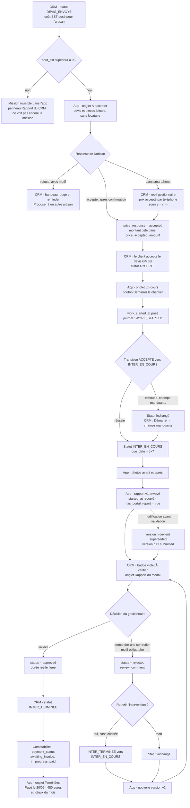
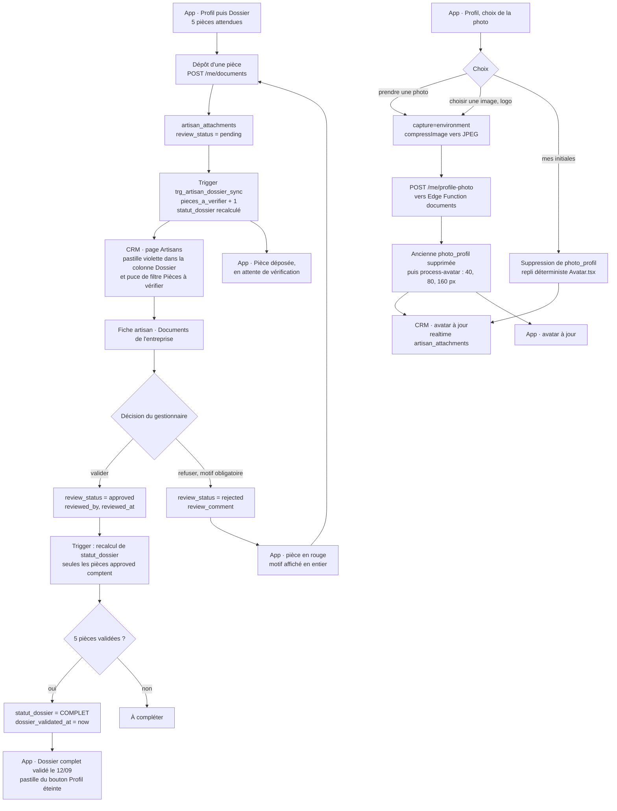

# Vision portail artisans : spécification

> **Statut** : spécification retenue, à implémenter. Écrite le 2026-09-05 à partir de trois propositions
> concurrentes arbitrées par deux jugements croisés (technique et produit). Base retenue :
> proposition « chemin le plus court », augmentée des greffes des deux autres et corrigée des erreurs
> relevées.
> **Branches** : CRM `visiondeposedocs`, portail `vision-deposedocs`.
> **Rien n'est appliqué** : aucune migration jouée, aucun code modifié à la date de rédaction.
> **Plan d'exécution** : [docs/guides/portail-vision-plan-lots.md](../guides/portail-vision-plan-lots.md).
> **Contrat d'API courant** : [portail-demo-contrat-api.md](portail-demo-contrat-api.md) — à mettre à jour au fil des lots.
> **État des lieux** : [portail-artisans-v2.md](portail-artisans-v2.md).

---

## 1. Résumé exécutif et principes

### 1.1 Ce qui change, en douze lignes

1. L'artisan voit ses missions **dès `DEVIS_ENVOYE`**, et non plus seulement à partir d'`ACCEPTE` — mais seulement si un prix SST lui a été posé, et **sans les coordonnées du locataire**.
2. Il **accepte ou refuse le prix** depuis l'application ; le montant est gelé au moment du oui, et un verrou optimiste interdit d'accepter un prix qui a bougé entre l'affichage et le clic.
3. Il **déclare le début du chantier** ; le CRM fait basculer l'intervention en `INTER_EN_COURS` et affiche la dette de saisie restante plutôt que de bloquer l'artisan.
4. La **durée réelle** devient calculable : `artisan_reports.submitted_at − artisan_reports.started_at`, affichée à côté de la durée déclarative.
5. Une intervention peut porter **plusieurs rapports** : un par artisan, et plusieurs versions successives par artisan. Un rapport reste modifiable tant qu'il n'est pas validé.
6. Le modal d'intervention gagne **deux onglets** dans la colonne de droite — « Infos » et « Rapport » — avec sélecteur de rapports, frise des versions et visionneuse de photos filtrée par version.
7. Le panneau « Rapport » n'est **jamais vide** : il affiche l'état de l'affectation (prix non posé, prix proposé, refusé, accepté, démarré depuis 5 h 22, rapport reçu), un bloc par artisan.
8. Toute **action de l'artisan** est journalisée (`artisan_portal_actions`) : c'est la seconde moitié du point 8 du verbatim, que la seule liste des versions ne couvrait pas.
9. Le **dossier de pièces** quitte la barre d'onglets et passe sous le profil ; une pièce déposée part « à vérifier », le gestionnaire valide ou refuse **avec motif**, et l'artisan voit « Dossier complet validé le … ».
10. `statut_dossier` cesse de mentir : seules les pièces **validées** comptent, ce qui rend le badge « COMPLET » du CRM vrai.
11. L'artisan pose une **photo de profil** (appareil photo, galerie/logo, ou repli initiales), synchronisée avec l'avatar du CRM par `process-avatar`.
12. Le pied de page du portail passe à **trois onglets** — À accepter / En cours / Terminées — et les missions terminées portent le **statut de paiement** et le montant dû à cet artisan.

### 1.2 Principes

| # | Principe | Conséquence pratique |
|---|---|---|
| P1 | **Le CRM est la seule source de vérité.** | Le portail n'a pas de base ; tout libellé métier (paiement, groupe de mission, verdict de pièce) est calculé côté CRM et transmis, jamais recalculé côté portail. |
| P2 | **On ajoute des colonnes, pas des mécaniques.** | Trois migrations, une table nouvelle (le journal), aucun trigger de projection métier, aucune refonte du moteur de workflow. |
| P3 | **Le fait ne meurt pas de l'échec de la projection.** | Un démarrage déclaré s'enregistre même si la transition de statut échoue ; le CRM signale alors ce qui manque. |
| P4 | **Séparation RGPD stricte.** | `PORTAL_TENANT_STATUSES` reste **strictement plus étroit** que `PORTAL_VISIBLE_STATUSES` : en `DEVIS_ENVOYE`, ni nom ni téléphone du locataire. |
| P5 | **Toute écriture portail est idempotente.** | Le téléphone travaille hors ligne et rejoue : enveloppe `{ event_uid, occurred_at }` sur toutes les routes d'écriture. |
| P6 | **Aucune surface de fuite nouvelle.** | Toute table touchée ou créée reçoit `ENABLE ROW LEVEL SECURITY`, ses policies `authenticated`, et un `REVOKE ALL … FROM anon` — avec test de non-régression à la clé anon. |
| P7 | **Le geste financier se confirme.** | Accepter un prix et démarrer un chantier passent par une confirmation explicite côté artisan, et par un verrou optimiste côté serveur. |
| P8 | **La démo doit rester vraie.** | Toute règle métier ajoutée côté CRM est répliquée dans `portal_gmbs/src/lib/mock/api.ts` dans le même lot — le mock réimplémente les règles, il ne se contente pas de servir des données. |

### 1.3 Ce que la spécification abandonne explicitement

| Abandon | Ce qu'on perd | Réversible ? |
|---|---|---|
| Pas de table `artisan_report_revisions` (historique champ à champ) | On saura « v2 envoyée le 12/09 après la remarque du gestionnaire », pas « le champ matériel a été corrigé à 14 h 02 ». Le journal `artisan_portal_actions` enregistre en revanche l'**événement** « rapport modifié » avec la liste des champs touchés. | Oui, table additive |
| Pas de colonne `cycle` / `cycle_reason` sur les rapports | On ne distingue pas nativement « v1 du cycle SAV » de « v4 de l'intervention ». Reconstituable en croisant `submitted_at` avec `intervention_status_transitions`. | Oui |
| Le contenu de l'app n'est pas le HTML de l'e-mail | Le corps du mail est construit **côté client** à partir de l'état non enregistré du formulaire (`useInterventionFormState.ts:300-331` → `EmailEditModal`) : le rejouer côté serveur produirait des divergences. On garantit l'équivalence des **données** et l'identité des **pièces jointes** (§5.6), pas le pixel-perfect. | Oui |
| Aucune refonte du moteur de workflow | La dette « trois chemins de changement de statut, trois contrôles » reste entière. On n'ajoute qu'un quatrième chemin, et c'est le seul à porter une garde de transition explicite. | — |
| Le canal WhatsApp reste non couvert | Un troisième canal (`whatsapp.ts`, textes jumeaux sans pièce jointe) continue d'exister en parallèle de l'e-mail et de l'app. | — |

---

## 2. Parcours cible

### 2.1 De l'attribution au paiement



**Lecture** : l'artisan est en amont du client. Le prix se négocie en `DEVIS_ENVOYE`, avant que le
client n'ait accepté le devis GMBS ; c'est pourquoi `ACCEPTE` — qui signifie « **le client** a
accepté le devis » (`workflow-rules.ts:115,126`) — n'est **jamais** posé par une action de l'artisan.

### 2.2 Le dossier de pièces et l'avatar



**Point clé** : la photo de profil **n'entre pas** dans le compteur « à vérifier ». Elle est insérée
sans `review_status = 'pending'` — sinon chaque changement d'avatar créerait une tâche fantôme
pour le gestionnaire.

---

## 3. Modèle de données

### 3.0 Ce qu'on ne touche pas, et pourquoi

| Objet | Décision | Motif vérifié |
|---|---|---|
| `intervention_artisans` — dédoublonnage préalable | **aucun** | La contrainte `UNIQUE (intervention_id, artisan_id)` existe depuis `00001_clean_schema.sql:343` et aucune migration ultérieure ne la supprime. Le `DELETE` de dédoublonnage proposé ailleurs porterait sur un problème qui ne peut pas exister. `src/lib/database.types.ts` est périmé (généré avant `99076`) : **il n'est pas une source de vérité du schéma**. |
| `ux_artisan_reports_intervention_artisan_version` (`99076:188-189`) | **conservé tel quel** | `artisan_reports` est déjà « une ligne par version ». Pas de colonne `cycle` ⇒ pas de reconstruction d'index. |
| `fn_artisan_reports_sync_flag` / `trg_artisan_reports_sync_flag` (`99076:251-270`) | **inchangés** | `has_portal_report = EXISTS(status='submitted')` reste juste avec N rapports et avec le nouvel état `superseded` (§3.4). |
| `intervention_payments` | **jamais lue par le portail** | `is_received` est un encaissement **client**, et `acompte_sst` n'a pas d'`artisan_order` (`00001:360-371`) : faux sur une intervention à deux artisans, et divulgation interdite. |
| `intervention_audit_log` | **non détournée** | `actor_user_id` est une FK vers `public.users` (un artisan n'en a pas) et `source` porte un CHECK fermé sans `'portal'` (`00037:291,331`). La détourner reproduirait l'incident « artisan_audit_log sans acteur ». |
| `artisan_report_photos` (`00069`) | **laissée orpheline** | Table de production référencée par zéro ligne de code. Ne pas la réveiller. |
| `src/lib/workflow-engine.ts`, `workflow-rules.ts` | **inchangés** | Aucun déplacement des 14 champs obligatoires de `INTER_EN_COURS`. |

### 3.1 Migration `99078_portal_v2_socle.sql`

Numéro vérifié libre : `ls supabase/migrations/` s'arrête à `99077_portal_realtime.sql` (99068 et
99069 sont des trous). Conventions : `NNNNN_snake_case.sql`, idempotence intégrale,
`DROP FUNCTION IF EXISTS` avant tout `CREATE FUNCTION` (rappel `99076:17`, incident `42P13` en
production).

> **Prérequis** : `99076` et `99077` ne sont pas encore appliquées en production. La `99078` les
> suppose. Elle est jouée **uniquement en local** (`supabase db reset`) pendant tout le
> développement ; l'application en production relève du plan de bascule, jamais d'un lot.

```sql
-- =====================================================================
-- 99078_portal_v2_socle.sql
-- Vision portail artisans v2 — socle.
-- Aucune table nouvelle : colonnes sur 4 tables existantes + sécurisation
-- de intervention_artisans (RLS + REVOKE anon), qui n'en avait aucune.
-- Prérequis : 99076 (artisan_reports convergée), 99077 (realtime portail).
-- =====================================================================

-- ---------------------------------------------------------------------
-- 1. RAPPORTS : versions remplacées, début de chantier figé
-- ---------------------------------------------------------------------

-- 1.a  version devient NOT NULL (aujourd'hui nullable, DEFAULT 1 — 99076:116)
UPDATE public.artisan_reports SET version = 1 WHERE version IS NULL;
ALTER TABLE public.artisan_reports ALTER COLUMN version SET NOT NULL;

-- 1.b  Nouvel état 'superseded' : une v(n) remplacée par une v(n+1) AVANT validation.
--      Le CHECK de 99076:142 n'admettait que submitted | approved | rejected.
ALTER TABLE public.artisan_reports DROP CONSTRAINT IF EXISTS artisan_reports_status_check;
ALTER TABLE public.artisan_reports
  ADD CONSTRAINT artisan_reports_status_check
  CHECK (status IN ('submitted','approved','rejected','superseded'));

ALTER TABLE public.artisan_reports
  ADD COLUMN IF NOT EXISTS superseded_at TIMESTAMPTZ,
  ADD COLUMN IF NOT EXISTS superseded_by UUID
      REFERENCES public.artisan_reports(id) ON DELETE SET NULL;

COMMENT ON COLUMN public.artisan_reports.superseded_by IS
  'Version qui remplace celle-ci. Une modification par l''artisan avant validation cree une '
  'nouvelle ligne (version + 1) et bascule la precedente en status = ''superseded''.';

-- 1.c  Au plus UN rapport en attente par couple (intervention, artisan).
--      Garantit que fn_artisan_reports_sync_flag (EXISTS status='submitted') reste sans
--      ambiguite et que la revue sait quel rapport traiter.
CREATE UNIQUE INDEX IF NOT EXISTS ux_artisan_reports_one_open
  ON public.artisan_reports(intervention_id, artisan_id)
  WHERE status = 'submitted';

-- 1.d  Debut de chantier recopie sur le rapport a l'envoi : fige la duree reelle.
ALTER TABLE public.artisan_reports
  ADD COLUMN IF NOT EXISTS started_at TIMESTAMPTZ;
COMMENT ON COLUMN public.artisan_reports.started_at IS
  'Copie de intervention_artisans.work_started_at au moment de l''envoi du rapport. '
  'Duree reelle = submitted_at - started_at. Ne pas confondre avec duree_minutes, '
  'qui reste la saisie DECLARATIVE de l''artisan (99076:119).';

-- ---------------------------------------------------------------------
-- 2. PAR ARTISAN : prix, demarrage, paiement
--    intervention_artisans a deja UNIQUE(intervention_id, artisan_id) — 00001:343.
--    Elle est deja en realtime (00085:13,26-30) et deja ecoutee par le SSE portail
--    (app/api/portal-external/me/stream/route.ts:141-158, event '*', filter artisan_id).
--    => tout ce qu'on ecrit ici remonte dans l'application sans une ligne de SSE en plus.
-- ---------------------------------------------------------------------

ALTER TABLE public.intervention_artisans
  -- A2 : l'artisan accepte ou refuse le prix depuis son application
  ADD COLUMN IF NOT EXISTS price_response TEXT
      CHECK (price_response IS NULL OR price_response IN ('accepted','refused')),
  ADD COLUMN IF NOT EXISTS price_responded_at    TIMESTAMPTZ,
  ADD COLUMN IF NOT EXISTS price_accepted_amount NUMERIC(12,2),
  ADD COLUMN IF NOT EXISTS price_refused_reason  TEXT,
  ADD COLUMN IF NOT EXISTS price_response_source TEXT
      CHECK (price_response_source IS NULL OR price_response_source IN ('portal','crm')),
  ADD COLUMN IF NOT EXISTS price_response_by     UUID REFERENCES public.users(id) ON DELETE SET NULL,
  -- A4 : l'artisan declare le debut du chantier
  ADD COLUMN IF NOT EXISTS work_started_at   TIMESTAMPTZ,
  ADD COLUMN IF NOT EXISTS work_started_from TEXT
      CHECK (work_started_from IS NULL OR work_started_from IN ('portal','crm')),
  ADD COLUMN IF NOT EXISTS work_started_by   UUID REFERENCES public.users(id) ON DELETE SET NULL,
  -- C11 : ou en est la prise en charge par GMBS, pour CET artisan
  ADD COLUMN IF NOT EXISTS payment_status TEXT NOT NULL DEFAULT 'not_applicable'
      CHECK (payment_status IN ('not_applicable','awaiting_invoice','in_progress','paid')),
  ADD COLUMN IF NOT EXISTS paid_at            TIMESTAMPTZ,
  ADD COLUMN IF NOT EXISTS payment_updated_by UUID REFERENCES public.users(id) ON DELETE SET NULL,
  ADD COLUMN IF NOT EXISTS payment_updated_at TIMESTAMPTZ;

COMMENT ON COLUMN public.intervention_artisans.price_accepted_amount IS
  'Montant GELE au moment du oui de l''artisan (copie de intervention_costs.amount, '
  'cost_type = ''sst'', pour son artisan_order). Sans ce gel, la modale e-mail peut modifier le '
  'cout SST a posteriori (EmailEditModal.tsx:460-503 persiste le prix via upsertCost) sans trace '
  'de ce qui a ete accepte.';

COMMENT ON COLUMN public.intervention_artisans.price_response_source IS
  'portal = l''artisan a repondu depuis son application ; crm = le gestionnaire a saisi une '
  'reponse recue par telephone. Repli indispensable : sans lui, un artisan sans smartphone ne '
  'peut jamais franchir la garde de POST /start.';

COMMENT ON COLUMN public.intervention_artisans.payment_status IS
  'Statut de paiement DE CET ARTISAN, saisi par le gestionnaire. Ne jamais deriver de '
  'intervention_payments.is_received : c''est un encaissement CLIENT, et acompte_sst n''a pas '
  'd''artisan_order (00001:360-371) — faux sur une intervention a deux artisans.';

CREATE INDEX IF NOT EXISTS idx_intervention_artisans_payment
  ON public.intervention_artisans(payment_status)
  WHERE payment_status <> 'not_applicable';

-- ---------------------------------------------------------------------
-- 2.b  SECURITE de intervention_artisans — CORRECTIF, absent des trois propositions.
--      00001:738-747 grante ALL ON ALL TABLES a anon ET pose ALTER DEFAULT PRIVILEGES.
--      Or (grep sur supabase/migrations/) intervention_artisans n'a NI RLS NI REVOKE,
--      contrairement a artisan_attachments (couverte par 99057).
--      Poser price_accepted_amount / paid_at / payment_status ici rendrait le montant du a
--      chaque artisan lisible avec la cle anon — la fuite deja constatee sur les tables enfant.
--      Policies « authenticated = confiance » : meme modele que 99057, sinon RLS sans policy
--      = deny-all et on reproduit le lockout de l'avatar artisan.
-- ---------------------------------------------------------------------

ALTER TABLE public.intervention_artisans ENABLE ROW LEVEL SECURITY;

DROP POLICY IF EXISTS "Allow read access for authenticated users"   ON public.intervention_artisans;
DROP POLICY IF EXISTS "Allow insert access for authenticated users" ON public.intervention_artisans;
DROP POLICY IF EXISTS "Allow update access for authenticated users" ON public.intervention_artisans;
DROP POLICY IF EXISTS "Allow delete access for authenticated users" ON public.intervention_artisans;
DROP POLICY IF EXISTS "service_role full access"                    ON public.intervention_artisans;

CREATE POLICY "Allow read access for authenticated users"
  ON public.intervention_artisans FOR SELECT TO authenticated USING (true);
CREATE POLICY "Allow insert access for authenticated users"
  ON public.intervention_artisans FOR INSERT TO authenticated WITH CHECK (true);
CREATE POLICY "Allow update access for authenticated users"
  ON public.intervention_artisans FOR UPDATE TO authenticated USING (true) WITH CHECK (true);
CREATE POLICY "Allow delete access for authenticated users"
  ON public.intervention_artisans FOR DELETE TO authenticated USING (true);
CREATE POLICY "service_role full access"
  ON public.intervention_artisans FOR ALL TO service_role USING (true) WITH CHECK (true);

REVOKE ALL ON public.intervention_artisans FROM anon;

-- ---------------------------------------------------------------------
-- 3. PIECES DU DOSSIER : vérification par le gestionnaire (D16, D17)
--    review_status existe deja (99076:236-240) mais aucune UI ni route ne l'ecrit.
-- ---------------------------------------------------------------------

ALTER TABLE public.artisan_attachments
  ADD COLUMN IF NOT EXISTS reviewed_by    UUID REFERENCES public.users(id) ON DELETE SET NULL,
  ADD COLUMN IF NOT EXISTS reviewed_at    TIMESTAMPTZ,
  ADD COLUMN IF NOT EXISTS review_comment TEXT;

COMMENT ON COLUMN public.artisan_attachments.reviewed_at IS
  'Discriminant « reellement verifiee » : review_status a pour DEFAULT ''approved'' (99076:236), '
  'donc « validee » et « jamais regardee » sont indiscernables sur l''historique. '
  'reviewed_at IS NOT NULL = une decision humaine a ete prise apres la mise en service.';

CREATE INDEX IF NOT EXISTS idx_artisan_attachments_pending
  ON public.artisan_attachments(artisan_id) WHERE review_status = 'pending';

-- Compteur denormalise : indispensable. Un filtre par embed artisan_attachments!inner(...)
-- casserait le count exact de la pagination (doublons de jointure) et les puces lancent deja
-- 6+ count en parallele (useArtisanFilterCounts.ts:214-242).
ALTER TABLE public.artisans
  ADD COLUMN IF NOT EXISTS pieces_a_verifier    INTEGER NOT NULL DEFAULT 0,
  ADD COLUMN IF NOT EXISTS dossier_validated_at TIMESTAMPTZ,
  ADD COLUMN IF NOT EXISTS dossier_validated_by UUID REFERENCES public.users(id) ON DELETE SET NULL;

-- ---------------------------------------------------------------------
-- 4. statut_dossier tient enfin compte de la verification
--    Regle actuelle (99015:7-43) : compte les kinds requis, IGNORE review_status
--    => un depot portail 'pending' fait passer le dossier a COMPLET sans verification.
--    DROP avant CREATE : obligatoire (99076:17, incident 42P13 en production).
-- ---------------------------------------------------------------------

DROP FUNCTION IF EXISTS public.calculate_artisan_dossier_status(UUID);
CREATE FUNCTION public.calculate_artisan_dossier_status(artisan_uuid UUID)
RETURNS TEXT
LANGUAGE plpgsql SECURITY DEFINER SET search_path = public AS $$
DECLARE
  v_required TEXT[] := ARRAY['kbis','assurance','cni_recto_verso','iban','decharge_partenariat'];
  v_ok INTEGER;
BEGIN
  -- COALESCE, PAS « IN ('approved', NULL) » : en SQL, x IN (…, NULL) ne vaut jamais vrai
  -- pour NULL, et le CHECK de 99076:239-240 tolere explicitement NULL. Ecrit autrement,
  -- des artisans aujourd'hui COMPLET basculeraient — l'inverse de la non-regression voulue.
  -- Le DEFAULT 'approved' de review_status protege les milliers de pieces historiques :
  -- seuls les depots portail ('pending') attendent desormais une verification.
  SELECT COUNT(DISTINCT lower(kind)) INTO v_ok
  FROM public.artisan_attachments
  WHERE artisan_id = artisan_uuid
    AND lower(kind) = ANY(v_required)
    AND COALESCE(review_status, 'approved') = 'approved';

  IF v_ok >= 5 THEN RETURN 'COMPLET';
  ELSIF v_ok = 0 THEN RETURN 'INCOMPLET';
  ELSE RETURN 'À compléter';
  END IF;
END $$;

-- 4.b  Recalcul + compteur « a verifier » + date de validation du dossier.
--      Les triggers de 00008:89-99 n'ecoutent QUE INSERT et DELETE : valider une piece est un
--      UPDATE, il ne recalculait donc rien.
DROP FUNCTION IF EXISTS public.fn_artisan_dossier_sync() CASCADE;
CREATE FUNCTION public.fn_artisan_dossier_sync()
RETURNS TRIGGER
LANGUAGE plpgsql SECURITY DEFINER SET search_path = public AS $$
DECLARE
  v_artisan UUID := COALESCE(NEW.artisan_id, OLD.artisan_id);
  v_statut  TEXT;
  v_pending INTEGER;
BEGIN
  IF v_artisan IS NULL THEN RETURN COALESCE(NEW, OLD); END IF;

  v_statut := public.calculate_artisan_dossier_status(v_artisan);
  SELECT COUNT(*) INTO v_pending
    FROM public.artisan_attachments
   WHERE artisan_id = v_artisan AND review_status = 'pending';

  UPDATE public.artisans a
     SET statut_dossier       = v_statut,
         pieces_a_verifier    = v_pending,
         -- horodatage pose au premier passage a COMPLET, efface si le dossier redevient incomplet
         dossier_validated_at = CASE
             WHEN v_statut = 'COMPLET' AND a.dossier_validated_at IS NULL THEN now()
             WHEN v_statut <> 'COMPLET' THEN NULL
             ELSE a.dossier_validated_at END
   WHERE a.id = v_artisan
     -- garde anti-ecriture inutile : artisans est en REPLICA IDENTITY FULL (00085:10),
     -- chaque UPDATE sans changement coute du WAL logique et un evenement realtime.
     AND (a.statut_dossier IS DISTINCT FROM v_statut
          OR a.pieces_a_verifier IS DISTINCT FROM v_pending);

  RETURN COALESCE(NEW, OLD);
END $$;

-- CORRECTIF : supprimer les deux anciens triggers, sinon DEUX ecrivains de statut_dossier
-- sur le meme INSERT, sur une table publiee en realtime (doublon d'ecriture gratuit).
DROP TRIGGER IF EXISTS trigger_update_dossier_status_on_attachment_insert ON public.artisan_attachments;
DROP TRIGGER IF EXISTS trigger_update_dossier_status_on_attachment_delete ON public.artisan_attachments;

DROP TRIGGER IF EXISTS trg_artisan_dossier_sync ON public.artisan_attachments;
CREATE TRIGGER trg_artisan_dossier_sync
  AFTER INSERT OR DELETE OR UPDATE OF review_status, kind
  ON public.artisan_attachments
  FOR EACH ROW EXECUTE FUNCTION public.fn_artisan_dossier_sync();

-- 4.c  Rattrapage du compteur sur l'existant.
UPDATE public.artisans a
   SET pieces_a_verifier = COALESCE(p.n, 0)
  FROM (SELECT artisan_id, COUNT(*) n FROM public.artisan_attachments
         WHERE review_status = 'pending' GROUP BY artisan_id) p
 WHERE a.id = p.artisan_id
   AND a.pieces_a_verifier IS DISTINCT FROM COALESCE(p.n, 0);
```

**Second écrivain de `statut_dossier`** : `update_artisan_status_on_intervention_completion`
(`00008`, réécrite en `00055` et `00072`) recalcule aussi le dossier. **Vérifié** :
`00072_fix_artisan_status_all_linked.sql` l. 45, 68, 110, 141 — comme `00055` l. 62, 104, 127 —
appelle bien `calculate_artisan_dossier_status`, jamais une règle en dur. Il hérite donc
automatiquement de la fonction corrigée. **Aucun travail supplémentaire, aucune réserve.**

### 3.2 Migration `99079_artisan_portal_actions.sql`

Le versionnement seul rend « v2 envoyée le 12/09 » mais pas « accepté le 10/09 à 9 h 12 » ni
« rapport modifié à 15 h 10 ». Le point 8 du verbatim demande **les deux** : l'historique des
modifications *et* des actions de l'artisan. Une table, aucune projection par trigger, aucune
publication realtime.

```sql
-- =====================================================================
-- 99079_artisan_portal_actions.sql
-- Journal append-only des actions de l'artisan depuis le portail (et de leur
-- equivalent saisi au CRM). Repond a « historique des actions de l'artisan ».
--
-- CE QUE CETTE TABLE N'EST PAS :
--   - pas une source de verite : les etats vivent sur intervention_artisans et
--     artisan_reports, ecrits par les routes serveur dans la meme transaction ;
--   - pas un moteur : aucun trigger de projection, aucune logique metier en PL/pgSQL
--     (CLAUDE.md : la logique metier vit dans la couche API) ;
--   - pas publiee en realtime : le journal se lit a la demande, il n'alourdit pas le WAL.
-- =====================================================================

CREATE TABLE IF NOT EXISTS public.artisan_portal_actions (
  id              UUID PRIMARY KEY DEFAULT gen_random_uuid(),

  -- Acteur : jamais nul des deux cotes a la fois (lecon d'artisan_audit_log, 92 % sans acteur).
  artisan_id      UUID NOT NULL REFERENCES public.artisans(id) ON DELETE CASCADE,
  actor_user_id   UUID REFERENCES public.users(id) ON DELETE SET NULL, -- rempli si source='crm'
  source          TEXT NOT NULL DEFAULT 'portal'
                  CHECK (source IN ('portal','crm')),

  -- Objet
  intervention_id UUID REFERENCES public.interventions(id) ON DELETE CASCADE,
  report_id       UUID REFERENCES public.artisan_reports(id) ON DELETE SET NULL,
  attachment_id   UUID,   -- volontairement SANS FK : cible artisan_attachments OU
                          -- intervention_attachments selon action_type.

  action_type     TEXT NOT NULL CHECK (action_type IN (
                    'PRICE_ACCEPTED','PRICE_REFUSED',
                    'WORK_STARTED',
                    'REPORT_SUBMITTED','REPORT_REPLACED',
                    'PHOTO_UPLOADED',
                    'DOCUMENT_UPLOADED','DOCUMENT_APPROVED','DOCUMENT_REJECTED',
                    'AVATAR_CHANGED','DECHARGE_SIGNED',
                    'REPORT_APPROVED','REPORT_REJECTED')),

  payload         JSONB NOT NULL DEFAULT '{}'::jsonb,

  -- Deux horloges : le telephone travaille hors ligne et rejoue.
  occurred_at     TIMESTAMPTZ NOT NULL DEFAULT now(),  -- declare par le client, borne cote serveur
  recorded_at     TIMESTAMPTZ NOT NULL DEFAULT now(),  -- pose par le serveur, fait foi pour l'audit

  -- Idempotence : meme mecanisme que portal_report_id (index unique partiel, 99076:186-187).
  event_uid       TEXT,

  created_at      TIMESTAMPTZ NOT NULL DEFAULT now()
);

CREATE UNIQUE INDEX IF NOT EXISTS ux_artisan_portal_actions_event_uid
  ON public.artisan_portal_actions(event_uid) WHERE event_uid IS NOT NULL;
CREATE INDEX IF NOT EXISTS idx_artisan_portal_actions_artisan
  ON public.artisan_portal_actions(artisan_id, occurred_at DESC);
CREATE INDEX IF NOT EXISTS idx_artisan_portal_actions_intervention
  ON public.artisan_portal_actions(intervention_id, occurred_at DESC)
  WHERE intervention_id IS NOT NULL;

COMMENT ON TABLE public.artisan_portal_actions IS
  'Journal append-only des actions de l''artisan (portail) et de leurs equivalents saisis au CRM. '
  'Lecture seule pour authenticated ; ecriture par les routes serveur uniquement (service_role).';
COMMENT ON COLUMN public.artisan_portal_actions.occurred_at IS
  'Horodatage DECLARE. Borne cote serveur a [now - 7 jours, now + 5 min] : hors bornes, on garde '
  'la valeur brute dans payload.occurred_at_declared, on aligne occurred_at sur recorded_at et on '
  'pose payload.clock_skew = true. Le fait n''est JAMAIS rejete pour une horloge fausse.';

-- Securite : ALTER DEFAULT PRIVILEGES (00001:732-747) grante ALL a anon et authenticated
-- sur toute table CREEE dans public. On revoque nominativement.
ALTER TABLE public.artisan_portal_actions ENABLE ROW LEVEL SECURITY;

DROP POLICY IF EXISTS "Allow read access for authenticated users" ON public.artisan_portal_actions;
DROP POLICY IF EXISTS "service_role full access"                  ON public.artisan_portal_actions;

CREATE POLICY "Allow read access for authenticated users"
  ON public.artisan_portal_actions FOR SELECT TO authenticated USING (true);
CREATE POLICY "service_role full access"
  ON public.artisan_portal_actions FOR ALL TO service_role USING (true) WITH CHECK (true);

REVOKE ALL ON public.artisan_portal_actions FROM anon;
REVOKE INSERT, UPDATE, DELETE ON public.artisan_portal_actions FROM authenticated;
GRANT  SELECT ON public.artisan_portal_actions TO authenticated;
```

**Immuabilité sans trigger, volontairement.** Un `BEFORE UPDATE OR DELETE … RAISE EXCEPTION`
combiné aux FK `ON DELETE CASCADE` de la même table rendrait **impossible** la suppression d'un
artisan ou d'une intervention — pour tout le monde, `service_role` compris — alors que le CRM
supprime réellement des interventions (`src/lib/api/interventions/server.ts:250`). L'immuabilité
est donc applicative : `REVOKE INSERT, UPDATE, DELETE … FROM authenticated`, écriture par les
routes serveur seules.

**Pas de `ALTER PUBLICATION`.** Le journal n'est pas publié en temps réel. C'est un choix : il évite
d'alourdir le WAL logique (quota Presence déjà à ~30 %) et supprime d'emblée le piège
d'idempotence de `ALTER PUBLICATION … ADD TABLE` nu, qui échoue au rejeu (`duplicate_object`) et
sur une base sans publication. Si le besoin apparaissait, reprendre le motif gardé de
`99077:17-34` ou de `00085:16-35`.

### 3.3 Migration `99080_report_attachments_link.sql` (lot ultérieur)

`artisan_reports.attachment_ids uuid[]` est déjà peuplée et déjà exposée. Elle suffit à la
visionneuse (`.in('id', attachment_ids)`), mais elle n'a pas de FK et n'est pas maintenue à la
suppression d'une photo : avec trois versions, la visionneuse peut mélanger les photos de la v1 et
de la v3. Trois lignes de DDL suppriment une classe entière de bugs d'affichage.

```sql
-- =====================================================================
-- 99080_report_attachments_link.sql
-- Lien fort photo -> version de rapport. Complete attachment_ids uuid[]
-- (conservee : lue par le portail et par PORTAL_REPORT_COLUMNS).
-- =====================================================================

ALTER TABLE public.intervention_attachments
  ADD COLUMN IF NOT EXISTS artisan_report_id UUID
      REFERENCES public.artisan_reports(id) ON DELETE SET NULL;

CREATE INDEX IF NOT EXISTS idx_intervention_attachments_report
  ON public.intervention_attachments(artisan_report_id)
  WHERE artisan_report_id IS NOT NULL;

-- Backfill depuis attachment_ids, sans ecraser une valeur deja posee.
UPDATE public.intervention_attachments ia
   SET artisan_report_id = r.id
  FROM public.artisan_reports r
 WHERE ia.id = ANY(r.attachment_ids)
   AND ia.artisan_report_id IS NULL;

COMMENT ON COLUMN public.intervention_attachments.artisan_report_id IS
  'Version de rapport a laquelle cette photo est rattachee. attachment_ids reste la source lue '
  'par le portail ; cette colonne est la source lue par la visionneuse du CRM.';
```

> `intervention_attachments` est déjà en `REPLICA IDENTITY FULL` et publiée (`99077:38-41`) : une
> colonne de plus y coûte du WAL. C'est le prix, assumé, de photos correctement rattachées.

### 3.4 Impact sur `has_portal_report` et le trigger existant

| Question | Réponse |
|---|---|
| Le trigger `trg_artisan_reports_sync_flag` doit-il changer ? | **Non.** Il calcule `has_portal_report = EXISTS(SELECT 1 … WHERE status = 'submitted')` (`99076:257-270`). Avec N rapports, il reste vrai tant qu'au moins un est en attente — exactement ce qu'on veut. |
| L'état `superseded` le casse-t-il ? | **Non.** `superseded` n'est pas `submitted` : une version remplacée sort du drapeau, la nouvelle l'y remet, et l'index partiel `ux_artisan_reports_one_open` garantit qu'il n'y en a qu'une à la fois. |
| Deux artisans, l'un validé et l'autre en attente ? | Le drapeau reste **vrai** : c'est le correctif QA du 2026-09-02 et il est conservé tel quel. |
| Où le drapeau est-il visible ? | Badge violet « À vérifier » (`portal-report-status.ts`), restreint à `ACCEPTE / INTER_EN_COURS / SAV` (l. 13). **Correctif requis** : ajouter `INTER_TERMINEE` à `PORTAL_REPORT_REVIEW_STATUSES` — sinon un rapport en attente sur une intervention terminée est invisible dans le CRM alors que `has_portal_report` vaut `true`. Trou préexistant que l'élargissement rend plus probable. |
| `interventions` gagne-t-elle une colonne ? | **Non.** Aucune colonne nouvelle sur `interventions` : elle est en `REPLICA IDENTITY FULL` (`00084`) et chaque écriture y déclenche un événement realtime pour tous les gestionnaires connectés. |

### 3.5 Après application locale

1. **Régénérer `src/lib/database.types.ts`.** Il est périmé depuis avant `99076` (`content NOT NULL`,
   pas de `version`, pas de `review_status`) : tout code neuf typé dessus ne compilera pas.
2. **Le juge est `npm run build`**, pas `tsc` seul : le build Vercel exécute ESLint.
3. **Test de non-régression à la clé anon** (§4.6) : avec la clé anon, `intervention_artisans` et
   `artisan_portal_actions` doivent renvoyer 0 ligne ou une erreur de permission.
4. **Vérifier `SUPABASE_SERVICE_ROLE_KEY`** : `createServerSupabaseAdmin` retombe sur la clé anon
   quand elle est absente (`src/lib/supabase/server.ts:12-14`). Après le `REVOKE`, cette bascule
   silencieuse casserait toutes les routes portail au lieu de dégrader — à transformer en échec
   explicite, ou au minimum à surveiller en démo locale.

---

## 4. Contrat d'API

### 4.1 Conventions

- **Authentification portail → CRM** : `X-GMBS-Key-Id` + `X-GMBS-Secret` (M2M, `timingSafeEqual`)
  **et** `X-Portal-Token` (identité de l'artisan). Inchangé.
- **Authentification gestionnaire** : session Supabase + `requirePermission(request, '<permission>')`.
- **Codes** : `400` validation, `401` auth, `404` uniforme pour une ressource qui n'appartient pas à
  l'artisan (jamais `403` révélateur), `409` conflit d'état, `413` corps trop grand, `415` MIME
  refusé, `503` portail non configuré.
- **Enveloppe d'idempotence** — obligatoire sur toute écriture portail :

```jsonc
{ "event_uid": "uuid généré par le téléphone", "occurred_at": "2026-09-12T08:12:04.000Z" }
```

  `event_uid` déjà connu ⇒ **`200` avec le résultat déjà enregistré**, jamais `409`.
  `occurred_at` optionnel, borné à `[now − 7 j, now + 5 min]` ; hors bornes on conserve la valeur
  brute dans `payload.occurred_at_declared`, on aligne `occurred_at` sur `recorded_at` et on pose
  `payload.clock_skew = true`. **Un fait n'est jamais rejeté pour une horloge fausse.**
- Le proxy du portail (`portal_gmbs/src/lib/server/proxy.ts`) relaie code HTTP et corps **tels
  quels**. Toute route CRM nouvelle a son proxy jumeau de trois lignes.

### 4.2 CRM — routes portail (`app/api/portal-external/…`)

| Méthode et chemin | État | Corps de requête | Réponse | Erreurs | Garde |
|---|---|---|---|---|---|
| `GET /me` | **modifiée** | — | `documents:{present, required, pending, rejected}` (au lieu de `present`/`required`), `avatar:{url, sizes}｜null`, `dossier_validated_at`, `counters` recalés sur les 3 groupes | `401`, `503` | jeton portail |
| `GET /me/interventions` | **modifiée** | — | + `groupe` (`a_accepter｜en_cours｜terminee`), + `price{…}`, + `work{…}`, + `payment{…}` (§4.2.1) | `401`, `503` | jeton ; visibilité §7.1 |
| `GET /me/interventions/{id}` | **modifiée** | — | `documents.devis[]` enrichi (`kind, mime_type, file_size, created_at`), `documents.factures[]` ajouté (`kind='facturesArtisans'` **uniquement**), `reports[]` remplace `report` (`report` conservé = le premier de la liste, rétro-compat) | `401`, `404` | jeton ; affectation |
| `POST /me/interventions/{id}/price` | **nouvelle** | `{event_uid, occurred_at?, response:'accepted'｜'refused', amount_seen, reason?}` | `200 {price:{response, responded_at, accepted_amount}}` | `409 price_unavailable` (cout_sst absent) · `409 status_not_allowed` · **`409 price_changed` + `current_amount`** (verrou optimiste) · rejeu ⇒ `200` | jeton ; statut ∈ `PORTAL_PRICE_STATUSES` ; affectation ; `amount_seen` = `cout_sst` courant |
| `POST /me/interventions/{id}/start` | **nouvelle** | `{event_uid, occurred_at?}` | `200 {work:{started_at}, statut_code, status_advanced, missing_fields:[…]}` | `409 status_not_allowed` · `409 price_not_accepted` · rejeu ⇒ `200` avec la date existante | jeton ; statut = `ACCEPTE` ; affectation ; `price_response='accepted'` (quelle qu'en soit la `source`) |
| `POST /me/interventions/{id}/report` | **assouplie** | + `replaces?` (id du rapport en attente) + enveloppe | `201 {report:{id, version, status}}` | `409 report_pending` si un `submitted` existe **et** pas de `replaces` · `409 report_not_replaceable` | jeton ; statut ∈ `PORTAL_REPORT_STATUSES` ; §7.3 |
| `PATCH /me/interventions/{id}/report` | **nouvelle** | champs du rapport, tous optionnels + enveloppe | `200 {report:{…, version, status:'submitted'}}` | `409 report_already_approved` · `404` | jeton ; le rapport visé est `submitted` |
| `GET /me/interventions/{id}/reports` | **nouvelle** | — | `{reports:[{id, version, status, submitted_at, started_at, reviewed_at, review_comment, photos_count, is_current}], current_report_id}` | `401`, `404` | jeton ; affectation |
| `POST /me/profile-photo` | **nouvelle** | `{event_uid, filename, mime_type, content_base64}` ou `{event_uid, mode:'initials'}` | `201 {avatar:{url, sizes:{40,80,160}}}` | `413`, `415` | jeton |
| `GET /me/library` | **nouvelle** | — | `{groups:[{intervention:{id, id_inter, adresse, ville, statut_code}, documents:[{id, kind, filename, mime_type, file_size, created_at, url}], payment:{state, amount, paid_at}}]}` | `401` | jeton ; `kind` ∈ `devis, facturesArtisans` — **jamais `facturesGMBS`** |
| `GET /me/stream` | **modifiée** | — | + événements `price`, `work`, `report`, `document` (§4.5) | — | jeton |

#### 4.2.1 Projection ajoutée à un élément de `GET /me/interventions`

```jsonc
{
  "id": "…", "id_inter": "GMBS-2026-0912",
  "statut_code": "DEVIS_ENVOYE", "statut_label": "Devis Envoyé", "statut_color": "#8B5CF6",
  "groupe": "a_accepter",              // a_accepter | en_cours | terminee — calculé côté CRM
  "cout_sst": 480.00,                  // déjà présent, résolu par artisan_order
  "price": {
    "response": null,                  // null | "accepted" | "refused"
    "responded_at": null,
    "accepted_amount": null,
    "amount": 480.00,                  // montant à afficher ET à renvoyer dans amount_seen
    "can_accept": true                 // false hors DEVIS_ENVOYE, ou si déjà répondu
  },
  "work": {
    "started_at": null,
    "can_start": false                 // true seulement si ACCEPTE et price_response='accepted'
  },
  "payment": {                         // présent uniquement si statut = INTER_TERMINEE
    "state": "in_progress",            // awaiting_invoice | in_progress | paid
    "label": "Paiement en cours",      // libellé calculé CÔTÉ CRM (P1)
    "amount": 480.00,                  // SON cout_sst, jamais un total GMBS
    "paid_at": null
  },
  "tenant": null                       // reste null hors PORTAL_TENANT_STATUSES — inchangé
}
```

Le mapping `payment_status → libellé` vit dans un module pur du CRM, sur le modèle de
`src/lib/interventions/portal-report-status.ts` — **jamais dans le portail**. Précédent : les
couleurs de statut sont déjà dupliquées entre `globals.css` et `status.ts:15-20` côté portail, et
c'est une incohérence silencieuse à chaque ajout.

### 4.3 CRM — routes internes (gestionnaire)

| Méthode et chemin | État | Corps | Réponse | Erreurs | Permission |
|---|---|---|---|---|---|
| `GET /api/interventions/{id}/portal-report` | **élargie, rétro-compatible** | — | `{report, reports[], photos[], photosByReport{}, artisan, assignments[]}` (§4.3.1) | `404` | `read_interventions` |
| `POST /api/interventions/{id}/portal-report/review` | **modifiée** | `{decision, comment?, report_id?, reopen_intervention?}` | `{report, intervention:{statut_code}}` | `409` si le rapport n'est pas `submitted` ou n'appartient pas à l'intervention · `400` si `decision='rejected'` sans `comment` | `write_interventions` |
| `PATCH /api/interventions/{id}/artisans/{artisanId}/price` | **nouvelle** — repli gestionnaire | `{response:'accepted'｜'refused', amount, reason?}` | `{price:{…, source:'crm'}}` | `409` mêmes gardes que la route portail | `write_interventions` |
| `PATCH /api/interventions/{id}/artisans/{artisanId}/start` | **nouvelle** — repli gestionnaire | `{started_at}` | `{work:{started_at, from:'crm'}, statut_code}` | `409` | `write_interventions` |
| `PATCH /api/interventions/{id}/artisans/{artisanId}/payment` | **nouvelle** | `{payment_status, paid_at?}` | `{payment:{state, paid_at}}` | `400` valeur hors CHECK | `write_interventions` |
| `POST /api/artisans/{id}/documents/{attachmentId}/review` | **nouvelle** | `{decision:'approved'｜'rejected', comment?}` | `{document:{id, kind, review_status, reviewed_at, review_comment}, artisan:{statut_dossier, pieces_a_verifier, dossier_validated_at}}` | `400` refus sans motif · `404` | `write_artisans` |
| `GET /api/artisans/{id}/timeline` | **nouvelle** | — | `{events:[{id, action_type, occurred_at, recorded_at, source, actor, intervention:{id, id_inter}, payload}]}`, paginée | `404` | `read_artisans` |

**Pourquoi une route Next pour la revue de pièce, et pas l'Edge Function `documents`** : son `PUT`
n'accepte que `kind / filename / mime_type / file_size / created_by*`
(`supabase/functions/documents/index.ts:703-711`) — il est **impossible** d'y écrire `review_status`.
Et la garde ne peut pas venir de la base : `99057:44-51` donne à `authenticated` un
`UPDATE USING(true)` complet sur `artisan_attachments`.

**Motif de refus obligatoire**, des deux côtés : sans lui l'artisan redépose la même pièce et le
gestionnaire refait le travail — contradiction directe avec l'objectif 17.

#### 4.3.1 `GET /api/interventions/{id}/portal-report` élargie

```jsonc
{
  "report":  { … },                     // CONSERVÉ = pickPortalReport(reports) — rétro-compat
  "reports": [
    { "id":"r3", "artisan":{"id":"…","nom":"Benali","prenom":"Karim"},
      "version":3, "status":"submitted", "submitted_at":"…", "started_at":"…",
      "reviewed_at":null, "review_comment":null, "superseded_by":null,
      "attachment_ids":["p7","p8"], "…":"champs métier" }
  ],
  "photos":         [ … ],              // CONSERVÉ : toutes les photos portail de l'intervention
  "photosByReport": { "r3":["p7","p8"], "_hors_rapport":["p1"] },
  "artisan":     { … },                 // CONSERVÉ = l'artisan de `report`
  "assignments": [                      // NOUVEAU — alimente les 7 états du panneau (§5.2)
    { "artisan":{"id":"…","nom":"Benali","prenom":"Karim"},
      "cout_sst":320.00,
      "price":{"response":"accepted","responded_at":"…","accepted_amount":320.00,
               "source":"portal","refused_reason":null,"drift":false},
      "work":{"started_at":"…","from":"portal"},
      "payment":{"state":"awaiting_invoice","paid_at":null},
      "report_ids":["r3","r2","r1"] }
  ]
}
```

`pickPortalReport` **n'est pas supprimé** : il devient la sélection par défaut de l'UI. C'est un
correctif QA du 2026-09-02 pour les interventions à deux artisans ; le retirer ferait régresser ce
cas. `photosByReport` est construit à partir de `attachment_ids` (puis de
`intervention_attachments.artisan_report_id` une fois la `99080` jouée) ; les photos non référencées
tombent dans `_hors_rapport`. `drift` vaut `true` quand `price_accepted_amount` diffère du `cout_sst`
courant — c'est l'avertissement affiché dans le modal e-mail (§5.6).

### 4.4 Portail — routes proxy à ajouter

Trois lignes chacune, sur le modèle de `src/app/api/portal/me/documents/route.ts` :

| Fichier | Cible CRM |
|---|---|
| `src/app/api/portal/me/interventions/[id]/price/route.ts` | `POST /me/interventions/{id}/price` |
| `src/app/api/portal/me/interventions/[id]/start/route.ts` | `POST /me/interventions/{id}/start` |
| `src/app/api/portal/me/interventions/[id]/report/route.ts` | `PATCH` ajouté à la route existante |
| `src/app/api/portal/me/interventions/[id]/reports/route.ts` | `GET /me/interventions/{id}/reports` |
| `src/app/api/portal/me/profile-photo/route.ts` | `POST /me/profile-photo` |
| `src/app/api/portal/me/library/route.ts` | `GET /me/library` |

### 4.5 Temps réel

**Deux canaux, à ne pas fusionner.** La socket du portail est volontairement séparée de
`realtime-client.ts` et le quota Presence est déjà consommé à ~30 %.

| Canal | Sens | Table écoutée | Ce qui change |
|---|---|---|---|
| `portail-live` (CRM, `usePortalLiveSync.ts`) | portail → CRM | `artisan_reports`, `intervention_attachments`, `artisan_attachments` (publiées par `99077`) | **Ajouter l'invalidation de `artisanKeys.lists()`** : aujourd'hui `usePortalLiveSync.ts:92-93` invalide `artisanKeys.detail(id)` et `documentKeys.byEntity('artisan', id)` mais **pas** la liste — sans quoi la pastille « à vérifier » et la puce de filtre ne bougent qu'au rechargement. Ajouter aussi `interventionKeys.portalReport(id)` sur un événement `artisan_reports`. |
| SSE `/me/stream` (portail) | CRM → portail | `interventions`, `intervention_artisans` (déjà `REPLICA IDENTITY FULL` + publiée par `00085:13,26-30`, déjà écoutée avec `event:'*'` et `filter: artisan_id=eq.…`) | **Rien à brancher.** Tout ce que l'on écrit sur `intervention_artisans` (prix, démarrage, paiement) remonte déjà dans l'application : c'est le levier le plus rentable du dossier. Il reste à **nommer** les événements : émettre `price` / `work` / `payment` au lieu du seul `assignment`, en diffant les colonnes du payload, pour éviter que le portail ne rejoue toutes ses requêtes montées à chaque écriture (`api-client.ts:106` incrémente `revision` sur n'importe quel événement). |
| SSE `/me/stream` — dossier | CRM → portail | `artisan_attachments` | **À ajouter** : un abonnement filtré `artisan_id=eq.<id>` émettant `document`, pour que la validation d'une pièce se voie côté artisan sans rechargement (parcours D16 du §2.2). |

**Mock** : `portal_gmbs/src/app/api/portal/stream/route.ts` n'émet aucun événement métier
(l. 19-45). Sans extension, le parcours « pièce déposée → à vérifier → validée des deux côtés »
n'est **pas démontrable en mode démo**. C'est une tâche du lot correspondant, pas une option.

### 4.6 Tests de sécurité obligatoires

| Test | Attendu |
|---|---|
| `SELECT` sur `intervention_artisans` avec la **clé anon** | 0 ligne ou erreur de permission |
| `SELECT` sur `artisan_portal_actions` avec la clé anon | 0 ligne ou erreur de permission |
| `INSERT`/`UPDATE`/`DELETE` sur `artisan_portal_actions` en `authenticated` | refusé |
| `GET /me/interventions` en `DEVIS_ENVOYE` | `tenant === null` sur **tous** les éléments |
| `POST /me/interventions/{id}/report` en `DEVIS_ENVOYE` | `409` |
| Lecture d'`intervention_artisans` en `authenticated` (navigateur) et via realtime | **fonctionne** — non-régression du lockout « RLS activée sans policy » |

---

## 5. UI CRM

### 5.1 Modal d'intervention : deux onglets dans la colonne de droite

**Où** : `src/components/interventions/InterventionEditForm.tsx`, colonne droite (`div.if-col-right`,
l. 912-917). Le `div.flex.flex-col.gap-2.pb-4.min-h-full` de la ligne 917 et ses huit enfants
restent **exactement** tels quels.

```tsx
<div className="if-col-right flex-shrink-0 flex flex-col min-h-0"   // ne scrolle plus lui-même
     style={{ width: `${rightColumnWidth}px` }}>

  {/* Bascule — sticky pour marcher aussi en mode empilé (< 640 px de conteneur) */}
  <div className="sticky top-0 z-10 bg-background flex-none px-1 pt-1 pb-1 pointer-events-auto">
    <div role="tablist" className="flex rounded-md bg-muted p-0.5 gap-0.5">
      <div role="tab" tabIndex={0} aria-selected={tab === 'infos'}
           onClick={() => setTab('infos')} onKeyDown={onTabKeyDown}
           className={cn("flex-1 h-7 rounded text-[11px] leading-7 text-center cursor-pointer truncate",
                         tab === 'infos' && "bg-background shadow-sm")}>Infos</div>
      <div role="tab" tabIndex={0} aria-selected={tab === 'report'}
           onClick={() => setTab('report')} onKeyDown={onTabKeyDown} …>
        Rapport {pendingCount > 0 && <span className="…bg-[#9333EA]…">{pendingCount}</span>}
      </div>
    </div>
  </div>

  <div className="flex-1 min-h-0 overflow-y-auto scrollbar-minimal">
    <div className={cn("flex flex-col gap-2 pb-4 min-h-full", tab !== 'infos' && "hidden")}>
      {/* …les 8 sections, INCHANGÉES, order-first préservé… */}
    </div>
    <div className={cn("pointer-events-auto", tab !== 'report' && "hidden")}>
      <ReportsPanel interventionId={intervention.id} />
    </div>
  </div>
</div>
```

Cinq contraintes, chacune pour une raison identifiée dans le code :

1. **`<div role="tab">` — jamais `<button>`, jamais `TabsTrigger` Radix.** Toute la colonne descend
   d'un `<fieldset disabled={readOnly}>` (l. 673), et `readOnly` vaut vrai dès qu'un autre
   utilisateur est l'éditeur actif (`InterventionModalContent.tsx:151`). Un `<button>` deviendrait
   incliquable : le gestionnaire en lecture seule ne pourrait plus consulter le rapport.
2. **`pointer-events-auto` explicite sur la barre d'onglets ET sur le panneau Rapport.**
   **Correctif indispensable** : le fieldset porte
   `className={cn("…", readOnly && "pointer-events-none select-none")}` **en plus** de
   `disabled={readOnly}` (l. 673). `pointer-events-none` neutralise n'importe quel descendant,
   `div` compris — le `role="tab"` seul ne suffit pas. La seule autre option serait de sortir la
   barre du `<fieldset>`, ce qui la déplacerait au-dessus des deux colonnes : à ne faire que si le
   `pointer-events-auto` pose problème en recette.
3. **`sticky top-0`, pas `flex-none` seul.** Le responsive du modal repose sur des **container
   queries** (`container-name: ifmodal`, `modals-config.css:446-449`) : sous 640 px de conteneur,
   `.if-columns` devient le scroller et `.if-col-right` reçoit
   `flex:none; overflow:visible; width:100% !important` (l. 482-486). Un `flex-none` au-dessus d'un
   `overflow-y-auto` casse dans ce mode ; `sticky` marche dans les deux.
4. **`hidden`, pas de démontage.** Radix `Tabs` démonte le panneau inactif : un upload en cours dans
   `DocumentManagerGmbs`, la position de scroll, l'aperçu ouvert
   (`useDocumentManager.ts:180-250`) seraient perdus à chaque bascule.
5. **Libellés courts.** La colonne descend à 250 px (`usePanelResize.ts:18`) : « Informations de
   l'intervention » ne tient pas. « Infos » / « Rapport », plus `truncate`.

**Piège silencieux à ne pas déclencher** : trois sections remontent en tête par la classe
conditionnelle `order-first` (l. 919, 931, 961), ce qui ne fonctionne que si elles sont enfants
**directs** d'un flex-col. Un wrapper inséré entre le flex parent et les sections supprimerait la
priorisation des champs obligatoires **sans erreur ni warning**.

**Composants shadcn** : `Card`, `CardContent`, `Collapsible`, `Badge`, `Button`, `Dialog`,
`Textarea`, `Label`, `Separator`, `ScrollArea` — tous déjà présents. **`src/components/ui/tabs.tsx`
n'est pas utilisé ici**, pour la raison 1.

### 5.2 `ReportsPanel` : les sept états, le sélecteur, les versions

Composant nouveau (`src/components/interventions/report-panel/ReportsPanel.tsx`) qui **réutilise le
corps de `PortalReportSection`** (`src/components/interventions/form-sections/PortalReportSection.tsx`) :
badges de statut, six champs métier, `formatDuration`, encarts de décision, boutons
Valider / Demander une correction. On déplace, on ne réécrit pas.

**Le panneau ne renvoie jamais `null`.** Le garde-fou `if (!enabled) return null` (l. 205) disparaît :
il rendait la section invisible tant qu'aucun artisan n'était sélectionné, alors qu'un rapport peut
exister pour un artisan qui n'est plus l'artisan principal. **Un bloc par artisan affecté**, chacun
dans l'un de ces sept états — aucun n'est visible aujourd'hui, nulle part dans le CRM :

| Situation | Ce qu'affiche le bloc |
|---|---|
| Aucun artisan affecté | « Aucun artisan sur cette intervention. » + bouton qui bascule sur l'onglet Infos, section Artisan |
| `DEVIS_ENVOYE`, `cout_sst` absent | « Karim B. ne voit pas encore la mission : le coût SST n'est pas renseigné. » + lien vers le champ |
| `DEVIS_ENVOYE`, prix posé, sans réponse | « Prix de 320 € proposé. En attente de la réponse de Karim B. » |
| Prix refusé | Bandeau rouge : « Refusé le 10 sept. — trop loin » + bouton « Proposer à un autre artisan » |
| Prix accepté, chantier non démarré | « Accepté le 10 sept. à 9 h 12 (application). Chantier non démarré. » + bouton de repli « Démarré par téléphone » |
| Chantier démarré, pas de rapport | « Démarré le 12 sept. à 8 h 40 — **en cours depuis 5 h 22** » (compteur vivant) ; si le statut est encore `ACCEPTE` : « Démarré · n champs manquants » + la liste |
| Rapport reçu | le rapport, avec bandeau de chantier |

**Bandeau de chantier**, en tête du corps de rapport :
`Démarré 12 sept. 08:40 · Envoyé 14:02 · Durée réelle 5 h 22 (déclarée : 5 h)`.
Le rapprochement des deux durées est le cœur du point 4 du verbatim : `duree_minutes` est
déclaratif, `submitted_at − started_at` est le fait. **Les afficher côte à côte, sans en cacher un.**

**Sélecteur — il n'apparaît qu'à partir de deux rapports.** Cas nominal (un artisan, un rapport) :
aucun chrome inutile, le rapport s'affiche directement ; 250 px de large ne pardonnent pas.

```
┌─────────────────────────────────┐
│ ● Karim B.   v3 · 12 sept 14:02 │  ← sélectionné, anneau violet (en attente)
│   └ 2 versions précédentes  ⌄   │
│ ○ Malik T.   v1 · 11 sept 17:20 │  ← validé, point vert
└─────────────────────────────────┘
```

**Ordre** : rapport en attente épinglé en tête (même règle que `pickPortalReport`, promue de l'API
vers l'UI), puis date décroissante. Les versions antérieures d'un même artisan sont **repliées** en
frise sous la version courante, chacune avec son verdict et surtout le `review_comment` qui a motivé
la reprise — c'est l'information que le gestionnaire cherche (« pourquoi une v2 ? »).

**Libellés d'état à ajouter des deux côtés dans le même lot** : `superseded` → « Remplacée » côté
CRM (`portal-report-status.ts`) et côté portail (`src/lib/status.ts:73-78`, qui ne mappe aujourd'hui
que `null｜pending｜approved｜rejected`). Sans cela, une version remplacée s'affiche **sans badge**.

**Lien « Journal »** : ouvre une frise latérale alimentée par `GET /api/artisans/{id}/timeline`
filtrée sur l'intervention — « prix accepté le 10 sept. à 9 h 12 », « chantier démarré le 12 à
8 h 40 », « rapport modifié le 12 à 15 h 10 ».

**`SectionLock`** : `PortalReportSection` est le seul composant de la colonne droite qui n'en est pas
enveloppé, et ses boutons de validation restent actifs même quand `canEditIntervention` est faux
(garde interne `can("write_interventions")`). **Conserver ce comportement** — valider un rapport
n'est pas éditer l'intervention — mais le décider sciemment, pas par héritage.

**Données** : `usePortalReportQuery` (`src/hooks/usePortalReport.ts:100-113`) garde son `staleTime: 0`
et sa query key `interventionKeys.portalReport(id)` ; la mutation de revue accepte `reportId` et
`reopen_intervention`.

### 5.3 Visionneuse de photos

Extraction du bloc inline `PortalReportSection.tsx:407-437` en
`src/components/ui/PhotoLightbox.tsx` : `fixed inset-0 bg-black/90`, `role="dialog" aria-modal`,
fermeture Échap et clic sur le fond (comportement existant, couvert par
`tests/unit/components/interventions/PortalReportSection.test.tsx:127`), **plus** navigation ←/→,
gestes tactiles, compteur « 3 / 8 », légende `metadata.comment` et bandeau
« v3 · Karim B. · après ».

**`z-index ≥ 1400` impératif.** La pile du modal est : overlay `z-[100]`, dialog « demander une
correction » `!z-[1300]` sur overlay `!z-[1200]` (`PortalReportSection.tsx:374`). Extraite sans
conserver ce niveau, la visionneuse s'ouvrirait **derrière** le dialog.

Les vignettes restent en `grid-cols-3 sm:grid-cols-4`, `aspect-square object-cover`, groupées
avant / après / autres par `metadata.phase` — mais **filtrées par version** (`photosByReport`), pas
par intervention. Aujourd'hui la route renvoie toutes les photos portail de l'intervention en vrac
(`route.ts:53-58`) : avec trois versions, la visionneuse mélangerait tout.

On conserve la balise `` brute plutôt que `next/image` : `next.config.mjs:15-33` n'autorise que
le chemin `/storage/v1/object/public/**` et le bucket `documents` est public (`00004:6-10`). Cela
marche, mais toute bascule future vers des URL signées casserait `next/image`.

### 5.4 Page Artisans : la file de travail du gestionnaire

1. **Pastille dans la colonne « Dossier »** (`ArtisanTable.tsx:74-76`, rendue par `DossierBadge`,
   `ArtisanTableRow.tsx:37-60`) : `pieces_a_verifier > 0` ⇒ pastille violette `#9333EA` portant le
   compte, à côté du badge existant. **Même violet que le badge « À vérifier » des rapports**
   (`portal-report-status.ts:19`) : même geste métier, une seule couleur à apprendre.
   Ajouter `pieces_a_verifier` aux `select` de `artisans-crud.ts` (l. 100, 234, 496) et au type
   `ArtisanPageContact` (`src/types/artisan-page.ts:42`).
2. **Puce de filtre virtuelle « Pièces à vérifier »**, copie exacte du motif
   `VIRTUAL_STATUS_DOSSIER_A_COMPLETER` (`useArtisanPageState.ts:342-345`, compteur
   `useArtisanFilterCounts.ts:234-242`) : un `.gt('pieces_a_verifier', 0)` sur une colonne scalaire
   d'`artisans` — **jamais** un embed `artisan_attachments!inner(...)`, qui casserait le
   `count: exact` de la pagination par doublons de jointure.
3. **⚠ Ne pas « corriger au passage » le bug voisin** : `artisans-counts.ts:72-74` et
   `artisans-crud.ts:124-126` font `.in("statut_dossier", ["À compléter","incomplet","INCOMPLET"])`
   quelle que soit la valeur demandée. Y toucher change **à la fois** le compteur et la liste de la
   puce existante (précédent « Matera 9 vs 2 »). Chantier séparé.
   **Critère de recette** : le compteur « Dossier à compléter » doit afficher **exactement** le même
   nombre qu'avant le lot.

**L'objectif 17 se lit à la fin dans un seul chiffre** : le nombre de pastilles violettes de la page
Artisans. C'est la file de travail du gestionnaire, et elle doit pouvoir tomber à zéro.

### 5.5 Fiche artisan : validation des pièces, avatar, journal

- **Carte « Documents de l'entreprise »** (`ArtisanModalContent.tsx:504-560`) : chaque pièce
  `pending` gagne **Valider** / **Refuser** à côté du bouton « Reclassifier » existant (l. 519-536).
  Refus ⇒ dialog avec **motif obligatoire** (même composant que « Demander une correction »).
  Une pièce validée affiche « vérifiée le 12 sept. par A. B. » ; une pièce héritée du `DEFAULT
  'approved'` n'affiche **rien** — c'est le rôle du discriminant `reviewed_at IS NOT NULL`.
- **Bouton « Valider le dossier »**, actif seulement quand les 5 pièces requises sont `approved` ;
  il pose `dossier_validated_by`. (`dossier_validated_at` est posé par le trigger.)
- **Onglet « Journal »** dans le modal artisan, alimenté par `GET /api/artisans/{id}/timeline`, en
  réutilisant le précédent de bascule plein cadre `showStats` (`ArtisanModalContent.tsx:371` vs
  `:403`).
- **Prérequis de plomberie, souvent oubliés** : `review_status`, `metadata`, `reviewed_at`,
  `review_comment` doivent être ajoutés au `select` de l'Edge Function `documents`
  (`supabase/functions/documents/index.ts:246-265`) **et** au type `AttachmentRecord`
  (`src/components/documents/types.ts:24-38`) — aucun des deux ne les connaît aujourd'hui.
- **Avatar** : rien à construire. `process-avatar` produit déjà les dérivées 40/80/160 en
  `fit:'cover', position:'center'` (`supabase/functions/process-avatar/index.ts:24,58-80`) et
  `Avatar.tsx:23-42` gère le repli initiales. La photo arrive par realtime `artisan_attachments`
  (publiée par `99077`).

### 5.6 Modale e-mail : les pièces jointes deviennent des pièces de l'intervention

C'est la **seule** réponse réelle au point 3 du verbatim. Aujourd'hui le gestionnaire joint des
fichiers **de son disque** (`EmailEditModal.tsx:224, 365-383`), convertis en base64 dans le corps de
la requête (l. 582-590) ; `email_logs` n'en garde que le **nombre**. L'application ne *peut* donc pas
montrer « ce que joint l'e-mail ».

**Cible** : le sélecteur liste les lignes d'`intervention_attachments` de l'intervention
(`kind = 'devis'`, `photos`, autres), le gestionnaire coche, et le **serveur lit les fichiers dans
Storage** au moment de l'envoi. L'ajout d'un fichier du disque reste possible : il crée d'abord une
ligne `intervention_attachments`, puis suit le même chemin.

Trois bénéfices, dans cet ordre :
1. L'artisan voit dans l'app **exactement** les pièces reçues par mail (`documents.devis[]`).
2. Le base64 sort du corps de la requête : le plafond Vercel de ~3,2 Mo après encodage
   (`EmailEditModal.tsx:59`) **disparaît**.
3. Les pièces envoyées sont enfin conservées et auditables.

**Avertissement de dérive du prix** : si `price_response = 'accepted'` et que le coût SST saisi dans
la modale diffère de `price_accepted_amount` (`assignments[].price.drift`), afficher un bandeau
« Karim B. a accepté 320 € le 10 sept. Vous êtes en train d'enregistrer 280 €. » — **sans bloquer**,
le gestionnaire doit pouvoir corriger une erreur de saisie.

**Avertissement doux sur les boutons Devis / Inter.** : ils ne sont gardés par **aucun** statut
aujourd'hui (`isDevisButtonDisabled = !selectedArtisanId`). Ajouter une mention discrète
« L'artisan ne verra cette mission qu'à partir de *Devis envoyé* » quand le statut est en amont —
sinon les deux canaux (mail et app) divergent en silence.

### 5.7 Comptabilité : le statut de paiement

Saisie du `payment_status` par artisan sur la page Comptabilité, à côté de
`intervention_compta_checks` (`00070`) : même écran, même permission `write_interventions`, un
sélecteur à quatre valeurs et un champ de date pour `paid_at`. **Jamais dérivé de
`intervention_payments`** (§3.0).

---

## 6. UI portail

### 6.1 Arborescence des écrans

```
/t/{token}                        pose le cookie httpOnly, redirige vers /app/missions
/app
├── missions?vue=attente          ← onglet 1 « À accepter »   (DEVIS_ENVOYE)
├── missions?vue=encours          ← onglet 2 « En cours »     (ACCEPTE, INTER_EN_COURS, SAV)
├── missions?vue=terminees        ← onglet 3 « Terminées »    (INTER_TERMINEE)
├── missions/[id]                 détail : Infos · Photos · Rapport · Documents
└── profil                        ← NOUVEAU, atteint par le bouton en haut à droite
    ├── (identité + avatar)
    ├── dossier                   ← DÉPLACÉ depuis /app/dossier
    │   └── decharge              ← DÉPLACÉ depuis /app/dossier/decharge
    ├── documents                 ← NOUVEAU : devis et factures, toutes missions
    └── compte                    ← l'actuel CompteScreen, allégé
/hors-ligne                       inchangé
/lien-invalide                    inchangé
```

**Une seule route pour les trois onglets, avec `?vue=`.** `usePortalQuery` n'a ni cache ni
déduplication : son effet dépend de `[path, tick, revision]` (`api-client.ts:106`), et `path` reste
`/me/interventions`. Trois routes distinctes tripleraient les appels au CRM à chaque bascule **et** à
chaque événement SSE. Les groupes sont d'ailleurs déjà calculés en mémoire
(`missions-screen.tsx:18-21`) : il n'y a qu'à remplacer l'empilement des sections par un filtre.

**Barre d'onglets** (`src/components/layout/tab-bar.tsx:9-13`) : `Missions｜Dossier｜Compte` devient
`À accepter｜En cours｜Terminées`. `Dossier` et `Compte` quittent la barre.

**Service worker** : `public/sw.js` précache `/app/missions` et le `start_url` du manifest pointe
dessus — les deux restent valides. Mais **`VERSION` (`sw.js:2`) doit être incrémentée**, sinon un
artisan ayant ajouté l'app à son écran d'accueil garde l'ancienne coquille de navigation.

**Déplacement du dossier** : `DossierScreen` et `DocumentRow` sont conservés **tels quels** ; seuls
la route et **trois liens en dur** changent — `dossier-screen.tsx:129` (vers la décharge),
`decharge-screen.tsx:56` (`backHref`) et `decharge-screen.tsx:67` (`router.push`). Les oublier casse
le parcours de signature, sans erreur visible.

**Couleur de `DEVIS_ENVOYE` (`#8B5CF6`) à ajouter aux DEUX endroits** : le token CSS
`--color-status-*` dans `globals.css` **et** `STATUS_STYLES` en HSL dur dans `status.ts:15-20`. En
oublier un produit une incohérence silencieuse — c'est le pendant portail de la dette « couleurs de
statuts, source hybride DB + hardcode » du CRM.

### 6.2 Bouton Profil et écran Profil

**Bouton** : slot `action` du `PageHeader` (`page-header.tsx:7-42`), aujourd'hui libre sur quatre
écrans sur cinq — donc **en haut à droite**. Il porte l'avatar (ou les initiales) et une **pastille
de notification** si
`documents.pending > 0 || documents.rejected > 0 || documents.present < documents.required`,
les trois compteurs venant de `GET /me`.

**Écran Profil** — quatre cartes, du plus consulté au moins :

1. **Identité** : avatar 64 px (tap ⇒ feuille de choix), nom, raison sociale, statut.
2. **Mon dossier** ⟶ `/app/profil/dossier` : barre de progression et **deux lignes** —
   « 5 / 5 pièces déposées » puis « 3 validées · 2 en vérification », ou
   « **Dossier complet validé le 12 sept.** » en vert (alimenté par `dossier_validated_at`).
   Distinguer *déposé* et *validé* est exactement la demande D16, et c'est ce qui empêche l'artisan
   de relancer pour rien.
3. **Mes documents** ⟶ `/app/profil/documents` : devis et factures, toutes missions confondues,
   alimentés par `GET /me/library`.
4. **Mon compte** : e-mail, téléphone, installation PWA, déconnexion, version — l'écran
   `CompteScreen` actuel (208 lignes), allégé.

**Avatar — feuille du bas à trois entrées** :

| Entrée | Mécanique | Déjà outillé ? |
|---|---|---|
| Prendre une photo | `<input type="file" accept="image/*" capture="environment">` | oui — `mission-photos-tab.tsx:211-221` |
| Choisir une image (c'est par là que passe le **logo d'entreprise**) | même input, sans `capture` | oui |
| Utiliser mes initiales | `POST /me/profile-photo {mode:'initials'}` ⇒ supprime la photo | oui — repli déterministe `compte-screen.tsx:95-97` |

`compressImage()` (`src/lib/image.ts:38-79`) re-encode en JPEG côté canvas : cela **règle le cas
HEIC/HEIF de l'iPhone**, refusé à la fois par `DOCUMENT_MIME_TYPES`
(`src/lib/portal-external/uploads.ts:23`) et par le sniff d'octets magiques (l. 38-51) — **à vérifier
explicitement en recette sur un iPhone**.

**Pas de recadrage carré côté portail** : `process-avatar` fait déjà
`resize(size, size, { fit:'cover', position:'center' })` en 40/80/160
(`supabase/functions/process-avatar/index.ts:24,58-80`). Les dérivées servies au CRM sont carrées
quoi qu'il arrive ; le recadrage ne changerait que l'original stocké. **Hors du chemin critique.**

**Implémentation serveur de `POST /me/profile-photo`** : la route **ne doit pas** écrire dans Storage
en direct comme le fait `me/documents` (`uploads.ts:105-121`). Elle **invoque l'Edge Function
`documents`** — seul chemin qui (a) supprime l'ancienne `photo_profil`
(`documents/index.ts:425-437`, `:599-610`) et (b) déclenche `process-avatar` (`:494-507`).
Sans cela, deux lignes `photo_profil` coexistent et `useArtisanDerivedData.ts:36` prend la
**première** sans tri ⇒ avatar aléatoire. Une seule différence avec l'Edge : **attendre**
`process-avatar` (`await`) au lieu du fire-and-forget de `documents/index.ts:497-506`, pour renvoyer
les dérivées immédiatement. Et **ne pas** poser `review_status='pending'` : une photo de profil
n'est pas une pièce du dossier.

**Affichage** : balise ``. Le `next.config.ts` du portail n'a aucun bloc `images`, donc aucun
domaine distant n'est autorisé — comme `GmbsLogo` (`logo.tsx`).

### 6.3 Les trois onglets de missions

| Onglet | Statuts | Contenu d'une ligne | Vide |
|---|---|---|---|
| **À accepter** | `DEVIS_ENVOYE` avec `cout_sst > 0` | date · ville · métier · **montant proposé** · pastille « À répondre » | « Aucune proposition en attente. » |
| **En cours** | `ACCEPTE`, `INTER_EN_COURS`, `SAV` (+ `STAND_BY`, cf. §7.6) | date · ville · métier · état du rapport · « Démarrée à 08 h 14 » si applicable | « Aucun chantier en cours. » |
| **Terminées** | `INTER_TERMINEE` | date · ville · montant · **pastille de paiement** | « Rien de terminé pour l'instant. » |

**Onglet Terminées** : groupé par mois, avec un **bandeau de total** en tête de chaque mois —
« Septembre · 8 missions · 2 340 € ». C'est la vraie question de l'artisan (« combien on me doit »),
à laquelle aucune ligne isolée ne répond. **Ces montants sont uniquement ses `cout_sst`** : jamais le
CA, jamais la marge, jamais `intervention_costs_cache`.

| `payment_status` | Libellé artisan | Ton |
|---|---|---|
| `awaiting_invoice` | En attente de votre facture | warning |
| `in_progress` | Paiement en cours | info |
| `paid` | Payé le 20/09 | success |
| `not_applicable` | *(rien)* | — |

Les libellés viennent du CRM (§4.2.1). Ajouter un état à un seul endroit produirait une incohérence
silencieuse.

### 6.4 Écran mission

**En `DEVIS_ENVOYE`** — le seul écran vraiment neuf :

- Bandeau prix : « GMBS vous propose **480 € HT** ».
- Les pièces du devis (`documents.devis[]`) sont consultables dans le même écran ; **le locataire ne
  l'est pas** — c'est la règle RGPD, et c'est exactement la distinction entre les deux e-mails
  actuels.
- Deux boutons : **J'accepte** / **Je refuse**.
- **Feuille de confirmation avant « J'accepte 480 € »** : c'est un engagement financier, il ne se
  déclenche pas d'un tap accidentel dans une camionnette.
- **Refus en trois taps** : motifs pré-remplis (*trop loin*, *prix trop bas*, *pas disponible*,
  *pas mon métier*) + champ libre facultatif. Le motif remonte au gestionnaire dans le panneau
  Rapport, et déclenche un reminder.
- `409 price_changed` ⇒ l'écran recharge le montant et affiche « Le prix a été mis à jour : 520 €.
  Confirmez-vous ? ». **L'artisan ne s'engage jamais sur un montant qu'il n'a pas vu.**
- Si `cout_sst` est absent, **la mission n'apparaît pas** (§7.1) : pas d'écran « Prix en cours de
  définition » sans action possible.

**En `ACCEPTE`** : bouton **Démarrer le chantier**, visible seulement si `work.can_start`, précédé
d'une confirmation (c'est la fondation de la durée réelle). Après appui : « Démarrée à 08 h 14 », et
la mission bascule dans l'onglet « En cours » au prochain événement SSE.

**En `INTER_TERMINEE`** : ligne de paiement (§6.3) et **son** montant.

### 6.5 Onglet Rapport de la mission

- La **liste des versions** remplace le rapport unique : `v3 · en attente`, `v2 · remplacée`,
  `v1 · corrigée le 11 sept.` avec le commentaire du gestionnaire déplié.
- Un rapport `submitted` reste **modifiable** : bouton « Modifier mon rapport » ⇒
  `PATCH …/report`, ou renvoi complet avec `replaces` (§7.3).
- Un rapport `approved` ne l'est plus.
- Un rapport `rejected` affiche le commentaire **en entier** et propose une nouvelle version.
- Le brouillon local existe déjà (`useLocalValue`, clés `report-draft:<id>`) : le conserver.

### 6.6 Dossier et pièces

**Il n'y a presque rien à construire côté portail pour D16** : les quatre états existent déjà —
`reviewLabel()` mappe `null → Manquante`, `pending → Déposée`, `approved → Validée`,
`rejected → Refusée` (`status.ts:73-78`) — et le message « Pièce déposée, en attente de
vérification » est déjà affiché (`dossier-screen.tsx:100`). **Tout manquait côté CRM.**

Deux ajouts seulement :
1. Le **motif de refus affiché en entier** sous une pièce `rejected`. Sans lui, l'artisan redépose la
   même chose.
2. La phrase « **Dossier complet validé le 12 sept.** », alimentée par `dossier_validated_at`.

### 6.7 Ce qu'on ne fait pas côté portail

Pas de visionneuse plein écran dans l'app (les photos s'ouvrent dans un nouvel onglet comme
aujourd'hui, `mission-photos-tab.tsx:272-295`) ; pas de migration des composants `Popover` /
`Tooltip` (copies shadcn non migrées au thème Tailwind v4, importées par aucun écran) ; pas de push
natif.

**Outillage de test** : le portail n'a **aucun test de composant React** — 4 fichiers Vitest en
environnement `node`, ni jsdom ni Testing Library. La refonte de navigation, le profil et
l'acceptation de prix se feraient sans filet. **Recommandation : ajouter jsdom + Testing Library
(≈ 1 j) avant le lot de navigation** — l'acceptation d'un prix est un geste financier.

---

## 7. Règles métier

### 7.1 Visibilité des interventions

**Un seul fichier, cinq constantes à découpler** — `src/lib/portal-external/interventions.ts:11-20` :

```ts
// AVANT : trois alias d'une même liste — modifier l'une modifiait silencieusement les trois
export const PORTAL_VISIBLE_STATUSES = ['ACCEPTE','INTER_EN_COURS','SAV','INTER_TERMINEE']
export const PORTAL_TENANT_STATUSES  = ['ACCEPTE','INTER_EN_COURS','SAV']
export const PORTAL_REPORT_STATUSES  = PORTAL_TENANT_STATUSES     // alias !
export const PORTAL_ONGOING_STATUSES = PORTAL_TENANT_STATUSES     // alias !

// APRÈS : six listes littérales, indépendantes
export const PORTAL_VISIBLE_STATUSES = ['DEVIS_ENVOYE','ACCEPTE','INTER_EN_COURS','SAV','INTER_TERMINEE']
export const PORTAL_TENANT_STATUSES  = ['ACCEPTE','INTER_EN_COURS','SAV']   // INCHANGÉ — RGPD
export const PORTAL_REPORT_STATUSES  = ['ACCEPTE','INTER_EN_COURS','SAV']   // littéral, pas alias
export const PORTAL_ONGOING_STATUSES = ['ACCEPTE','INTER_EN_COURS','SAV']   // littéral, pas alias
export const PORTAL_PRICE_STATUSES   = ['DEVIS_ENVOYE']                     // NOUVEAU
export const PORTAL_START_STATUSES   = ['ACCEPTE']                          // NOUVEAU
```

**La règle de visibilité complète** :

> Une intervention est visible par l'artisan si
> `statut ∈ PORTAL_VISIBLE_STATUSES` **et** ( `statut ≠ 'DEVIS_ENVOYE'` **ou** `cout_sst > 0` pour cet artisan ).

Masquer la mission tant que le prix n'est pas posé est plus juste que d'afficher un bouton
désactivé, et cela fait du « poser le coût SST » un geste structurant : c'est lui qui déclenche
l'apparition de la mission chez l'artisan.

**Trois points de vigilance** :

- **Pas de seuil numérique.** Le `sort_order` en base place `ACCEPTE` (2) **avant** `DEVIS_ENVOYE` (3)
  (`seed_essential.sql:131-142`) : « à partir de devis envoyé » n'est pas exprimable comme un seuil.
  Liste explicite obligatoire. Trois ordres de tri concurrents cohabitent d'ailleurs (`sort_order` DB,
  `INTERVENTION_STATUS_ORDER`, `STATUS_SORT_ORDER`).
- **Découpler les alias en premier geste.** Élargir `PORTAL_VISIBLE_STATUSES` sans découpler
  autoriserait mécaniquement l'envoi d'un rapport dès `DEVIS_ENVOYE` et fausserait le compteur
  « en cours » du profil (`me/route.ts:25`). **C'est le piège le plus facile du dossier, et il est
  fatal côté RGPD.**
- **Volumétrie.** Le filtrage est applicatif, jamais SQL : `listPortalInterventions` charge toutes
  les affectations puis filtre en JS (`interventions.ts:258-275`). Acceptable à l'échelle
  (~1 500-2 000 artisans, missions par artisan comptées en dizaines) ; à surveiller si l'on ajoutait
  d'autres statuts.

### 7.2 Qui peut faire quoi, et quand

| Geste | Acteur | Condition | Effet | Écrit |
|---|---|---|---|---|
| Rendre la mission visible | gestionnaire | statut `DEVIS_ENVOYE` **et** coût SST posé | la mission apparaît dans « À accepter » | `intervention_costs` |
| Accepter le prix | **artisan** | `DEVIS_ENVOYE`, affecté, `amount_seen` = coût courant | montant gelé | `price_response`, `price_accepted_amount`, `price_responded_at`, `price_response_source='portal'` + journal |
| Accepter le prix par téléphone | gestionnaire | idem | identique | `… price_response_source='crm'`, `price_response_by` + journal |
| Refuser le prix | **artisan** | idem | bandeau rouge CRM + reminder | `price_response='refused'`, `price_refused_reason` + journal |
| Faire passer en `ACCEPTE` | gestionnaire | le **client** a accepté le devis GMBS | — | `interventions.statut_id` |
| Démarrer le chantier | **artisan** | `ACCEPTE`, affecté, `price_response='accepted'` | `work_started_at` **toujours** posé ; tentative `ACCEPTE → INTER_EN_COURS` | `work_started_at`, `work_started_from='portal'` + journal |
| Démarrer par téléphone | gestionnaire | idem | identique, `from='crm'` | `work_started_from='crm'`, `work_started_by` |
| Envoyer un rapport | **artisan** | statut ∈ `PORTAL_REPORT_STATUSES`, aucun `submitted` en attente | `version = max+1` | `artisan_reports` + journal |
| Modifier son rapport | **artisan** | le rapport visé est `submitted` | `PATCH` en place, ou v(n+1) et v(n) → `superseded` | `artisan_reports` + journal |
| Valider un rapport | gestionnaire | rapport `submitted` | `approved`, durée réelle figée | `artisan_reports` |
| Refuser un rapport | gestionnaire | rapport `submitted`, **motif obligatoire** | `rejected` ; option `reopen_intervention` | `artisan_reports` (+ statut si réouverture) |
| Déposer une pièce | **artisan** | — | part « à vérifier » | `artisan_attachments` (`pending`) + journal |
| Valider / refuser une pièce | gestionnaire | `write_artisans`, refus motivé | `statut_dossier` recalculé | `review_status`, `reviewed_by`, `reviewed_at`, `review_comment` |
| Changer la photo de profil | **artisan** | — | avatar synchronisé | `artisan_attachments` (`photo_profil`) + journal |
| Poser le statut de paiement | gestionnaire | `write_interventions` | visible par l'artisan | `payment_status`, `paid_at` |

### 7.3 Ce qui reste modifiable, ce qui se verrouille

| Objet | Modifiable tant que… | Verrouillé quand… |
|---|---|---|
| Rapport | `status = 'submitted'` | `approved` ⇒ `409 report_already_approved`. `rejected` n'est pas un verrou : il **ouvre** une nouvelle version. |
| Réponse au prix | jamais reprise par l'artisan | dès `price_response` non nul. Seul le **gestionnaire** peut la réécrire (repli téléphone, erreur de saisie), avec trace au journal. |
| `work_started_at` | idempotent : un second appel renvoie la même date | dès qu'il est posé. Correction possible par le gestionnaire uniquement. |
| Pièce du dossier | redéposable tant qu'elle n'est pas `approved` | une pièce `approved` se remplace par un nouveau dépôt (nouvelle ligne), jamais par une édition. |
| Coût SST | modifiable à tout moment par le gestionnaire | jamais verrouillé — mais l'écart avec `price_accepted_amount` déclenche l'avertissement de dérive (§5.6). **Choix assumé** : verrouiller empêcherait de corriger une faute de frappe. |

**La règle d'assouplissement de `report.ts:254`.** Aujourd'hui : « une nouvelle version n'est permise
que si le dernier rapport est `rejected` ». Demain :

> Une nouvelle version est permise si aucun rapport `submitted` n'est en attente, **et** que le
> dernier rapport est `rejected`, **ou** que l'intervention est repassée par `INTER_EN_COURS` ou
> `SAV` depuis la validation.

La seconde branche est lisible dans `intervention_status_transitions` (`00010`, alimentée par
trigger depuis `99031`). Elle est **plus stricte** que « refus uniquement s'il existe déjà un rapport
submitted », qui autoriserait une v2 immédiatement après un `approved` sans que le gestionnaire ait
rouvert quoi que ce soit — ce qui ne correspond pas au verbatim (« si le gestionnaire refuse une
intervention terminée, elle repasse en cours et l'artisan refait un rapport »).

### 7.4 Le cas des deux artisans

- Tout ce qui est **par artisan** vit sur `intervention_artisans` : prix, démarrage, paiement. Un
  artisan peut avoir accepté et l'autre pas.
- Le **coût SST** est résolu par `artisan_order` (`interventions.ts:178-195`). Chaque artisan ne voit
  **que le sien**.
- `has_portal_report` reste vrai tant qu'**au moins un** rapport est en attente — correctif QA du
  2026-09-02, conservé.
- Le panneau Rapport affiche **deux blocs**, chacun dans son propre état (§5.2), et la revue vise un
  `report_id` explicite.
- La transition déclenchée par le **premier** artisan qui démarre fait basculer l'intervention ; le
  second n'en déclenche pas une seconde (l'index de statut est au niveau de l'intervention, pas de
  l'affectation). Son `work_started_at` est néanmoins enregistré, et les deux durées réelles sont
  calculées séparément.

### 7.5 Le cas du SAV

- `SAV` est dans `PORTAL_REPORT_STATUSES` : l'artisan peut y produire un rapport.
- Un passage en `SAV` après une validation ouvre donc une **nouvelle version** (règle §7.3, seconde
  branche).
- On ne nomme **pas** nativement « v1 du cycle SAV » : pas de colonne `cycle`. L'information est
  reconstituable en croisant `submitted_at` avec `intervention_status_transitions`, et le panneau
  affiche la date de chaque version, ce qui suffit à la lecture humaine.
- `SAV` reste dans le groupe « En cours » du portail.

### 7.6 Statuts hors des trois onglets

| Statut | Décision | Motif |
|---|---|---|
| `STAND_BY` | **visible dans « En cours »**, avec un bandeau « Mission en pause — GMBS vous recontacte » | Une mission qui disparaît sans explication égale un appel téléphonique au gestionnaire. |
| `REFUSE`, `ANNULE` | **gardée 7 jours dans « Terminées »** avec la mention « Annulée », puis disparaît | Même raison. Comportement actuel (disparition immédiate) : à corriger dans le lot correspondant. |
| `VISITE_TECHNIQUE` | **exclue** | Ce n'est pas un chantier chiffré ; hors périmètre de cette vision. |
| `ATT_ACOMPTE` | **non touché** | Piloté hors moteur, en va-et-vient local avec `ACCEPTE` par `useInterventionAccomptes.ts` — bascule volontairement non persistée pour éviter les bumps d'`updated_at` et les écrasements realtime. |
| `POTENTIEL` | **hors périmètre** | Fantôme : valeur par défaut de `CreateInterventionSchema` (`src/types/interventions.ts:40`), absente de la base. |

### 7.7 Le démarrage déclaré et les 14 champs de `INTER_EN_COURS`

`INTER_EN_COURS` exige aujourd'hui 14 champs (7 propres — artisan, coût intervention > 0, coût
SST ≥ 0, consigne artisan, nom client, téléphone client, date prévue — plus le cumul amont via
`CUMULATIVE_VALIDATION_CHAIN`). **Arbitrage retenu** :

> La route artisan appelle `transitionStatus` (`src/lib/api/interventions/server.ts:262`), le même
> chemin serveur que le menu contextuel, avec une **garde explicite en dur** : statut = `ACCEPTE`,
> artisan affecté, `price_response = 'accepted'`. **Rien d'autre n'est vérifié.**
> Le statut bascule donc, même si la fiche est incomplète — et le CRM affiche
> « **Démarré · n champs manquants** » en liste et en kanban, avec la même mécanique de priorité que
> le badge « À vérifier » dans `getStatusDisplay`.

**Justification** : ces 14 champs sont une discipline de saisie CRM, pas une précondition du travail
physique. Et **aucun chemin serveur ne les vérifie déjà aujourd'hui** — `transitionStatus` n'appelle
jamais `validateTransition`, il ne fait qu'`assertBusinessRules` (`server.ts:80-84`), c'est-à-dire
« un artisan est requis pour `INTER_EN_COURS` », satisfait par construction puisque c'est l'artisan
qui appelle. On n'introduit donc **aucune** régression de contrôle : on ajoute un quatrième chemin
d'écriture de statut, et c'est le **seul des quatre à porter une garde de transition explicite**.

**À annoncer au client, pas à découvrir en recette** : il y aura des interventions `INTER_EN_COURS`
avec des champs manquants. Le badge est la contrepartie ; il rend la dette visible sans jamais
bloquer l'artisan.

**Effet de bord souhaitable, obtenu gratuitement** : `computeDueDate` (`server.ts:69-77`) pose
`due_date = now + 7 jours` au passage en `INTER_EN_COURS` sur ce chemin, comme le Kanban (le modal,
lui, ne le fait pas).

**Durée réelle** = `artisan_reports.submitted_at − artisan_reports.started_at`. Explicitement **pas**
`interventions.date_termine` : elle n'est alimentée par aucun trigger ni aucune route, seulement
recopiée depuis le corps de requête par l'Edge (`interventions-v2/index.ts:773`) — c'est la cause
connue du « Dashboard v3 : mauvaise assiette temporelle ».

---

## 8. Hors périmètre

| # | Sujet | Pourquoi dehors | Où le traiter |
|---|---|---|---|
| 1 | **Canal WhatsApp** (`whatsapp.ts`) | Textes jumeaux de l'e-mail, sans pièce jointe. Le couvrir demanderait un troisième constructeur de message. | Chantier séparé, après stabilisation du canal app. |
| 2 | **Bug `.in("statut_dossier", [...])`** (`artisans-counts.ts:72-74`, `artisans-crud.ts:124-126`) | Ignore la valeur demandée ; le corriger change **à la fois** le compteur et la liste de la puce existante (précédent « Matera 9 vs 2 »). | Chantier séparé, avec sa propre recette. |
| 3 | **Bucket `documents` public** (`00004:6-10`) | CNI, IBAN, Kbis lisibles par URL. On n'aggrave pas (les `facturesArtisans` exposées sont des pièces que l'artisan a lui-même émises) mais on ne le corrige pas ici. **Ne pas basculer en URL signées dans ce périmètre** : cela casserait `next/image` (`next.config.mjs:15-33`). | Chantier « bucket privé `artisan-legal` ». |
| 4 | **Refonte du moteur de workflow** | Trois chemins de changement de statut, trois contrôles différents. Le client n'a que le modal, où tout passe. | Chantier « workflow appliqué partout ». |
| 5 | **Historique champ à champ d'un rapport** | Le journal enregistre l'événement « rapport modifié » et la liste des champs touchés, pas les valeurs avant/après. | Table `artisan_report_revisions`, additive, si le besoin apparaît. |
| 6 | **Push natif, coque Capacitor, stores** | La PWA suffit au périmètre décrit. | Feuille de route portail. |
| 7 | **Authentification propre de l'artisan** (mot de passe, Supabase Auth du portail) | Le jeton d'un an dans l'URL reste le mécanisme. | Chantier « identité artisan ». |
| 8 | **`intervention_payments` et le rapprochement comptable** | `payment_status` est une **saisie**, pas une dérivation. Les relier demanderait un `artisan_order` sur les encaissements. | Chantier comptabilité. |
| 9 | **Modèle de licence, facturation du service portail** | Décisions commerciales, sans impact technique dans ce périmètre. | Note « portail artisans : modèle de licence ». |
| 10 | **Application en production** (`db push`, `migration repair`, déploiement) | Interdit dans la phase de spécification. Les trois migrations ne sont jouées qu'en local (`supabase db reset`). | Plan de bascule, avec ses prérequis `99076` / `99077`. |

---

## 9. Questions ouvertes

| # | Question | Options | **Recommandation** |
|---|---|---|---|
| Q1 | **Une mission `DEVIS_ENVOYE` sans coût SST doit-elle apparaître ?** | (a) invisible ; (b) visible, bouton désactivé « Prix en cours de définition ». | **(a) invisible.** Un écran sans action possible génère des appels. Et cela fait du « poser le coût SST » le geste qui déclenche l'apparition — plus lisible pour le gestionnaire. Le panneau Rapport du CRM dit explicitement pourquoi l'artisan ne voit pas la mission. |
| Q2 | **Le refus d'un rapport doit-il rouvrir l'intervention automatiquement ?** | (a) jamais (comportement actuel) ; (b) toujours ; (c) case à cocher dans le dialog de refus. | **(c)**. La transition `INTER_TERMINEE → INTER_EN_COURS` existe déjà (« Réouverture depuis comptabilité », `workflow-rules.ts:127`). Une case cochée par défaut fait de B7 **un** geste au lieu de deux, sans retirer la main au gestionnaire. |
| Q3 | **Faut-il un état `disputed` / « litige » au paiement ?** | (a) quatre états ; (b) ajouter `disputed`. | **(a) quatre états** pour la v1 : le verbatim dit « payé / en cours de paiement ». `disputed` est un `ALTER … CHECK` de trois lignes le jour où le besoin est exprimé — mais chaque état ajouté est un libellé de plus à traduire côté artisan, et un litige se règle au téléphone. |
| Q4 | **Une mission `REFUSE` ou `ANNULE` doit-elle disparaître de l'app ?** | (a) disparition immédiate (actuel) ; (b) gardée 7 jours dans « Terminées » avec la mention « Annulée ». | **(b)**. Une mission qui s'évapore sans explication est un appel téléphonique garanti. Coût : une ligne dans le calcul de groupe. |
| Q5 | **Qui peut réécrire une réponse au prix déjà donnée ?** | (a) personne ; (b) le gestionnaire, avec trace ; (c) l'artisan, tant que le statut n'a pas bougé. | **(b)**. L'artisan qui se trompe appelle ; le gestionnaire corrige avec `price_response_source='crm'` et une entrée au journal. (c) ouvrirait la porte à une renégociation silencieuse après acceptation. |
| Q6 | **Outillage de test du portail (jsdom + Testing Library, ≈ 1 j)** | (a) l'ajouter avant le lot de navigation ; (b) recette manuelle scriptée. | **(a)**. Le lot de navigation touche la barre d'onglets, le service worker et le parcours de signature **en même temps**, et l'acceptation d'un prix est un geste financier. |
| Q7 | **Faut-il publier `artisan_portal_actions` en temps réel ?** | (a) non (retenu) ; (b) oui, pour une frise vivante. | **(a) non.** Le journal se lit à la demande. Le publier alourdirait le WAL logique alors que le quota Presence est déjà à ~30 %, pour un gain d'affichage marginal. |
| Q8 | **Que fait-on du montant quand deux artisans se partagent un chantier ?** | (a) chacun voit son `cout_sst` par `artisan_order` (retenu) ; (b) une clé de répartition explicite. | **(a)**. `artisan_order` est déjà le mécanisme de résolution et il est testé. Une clé de répartition serait un chantier comptable à part entière. |
| Q9 | **L'artisan doit-il pouvoir supprimer une photo déjà envoyée dans un rapport validé ?** | (a) non ; (b) oui tant que le rapport est `submitted`. | **(b)**, cohérent avec « modifiable tant qu'il n'est pas validé ». Après validation, la photo fait partie de la preuve. |
| Q10 | **Faut-il notifier l'artisan (mail / push) quand une pièce est refusée ?** | (a) rien (il le voit à l'ouverture) ; (b) e-mail ; (c) push. | **(b) e-mail**, réutilisant le canal existant. Le push est hors périmètre (§8), et une pièce refusée non vue bloque l'artisan pour de bon. À chiffrer séparément (~0,5 j). |

---

## 10. Références de code citées

| Fait | Emplacement |
|---|---|
| `UNIQUE (intervention_id, artisan_id)` — le dédoublonnage est inutile | `supabase/migrations/00001_clean_schema.sql:343` |
| `ALTER DEFAULT PRIVILEGES … GRANT ALL … TO anon` | `supabase/migrations/00001_clean_schema.sql:738-747` |
| `intervention_artisans` en `REPLICA IDENTITY FULL` + publiée | `supabase/migrations/00085_enable_artisans_realtime.sql:13,26-30` |
| SSE portail déjà abonné à `intervention_artisans` (`event:'*'`, `filter: artisan_id`) | `app/api/portal-external/me/stream/route.ts:141-158` |
| `artisan_reports` : une ligne par version, index unique | `supabase/migrations/99076_portal_demo_convergence.sql:186-193` |
| `review_status` sur `artisan_attachments`, `DEFAULT 'approved'`, CHECK tolérant `NULL` | `supabase/migrations/99076_portal_demo_convergence.sql:236-241` |
| Trigger `has_portal_report = EXISTS(status='submitted')` | `supabase/migrations/99076_portal_demo_convergence.sql:251-273` |
| Motif gardé d'`ALTER PUBLICATION` (idempotence) | `supabase/migrations/99077_portal_realtime.sql:17-34` ; `00085:16-35` |
| Policies RLS `authenticated` sur les tables enfant artisan | `supabase/migrations/99057_restore_artisan_child_tables_rls_policies.sql:32-51` |
| Les 4 constantes de visibilité portail | `src/lib/portal-external/interventions.ts:11-20` |
| Règle de version bloquante à assouplir | `src/lib/portal-external/report.ts:245-256` |
| `fieldset` en lecture seule : `disabled` **et** `pointer-events-none` | `src/components/interventions/InterventionEditForm.tsx:673` |
| Colonne droite du modal, `order-first` sur trois sections | `src/components/interventions/InterventionEditForm.tsx:912-961` |
| `if (!enabled) return null` du panneau Rapport | `src/components/interventions/form-sections/PortalReportSection.tsx:205` |
| Visionneuse inline `z-[1400]`, dialog `!z-[1300]` / overlay `!z-[1200]` | `src/components/interventions/form-sections/PortalReportSection.tsx:374,407-437` |
| `PORTAL_REPORT_REVIEW_STATUSES` (à élargir à `INTER_TERMINEE`) | `src/lib/interventions/portal-report-status.ts:13` |
| Pièces jointes de l'e-mail lues sur le disque, base64, plafond ~3,2 Mo | `src/components/interventions/EmailEditModal.tsx:59,224,365-383,582-590` |
| Coût SST persisté par la modale e-mail | `src/components/interventions/EmailEditModal.tsx:460-503` |
| `transitionStatus` n'appelle jamais `validateTransition` | `src/lib/api/interventions/server.ts:69-84,262` |
| Suppression réelle d'une intervention | `src/lib/api/interventions/server.ts:250` |
| `createServerSupabaseAdmin` retombe sur la clé anon | `src/lib/supabase/server.ts:12-14` |
| `process-avatar` : `fit:'cover'`, 40/80/160 | `supabase/functions/process-avatar/index.ts:24,58-80` |
| Edge `documents` : suppression de l'ancienne `photo_profil`, `process-avatar` | `supabase/functions/documents/index.ts:425-437,494-507,599-610` |
| `PUT` de l'Edge `documents` n'accepte pas `review_status` | `supabase/functions/documents/index.ts:703-711` |
| `usePortalQuery` : ni cache ni déduplication, rejeu sur `revision` | `portal_gmbs/src/lib/api-client.ts:106` |
| `reviewLabel()` : les 4 états de pièce existent déjà | `portal_gmbs/src/lib/status.ts:73-78` |
| Barre d'onglets du portail | `portal_gmbs/src/components/layout/tab-bar.tsx:8-13` |
| Liens en dur du parcours de signature | `portal_gmbs/src/components/screens/dossier-screen.tsx:129` ; `decharge-screen.tsx:56,67` |
| Input `capture="environment"` déjà en place | `portal_gmbs/src/components/screens/mission-photos-tab.tsx:211-221` |

---

## 10. Décisions du client (2026-09-05)

### 10.1 Le CRM garde la main sur les statuts

Confirmé par André : *« oui le CRM doit garder la main sur les statuts »*. Cela précise — sans la
contredire — la règle R1 (« le fait est toujours écrit, la transition n'est qu'une tentative ») :

| Qui | Peut faire quoi |
|---|---|
| **Artisan** | déclare un **fait** : « j'accepte le prix », « je démarre le chantier », « voici mon rapport ». Le fait est enregistré et horodaté quoi qu'il arrive (`intervention_artisans`, `artisan_portal_actions`). |
| **CRM** | reste **seul propriétaire du statut**. Il applique ses propres règles d'entrée (`getEntryRulesForStatus`) : si elles sont réunies, il avance le statut ; sinon il ne bouge pas, renvoie `status_advanced: false` et `missing_fields`, et le gestionnaire voit le badge « Démarré · n champs manquants ». |
| **Gestionnaire** | peut à tout moment **corriger, avancer ou reculer** un statut depuis le modal, indépendamment de ce que l'artisan a déclaré. La déclaration de l'artisan ne verrouille jamais un statut et n'interdit jamais une transition manuelle. |

Conséquences à respecter dans les lots suivants :
1. Aucune route du portail ne doit **empêcher** un changement de statut côté CRM.
2. Le gestionnaire doit **voir** ce que l'artisan a déclaré (heure de démarrage, prix accepté) même
   quand le statut n'a pas suivi — c'est le rôle du badge et du panneau « Rapport ».
3. Le repli gestionnaire (saisie « prix accepté par téléphone », « chantier démarré ») reste
   disponible pour les artisans sans smartphone, avec `source = 'crm'`.
4. Si le gestionnaire recule un statut (par exemple `INTER_TERMINEE` → `INTER_EN_COURS` après un
   refus de rapport), les faits déjà déclarés par l'artisan sont **conservés** : ils appartiennent à
   l'historique, seule une nouvelle version de rapport est attendue.
