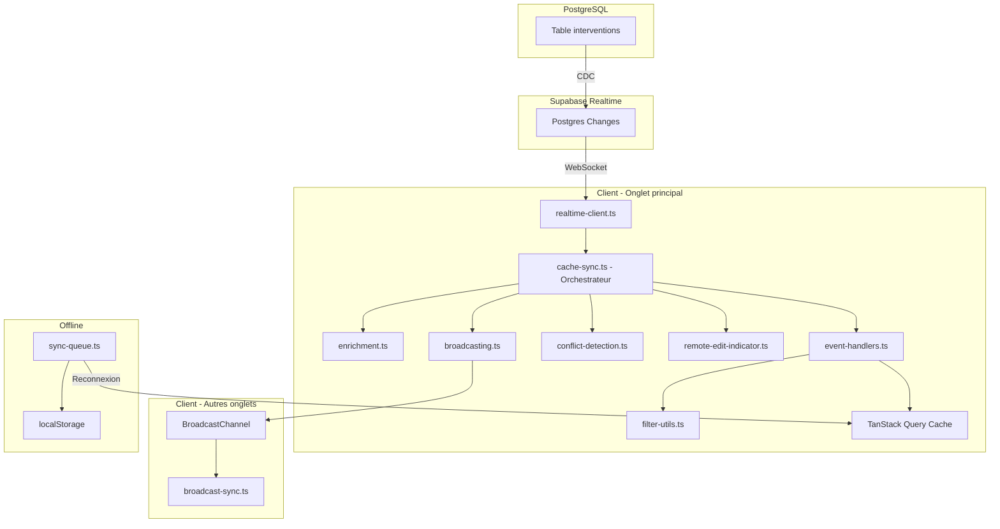
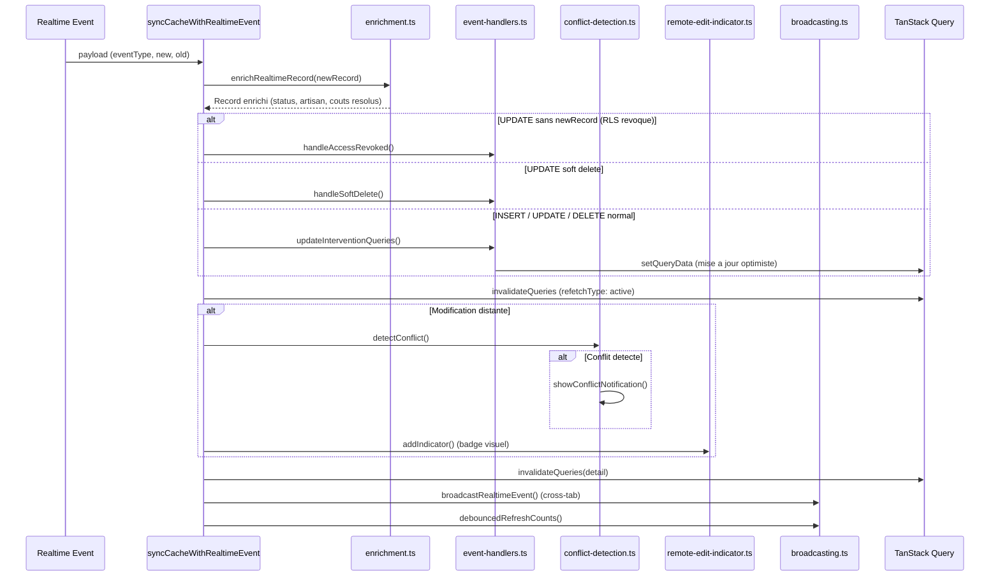
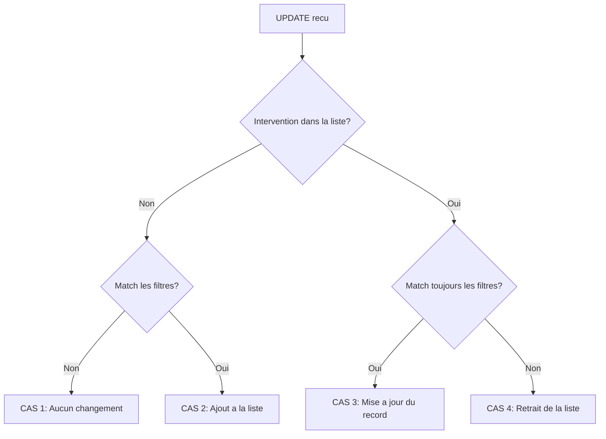
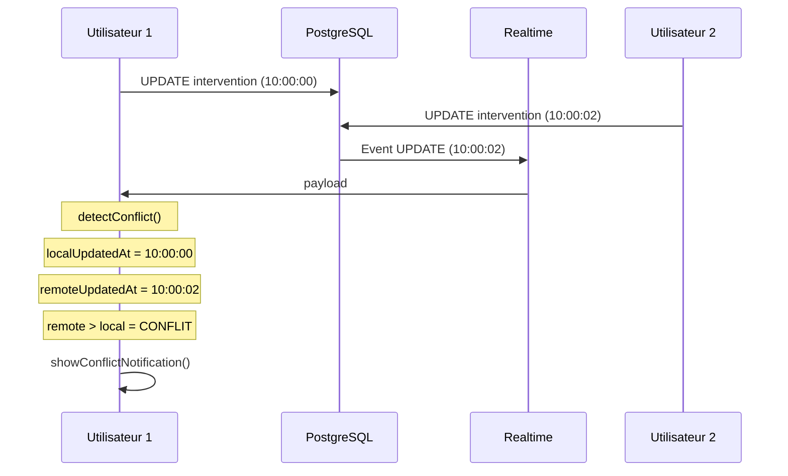
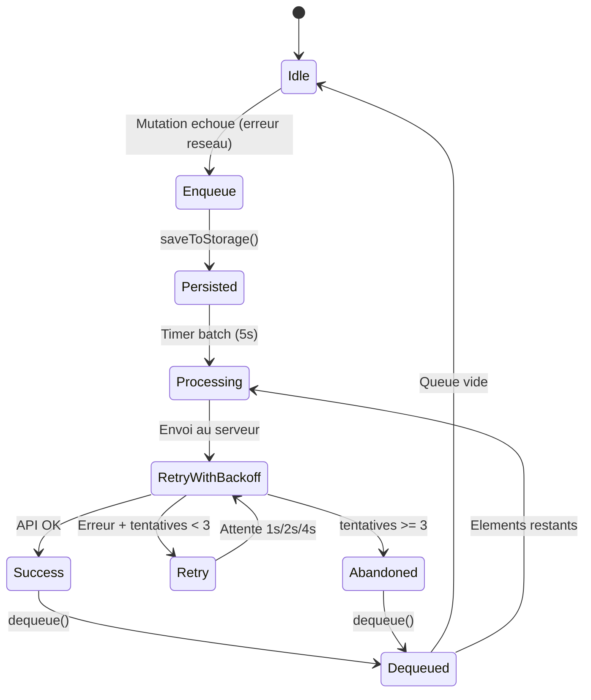

# Synchronisation temps reel

> Systeme de synchronisation en temps reel entre Supabase Realtime, le cache TanStack Query, et les onglets du navigateur.

---

## Vue d'ensemble

Le systeme de synchronisation temps reel permet a tous les utilisateurs connectes de voir les modifications instantanement, sans rafraichissement de page. Il gere egalement la synchronisation entre onglets du meme navigateur et la file d'attente hors-ligne.



---

## Fichiers du systeme

```
src/lib/realtime/
├── realtime-client.ts           # Canal Supabase Realtime
├── cache-sync.ts                # Orchestrateur facade
├── cache-sync/
│   ├── event-handlers.ts        # INSERT/UPDATE/DELETE handlers
│   ├── conflict-detection.ts    # Detection conflits simultanees
│   ├── enrichment.ts            # Enrichissement records
│   ├── remote-edit-indicator.ts # Badges "modifie par X"
│   ├── filter-utils.ts          # Matching filtres pour cache
│   └── broadcasting.ts          # Sync cross-tab (BroadcastChannel)
├── broadcast-sync.ts            # Gestion BroadcastChannel
└── sync-queue.ts                # File offline avec retry
```

---

## Canal Realtime

Le fichier `realtime-client.ts` configure un canal Supabase Realtime qui ecoute toutes les modifications sur la table `interventions` :

```typescript
// src/lib/realtime/realtime-client.ts
export function createInterventionsChannel(
  onEvent: (payload: RealtimePostgresChangesPayload<Intervention>) => void | Promise<void>
): RealtimeChannel {
  const channel = supabase
    .channel('interventions-changes')
    .on('postgres_changes', {
      event: '*',                    // INSERT, UPDATE, DELETE
      schema: 'public',
      table: 'interventions',
      filter: 'is_active=eq.true',  // Ignore les soft deletes
    }, onEvent);

  channel.subscribe((status) => {
    // Gestion des etats: SUBSCRIBED, CHANNEL_ERROR, TIMED_OUT, CLOSED
  });

  return channel;
}
```

Le filtre `is_active=eq.true` reduit le trafic d'environ 50% en ignorant les interventions desactivees. Les soft deletes sont detectes quand `is_active` passe de `true` a `false` dans un UPDATE.

### Fallback polling

En cas d'erreur du canal Realtime (erreur de channel, timeout, deconnexion), le hook `useInterventionsRealtime` bascule automatiquement vers un polling toutes les 15 secondes.

---

## Orchestrateur (cache-sync.ts)

Le fichier `cache-sync.ts` est la facade qui orchestre le traitement de chaque evenement Realtime. La fonction principale `syncCacheWithRealtimeEvent()` execute les etapes suivantes :



### Detection des cas speciaux

Avant le traitement normal, deux cas speciaux sont detectes :

1. **Perte d'acces RLS** : si `eventType === 'UPDATE'` mais `payload.new` est absent, l'utilisateur a perdu son acces SELECT (reassignation ou changement de permissions). L'intervention est retiree du cache et une notification est affichee.

2. **Soft delete** : si `is_active` passe de `true` a `false`, l'intervention est retiree du cache.

```typescript
export function isSoftDelete(oldRecord, newRecord): boolean {
  return oldRecord?.is_active === true && newRecord?.is_active === false;
}
```

---

## Event Handlers

### Les 4 cas d'un UPDATE



Chaque cas est gere de maniere immutable (creation d'un nouveau tableau) pour declencher le re-render React :

```typescript
// event-handlers.ts
export function handleUpdate(oldData, oldRecord, newRecord, filters) {
  const index = oldData.data.findIndex(i => i.id === newRecord.id);
  const wasInList = index !== -1;
  const matchesNow = matchesFilters(newRecord, filters);

  if (!wasInList && !matchesNow) return oldData;           // CAS 1
  if (!wasInList && matchesNow) return { ...add };          // CAS 2
  if (wasInList && matchesNow) return { ...replace };       // CAS 3
  if (wasInList && !matchesNow) return { ...remove };       // CAS 4
}
```

### INSERT

Verifie que le nouveau record correspond aux filtres de la vue actuelle. Si oui, l'ajoute en tete de liste et incremente le total de pagination.

### DELETE

Retire l'intervention du tableau et decremente le total.

### Mise a jour de toutes les queries

La fonction `updateInterventionQueries()` itere sur toutes les queries TanStack en memoire pour appliquer le handler a chacune :

```typescript
export function updateInterventionQueries(queryClient, keyFactory, updater): number {
  const queries = queryClient.getQueryCache().findAll({
    queryKey: keyFactory(),
    exact: false,
  });

  for (const query of queries) {
    const filters = extractFiltersFromQueryKey(query.queryKey);
    const nextData = updater(oldData, filters, query.queryKey);
    if (nextData !== oldData) {
      queryClient.setQueryData(query.queryKey, nextData);
    }
  }
}
```

Cela met a jour les listes completes (`lists`) ET les listes light (`lightLists`).

---

## Detection de conflits

La detection de conflits identifie les modifications simultanees : quand un utilisateur modifie une intervention pendant qu'un autre la modifie aussi.



### Algorithme

```typescript
export function detectConflict(interventionId, oldUpdatedAt, newUpdatedAt, indicatorManager) {
  const localUpdatedAt = indicatorManager.getLocalUpdatedAt(interventionId);
  if (!localUpdatedAt) return false; // Pas de modification locale recente

  const isRemoteNewerThanLocal = new Date(newUpdatedAt) > new Date(localUpdatedAt);
  const isRemoteNewerThanOld = new Date(newUpdatedAt) > new Date(oldUpdatedAt);

  return isRemoteNewerThanLocal && isRemoteNewerThanOld;
}
```

La notification affichee indique quel utilisateur a ecrase les modifications et quel champ est concerne.

---

## Indicateurs de modification distante

Le `RemoteEditIndicatorManager` (singleton) gere les badges visuels qui indiquent quand un record a ete modifie par un autre utilisateur. Chaque indicateur contient :

- `interventionId` : ID de l'intervention modifiee
- `userId` / `userName` / `userColor` : identite du modificateur
- `fields` : liste des champs modifies
- `timestamp` : horodatage
- `eventType` : INSERT ou UPDATE

Les indicateurs sont auto-nettoyes apres 20 secondes.

---

## Enrichissement

Le module `enrichment.ts` transforme les enregistrements bruts recus via Realtime en objets metier enrichis, en utilisant le `ReferenceCacheManager` et `mapInterventionRecord()`. Cela garantit que les records dans le cache ont le meme format que ceux recus via l'API.

```typescript
export async function enrichRealtimeRecord(record: Intervention): Promise<Intervention> {
  const refs = await getReferenceCache();
  return mapInterventionRecord(record, refs);
}
```

---

## Synchronisation cross-tab

### BroadcastChannel

Quand un evenement Realtime est traite dans un onglet, il est propage aux autres onglets via le `BroadcastChannel` :

```typescript
interface CacheSyncMessage {
  type: 'cache-update' | 'invalidation' | 'realtime-event';
  queryKey: QueryKey;
  data?: unknown;
  eventType?: 'INSERT' | 'UPDATE' | 'DELETE';
  interventionId?: string;
  timestamp: number;
}
```

### Anti-boucle

Pour eviter les boucles de messages, deux mecanismes sont utilises :

1. **recentTimestamps Set** : un Set contenant les timestamps des messages recents. Un message avec un timestamp deja vu est ignore.
2. **window.__lastBroadcastTimestamp** : le dernier timestamp envoye par cet onglet. Les messages avec ce timestamp sont ignores pour eviter l'echo.

### Rafraichissement des compteurs

Les compteurs de filtres (nombre d'interventions par statut, par utilisateur, etc.) sont rafraichis de maniere debounced apres chaque evenement qui affecte la distribution :

```typescript
function shouldRefreshCounts(eventType, oldRecord, newRecord): boolean {
  if (eventType === 'INSERT' || eventType === 'DELETE') return true;
  if (eventType === 'UPDATE') {
    return (
      oldRecord.statut_id !== newRecord.statut_id ||
      oldRecord.assigned_user_id !== newRecord.assigned_user_id ||
      oldRecord.agence_id !== newRecord.agence_id ||
      oldRecord.metier_id !== newRecord.metier_id ||
      oldRecord.is_active !== newRecord.is_active
    );
  }
  return false;
}
```

---

## File d'attente offline (SyncQueue)

Le `SyncQueue` (singleton) gere les mutations echouees en raison de problemes reseau.

### Fonctionnement



### Configuration

| Parametre | Valeur | Description |
|-----------|--------|-------------|
| `MAX_QUEUE_SIZE` | 50 | Taille maximale (FIFO si plein) |
| `BATCH_SIZE` | 10 | Elements traites par batch |
| `BATCH_INTERVAL` | 5000 ms | Intervalle entre les batchs |
| Retry delays | 1s, 2s, 4s | Backoff exponentiel |
| Max retries | 3 | Tentatives avant abandon |

### Persistance

La queue est persistee dans `localStorage` sous la cle `interventions-sync-queue`. La gestion des erreurs couvre :
- **localStorage plein** (`QUOTA_EXCEEDED_ERR`) : nettoyage des anciennes entrees, conservation des 10 plus recentes
- **Mode navigation privee** (`SECURITY_ERR`) : fonctionnement en memoire sans persistance
- **localStorage inaccessible** : fallback gracieux

### Structure d'un element

```typescript
interface QueuedModification {
  id: string;              // ID unique (interventionId-timestamp-random)
  interventionId: string;  // ID de l'intervention
  type: 'create' | 'update' | 'delete';
  data: Partial<Intervention>;
  timestamp: number;
  retryCount: number;      // 0, 1, 2 (max 3 tentatives)
}
```

### Nettoyage

Quand une intervention est supprimee ou que l'acces RLS est revoque, les entrees correspondantes dans la queue sont automatiquement nettoyees via `dequeueByInterventionId()`.

---

## Resume des patterns

| Pattern | Utilisation |
|---------|-------------|
| Singleton | `SyncQueue`, `RemoteEditIndicatorManager`, `ReferenceCacheManager` |
| Observer | Canal Supabase Realtime, BroadcastChannel |
| Facade | `cache-sync.ts` orchestre les sous-modules |
| Optimistic Update | Mise a jour du cache avant confirmation serveur |
| Exponential Backoff | Retry 1s -> 2s -> 4s dans SyncQueue |
| Debounce | `debouncedRefreshCounts` pour les compteurs |
| Anti-loop | `recentTimestamps` + `__lastBroadcastTimestamp` |
