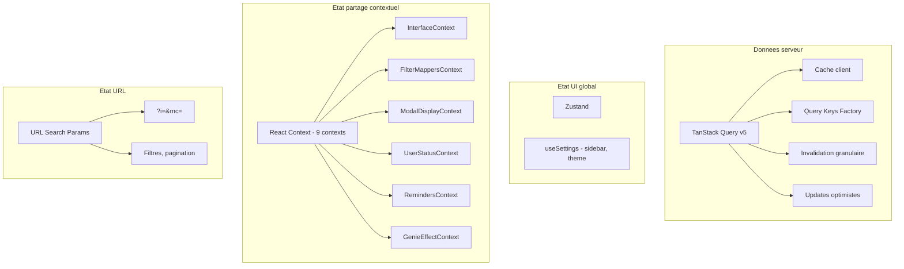
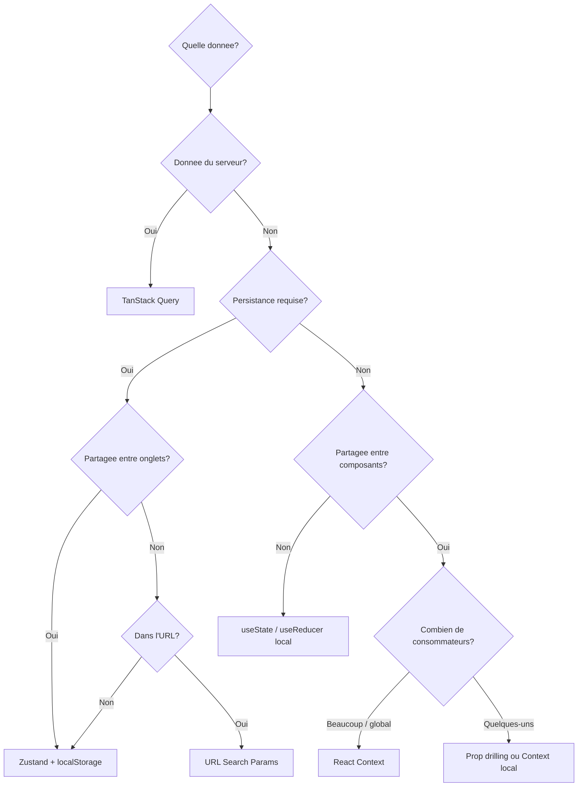
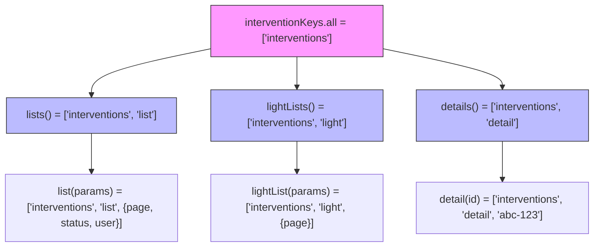
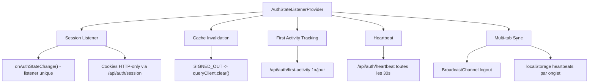

# Gestion d'etat

> Strategie de gestion d'etat dans GMBS-CRM : TanStack Query pour les donnees serveur, Zustand pour l'etat UI, React Context pour l'etat partage, et URL state pour les filtres.

---

## Vue d'ensemble

L'application utilise quatre couches de gestion d'etat, chacune avec un role distinct :



---

## Arbre de decision

Quand utiliser quelle couche :



| Type de donnee | Solution | Exemple |
|----------------|----------|---------|
| Liste interventions | TanStack Query | `useInterventionsQuery` |
| Detail intervention | TanStack Query | `interventionKeys.detail(id)` |
| Theme, sidebar | Zustand + localStorage | `useSettings` |
| Modal ouverte, ID | URL Search Params | `?i=abc&mc=intervention` |
| Filtres actifs | URL + TanStack Query | Params dans query key |
| Mappers code->ID | React Context | `FilterMappersContext` |
| Animation genie | React Context | `GenieEffectContext` |
| Presence utilisateur | React Context | `UserStatusContext` |
| Rappels temps reel | React Context | `RemindersContext` |

---

## TanStack Query (donnees serveur)

### Query Keys Factory

Les query keys sont generees par des factory functions dans `src/lib/react-query/queryKeys.ts` :

```typescript
export const interventionKeys = {
  all: ["interventions"] as const,
  lists: () => [...interventionKeys.all, "list"] as const,
  list: (params) => [...interventionKeys.lists(), params] as const,
  lightLists: () => [...interventionKeys.all, "light"] as const,
  lightList: (params) => [...interventionKeys.lightLists(), params] as const,
  details: () => [...interventionKeys.all, "detail"] as const,
  detail: (id, include?) => [...interventionKeys.details(), id, include] as const,
  invalidateAll: () => interventionKeys.all,
  invalidateLists: () => interventionKeys.lists(),
  invalidateLightLists: () => interventionKeys.lightLists(),
};

export const dashboardKeys = { ... };
export const artisanKeys = { ... };
export const referenceKeys = { ... };
```

### Hierarchie d'invalidation



Invalider `interventionKeys.lists()` invalide toutes les listes (toutes les pages, tous les filtres) mais ne touche pas les details.

### Configuration du cache

| Hook | staleTime | gcTime | Notes |
|------|-----------|--------|-------|
| `useInterventionsQuery` | Adaptatif | Default | Prefetch page +1 |
| `useReferenceDataQuery` | 5 min | 15 min | Donnees rarement modifiees |
| `useDashboardStats` | 30s | 5 min | Rafraichissement frequent |
| `useInterventionHistory` | Default | Default | Infinite query |

### Updates optimistes

Les mutations utilisent le pattern optimiste pour une UX reactive :

```typescript
// src/hooks/useInterventionsMutations.ts
const updateMutation = useMutation({
  mutationFn: (variables) => interventionsApi.update(id, data),
  onMutate: async (variables) => {
    // 1. Annuler les requetes en vol
    await queryClient.cancelQueries({ queryKey: interventionKeys.lists() });

    // 2. Sauvegarder l'etat precedent
    const previous = queryClient.getQueryData(queryKey);

    // 3. Appliquer le changement immediatement
    queryClient.setQueriesData({ queryKey: interventionKeys.lists() }, updateFn);

    return { previous };
  },
  onError: (error, _, context) => {
    // Rollback en cas d'erreur
    queryClient.setQueryData(queryKey, context.previous);
  },
  onSuccess: () => {
    // Re-fetch pour garantir la coherence
    queryClient.invalidateQueries({ queryKey: interventionKeys.invalidateLists() });
  },
});
```

---

## Zustand (etat UI global)

Un seul store Zustand est utilise pour les preferences utilisateur :

```typescript
// src/stores/settings.ts
interface SettingsState {
  sidebarMode: "collapsed" | "icons" | "hybrid" | "expanded";
  theme: "light" | "dark" | "system";
  classEffect: boolean;
  statusMock: "online" | "busy" | "dnd" | "offline";
}

export const useSettings = create<SettingsState>((set) => ({
  sidebarMode: "hybrid",
  theme: "system",
  classEffect: true,
  statusMock: "online",
  // ... setters
  hydrate: () => {
    // Charge depuis localStorage('gmbs:settings') + color-mode
  },
}));
```

### Persistance

Le store n'utilise pas le middleware `persist` de Zustand. A la place, une methode `hydrate()` est appelee manuellement au montage de l'application, lisant `localStorage('gmbs:settings')` et `localStorage('color-mode')` avec fallback.

---

## React Context (9 contexts)

### 1. InterfaceContext

Theme et layout UI. Synchronise avec le store Zustand.

```typescript
// src/contexts/interface-context.tsx
{
  sidebarMode: SidebarMode;
  sidebarEnabled: boolean;
  colorMode: "light" | "dark" | "system";
  accent: string;
}
```

### 2. FilterMappersContext

Traduction Code -> UUID pour les filtres. Agregat de trois hooks :

```typescript
// src/contexts/FilterMappersContext.tsx
{
  statusCodeToId: (code: string) => string | undefined;
  userCodeToId: (code: string) => string | undefined;
  currentUserId: string | null;
}
```

### 3. ModalDisplayContext

Gestion du mode d'affichage des modales avec responsive adaptatif :

```typescript
// src/contexts/ModalDisplayContext.tsx
{
  preferredMode: "halfpage" | "centerpage" | "fullpage";
  // Responsive:
  // < 640px  -> force fullpage
  // < 1024px -> downgrade halfpage -> centerpage
  // Persistance: localStorage
}
```

### 4. UserStatusContext

Tracking de la presence utilisateur avec throttle :

```typescript
// src/contexts/user-status-context.tsx
// Ecoute: mousemove, keydown, click, scroll (passive)
// Throttle: 300ms
// Auto "appear-away" apres 1h d'inactivite
// Check: toutes les 60s
```

> **Note :** En complement de UserStatusContext (statut volontaire), le hook `useIdleDetector` detecte l'inactivite reelle (5 min sans interaction ou onglet masque). Ce signal `isIdle` est utilise par `usePagePresence` (presence page-level), `useActivityTracker` (sessions decoupees), et `IdleScreensaver` (ecran de veille DVD bouncing). Voir [docs/maintenance/monitoring.md](../maintenance/monitoring.md#detection-dinactivite-idle-detection).

### 5. RemindersContext

Rappels d'intervention avec sync Realtime :

```typescript
// src/contexts/RemindersContext.tsx
// Canal Supabase: 'intervention_reminders_realtime'
// Parsing @mentions: /@([\p{L}\p{N}_.-]+)/gu
// Toast notifications pour mentions
```

### 6. GenieEffectContext

Animation de deplacement d'interventions entre vues :

```typescript
// src/contexts/GenieEffectContext.tsx
{
  registerBadgeRef: (viewId: string, element: HTMLElement) => void;
  triggerAnimation: (interventionId, source, targetViewId, onComplete) => void;
  // 11 keyframes, 1s duration
  // Respecte prefers-reduced-motion
}
```

### 7. NavigationContext

Cache de navigation avec TTL de 5 minutes (variable globale statique).

### 8. SimpleOptimizedContext

Cache leger avec 50 entrees et TTL de 5 minutes. Fournit `useSimpleInterventions()` et `useSimpleArtisans()`.

### 9. UltraOptimizedContext

Cache avance avec 100 entrees, LRU hits tracking, et VirtualizedManager (pageSize 50).

---

## URL State

Les modales et les filtres sont synchronises avec l'URL pour permettre le partage de liens et la navigation par historique :

### Modale intervention

```
/interventions?i=abc-123&mc=intervention
```

| Parametre | Signification |
|-----------|---------------|
| `i` | ID de l'intervention ouverte dans la modale |
| `mc` | Type de contenu modal (`intervention`, `artisan`, `new-intervention`, etc.) |

### Filtres

Les filtres sont encodes dans les query keys TanStack Query et dans les parametres URL.

---

## Provider : AuthStateListenerProvider

Un provider global gere l'etat d'authentification a travers plusieurs couches :



Ce provider est monte au plus haut niveau de l'application et orchestre :

1. **Session** : un listener unique `onAuthStateChange` pour les changements d'etat d'authentification
2. **Cache** : invalidation complete du QueryClient lors du `SIGNED_OUT`
3. **First Activity** : appel unique a `/api/auth/first-activity` une fois par jour pour le tracking de retard
4. **Heartbeat** : ping `/api/auth/heartbeat` toutes les 30 secondes pour la detection de presence
5. **Multi-tab** : propagation du logout via `BroadcastChannel` + heartbeats localStorage par onglet
