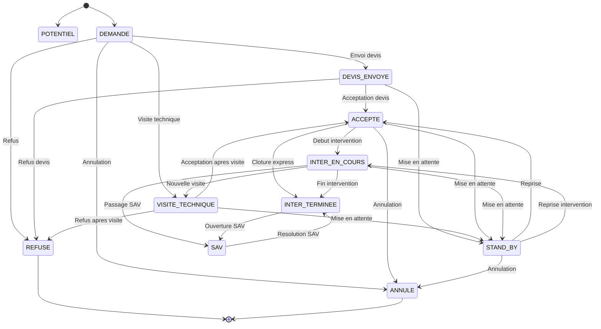
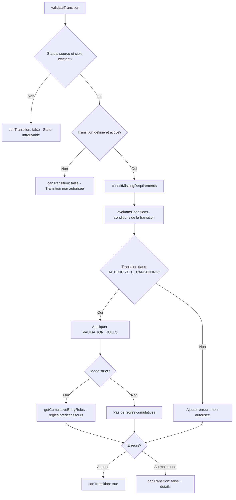
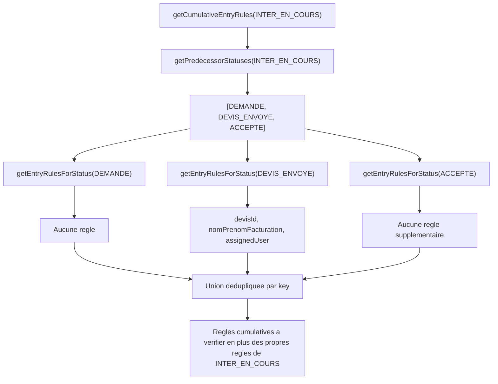

# Moteur de workflow des interventions

> Machine a etats qui regit les transitions de statuts des interventions, avec validation cumulative et regles metier.

---

## Vue d'ensemble

Le moteur de workflow controle le cycle de vie d'une intervention, de la demande initiale jusqu'a la cloture. Chaque transition est validee en temps reel en verifiant les prerequis (artisan assigne, facture uploadee, etc.) avant d'autoriser le changement de statut.



---

## Fichiers du workflow

```
src/config/
├── workflow-rules.ts              # Regles, transitions autorisees, validations
├── intervention-status-chains.ts  # Chaines de progression des statuts
└── status-colors.ts               # Palette de couleurs par statut

src/lib/
├── workflow-engine.ts             # Moteur de validation des transitions
└── workflow-persistence.ts        # Persistance configuration localStorage

src/lib/workflow/
└── cumulative-validation.ts       # Validation cumulative sur la chaine
```

---

## Statuts d'intervention

Le systeme definit 12 statuts, dont 2 initiaux et 2 terminaux :

| Statut | Code | Couleur | Type |
|--------|------|---------|------|
| Demande | `DEMANDE` | #3B82F6 (bleu) | Initial |
| Potentiel | `POTENTIEL` | - | Initial |
| Devis envoye | `DEVIS_ENVOYE` | #8B5CF6 (violet) | - |
| Visite technique | `VISITE_TECHNIQUE` | #06B6D4 (cyan) | - |
| Accepte | `ACCEPTE` | #10B981 (vert) | - |
| Att. acompte | `ATT_ACOMPTE` | #F97316 (orange) | - |
| Inter en cours | `INTER_EN_COURS` | #F59E0B (ambre) | - |
| Inter terminee | `INTER_TERMINEE` | #10B981 (vert) | - |
| SAV | `SAV` | #EC4899 (rose) | - |
| Stand-by | `STAND_BY` | #6B7280 (gris) | - |
| Refuse | `REFUSE` | #EF4444 (rouge) | Terminal |
| Annule | `ANNULE` | #EF4444 (rouge) | Terminal |

---

## Transitions autorisees

23 transitions sont definies dans `AUTHORIZED_TRANSITIONS` :

```mermaid
graph LR
    subgraph "Chaine principale"
        DEM[DEMANDE] --> DEV[DEVIS_ENVOYE]
        DEV --> ACC[ACCEPTE]
        ACC --> IEC[INTER_EN_COURS]
        IEC --> IET[INTER_TERMINEE]
    end

    subgraph "Chaine alternative"
        DEM --> VT[VISITE_TECHNIQUE]
        VT --> ACC
    end

    subgraph "Sorties"
        DEM --> REF[REFUSE]
        DEM --> ANN[ANNULE]
        DEV --> REF
        VT --> REF
        ACC --> ANN
        IEC -.->|Cloture express| IET
    end

    subgraph "Detours"
        DEV --> SB[STAND_BY]
        VT --> SB
        ACC --> SB
        IEC --> SB
        IEC --> VT
        SB --> ACC
        SB --> IEC
        SB --> ANN
    end

    subgraph "SAV"
        IEC --> SAV[SAV]
        IET --> SAV
        SAV --> IET
    end
```

Chaque transition a un trigger qui decrit l'action declenchante :

```typescript
// src/config/workflow-rules.ts
export const AUTHORIZED_TRANSITIONS: AuthorizedTransition[] = [
  { from: "DEMANDE", to: "DEVIS_ENVOYE", trigger: "Envoi devis" },
  { from: "DEMANDE", to: "VISITE_TECHNIQUE", trigger: "Visite technique" },
  { from: "DEVIS_ENVOYE", to: "ACCEPTE", trigger: "Acceptation devis" },
  { from: "ACCEPTE", to: "INTER_EN_COURS", trigger: "Debut intervention" },
  { from: "INTER_EN_COURS", to: "INTER_TERMINEE", trigger: "Fin intervention" },
  // ... 18 autres transitions
];
```

---

## Exigences par statut

Chaque statut definit des prerequis dans `WORKFLOW_RULES`. Une transition est bloquee si les prerequis du statut cible ne sont pas satisfaits.

| Statut cible | Prerequis |
|-------------|-----------|
| `DEMANDE` | Aucun (statut initial) |
| `POTENTIEL` | Aucun (statut initial) |
| `DEVIS_ENVOYE` | `devisId` + `nomPrenomFacturation` + `assignedUser` |
| `VISITE_TECHNIQUE` | `artisan` |
| `ACCEPTE` | `devisId` |
| `ATT_ACOMPTE` | `devisId` + `artisan` |
| `INTER_EN_COURS` | `artisan` + `coutIntervention` + `coutSST` + `consigneArtisan` + `nomPrenomClient` + `telephoneClient` + `datePrevue` |
| `INTER_TERMINEE` | `artisan` + `facture` + `proprietaire` + `factureGmbsFile` |
| `SAV` | `commentaire` |
| `STAND_BY` | `commentaire` |
| `REFUSE` | `commentaire` |
| `ANNULE` | `commentaire` |

---

## Moteur de validation

La fonction `validateTransition()` dans `src/lib/workflow-engine.ts` orchestre la validation en 7 etapes :



```typescript
// src/lib/workflow-engine.ts
export function validateTransition(
  workflow: WorkflowConfig,
  fromStatusKey: string,
  toStatusKey: string,
  context: WorkflowEntityContext,
): WorkflowValidationResult {
  // 1. Trouver les statuts source et cible
  // 2. Verifier que la transition est definie et active
  // 3. Collecter les prerequis manquants (artisan, facture, etc.)
  // 4. Evaluer les conditions de la transition
  // 5. Verifier l'autorisation (AUTHORIZED_TRANSITIONS)
  // 6. Appliquer les VALIDATION_RULES
  // 7. En mode strict: appliquer les regles cumulatives

  return {
    canTransition,       // boolean
    missingRequirements, // string[] (champs manquants)
    failedConditions,    // string[] (messages d'erreur)
  };
}
```

### Contexte d'entite

Le contexte passe au moteur contient toutes les informations de l'intervention necessaires a la validation :

```typescript
interface WorkflowEntityContext {
  artisanId?: string;
  factureId?: string;
  proprietaireId?: string;
  commentaire?: string;
  devisId?: string;
  nomPrenomFacturation?: string;
  assignedUserId?: string;
  coutIntervention?: number;
  coutSST?: number;
  consigneArtisan?: string;
  nomPrenomClient?: string;
  telephoneClient?: string;
  datePrevue?: string;
  idIntervention?: string;
  attachments?: Array<{ kind: string }>;
  // ...
}
```

---

## Regles de validation (VALIDATION_RULES)

Les `VALIDATION_RULES` sont des regles metier qui vont au-dela des prerequis simples. Chaque regle a :
- Un `key` unique
- Un scope (`from`, `to`, ou `statuses`)
- Un `message` d'erreur
- Une fonction `validate(context)` qui retourne `true` si la regle est satisfaite

### Regles definies

| Key | Scope | Validation |
|-----|-------|------------|
| `DEVIS_ENVOYE_TO_ACCEPTE` | from: DEVIS_ENVOYE, to: ACCEPTE | `devisId` non vide |
| `INTERVENTION_ID_REQUIRED` | statuses: [6 statuts] | `idIntervention` sans "AUTO" |
| `ARTISAN_REQUIRED_FOR_STATUS` | statuses: [VT, IEC, IET, ATT] | `artisanId` present |
| `INTER_TERMINEE_INCOMPLETE` | to: INTER_TERMINEE | `factureId` ET `proprietaireId` |
| `INTER_TERMINEE_GMBS_INVOICE_REQUIRED` | to: INTER_TERMINEE | Au moins un attachment `facturesGMBS` |
| `COMMENTAIRE_REQUIS` | statuses: [REF, ANN, SB, SAV] | `commentaire` non vide |
| `DEVIS_ENVOYE_NOM_FACTURATION` | to: DEVIS_ENVOYE | `nomPrenomFacturation` non vide |
| `DEVIS_ENVOYE_ASSIGNED_USER` | to: DEVIS_ENVOYE | `assignedUserId` present |
| `INTER_EN_COURS_COUT_*` (4 regles) | to: INTER_EN_COURS | Couts, consigne, client, date |

---

## Validation cumulative

### Concept

Sur la chaine principale de progression, chaque statut doit satisfaire non seulement ses propres prerequis, mais aussi ceux de tous les statuts precedents.

Exemple : pour passer a `INTER_EN_COURS`, il faut aussi satisfaire les prerequis de `DEVIS_ENVOYE` et `ACCEPTE`.

### Chaine cumulative

```typescript
// src/config/intervention-status-chains.ts
export const CUMULATIVE_VALIDATION_CHAIN = [
  'DEMANDE',
  'DEVIS_ENVOYE',
  'ACCEPTE',
  'INTER_EN_COURS',
  'INTER_TERMINEE',
];
```

`VISITE_TECHNIQUE` est exclu car c'est un detour optionnel (la chaine `VISIT_FIRST_PROGRESSION` existe comme alternative sans devis).

### Algorithme



```typescript
// src/lib/workflow/cumulative-validation.ts
export function getCumulativeEntryRules(targetStatus) {
  if (!isOnCumulativeChain(targetStatus)) return [];

  const predecessors = getPredecessorStatuses(targetStatus);
  const seenKeys = new Set<string>();
  const cumulativeRules = [];

  for (const predecessor of predecessors) {
    for (const rule of getEntryRulesForStatus(predecessor)) {
      if (!seenKeys.has(rule.key)) {
        seenKeys.add(rule.key);
        cumulativeRules.push(rule);
      }
    }
  }
  return cumulativeRules;
}
```

### Mode de validation

Le mode est configure dans `STATUS_CHAIN_CONFIG` :

```typescript
export const STATUS_CHAIN_CONFIG = {
  validationMode: 'strict',  // 'strict' | 'permissive'
  intermediateTransitionDelay: 1, // 1ms entre transitions intermediaires
};
```

- **strict** : tous les prerequis cumulatifs sont verifies (mode actuel)
- **permissive** : seuls les prerequis du statut cible sont verifies

---

## Chaines de progression

Deux chaines de progression sont definies :

### Chaine principale (MAIN_PROGRESSION)

```
DEMANDE -> DEVIS_ENVOYE -> VISITE_TECHNIQUE -> ACCEPTE -> INTER_EN_COURS -> INTER_TERMINEE
```

### Chaine alternative (VISIT_FIRST_PROGRESSION)

```
DEMANDE -> VISITE_TECHNIQUE -> ACCEPTE -> INTER_EN_COURS -> INTER_TERMINEE
```

La chaine alternative est utilisee quand une visite technique est necessaire avant l'envoi du devis.

---

## Actions automatiques

Certaines transitions declenchent des actions automatiques :

| Statut | Action | Description |
|--------|--------|-------------|
| `DEVIS_ENVOYE` | `send_email_devis` | Envoi email au client avec devis PDF |
| `INTER_TERMINEE` | `generate_invoice_if_missing` | Generation automatique de facture |

```typescript
export const AUTO_ACTIONS = {
  send_email_devis: {
    type: "send_email",
    config: {
      template: "devis_template",
      recipient: "intervention.client.email",
      attachments: ["devis_pdf"],
    },
  },
  generate_invoice_if_missing: {
    type: "generate_invoice",
    config: { autoGenerate: true, template: "facture_template" },
  },
};
```

---

## Recherche de transitions disponibles

La fonction `findAvailableTransitions()` retourne toutes les transitions possibles depuis un statut donne :

```typescript
// src/lib/workflow-engine.ts
export function findAvailableTransitions(
  workflow: WorkflowConfig,
  statusKey: string,
): WorkflowTransition[] {
  const status = workflow.statuses.find(s => s.key === statusKey);
  if (!status) return [];
  return workflow.transitions.filter(
    t => t.fromStatusId === status.id && t.isActive
  );
}
```

Cela permet au composant `WorkflowVisualizer` d'afficher uniquement les transitions autorisees depuis l'etat courant, et de griser celles dont les prerequis ne sont pas satisfaits.

---

## Palette de couleurs

Les couleurs sont definies dans `src/config/status-colors.ts` avec des lookups par label et par code :

```typescript
// Par code
export const INTERVENTION_STATUS_COLORS_BY_CODE = {
  DEMANDE: "#3B82F6",        // bleu
  DEVIS_ENVOYE: "#8B5CF6",   // violet
  VISITE_TECHNIQUE: "#06B6D4",// cyan
  ACCEPTE: "#10B981",        // vert
  INTER_EN_COURS: "#F59E0B", // ambre
  INTER_TERMINEE: "#10B981", // vert
  ANNULE: "#EF4444",         // rouge
  REFUSE: "#EF4444",         // rouge
  STAND_BY: "#6B7280",       // gris
  SAV: "#EC4899",            // rose
  ATT_ACOMPTE: "#F97316",    // orange
};
```

Le helper `getInterventionStatusColor(label?, code?)` retourne la couleur avec fallback (#6366F1 violet par defaut).
