# Schema de la base de données

> Documentation du schéma PostgreSQL de GMBS-CRM, hébergé sur Supabase.

---

## Vue d'ensemble

La base de données utilise PostgreSQL via Supabase avec les extensions suivantes :
- `pg_stat_statements` : statistiques de requêtes
- `pgcrypto` : fonctions cryptographiques (gen_random_uuid)
- `pg_trgm` : recherche par trigrammes (ILIKE performant)

**82 migrations SQL** dans `supabase/migrations/` définissent l'intégralité du schéma.

---

## Diagramme ER principal

```mermaid
erDiagram
    users ||--o{ user_roles : "a"
    users ||--o{ auth_user_mapping : "lié a"
    users ||--o{ user_permissions : "override"
    users ||--o{ user_page_permissions : "accès pages"
    roles ||--o{ user_roles : "attribué"
    roles ||--o{ role_permissions : "contient"
    permissions ||--o{ role_permissions : "accordée via"
    permissions ||--o{ user_permissions : "override"

    users ||--o{ interventions : "gère (assigned_user_id)"
    users ||--o{ artisans : "gère (gestionnaire_id)"
    users ||--o{ comments : "auteur"

    agencies ||--o{ interventions : "agence cliente"
    agencies ||--o| agency_config : "config"

    interventions ||--o{ intervention_artisans : "artisans assignés"
    interventions ||--o{ intervention_costs : "coûts"
    interventions ||--o{ intervention_payments : "paiements"
    interventions ||--o{ intervention_attachments : "pièces jointes"
    interventions ||--o{ comments : "commentaires"
    interventions ||--o{ intervention_audit_log : "audit"
    interventions }o--|| intervention_statuses : "statut"
    interventions }o--|| metiers : "métier"
    interventions }o--o| tenants : "locataire"
    interventions }o--o| owner : "propriétaire"

    artisans ||--o{ intervention_artisans : "interventions"
    artisans ||--o{ artisan_metiers : "métiers"
    artisans ||--o{ artisan_zones : "zones"
    artisans ||--o{ artisan_attachments : "pièces jointes"
    artisans ||--o{ artisan_absences : "absences"
    artisans ||--o{ artisan_statuses_history : "historique statuts"
    artisans }o--|| artisan_statuses : "statut"

    metiers ||--o{ artisan_metiers : "artisans"
    zones ||--o{ artisan_zones : "artisans"
```



---

## Tables principales

### Users et authentification

#### users

Table centrale des utilisateurs du CRM.

| Colonne | Type | Description |
|---------|------|-------------|
| `id` | `uuid` PK | Identifiant unique |
| `username` | `text` UNIQUE | Nom d'utilisateur (login) |
| `email` | `text` UNIQUE | Email |
| `firstname` | `text` | Prénom |
| `lastname` | `text` | Nom |
| `color` | `text` | Couleur attribuée (avatar, badges) |
| `code_gestionnaire` | `text` UNIQUE | Code court gestionnaire |
| `status` | `user_status` | Statut de présence (connected, dnd, busy, offline) |
| `token_version` | `int` | Version du token pour invalidation |
| `last_seen_at` | `timestamptz` | Dernière activité (heartbeat) |
| `email_smtp*` | `text/int/bool` | Configuration SMTP individuelle |
| `avatar_url` | `text` | URL de l'avatar (ajouté par migration 00050) |
| `delete_date` | `timestamptz` | Date de suppression (soft delete, migration 00057) |
| `deleted_by` | `uuid` | Utilisateur ayant effectué la suppression |
| `created_at` | `timestamptz` | Date de création |
| `updated_at` | `timestamptz` | Date de mise a jour |

**Enum `user_status` :** `'connected' | 'dnd' | 'busy' | 'offline'`

#### auth_user_mapping

Liaison entre `auth.users` (Supabase Auth) et `public.users`.

| Colonne | Type | Description |
|---------|------|-------------|
| `auth_user_id` | `uuid` UNIQUE | ID dans auth.users |
| `public_user_id` | `uuid` FK | ID dans public.users |

#### Système de rôles et permissions

```
roles (admin, manager, gestionnaire, viewer)
  role_permissions (N:M avec permissions)
    permissions (read_interventions, write_interventions, etc.)

user_roles (N:M entre users et roles)
user_permissions (overrides individuels : granted=true/false)
user_page_permissions (accès par page : page_key + has_access)
```

**Logique de résolution des permissions :**
1. Permissions de base = permissions du rôle via `role_permissions`
2. `user_permissions` peut AJOUTER (`granted=true`) ou RÉVOQUER (`granted=false`)
3. Permissions effectives = (rôle) + (ajouts individuels) - (révocations individuelles)

---

### Données de référence

#### metiers

| Colonne | Type | Description |
|---------|------|-------------|
| `id` | `uuid` PK | Identifiant |
| `code` | `text` UNIQUE | Code court (PLOMBERIE, ELECTRICITE, etc.) |
| `label` | `text` | Label affiché |
| `description` | `text` | Description |
| `is_active` | `boolean` | Actif/inactif |
| `color` | `text` | Couleur associée (migration 00024) |

**22 métiers** initiaux : Plomberie, Electricité, Chauffage, Menuiserie, Peinture, Maçonnerie, etc.

#### zones

| Colonne | Type | Description |
|---------|------|-------------|
| `id` | `uuid` PK | Identifiant |
| `code` | `text` UNIQUE | Code zone |
| `label` | `text` | Nom de la zone |
| `region` | `text` | Région |

**10 zones** : Paris, Lyon, Marseille, etc.

#### agencies

Agences clientes qui commandent les interventions.

| Colonne | Type | Description |
|---------|------|-------------|
| `id` | `uuid` PK | Identifiant |
| `code` | `text` UNIQUE | Code agence |
| `label` | `text` | Nom de l'agence |
| `is_active` | `boolean` | Active |

**agency_config** : table de configuration par agence (ex: `requires_reference` pour BR-AGN-001).

#### intervention_statuses / artisan_statuses

Tables de statuts avec `code`, `label`, `color`, `sort_order`.

**11 statuts d'intervention :** DEMANDE, DEVIS_ENVOYE, VISITE_TECHNIQUE, REFUSE, ANNULE, STAND_BY, ACCEPTE, INTER_EN_COURS, INTER_TERMINEE, SAV, ATT_ACOMPTE, POTENTIEL

**9 statuts d'artisan :** Candidat, En cours de validation, Validé, Expert, One Shot, Inactif, Archivé, etc.

---

### Artisans

#### artisans

| Colonne | Type | Description |
|---------|------|-------------|
| `id` | `uuid` PK | Identifiant |
| `prenom` / `nom` | `text` | Nom du contact |
| `plain_nom` | `text` | Nom sans accents pour recherche (migration 00025) |
| `email` | `text` UNIQUE | Email |
| `telephone` / `telephone2` | `text` | Téléphones |
| `raison_sociale` | `text` | Nom de l'entreprise |
| `siret` | `text` UNIQUE | Numéro SIRET |
| `iban` | `text` | IBAN (migration 00034) |
| `statut_juridique` | `text` | Forme juridique |
| `statut_id` | `uuid` FK | Statut artisan |
| `statut_dossier` | `text` CHECK | INCOMPLET, A compléter, COMPLET |
| `gestionnaire_id` | `uuid` FK | Gestionnaire assigné |
| `adresse_siege_social` / `ville_*` / `code_postal_*` | `text` | Adresse siège |
| `adresse_intervention` / `ville_*` / `code_postal_*` | `text` | Adresse intervention |
| `intervention_latitude` / `longitude` | `numeric(9,6)` | Coordonnées GPS |
| `is_active` | `boolean` | Actif (soft delete) |

**Tables liées :**
- `artisan_metiers` : N:M artisan-métier
- `artisan_zones` : N:M artisan-zone
- `artisan_attachments` : pièces jointes avec hash SHA-256 et dérivés d'images
- `artisan_absences` : périodes d'indisponibilité
- `artisan_statuses_history` : historique des changements de statut (migration 00052)

---

### Interventions

#### interventions

| Colonne | Type | Description |
|---------|------|-------------|
| `id` | `uuid` PK | Identifiant |
| `id_inter` | `text` UNIQUE | Identifiant métier lisible |
| `agence_id` | `uuid` FK | Agence cliente (obligatoire) |
| `tenant_id` | `uuid` FK | Locataire |
| `owner_id` | `uuid` FK | Propriétaire |
| `assigned_user_id` | `uuid` FK | Gestionnaire assigné |
| `statut_id` | `uuid` FK | Statut (obligatoire) |
| `metier_id` | `uuid` FK | Métier (obligatoire) |
| `updated_by` | `uuid` FK | Dernier modificateur |
| `date` | `timestamptz` | Date de demande (obligatoire) |
| `date_prevue` | `timestamptz` | Date prévue d'intervention |
| `date_termine` | `timestamptz` | Date de fin |
| `contexte_intervention` | `text` | Contexte (obligatoire) |
| `consigne_intervention` | `text` | Consignes pour l'artisan |
| `consigne_second_artisan` | `text` | Consignes pour le 2e artisan |
| `commentaire_agent` | `text` | Commentaire interne |
| `reference_agence` | `text` | Référence externe agence |
| `adresse` / `code_postal` / `ville` | `text` | Adresse (obligatoire) |
| `latitude` / `longitude` | `numeric(9,6)` | Coordonnées GPS |
| `is_vacant` | `boolean` | Logement vacant |
| `key_code` / `floor` / `apartment_number` | `text` | Accès logement vacant |
| `is_active` | `boolean` | Actif (soft delete) |
| `is_check` | `boolean` | Vérifié comptabilité (migration 00054) |

#### intervention_artisans

| Colonne | Type | Description |
|---------|------|-------------|
| `intervention_id` | `uuid` FK | Intervention |
| `artisan_id` | `uuid` FK | Artisan |
| `role` | `text` CHECK | 'primary' ou 'secondary' |
| `is_primary` | `boolean` | Artisan principal |

#### intervention_costs

| Colonne | Type | Description |
|---------|------|-------------|
| `intervention_id` | `uuid` FK | Intervention |
| `cost_type` | `text` CHECK | 'sst', 'materiel', 'intervention', 'marge' |
| `amount` | `numeric(12,2)` | Montant |
| `artisan_order` | `int` | 1 (principal) ou 2 (secondaire) (migration 00028). **NULL pour les types `intervention` et `marge`** (migration 00086) |

**Contrainte d'unicite** : `UNIQUE(intervention_id, cost_type, COALESCE(artisan_order, 0))` — empeche les doublons pour un meme type de cout par intervention (migration 00086).

#### intervention_payments

| Colonne | Type | Description |
|---------|------|-------------|
| `payment_type` | `text` CHECK | 'acompte_sst', 'acompte_client', 'final' |
| `amount` | `numeric(12,2)` | Montant |
| `is_received` | `boolean` | Paiement reçu |

---

### Support et traçabilité

#### comments

Système de commentaires unifié pour toutes les entités.

| Colonne | Type | Description |
|---------|------|-------------|
| `entity_type` | `text` CHECK | 'artisan', 'intervention', 'task', 'client' |
| `entity_id` | `uuid` | Entité cible |
| `author_id` | `uuid` FK | Auteur |
| `content` | `text` | Contenu |
| `comment_type` | `text` CHECK | 'internal', 'external', 'system' |
| `reason_type` | `text` CHECK | 'archive', 'done' (motif obligatoire) |

#### documents

Pièces jointes via Supabase Storage.

#### intervention_audit_log

Journal d'audit des modifications d'interventions (migration 00037).

| Colonne | Type | Description |
|---------|------|-------------|
| `intervention_id` | `uuid` FK | Intervention |
| `action_type` | `text` | Type d'action |
| `changed_fields` | `jsonb` | Champs modifiés |
| `old_values` / `new_values` | `jsonb` | Anciennes/nouvelles valeurs |
| `actor_id` | `uuid` | Utilisateur |

#### gestionnaire_targets

Objectifs par gestionnaire (migration 00009).

| Colonne | Type | Description |
|---------|------|-------------|
| `user_id` | `uuid` FK | Gestionnaire |
| `period_type` | `target_period_type` | 'week', 'month', 'year' |
| `target_value` | `numeric` | Objectif |

---

### Autres tables

| Table | Description |
|-------|-------------|
| `tasks` | Système de tâches internes |
| `conversations` / `messages` | Chat interne |
| `chat_sessions` / `chat_messages` | Sessions IA (OpenAI) |
| `ai_assistants` | Assistants IA persistants |
| `email_logs` | Logs des emails envoyés |
| `sync_logs` | Logs de synchronisation Google Sheets |
| `billing_state` / `subscriptions` / `orders` | Facturation (préparé) |
| `lateness_email_config` | Config emails de retard (migration 00062) |

---

## Fonctions SQL importantes

| Fonction | Description |
|----------|-------------|
| `get_public_user_id()` | Résout `auth.uid()` vers `public.users.id` |
| `user_has_role(role_name)` | Vérifie si l'utilisateur courant a un rôle |
| `user_has_any_role(role_names[])` | Vérifie si l'utilisateur a l'un des rôles |
| `get_user_permissions(user_id)` | Retourne les permissions effectives |
| `user_has_permission(user_id, key)` | Vérifie une permission spécifique |
| `get_intervention_history(id)` | Retourne l'historique d'audit d'une intervention |

---

## Triggers

| Trigger | Table | Description |
|---------|-------|-------------|
| `trigger_update_*_updated_at` | Plusieurs | Met a jour `updated_at` automatiquement |
| Artisan status triggers | `intervention_artisans` | Recalcule le statut artisan a chaque liaison/déliaison (migrations 00072-00082) |
| Search views refresh | `interventions`, `artisans` | Rafraîchit les vues matérialisées de recherche (migration 00033) |
| Intervention audit | `interventions` | Log les modifications dans `intervention_audit_log` |
| Touch intervention on child | `intervention_costs`, `intervention_artisans` | Met a jour `updated_at` de l'intervention parent (migration 00082) |

---

## Vues matérialisées

| Vue | Description | Rafraîchissement |
|-----|-------------|------------------|
| `search_interventions` | Index de recherche full-text interventions | Async sur trigger |
| `search_artisans` | Index de recherche full-text artisans | Async sur trigger |
| Dashboard stats views | Vues agrégées pour les stats admin | Cron ou trigger |
