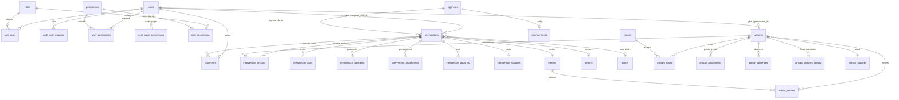

# Schema de la base de données

> Documentation du schéma PostgreSQL de GMBS-CRM, hébergé sur Supabase.

---

## Vue d'ensemble

La base de données utilise PostgreSQL via Supabase avec les extensions suivantes :
- `pg_stat_statements` : statistiques de requêtes
- `pgcrypto` : fonctions cryptographiques (gen_random_uuid)
- `pg_trgm` : recherche par trigrammes (ILIKE performant)

**115 migrations SQL** dans `supabase/migrations/` définissent l'intégralité du schéma.

---

## Diagramme ER principal


```mermaid
erDiagram
    users ||--o{ user_roles : "a"
    users ||--o{ auth_user_mapping : "lié a"
    users ||--o{ user_permissions : "override"
    users ||--o{ user_page_permissions : "accès pages"
    roles ||--o{ user_roles : "attribué"
    roles ||--o{ role_permissions : "contient"
    permissions ||--o{ role_permissions : "accordée via"
    permissions ||--o{ user_permissions : "override"

    users ||--o{ interventions : "gère (assigned_user_id)"
    users ||--o{ artisans : "gère (gestionnaire_id)"
    users ||--o{ comments : "auteur"

    agencies ||--o{ interventions : "agence cliente"
    agencies ||--o| agency_config : "config"

    interventions ||--o{ intervention_artisans : "artisans assignés"
    interventions ||--o{ intervention_costs : "coûts"
    interventions ||--o{ intervention_payments : "paiements"
    interventions ||--o{ intervention_attachments : "pièces jointes"
    interventions ||--o{ comments : "commentaires"
    interventions ||--o{ intervention_audit_log : "audit"
    interventions }o--|| intervention_statuses : "statut"
    interventions }o--|| metiers : "métier"
    interventions }o--o| tenants : "locataire"
    interventions }o--o| owner : "propriétaire"

    artisans ||--o{ intervention_artisans : "interventions"
    artisans ||--o{ artisan_metiers : "métiers"
    artisans ||--o{ artisan_zones : "zones"
    artisans ||--o{ artisan_attachments : "pièces jointes"
    artisans ||--o{ artisan_absences : "absences"
    artisans ||--o{ artisan_statuses_history : "historique statuts"
    artisans }o--|| artisan_statuses : "statut"

    metiers ||--o{ artisan_metiers : "artisans"
    zones ||--o{ artisan_zones : "artisans"
```

---

## Tables principales

### Users et authentification

#### users

Table centrale des utilisateurs du CRM.

| Colonne | Type | Description |
|---------|------|-------------|
| `id` | `uuid` PK | Identifiant unique |
| `username` | `text` UNIQUE | Nom d'utilisateur (login) |
| `email` | `text` UNIQUE | Email |
| `firstname` | `text` | Prénom |
| `lastname` | `text` | Nom |
| `color` | `text` | Couleur attribuée (avatar, badges) |
| `code_gestionnaire` | `text` UNIQUE | Code court gestionnaire |
| `status` | `user_status` | Statut de présence (connected, dnd, busy, offline) |
| `token_version` | `int` | Version du token pour invalidation |
| `last_seen_at` | `timestamptz` | Dernière présence de l'onglet (ping d'activité) |
| `email_smtp*` | `text/int/bool` | Configuration SMTP individuelle |
| `avatar_url` | `text` | URL de l'avatar (ajouté par migration 00050) |
| `delete_date` | `timestamptz` | Date de suppression (soft delete, migration 00057) |
| `deleted_by` | `uuid` | Utilisateur ayant effectué la suppression |
| `created_at` | `timestamptz` | Date de création |
| `updated_at` | `timestamptz` | Date de mise a jour |

**Enum `user_status` :** `'connected' | 'dnd' | 'busy' | 'offline'`

#### auth_user_mapping

Liaison entre `auth.users` (Supabase Auth) et `public.users`.

| Colonne | Type | Description |
|---------|------|-------------|
| `auth_user_id` | `uuid` UNIQUE | ID dans auth.users |
| `public_user_id` | `uuid` FK | ID dans public.users |

#### Système de rôles et permissions

```
roles (admin, manager, gestionnaire, viewer)
  role_permissions (N:M avec permissions)
    permissions (read_interventions, write_interventions, etc.)

user_roles (N:M entre users et roles)
user_permissions (overrides individuels : granted=true/false)
user_page_permissions (accès par page : page_key + has_access)
```

**Logique de résolution des permissions :**
1. Permissions de base = permissions du rôle via `role_permissions`
2. `user_permissions` peut AJOUTER (`granted=true`) ou RÉVOQUER (`granted=false`)
3. Permissions effectives = (rôle) + (ajouts individuels) - (révocations individuelles)

---

### Données de référence

#### metiers

| Colonne | Type | Description |
|---------|------|-------------|
| `id` | `uuid` PK | Identifiant |
| `code` | `text` UNIQUE | Code court (PLOMBERIE, ELECTRICITE, etc.) |
| `label` | `text` | Label affiché |
| `description` | `text` | Description |
| `is_active` | `boolean` | Actif/inactif |
| `color` | `text` | Couleur associée (migration 00024) |

**22 métiers** initiaux : Plomberie, Electricité, Chauffage, Menuiserie, Peinture, Maçonnerie, etc.

#### zones

| Colonne | Type | Description |
|---------|------|-------------|
| `id` | `uuid` PK | Identifiant |
| `code` | `text` UNIQUE | Code zone |
| `label` | `text` | Nom de la zone |
| `region` | `text` | Région |

**10 zones** : Paris, Lyon, Marseille, etc.

#### agencies

Agences clientes qui commandent les interventions.

| Colonne | Type | Description |
|---------|------|-------------|
| `id` | `uuid` PK | Identifiant |
| `code` | `text` UNIQUE | Code agence |
| `label` | `text` | Nom de l'agence |
| `is_active` | `boolean` | Active |

**agency_config** : table de configuration par agence (ex: `requires_reference` pour BR-AGN-001).

#### intervention_statuses / artisan_statuses

Tables de statuts avec `code`, `label`, `color`, `sort_order`.

**11 statuts d'intervention :** DEMANDE, DEVIS_ENVOYE, VISITE_TECHNIQUE, REFUSE, ANNULE, STAND_BY, ACCEPTE, INTER_EN_COURS, INTER_TERMINEE, SAV, ATT_ACOMPTE, POTENTIEL

**9 statuts d'artisan :** Candidat, En cours de validation, Validé, Expert, One Shot, Inactif, Archivé, etc.

---

### Artisans

#### artisans

| Colonne | Type | Description |
|---------|------|-------------|
| `id` | `uuid` PK | Identifiant |
| `prenom` / `nom` | `text` | Nom du contact |
| `plain_nom` | `text` | Nom sans accents pour recherche (migration 00025) |
| `email` | `text` UNIQUE | Email |
| `telephone` / `telephone2` | `text` | Téléphones |
| `raison_sociale` | `text` | Nom de l'entreprise |
| `siret` | `text` UNIQUE | Numéro SIRET |
| `iban` | `text` | IBAN (migration 00034) |
| `statut_juridique` | `text` | Forme juridique |
| `statut_id` | `uuid` FK | Statut artisan |
| `statut_dossier` | `text` CHECK | INCOMPLET, A compléter, COMPLET |
| `gestionnaire_id` | `uuid` FK | Gestionnaire assigné |
| `adresse_siege_social` / `ville_*` / `code_postal_*` | `text` | Adresse siège |
| `adresse_intervention` / `ville_*` / `code_postal_*` | `text` | Adresse intervention |
| `intervention_latitude` / `longitude` | `numeric(9,6)` | Coordonnées GPS |
| `is_active` | `boolean` | Actif (soft delete) |

**Tables liées :**
- `artisan_metiers` : N:M artisan-métier
- `artisan_zones` : N:M artisan-zone
- `artisan_attachments` : pièces jointes avec hash SHA-256 et dérivés d'images
- `artisan_absences` : périodes d'indisponibilité
- `artisan_statuses_history` : historique des changements de statut (migration 00052)

---

### Interventions

#### interventions

| Colonne | Type | Description |
|---------|------|-------------|
| `id` | `uuid` PK | Identifiant |
| `id_inter` | `text` UNIQUE | Identifiant métier lisible |
| `agence_id` | `uuid` FK | Agence cliente (obligatoire) |
| `tenant_id` | `uuid` FK | Locataire |
| `owner_id` | `uuid` FK | Propriétaire |
| `assigned_user_id` | `uuid` FK | Gestionnaire assigné |
| `statut_id` | `uuid` FK | Statut (obligatoire) |
| `metier_id` | `uuid` FK | Métier (obligatoire) |
| `updated_by` | `uuid` FK | Dernier modificateur |
| `date` | `timestamptz` | Date de demande (obligatoire) |
| `date_prevue` | `timestamptz` | Date prévue d'intervention |
| `date_termine` | `timestamptz` | Date de fin |
| `contexte_intervention` | `text` | Contexte (obligatoire) |
| `consigne_intervention` | `text` | Consignes pour l'artisan |
| `consigne_second_artisan` | `text` | Consignes pour le 2e artisan |
| `commentaire_agent` | `text` | Commentaire interne |
| `reference_agence` | `text` | Référence externe agence |
| `adresse` / `code_postal` / `ville` | `text` | **Adresse partielle saisie par l'utilisateur** (rue, CP, ville). Source de vérité pour l'affichage formulaire et l'import CSV. Obligatoire. |
| `adresse_complete` | `text` | **Adresse normalisée retournée par le service de géocodage** (ex: `"123 Rue de Rivoli, 75001 Paris, France"`). Indépendante de `adresse`. Voir [Modèle à deux adresses](../architecture/geocode-service.md#modèle-à-deux-adresses-adresse-vs-adresse_complete). Migration 00056. |
| `latitude` / `longitude` | `numeric(9,6)` | Coordonnées GPS issues du géocodage (alimentées en même temps que `adresse_complete`) |
| `is_vacant` | `boolean` | Logement vacant |
| `key_code` / `floor` / `apartment_number` | `text` | Accès logement vacant |
| `is_active` | `boolean` | Actif (soft delete) |
| `is_check` | `boolean` | Vérifié comptabilité (migration 00054) |
| `has_portal_report` | `boolean` | Un rapport portail est en attente de vérification (`artisan_reports.status = 'submitted'`). Maintenu **uniquement** par le trigger `trg_artisan_reports_sync_flag` ; affiché « À vérifier » (migration 99076) |

#### intervention_artisans

| Colonne | Type | Description |
|---------|------|-------------|
| `intervention_id` | `uuid` FK | Intervention |
| `artisan_id` | `uuid` FK | Artisan |
| `role` | `text` CHECK | 'primary' ou 'secondary' |
| `is_primary` | `boolean` | Artisan principal |

#### intervention_costs

| Colonne | Type | Description |
|---------|------|-------------|
| `intervention_id` | `uuid` FK | Intervention |
| `cost_type` | `text` CHECK | 'sst', 'materiel', 'intervention', 'marge' |
| `amount` | `numeric(12,2)` | Montant |
| `artisan_order` | `int` | 1 (principal) ou 2 (secondaire) (migration 00028). **NULL pour les types `intervention` et `marge`** (migration 00086) |

**Contrainte d'unicite** : `UNIQUE(intervention_id, cost_type, COALESCE(artisan_order, 0))` — empeche les doublons pour un meme type de cout par intervention (migration 00086).

#### intervention_payments

| Colonne | Type | Description |
|---------|------|-------------|
| `payment_type` | `text` CHECK | 'acompte_sst', 'acompte_client', 'final' |
| `amount` | `numeric(12,2)` | Montant |
| `is_received` | `boolean` | Paiement reçu |

#### intervention_attachments (colonne portail)

| Colonne | Type | Description |
|---------|------|-------------|
| `metadata` | `jsonb` DEFAULT `{}` | Informations complémentaires ; photos du portail : `{source:'portal', phase:'avant'|'apres', comment, artisan_id}` (migration 99076) |

---

### Portail artisans (migration 99076)

Tables lues/écrites **uniquement** par le client `service_role` des routes `app/api/portal-external/**` (aucune policy `anon`). Contrat : [portail-demo-contrat-api.md](../architecture/portail-demo-contrat-api.md).

#### artisan_portal_tokens

| Colonne | Type | Description |
|---------|------|-------------|
| `artisan_id` | `uuid` FK | Artisan (cascade) |
| `token_hash` | `text` | SHA-256 hexadécimal du jeton de 64 caractères du lien `/t/{token}` (index). Les jetons historiques de production (colonne `token` en clair, 00065) sont hachés par 99076 puis le clair est effacé : les liens déjà envoyés restent valides |
| `token` | `text` UNIQUE, nullable | Colonne historique (jeton en clair, jamais renseignée) |
| `expires_at` | `timestamptz` | Expiration (+30 j) |
| `is_active` | `boolean` | Un seul jeton actif par artisan (index unique partiel) |
| `last_used_at` | `timestamptz` | Dernière requête authentifiée du portail |

RLS : policy `service_role` seulement.

#### artisan_reports

| Colonne | Type | Description |
|---------|------|-------------|
| `intervention_id` / `artisan_id` | `uuid` FK | Intervention et artisan (cascade) |
| `portal_report_id` | `uuid` UNIQUE | Clé d'idempotence générée par le portail |
| `version` | `int` | Incrémenté à chaque resoumission après rejet ; `UNIQUE(intervention_id, artisan_id, version)` |
| `status` | `text` CHECK | `submitted` \| `approved` \| `rejected` |
| `travaux_realises` | `text` | Requis (≤ 2000 caractères) ; recopié dans `content` (colonne historique) |
| `duree_minutes` / `materiel_utilise` / `reste_a_faire` / `reste_a_faire_detail` / `anomalies` / `client_present` | divers | Rapport structuré |
| `attachment_ids` | `uuid[]` | Photos (`intervention_attachments`) jointes |
| `submitted_from` | `text` | `portal` |
| `submitted_at` / `reviewed_at` | `timestamptz` | Horodatages |
| `reviewed_by` | `uuid` FK → `users` | Gestionnaire ayant validé/refusé |
| `review_comment` | `text` | Commentaire de revue |

RLS : SELECT `authenticated`, tout pour `service_role`.

#### artisan_attachments (colonnes portail)

| Colonne | Type | Description |
|---------|------|-------------|
| `review_status` | `text` CHECK DEFAULT `approved` | `pending` (déposé depuis le portail) \| `approved` \| `rejected` |
| `metadata` | `jsonb` DEFAULT `{}` | `{source:'portal'}` ; décharge signée : `{signed_at, signer_name, ip, user_agent, consent_text, sha256}` |

---

### Socle vision v2 (migrations 99078, 99079)

Spécification : [portail-vision-spec.md](../architecture/portail-vision-spec.md) §3. Aucune table nouvelle hors le journal : des colonnes sur quatre tables existantes, plus la **sécurisation** de `intervention_artisans`.

#### artisan_reports (colonnes 99078)

| Colonne | Type | Description |
|---------|------|-------------|
| `version` | `int` **NOT NULL** | Plus nullable ; une ligne par version |
| `status` | `text` CHECK | `submitted` \| `approved` \| `rejected` \| **`superseded`** (version remplacée avant validation) |
| `superseded_at` / `superseded_by` | `timestamptz` / `uuid` FK → `artisan_reports` | Quand et par quelle version cette version a été remplacée |
| `started_at` | `timestamptz` | Copie de `intervention_artisans.work_started_at` à l'envoi. **Durée réelle** = `submitted_at − started_at` ; à ne pas confondre avec `duree_minutes`, qui reste la saisie déclarative |

Index unique partiel `ux_artisan_reports_one_open (intervention_id, artisan_id) WHERE status = 'submitted'` : **au plus un rapport en attente par couple**. C'est lui qui garde `fn_artisan_reports_sync_flag` (`has_portal_report = EXISTS(status='submitted')`) sans ambiguïté et qui dit à la revue quel rapport traiter.

#### intervention_artisans (colonnes 99078)

| Colonne | Type | Description |
|---------|------|-------------|
| `price_response` | `text` CHECK | `accepted` \| `refused` — réponse de l'artisan au prix SST proposé |
| `price_responded_at` | `timestamptz` | Horodatage de la réponse |
| `price_accepted_amount` | `numeric(12,2)` | Montant **gelé** au moment du oui (copie de `intervention_costs.amount`, `cost_type='sst'`). Sans ce gel, la modale e-mail peut modifier le coût SST après coup sans trace de ce qui a été accepté |
| `price_refused_reason` | `text` | Motif du refus |
| `price_response_source` | `text` CHECK | `portal` (l'artisan a répondu depuis l'app) \| `crm` (repli : réponse reçue par téléphone). Sans ce repli, un artisan sans smartphone ne franchit jamais la garde de `POST /start` |
| `price_response_by` | `uuid` FK → `users` | Gestionnaire, quand `source='crm'` |
| `work_started_at` | `timestamptz` | Début de chantier **déclaré**. Posé même si la transition `ACCEPTE → INTER_EN_COURS` échoue (le fait ne meurt pas de l'échec de la projection) |
| `work_started_from` / `work_started_by` | `text` CHECK / `uuid` FK | `portal` \| `crm`, et l'acteur côté CRM |
| `payment_status` | `text` NOT NULL DEFAULT `not_applicable` | `not_applicable` \| `awaiting_invoice` \| `in_progress` \| `paid` — paiement **de cet artisan**, saisi par le gestionnaire. Jamais dérivé de `intervention_payments.is_received` (encaissement *client*, et `acompte_sst` n'a pas d'`artisan_order`) |
| `paid_at` / `payment_updated_by` / `payment_updated_at` | `timestamptz` / `uuid` / `timestamptz` | Traçabilité de la saisie |

**Sécurité (correctif de 99078)** : la table n'avait ni RLS ni `REVOKE`, alors que `00001` grante `ALL ON ALL TABLES` à `anon` et pose des `ALTER DEFAULT PRIVILEGES`. `99078` active la RLS, crée les policies `authenticated` (SELECT/INSERT/UPDATE/DELETE `USING (true)`, modèle `99057`) et `service_role`, **dans la même migration**, puis `REVOKE ALL … FROM anon`. Les policies dans la même migration que l'activation : sinon « RLS activée sans policy = deny-all » et le CRM se verrouille (incident de l'avatar artisan).

#### artisan_attachments (colonnes 99078)

| Colonne | Type | Description |
|---------|------|-------------|
| `reviewed_by` | `uuid` FK → `users` | Gestionnaire ayant validé ou refusé la pièce |
| `reviewed_at` | `timestamptz` | Discriminant « réellement vérifiée » : `review_status` a pour DEFAULT `approved`, donc « validée » et « jamais regardée » sont sinon indiscernables |
| `review_comment` | `text` | Motif du refus, obligatoire quand `review_status='rejected'` (garde applicative) ; affiché **en entier** à l'artisan |

#### artisans (colonnes 99078)

| Colonne | Type | Description |
|---------|------|-------------|
| `pieces_a_verifier` | `int` NOT NULL DEFAULT 0 | Compteur dénormalisé des pièces `pending`. Dénormalisé volontairement : un embed `artisan_attachments!inner(...)` casserait le `count` exact de la pagination et les puces de filtre lancent déjà 6+ `count` en parallèle |
| `dossier_validated_at` | `timestamptz` | Date du premier passage à `COMPLET`, remise à `NULL` si le dossier retombe. Affichée à l'artisan : « Dossier complet validé le … » |
| `dossier_validated_by` | `uuid` FK → `users` | Gestionnaire ayant validé le dossier |

#### artisan_portal_actions (migration 99079)

Journal **append-only** des actions de l'artisan depuis le portail, et de leurs équivalents saisis au CRM. Ce n'est ni une source de vérité (les états vivent sur `intervention_artisans` et `artisan_reports`), ni un moteur (aucun trigger de projection), ni une table publiée en temps réel.

| Colonne | Type | Description |
|---------|------|-------------|
| `artisan_id` | `uuid` FK NOT NULL | Acteur côté artisan (cascade) |
| `actor_user_id` | `uuid` FK → `users` | Acteur côté CRM quand `source='crm'` — jamais nul des deux côtés à la fois (leçon d'`artisan_audit_log`, 92 % sans acteur) |
| `source` | `text` CHECK | `portal` \| `crm` |
| `intervention_id` / `report_id` | `uuid` FK | Objet de l'action |
| `attachment_id` | `uuid` **sans FK** | Cible `artisan_attachments` ou `intervention_attachments` selon `action_type` |
| `action_type` | `text` CHECK fermé | `PRICE_ACCEPTED`, `PRICE_REFUSED`, `WORK_STARTED`, `REPORT_SUBMITTED`, `REPORT_REPLACED`, `PHOTO_UPLOADED`, `DOCUMENT_UPLOADED`, `DOCUMENT_APPROVED`, `DOCUMENT_REJECTED`, `AVATAR_CHANGED`, `DECHARGE_SIGNED`, `REPORT_APPROVED`, `REPORT_REJECTED` |
| `payload` | `jsonb` NOT NULL DEFAULT `{}` | Détail de l'action |
| `occurred_at` | `timestamptz` | Horodatage **déclaré** par le téléphone, borné côté serveur à `[now − 7 j, now + 5 min]` ; hors bornes, la valeur brute part dans `payload.occurred_at_declared` avec `payload.clock_skew = true`. Un fait n'est jamais rejeté pour une horloge fausse |
| `recorded_at` | `timestamptz` | Horodatage serveur : fait foi pour l'audit |
| `event_uid` | `text` | Clé d'idempotence du rejeu hors ligne (index unique partiel) |

RLS : `SELECT` pour `authenticated`, tout pour `service_role`. `REVOKE ALL FROM anon` **et** `REVOKE ALL FROM authenticated` suivi de `GRANT SELECT` — un simple `REVOKE INSERT, UPDATE, DELETE` laisserait `TRUNCATE`, qui ne passe par aucune policy. L'immuabilité est **applicative** : un trigger `BEFORE UPDATE OR DELETE … RAISE EXCEPTION` rendrait impossible la suppression d'un artisan ou d'une intervention (FK `ON DELETE CASCADE`), pour tout le monde, `service_role` compris.

---

### Support et traçabilité

#### comments

Système de commentaires unifié pour toutes les entités.

| Colonne | Type | Description |
|---------|------|-------------|
| `entity_type` | `text` CHECK | 'artisan', 'intervention', 'task', 'client' |
| `entity_id` | `uuid` | Entité cible |
| `author_id` | `uuid` FK | Auteur |
| `content` | `text` | Contenu |
| `comment_type` | `text` CHECK | 'internal', 'external', 'system' |
| `reason_type` | `text` CHECK | 'archive', 'done' (motif obligatoire) |

#### documents

Pièces jointes via Supabase Storage.

#### intervention_audit_log

Journal d'audit des modifications d'interventions (migration 00037).

| Colonne | Type | Description |
|---------|------|-------------|
| `intervention_id` | `uuid` FK | Intervention |
| `action_type` | `text` | Type d'action |
| `changed_fields` | `jsonb` | Champs modifiés |
| `old_values` / `new_values` | `jsonb` | Anciennes/nouvelles valeurs |
| `actor_id` | `uuid` | Utilisateur |

#### gestionnaire_targets

Objectifs par gestionnaire (migration 00009).

| Colonne | Type | Description |
|---------|------|-------------|
| `user_id` | `uuid` FK | Gestionnaire |
| `period_type` | `target_period_type` | 'week', 'month', 'year' |
| `target_value` | `numeric` | Objectif |

---

### Autres tables

| Table | Description |
|-------|-------------|
| `tasks` | Système de tâches internes |
| `conversations` / `messages` | Chat interne |
| `chat_sessions` / `chat_messages` | Sessions IA (OpenAI) |
| `ai_assistants` | Assistants IA persistants |
| `email_logs` | Logs des emails envoyés |
| `sync_logs` | Logs de synchronisation Google Sheets |
| `billing_state` / `subscriptions` / `orders` | Facturation (préparé) |
| `lateness_email_config` | Config emails de retard (migration 00062) |

---

## Fonctions SQL importantes

| Fonction | Description |
|----------|-------------|
| `get_public_user_id()` | Résout `auth.uid()` vers `public.users.id` |
| `user_has_role(role_name)` | Vérifie si l'utilisateur courant a un rôle |
| `user_has_any_role(role_names[])` | Vérifie si l'utilisateur a l'un des rôles |
| `get_user_permissions(user_id)` | Retourne les permissions effectives |
| `user_has_permission(user_id, key)` | Vérifie une permission spécifique |
| `get_intervention_history(id)` | Retourne l'historique d'audit d'une intervention |
| `calculate_artisan_dossier_status(artisan_uuid)` | Statut du dossier artisan : `COMPLET` (5 pièces requises **validées**) / `À compléter` / `INCOMPLET`. Depuis 99078, seules les pièces dont `review_status` vaut `approved` — ou `NULL`, historique — comptent, via `COALESCE(review_status,'approved')` : écrite `IN ('approved', NULL)`, la condition ne matcherait jamais `NULL` et ferait basculer les dossiers existants |

---

## Triggers

| Trigger | Table | Description |
|---------|-------|-------------|
| `trigger_update_*_updated_at` | Plusieurs | Met a jour `updated_at` automatiquement |
| Artisan status triggers | `intervention_artisans` | Recalcule le statut artisan a chaque liaison/déliaison (migrations 00072-00082) |
| Search views refresh | `interventions`, `artisans` | Rafraîchit les vues matérialisées de recherche (migration 00033) |
| Intervention audit | `interventions` | Log les modifications dans `intervention_audit_log` |
| Touch intervention on child | `intervention_costs`, `intervention_artisans` | Met a jour `updated_at` de l'intervention parent (migration 00082) |
| `trg_artisan_dossier_sync` | `artisan_attachments` | `AFTER INSERT OR DELETE OR UPDATE OF review_status, kind` : recalcule `artisans.statut_dossier`, `artisans.pieces_a_verifier` et `artisans.dossier_validated_at`. **Remplace** les deux triggers INSERT/DELETE de `00008`, qui ne voyaient pas la validation d'une pièce (un `UPDATE` de `review_status`) et qui feraient un second écrivain du même champ. Garde anti-écriture inutile : rien n'est écrit si ni le statut ni le compteur ne changent — `artisans` est en `REPLICA IDENTITY FULL` et chaque `UPDATE` coûte du WAL logique et un événement temps réel (migration 99078) |
| `trg_artisan_reports_sync_flag` | `artisan_reports` | `AFTER INSERT OR UPDATE OF status OR DELETE` : recalcule `interventions.has_portal_report = EXISTS(rapport submitted)` (`COALESCE(NEW, OLD).intervention_id`) — seul mécanisme qui écrit ce drapeau ; la suppression d'un rapport `submitted` fait retomber le badge « À vérifier » (migration 99076) |

---

## Vues matérialisées

| Vue | Description | Rafraîchissement |
|-----|-------------|------------------|
| `search_interventions` | Index de recherche full-text interventions | Async sur trigger |
| `search_artisans` | Index de recherche full-text artisans | Async sur trigger |
| Dashboard stats views | Vues agrégées pour les stats admin | Cron ou trigger |
