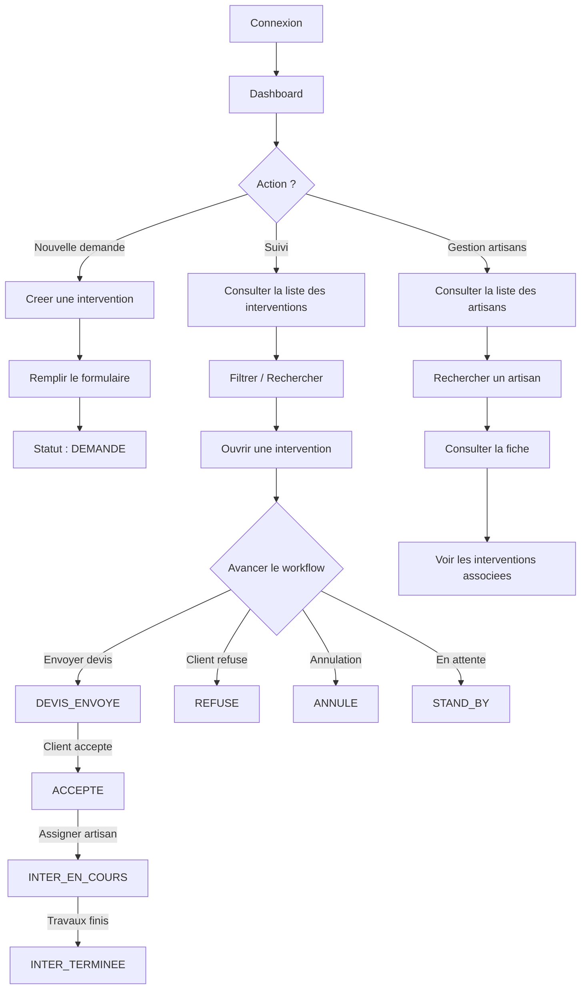
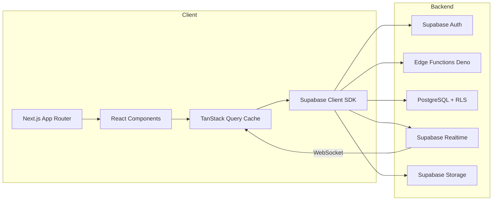

# Vue d'ensemble du projet

GMBS-CRM est un CRM (Customer Relationship Management) interne destine a la gestion des interventions terrain, des artisans sous-traitants et des clients. Il est utilise par les equipes de gestion de GMBS pour suivre le cycle de vie complet d'une intervention, de la demande initiale a la facturation.

---

## Modules principaux

Le CRM s'articule autour de 6 modules fonctionnels :

### 1. Interventions

Le coeur du systeme. Chaque intervention represente un ordre de travaux terrain (plomberie, electricite, chauffage, etc.).

- Creation, edition, suppression d'interventions
- Workflow de statuts avec 12 etapes (Demande, Devis Envoye, Accepte, En Cours, Termine, etc.)
- Attribution d'artisans (principal et secondaire)
- Gestion des couts (CA, cout SST, cout materiel, marge)
- 8 vues de visualisation : table, cards, gallery, kanban, calendar, timeline
- Recherche universelle et filtres avances
- Synchronisation temps reel entre utilisateurs

### 2. Artisans

Gestion du reseau d'artisans sous-traitants.

- Fiche artisan complete (coordonnees, SIRET, metiers, zones d'intervention)
- Statuts artisan : Candidat, Valide, Expert, One Shot, Inactif, Archive
- Recherche geographique (artisans a proximite d'une intervention)
- Historique des interventions par artisan
- Import/export depuis Google Sheets

### 3. Clients

Gestion des donneurs d'ordres.

- Fiche client avec coordonnees
- Locataires (tenants) et proprietaires (owners) associes
- Historique des interventions par client

### 4. Comptabilite

Suivi financier des interventions.

- Calcul des marges par intervention
- Suivi des couts SST (sous-traitance) et materiels
- Gestion des paiements et factures
- Reporting par periode et par gestionnaire

### 5. Dashboard

Tableau de bord personnalise par utilisateur.

- KPIs en temps reel : interventions en cours, taux de transformation, marge moyenne
- Graphiques : evolution du CA, repartition par statut, historique des marges
- Classement des gestionnaires (podium)
- Dashboard admin avec statistiques globales et analytics avances

### 6. Settings

Configuration de l'application.

- Gestion de l'equipe (profils, roles, permissions)
- Configuration des enums (metiers, zones, statuts)
- Personnalisation de l'interface (theme, sidebar, mode d'affichage des modals)
- Gestion des objectifs par gestionnaire

---

## Flux utilisateur typique



---

## Workflow des interventions

Le systeme de workflow est le mecanisme central du CRM. Chaque intervention progresse a travers une serie de statuts avec des regles de transition strictes.

### Chaine principale

```
DEMANDE → DEVIS_ENVOYE → VISITE_TECHNIQUE → ACCEPTE → INTER_EN_COURS → INTER_TERMINEE
```

### Statuts de sortie

- **REFUSE** : le client refuse le devis
- **ANNULE** : intervention annulee
- **STAND_BY** : intervention mise en attente

### Statuts speciaux

- **SAV** : service apres-vente (apres INTER_TERMINEE)
- **ATT_ACOMPTE** : en attente d'un acompte (avant INTER_EN_COURS)
- **POTENTIEL** : intervention potentielle (entree alternative)

### Validation cumulative

Chaque transition vers un statut donne exige que toutes les conditions des statuts precedents soient remplies. Par exemple, pour passer a INTER_EN_COURS, il faut que les exigences de DEMANDE, DEVIS_ENVOYE et ACCEPTE soient satisfaites.

| Statut | Exigences |
|--------|-----------|
| DEMANDE | Aucune (statut initial) |
| DEVIS_ENVOYE | Numero de devis, nom facturation, gestionnaire assigne |
| VISITE_TECHNIQUE | Artisan assigne |
| ACCEPTE | Numero de devis |
| INTER_EN_COURS | Artisan, couts, consigne, nom client, telephone client, date prevue |
| INTER_TERMINEE | Artisan, facture, proprietaire, facture GMBS |
| SAV / REFUSE / ANNULE / STAND_BY | Commentaire obligatoire |

---

## Roles et permissions

Le systeme utilise un modele RBAC (Role-Based Access Control) avec 4 roles principaux :

| Role | Acces |
|------|-------|
| **Admin** | Acces complet, gestion des roles et permissions |
| **Manager** | Gestion des interventions, artisans, dashboard admin |
| **Gestionnaire** | CRUD interventions, consultation artisans |
| **Viewer** | Lecture seule |

Les permissions peuvent etre surchargees par utilisateur (`user_permissions`) et par page (`user_page_permissions`).

---

## Architecture technique en bref



- **Frontend** : Next.js 15 avec App Router, rendu serveur et client
- **Backend** : Supabase (PostgreSQL, Auth, Realtime, Storage, Edge Functions)
- **State** : TanStack Query pour le cache serveur, Zustand pour l'etat local
- **Temps reel** : Supabase Realtime + BroadcastChannel pour la synchronisation cross-tab

Pour une description detaillee de l'architecture, voir la section [Architecture](../architecture/).

---

## Prochaines etapes

- [Structure des dossiers](./folder-structure.md) pour naviguer dans le code source
- [Stack technique](./tech-stack.md) pour comprendre chaque technologie utilisee
- [Quick Start](./quick-start.md) si vous n'avez pas encore installe le projet
