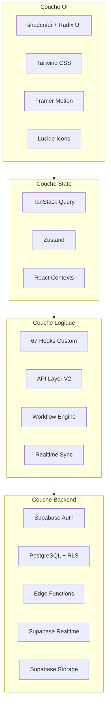

# Stack technique

Description complete des technologies utilisees dans GMBS-CRM, organisees par categorie, avec les versions et les raisons de chaque choix.

---

## Framework et runtime

| Technologie | Version | Role |
|-------------|---------|------|
| **Next.js** | 15.5.7 | Framework React full-stack. Utilise l'App Router pour le routing file-based, le rendu serveur (SSR), les API routes, et le middleware d'authentification. |
| **React** | 18.3.1 | Bibliotheque UI. Composants fonctionnels avec hooks. React 18 pour le concurrent rendering et les transitions. |
| **TypeScript** | 5.x | Typage statique. Mode strict active. Interfaces pour les props, types pour les unions. Path alias `@/*` vers `src/`. |
| **Node.js** | 20.x / 22.x | Runtime serveur. Utilise pour les scripts d'import/export, le build et le dev server. |

### Pourquoi Next.js 15 ?

Next.js fournit en un seul framework : le routing (App Router), le SSR, les API routes (pour les endpoints auth), le middleware (pour la protection des routes), et l'optimisation d'images. L'App Router permet la co-location des composants avec les pages (`_components/`, `_lib/`) et le streaming SSR.

---

## Backend et base de donnees

| Technologie | Version | Role |
|-------------|---------|------|
| **Supabase JS** | 2.95.3 | Client principal pour interagir avec Supabase (Auth, Database, Realtime, Storage). Utilise en browser et en Node.js. |
| **@supabase/ssr** | 0.8.0 | Gestion des sessions via cookies HTTP. Remplace le stockage localStorage par des cookies cote serveur (middleware, server components, browser). Rafraichissement automatique du JWT dans le middleware Next.js. |
| **Supabase CLI** | 2.40.7 | Outil CLI pour le developpement local, les migrations, le deploiement des Edge Functions, et la generation de types. |
| **PostgreSQL** | via Supabase | Base de donnees relationnelle avec RLS (Row Level Security). 85 migrations SQL. |
| **Edge Functions** | Deno | 13+ fonctions serverless deployees sur Supabase. CRUD complet, sync Google Sheets, gestion de presence. |

### Pourquoi Supabase ?

Supabase fournit en un seul service : la base de donnees PostgreSQL avec RLS, l'authentification (email/password, PKCE), le stockage de fichiers, les subscriptions temps reel (WebSocket), et les Edge Functions (Deno). Cela evite de gerer separement une base de donnees, un serveur d'auth, et un service de stockage.

---

## State management et data fetching

| Technologie | Version | Role |
|-------------|---------|------|
| **TanStack Query** | 5.90.2 | Cache serveur et data fetching. Gere la pagination, le prefetch, les updates optimistes, l'invalidation, et le staleTime adaptatif. |
| **TanStack Query DevTools** | 5.90.2 | Outil de debug pour inspecter le cache, les queries en vol, et les mutations. |
| **TanStack Table** | latest | Gestion des tables de donnees (tri, filtrage, pagination, colonnes redimensionnables). |
| **TanStack Virtual** | 3.13.12 | Virtualisation de listes longues. Rend uniquement les elements visibles a l'ecran pour les tables de 1000+ lignes. |
| **Zustand** | 5.0.8 | State management local leger. Utilise pour les preferences UI (sidebar, theme) avec persistance localStorage. |

### Pourquoi TanStack Query plutot que Redux ?

TanStack Query est specialise dans le cache serveur : il gere automatiquement le stale time, le background refetch, les updates optimistes avec rollback, la deduplication des requetes, et le garbage collection. Redux serait excessif pour du data fetching et ne fournit pas ces fonctionnalites nativement.

### Pourquoi Zustand plutot que Context pour l'etat local ?

Zustand evite les re-renders en cascade des React Context. Il est utilise uniquement pour l'etat UI local (preferences), tandis que TanStack Query gere tout l'etat serveur.

---

## UI et design system

| Technologie | Version | Role |
|-------------|---------|------|
| **Tailwind CSS** | 3.4.17 | Framework CSS utility-first. Dark mode class-based. Couleurs custom pour les statuts, animations personnalisees. |
| **Radix UI** | 20+ packages | Composants headless accessibles (Dialog, Dropdown, Popover, Select, Tabs, Tooltip, etc.). Base pour les composants shadcn/ui. |
| **shadcn/ui** | -- | Collection de composants pre-styles basee sur Radix UI + Tailwind. 30+ composants (Button, Card, Input, etc.). |
| **Framer Motion** | 12.23.12 | Animations et transitions. Utilise pour les modals, le genie effect, et les transitions de layout. |
| **Lucide React** | 0.454.0 | Bibliotheque d'icones SVG (1000+ icones). |
| **class-variance-authority** | 0.7.1 | Gestion des variantes de composants (primary, secondary, destructive, etc.). |
| **clsx** + **tailwind-merge** | 2.1.1 / 2.5.5 | Composition et merge de classes CSS conditionnelles sans conflits. |
| **next-themes** | latest | Gestion du theme (light/dark/system) avec Next.js. |
| **Geist** | 1.3.1 | Police de caracteres de Vercel. |
| **tailwindcss-animate** | 1.0.7 | Plugin d'animations pour Tailwind (fade-in, slide-in, etc.). |

### Pourquoi shadcn/ui ?

Contrairement a une bibliotheque de composants classique (Material UI, Ant Design), shadcn/ui copie le code des composants dans le projet. Cela donne un controle total sur le style et le comportement, sans lock-in sur une version de la librairie.

---

## Formulaires et validation

| Technologie | Version | Role |
|-------------|---------|------|
| **React Hook Form** | 7.54.1 | Gestion des formulaires (validation, soumission, etat, erreurs). Performant grace a la souscription selective aux champs. |
| **Zod** | 3.24.1 | Validation de schemas TypeScript. Utilise avec `@hookform/resolvers` pour la validation des formulaires et comme source de verite pour les types. |
| **@hookform/resolvers** | 3.9.1 | Bridge entre React Hook Form et Zod pour la validation automatique. |

### Pourquoi Zod ?

Zod permet de definir un schema une fois et d'en deriver : le type TypeScript (inference), la validation runtime (formulaires), et les messages d'erreur. Les schemas Zod du projet sont dans `src/types/interventions.ts`.

---

## Cartographie

| Technologie | Version | Role |
|-------------|---------|------|
| **MapLibre GL** | 5.9.0 | Rendu de cartes interactives (alternative open-source a Mapbox GL). Utilise pour la localisation des interventions et la recherche d'artisans a proximite. |
| **MapTiler SDK** | 3.8.0 | Fournisseur de tuiles cartographiques pour MapLibre. Necessite une cle API (`NEXT_PUBLIC_MAPTILER_API_KEY`). |

### Pourquoi MapLibre plutot que Google Maps ?

MapLibre est open-source, plus performant pour les gros volumes de marqueurs (WebGL), et compatible avec plusieurs fournisseurs de tuiles. Le cout est significativement inferieur a Google Maps pour un usage CRM interne.

---

## Data import/export

| Technologie | Version | Role |
|-------------|---------|------|
| **ExcelJS** | 4.4.0 | Generation et lecture de fichiers Excel (.xlsx). Utilise pour les exports de donnees. |
| **PapaParse** | 5.5.3 | Parsing CSV performant. Utilise pour les imports/exports CSV. |
| **Google Spreadsheet** | 5.0.2 | API Google Sheets pour la synchronisation bidirectionnelle des donnees (import artisans et interventions). |
| **googleapis** | 159.0.0 | Client Google APIs (Drive, Sheets) pour l'import de documents. |
| **google-auth-library** | 10.3.0 | Authentification service account pour les API Google. |

---

## Email et communication

| Technologie | Version | Role |
|-------------|---------|------|
| **Nodemailer** | 7.0.10 | Envoi d'emails (notifications de retard, alertes). Utilise avec la configuration SMTP stockee en base. |

---

## Intelligence artificielle

| Technologie | Version | Role |
|-------------|---------|------|
| **OpenAI SDK** | 6.9.1 | Integration avec les modeles OpenAI. Utilise pour des fonctionnalites d'assistance (scripts AI dans `scripts/ai/`). |

---

## Visualisation de donnees

| Technologie | Version | Role |
|-------------|---------|------|
| **Recharts** | latest | Graphiques React (barres, lignes, aires). Utilise pour le dashboard et les analytics. |
| **Nivo** | 0.99.0 | Graphiques avances (Sankey diagrams pour les flux de statuts). |
| **ReactFlow** | 11.11.4 | Visualisation de graphes et diagrammes (workflow visualizer). |
| **Dagre** | 0.8.5 | Layout automatique de graphes diriges (positionnement des noeuds workflow). |

---

## Drag and drop

| Technologie | Version | Role |
|-------------|---------|------|
| **@dnd-kit** | 6.3.1 | Drag and drop moderne (sortable, core, utilities). Utilise pour le kanban et le reordonnancement. |
| **@hello-pangea/dnd** | 18.0.1 | Alternative drag and drop (fork de react-beautiful-dnd). |

---

## Securite

| Technologie | Version | Role |
|-------------|---------|------|
| **DOMPurify** | 3.3.1 | Sanitisation HTML pour prevenir les attaques XSS. Utilise pour le rendu de contenu riche (commentaires, descriptions). |
| **focus-trap-react** | 11.0.4 | Piege le focus dans les modals pour l'accessibilite et la securite. |

---

## Markdown et contenu

| Technologie | Version | Role |
|-------------|---------|------|
| **react-markdown** | 9.1.0 | Rendu Markdown dans les composants React. |
| **rehype-highlight** | 7.0.2 | Coloration syntaxique du code dans le Markdown. |
| **highlight.js** | 11.9.0 | Moteur de coloration syntaxique. |
| **remark-gfm** | 4.0.1 | Support GitHub Flavored Markdown (tables, task lists, etc.). |

---

## Tests

| Technologie | Version | Role |
|-------------|---------|------|
| **Vitest** | 3.2.4 | Framework de tests unitaires et d'integration. Compatible ESM, rapide, API compatible Jest. |
| **@testing-library/react** | 16.3.0 | Tests de composants React centres sur le comportement utilisateur plutot que l'implementation. |
| **@testing-library/jest-dom** | 6.8.0 | Matchers DOM pour les assertions (toBeInTheDocument, toHaveClass, etc.). |
| **Playwright** | 1.55.0 | Tests end-to-end et tests visuels. Headless browser pour simuler des scenarios utilisateur complets. |
| **jsdom** | 26.1.0 | Environnement DOM simule pour les tests unitaires (utilise par Vitest). |

### Pourquoi Vitest plutot que Jest ?

Vitest est nativement compatible ESM (pas de transformation CJS), plus rapide grace a Vite, et partage la configuration du projet. L'API est compatible Jest, donc la migration est transparente.

---

## Build et tooling

| Technologie | Version | Role |
|-------------|---------|------|
| **ESLint** | 9.34.0 | Linter avec flat config. Regle custom : imports relatifs cross-feature interdits. |
| **PostCSS** | 8.5.x | Transformation CSS (import, Tailwind). |
| **tsx** | 4.20.6 | Execution TypeScript directe pour les scripts (alternative a ts-node). |
| **@next/bundle-analyzer** | 15.5.0 | Analyse de la taille du bundle Next.js. |
| **@vitejs/plugin-react** | 5.0.1 | Plugin React pour Vite/Vitest (JSX transform, fast refresh). |

---

## Autres

| Technologie | Version | Role |
|-------------|---------|------|
| **Sonner** | 1.7.1 | Notifications toast elegantes. |
| **cmdk** | 1.0.4 | Command palette (Ctrl+K). |
| **vaul** | 0.9.6 | Drawer mobile (slide up). |
| **embla-carousel-react** | 8.5.1 | Carousel performant. |
| **react-resizable-panels** | 2.1.7 | Panneaux redimensionnables (layout split). |
| **react-error-boundary** | 6.0.0 | Error boundaries declaratifs. |
| **input-otp** | 1.4.1 | Champs OTP (one-time password). |
| **date-fns** | latest | Manipulation de dates (format, comparaison, calculs). |
| **dotenv** | 17.2.1 | Chargement de variables d'environnement pour les scripts. |
| **web-vitals** | 5.1.0 | Mesure des Core Web Vitals (LCP, FID, CLS). |
| **styled-components** | 6.1.19 | CSS-in-JS (usage limite, principalement Tailwind). |
| **Prisma Client** | 6.17.0 | ORM TypeScript (usage complementaire a Supabase). |

---

## Diagramme des couches

---

## Prochaines etapes

- [Quick Start](./quick-start.md) pour installer et lancer le projet
- [Structure des dossiers](./folder-structure.md) pour naviguer dans le code
- [Vue d'ensemble](./project-overview.md) pour comprendre les modules fonctionnels
