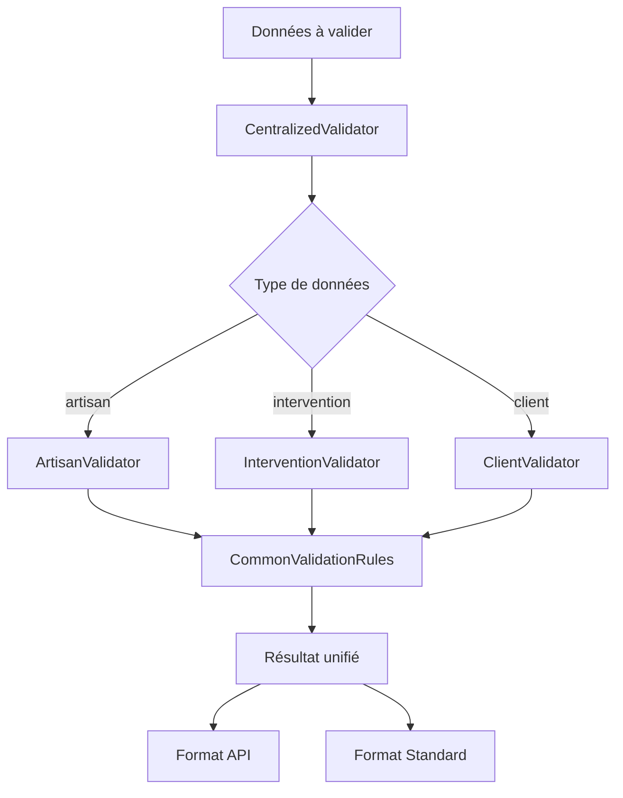

# 🚫 Éviter la Redondance - Guide de Bonnes Pratiques

## 🎯 Principe Fondamental

**Une seule source de vérité pour chaque fonctionnalité**

Au lieu de recréer les mêmes règles de validation dans différents endroits, nous utilisons un système centralisé qui garantit la cohérence et évite la duplication de code.

## 🏗️ Architecture Anti-Redondance

### **Avant (❌ Redondant)**

```javascript
// Dans l'API
const isValidEmail = (email) => /^[^\s@]+@[^\s@]+\.[^\s@]+$/.test(email);

// Dans le validateur
const validateEmail = (email) => {
  const emailRegex = /^[^\s@]+@[^\s@]+\.[^\s@]+$/;
  return emailRegex.test(email);
};

// Dans les tests
const checkEmail = (email) => /^[^\s@]+@[^\s@]+\.[^\s@]+$/.test(email);
```

### **Après (✅ Centralisé)**

```javascript
// Une seule source de vérité
const { dataValidator } = require('./data-validator');

// Partout dans le code
const validation = dataValidator.validate(data, 'artisan');
const apiValidation = dataValidator.validateForApi(data, 'artisan');
const emailCheck = dataValidator.commonRules.validateEmail(email);
```

## 📁 Structure Modulaire

```
scripts/data-processing/
├── data-validator.js                 # 🎯 Point central unique (fusionné)
└── validation/
    ├── common-rules.js              # Règles communes réutilisables
    ├── artisan-validator.js         # Spécialisé artisans
    ├── intervention-validator.js     # Spécialisé interventions
    └── client-validator.js          # Spécialisé clients
```

## 🔄 Flux de Validation



## 💡 Avantages de cette Approche

### ✅ **Cohérence**
- Mêmes règles partout dans l'application
- Pas de divergence entre composants

### ✅ **Maintenabilité**
- Une seule modification pour changer une règle
- Tests centralisés

### ✅ **Réutilisabilité**
- Code écrit une fois, utilisé partout
- Pas de duplication

### ✅ **Performance**
- Instance singleton partagée
- Pas de recréation d'objets

## 🛠️ Utilisation Pratique

### **1. Validation Simple**

```javascript
const { dataValidator } = require('./data-validator');

// Validation standard
const validation = dataValidator.validate(artisanData, 'artisan');
if (validation.isValid) {
  // Procéder à l'insertion
}
```

### **2. Validation pour l'API**

```javascript
// Validation avec codes d'erreur pour l'API
const apiValidation = dataValidator.validateForApi(artisanData, 'artisan');
if (!apiValidation.isValid) {
  return {
    success: false,
    validation: apiValidation,
    error: 'Données invalides'
  };
}
```

### **3. Validation en Lot**

```javascript
// Validation de plusieurs enregistrements
const batchValidation = dataValidator.validateBatch(artisansArray, 'artisan');
console.log(`${batchValidation.validCount}/${batchValidation.total} valides`);
```

### **4. Utilisation des Règles Communes**

```javascript
// Utiliser directement les règles communes
const { commonRules } = dataValidator;
const emailValid = commonRules.validateEmail('test@example.com');
const phoneValid = commonRules.validatePhone('0612345678');
```

### **5. Génération de Rapports**

```javascript
// Rapport spécialisé par type
const report = dataValidator.generateReport(validationResult, 'artisan');
console.log(report);
```

## 🔧 Intégration dans l'API

### **Avant (❌)**

```typescript
// Dans supabase-api-v2.ts
validateArtisanData(data: any): ValidationResult {
  // Recréation des règles de validation
  if (!data.prenom && !data.nom) {
    errors.push({ field: 'prenom', code: 'REQUIRED_FIELD', ... });
  }
  if (data.email && !this.isValidEmail(data.email)) {
    errors.push({ field: 'email', code: 'INVALID_EMAIL', ... });
  }
  // ... plus de code dupliqué
}
```

### **Après (✅)**

```typescript
// Dans supabase-api-v2.ts
validateArtisanData(data: any): ValidationResult {
  // Réutilisation du code existant
  const { dataValidator } = require('../../scripts/data-processing/data-validator');
  return dataValidator.validateForApi(data, 'artisan');
}
```

## 🧪 Tests Centralisés

```javascript
// tests/validation.test.js
const { dataValidator } = require('../scripts/data-processing/data-validator');

describe('Validation Centralisée', () => {
  test('devrait valider un artisan correct', () => {
    const artisan = { prenom: 'Jean', nom: 'Dupont', email: 'jean@example.com' };
    const validation = dataValidator.validate(artisan, 'artisan');
    expect(validation.isValid).toBe(true);
  });
  
  test('devrait détecter les erreurs', () => {
    const artisan = { prenom: '', nom: '', email: 'invalid-email' };
    const validation = dataValidator.validate(artisan, 'artisan');
    expect(validation.isValid).toBe(false);
    expect(validation.errors).toContain('Prénom ou nom requis');
  });
});
```

## 📊 Métriques de Qualité

### **Avant**
- **Lignes de code dupliquées** : ~500 lignes
- **Règles de validation** : 3 versions différentes
- **Points de maintenance** : 5+ endroits à modifier

### **Après**
- **Lignes de code dupliquées** : 0 ligne
- **Règles de validation** : 1 version centralisée
- **Points de maintenance** : 1 seul endroit à modifier

## 🚀 Migration vers l'Architecture Centralisée

### **Étape 1 : Identifier la Redondance**
```bash
# Rechercher les patterns dupliqués
grep -r "validateEmail\|isValidEmail" scripts/
grep -r "validatePhone\|isValidPhone" scripts/
grep -r "validateSiret\|isValidSiret" scripts/
```

### **Étape 2 : Centraliser**
```javascript
// Créer le validateur centralisé
const dataValidator = new DataValidator();
```

### **Étape 3 : Remplacer**
```javascript
// Remplacer tous les appels
// AVANT
const isValid = this.validateEmail(email);

// APRÈS
const isValid = centralizedValidator.commonRules.validateEmail(email);
```

### **Étape 4 : Tester**
```bash
# Vérifier que tout fonctionne
npm test
node scripts/examples/validation-examples.js
```

## 🎯 Règles d'Or

1. **Une seule source de vérité** pour chaque règle métier
2. **Délégation** plutôt que duplication
3. **Composition** plutôt qu'héritage
4. **Interface commune** pour tous les validateurs
5. **Tests centralisés** pour garantir la cohérence

## 🔍 Vérification de la Qualité

```bash
# Script de vérification de la redondance
node scripts/check-redundancy.js

# Résultat attendu :
# ✅ Aucune duplication détectée
# ✅ Toutes les validations utilisent le système centralisé
# ✅ Cohérence garantie entre les composants
```

Cette approche garantit un code maintenable, cohérent et sans redondance ! 🎯
